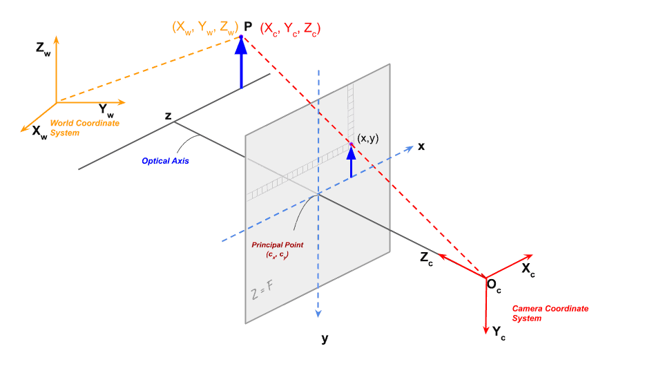
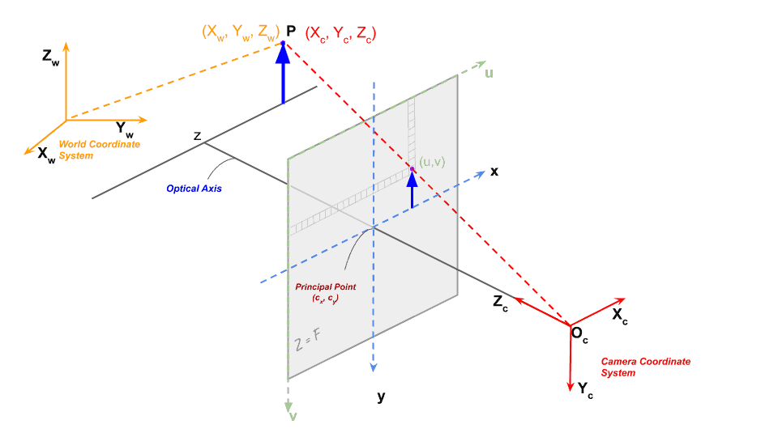
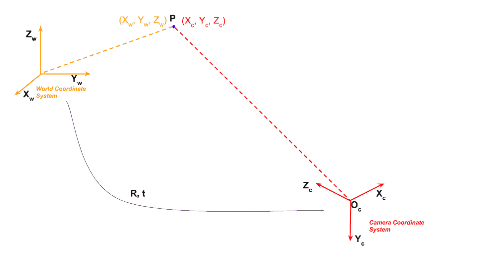

## 相机和激光雷达联合标定

相机和激光雷达的标定是自动驾驶等领域中非常重要的一步，目的是将激光雷达数据和相机数据对齐到统一的坐标系中。

### 0x00 前置知识

#### 1. 坐标系

- **世界坐标系（World Coordinates）**: 全局坐标系，通常用来描述物体在现实世界中的位置。坐标原点可以是任意选定的。
- **相机坐标系（Camera Coordinates）**: 相机本身的局部坐标系，通常以相机的光心（主光轴交点）为原点，Z 轴沿相机的观察方向，X 轴和 Y 轴分别与相机的水平和垂直方向对齐。
- **图像坐标系（Image Coordinates）**: X 轴指向右，Y 轴指向下。用于表示图像中每个像素的坐标。图像坐标系是一个二维坐标系，通常与相机坐标系的Z轴相联系，表示相机成像的二维结果。
- **像素坐标系（Pixel Coordinates）**: 用于描述图像中每个像素的具体位置。它是一个离散坐标系，表示图像中像素的具体位置。
- **激光雷达坐标系（Lidar Coordinates）**: 激光雷达传感器的局部坐标系。表示激光雷达点云中每个点的坐标，通常也需要转换到世界坐标系或相机坐标系。

#### 2. 相机标定基础

在图像测量过程以及机器视觉应用中，为确定**空间物体表面某点的三维几何位置**与其在**图像中对应点**之间的相互关系，必须建立相机成像的几何模型，这些几何模型参数就是相机参数。

标定的目标：求出相机的内、外参数，以及畸变参数。

##### 内参和外参

1. **内参 (Intrinsic Parameters)**

   - **焦距 (focal length)** ：$f_x, f_y$ 表示图像平面上两个方向的焦距。通常，$f_x$ 和 $f_y$ 是相同的，但如果相机的像素不是正方形时，它们可能不同。
   - **主点坐标 (Principal point)** ：$c_x, c_y$ 是图像坐标系中的主点，通常是图像的中心。
   - **畸变系数 (Distortion Coefficients)** ：包含径向畸变和切向畸变的系数。

2. **外参 (Extrinsic Parameters)**

   外参描述相机与世界坐标系之间的关系。它们包含相机坐标系到世界坐标系的旋转和平移。

   - **旋转矩阵 (Rotation Matrix)** $R$：相机坐标系与世界坐标系之间的旋转关系。
   - **平移向量 (Translation Vector)** $T$：相机坐标系与世界坐标系之间的平移。

   外参的变换公式： 
   $$
   \mathbf{X}_ {\text{world}} = R \cdot \mathbf{X}_ {\text{cam}} + T
   $$
   其中 $\mathbf{X}_ {\text{world}}$ 是世界坐标系中的点，$\mathbf{X}_ {\text{cam}}$ 是相机坐标系中的点。

#### 3. 标定理论基础

##### 3.1 投影模型

投影模型的核心是将三维点映射到二维图像平面上。常见的投影模型包括相机的针孔模型，通过内参矩阵和外参矩阵将三维空间中的物体点投影到图像平面上。

- 从三维点到二维图像点的转换公式： 
  $$
  \mathbf{X}_ {\text{img}} = K \cdot [R | T] \cdot \mathbf{X}_ {\text{world}}
  $$
   其中，$K$ 是相机的内参矩阵，$R$ 和 $T$ 是外参矩阵，$\mathbf{X}_ {\text{world}}$ 是世界坐标系中的三维点。

##### 3.2 ICP算法 (Iterative Closest Point)

ICP算法是点云配准中的经典算法。其目标是将两个点云数据集进行配准，使得它们的重叠部分尽可能精确对齐。ICP算法的步骤如下：

1. **选择最近点**：对于目标点云中的每一个点，找到源点云中距离它最近的点。
2. **最小化距离**：计算源点云和目标点云之间的误差（通常是欧氏距离的平方和），并通过旋转和平移来最小化这个误差。
3. **迭代优化**：反复进行最近点匹配和最小化距离的步骤，直到误差收敛。

### 0x01 标定步骤

#### 1. 相机标定

>- 目标：获得相机的内参和畸变系数。
>- 方法：
>  1. 拍摄多张包含标定板的图片，确保从不同角度拍摄，覆盖整个视场。
>  2. 使用 OpenCV 或其他工具检测标定板角点。
>  3. 通过最小二乘法拟合，求解相机内参和畸变参数。
>- 输出：内参矩阵、畸变系数。

相机的几何模型通常采用针孔模型，其核心是将三维点从**世界坐标系**投影到**二维图像坐标系**。投影由以下三个变换步骤完成：

##### 1.1 世界坐标系到齐次坐标系

首先定义点 $W$ 的世界坐标 
$$
\mathbf{X}_ {\text{w}} = [x_ {\text{w}}, y_ {\text{w}}, z_ {\text{w}}]^T
$$
将其转化为齐次坐标：
$$
\mathbf{X}_ {\text{w}_ h} = \begin{bmatrix} x_ {\text{w}} \\ y_ {\text{w}} \\ z_ {\text{w}} \\ 1 \end{bmatrix}
$$

##### 1.2 世界坐标到相机坐标变换

假设从激光雷达到相机坐标系的变换矩阵为 $E^{-1}_ {4 \times 4}$，该矩阵包含旋转和平移分量：
$$
E^{-1}_ {4 \times 4} = \begin{bmatrix} r_ {x1} & r_ {y1} & r_ {z1} & t_ x \\\\ r_ {x2} & r_ {y2} & r_ {z2} & t_ y \\\\ r_ {x3} & r_ {y3} & r_ {z3} & t_ z \\\\ 0 & 0 & 0 & 1 \end{bmatrix}
$$
将点 $W$ 在相机坐标系下的坐标表示为 :
$$
\mathbf{X}_ {\text{c}} = [x_ {\text{c}}, y_ {\text{c}}, z_ {\text{c}}]^T
$$
其齐次坐标形式为：
$$
\mathbf{X}_ {\text{c}_ h} = \begin{bmatrix} x_ {\text{c}} \\ y_ {\text{c}} \\ z_ {\text{c}} \\ 1 \end{bmatrix}
$$
根据变换矩阵，可以得到以下等式：
$$
\mathbf{X}_ {\text{c}_ h} = E^{-1}_ {4 \times 4} \cdot \mathbf{X}_ {\text{w}_ h}
$$
展开矩阵乘法后：
$$
\begin{bmatrix} x_ {\text{c}} \\\\ y_ {\text{c}} \\\\ z_ {\text{c}} \\\\ 1 \end{bmatrix} =  \begin{bmatrix} r_ {x1} & r_ {y1} & r_ {z1} & t_ x \\\\ r_ {x2} & r_ {y2} & r_ {z2} & t_ y \\\\ r_ {x3} & r_ {y3} & r_ {z3} & t_ z \\\\ 0 & 0 & 0 & 1 \end{bmatrix}  \cdot  \begin{bmatrix} x_ {\text{w}} \\\\ y_ {\text{w}} \\\\ z_ {\text{w}} \\\\ 1 \end{bmatrix}
$$
解出：
$$
\begin{aligned} x_ {\text{c}} & = r_ {x1} \cdot x_ {\text{w}} + r_ {y1} \cdot y_ {\text{w}} + r_ {z1} \cdot z_ {\text{w}} + t_ x \\\\ y_ {\text{c}} & = r_ {x2} \cdot x_ {\text{w}} + r_ {y2} \cdot y_ {\text{w}} + r_ {z2} \cdot z_ {\text{w}} + t_ y \\\\ z_ {\text{c}} & = r_ {x3} \cdot x_ {\text{w}} + r_ {y3} \cdot y_ {\text{w}} + r_ {z3} \cdot z_ {\text{w}} + t_ z \end{aligned}
$$
其中旋转矩阵和平移矩阵分别是：
$$
R^{-1}_ {3 \times 3} = \begin{bmatrix} r_ {x1} & r_ {y1} & r_ {z1} \\\\ r_ {x2} & r_ {y2} & r_ {z2} \\\\ r_ {x3} & r_ {y3} & r_ {z3} \end{bmatrix}
$$

$$
T = \begin{bmatrix} t_ x \\\\ t_ y \\\\ t_ z \end{bmatrix}
$$

因此：
$$
\mathbf{X}_ {\text{w}} = R^{-1}_ {3 \times 3} \cdot \mathbf{X}_ {\text{c}} + T
$$

##### 1.3 相机坐标到图像坐标变换

接下来考虑相机坐标系到图像坐标系的转换。设定相机内参矩阵 $K$ 及其逆矩阵 $K^{-1}$ 如下：
$$
K_ {3 \times 3} = \begin{bmatrix} f_ x & 0 & u \\\\ 0 & f_ y & v \\\\ 0 & 0 & 1 \end{bmatrix}, \quad K^{-1}_ {3 \times 3} = \begin{bmatrix} a & 0 & b \\\\ 0 & c & d \\\\ 0 & 0 & 1 \end{bmatrix}
$$
其中：

- $f_x, f_y$：分别是水平和垂直方向的焦距（以像素为单位）。
- $u, v$：主点坐标（通常是图像中心）。

点 $W$ 在图像坐标系下的坐标表示为 $\mathbf{X}_ {\text{img}} = [x_{\text{img}}, y_{\text{img}}]^T$，其齐次坐标形式为：
$$
\mathbf{X}_ {\text{img}_ h} = \begin{bmatrix} x_ {\text{img}} \\\\ y_ {\text{img}} \\\\ 1 \end{bmatrix}
$$
根据上述变换矩阵，我们有：
$$
\mathbf{X}_ {\text{img}_ h} = \frac{1}{Z_ {\text{c}}} \cdot K_ {3 \times 3} \cdot \mathbf{X}_ {\text{c}}
$$
展开矩阵乘法后：
$$
\begin{bmatrix} x_ {\text{img}} \\\\ y_ {\text{img}} \\\\ 1 \end{bmatrix} = \frac{1}{Z_ {\text{c}}} \cdot \begin{bmatrix} f_ x & 0 & u \\\\ 0 & f_ y & v \\\\ 0 & 0 & 1 \end{bmatrix} \cdot \begin{bmatrix} x_ {\text{c}} \\\\ y_ {\text{c}} \\\\ z_ {\text{c}} \end{bmatrix}
$$
解出：
$$
\begin{aligned} x_ {\text{img}} &= \frac{f_ x \cdot x_ {\text{c}} + u}{Z_ {\text{c}}} \\\\ y_ {\text{img}} &= \frac{f_ y \cdot y_ {\text{c}} + v}{Z_ {\text{c}}} \end{aligned}
$$
其中：
$$
\mathbf{X}_ {\text{c}} = Z_ {\text{c}} \cdot K^{-1}_ {3 \times 3} \cdot \mathbf{X}_ {\text{img}_ h}
$$
所以：
$$
\begin{aligned} x_ {\text{c}} &= Z_ {\text{c}} \cdot (a \cdot x_ {\text{img}} + b) \\\\ y_ {\text{c}} &= Z_ {\text{c}} \cdot (c \cdot y_ {\text{img}} + d) \end{aligned}
$$
由于我们不知道 $Z_{\text{c}}$，所以无法直接进行投影。为了获得准确的转换，我们需要知道点到相机平面的距离（即 $Z_{\text{c}}$）。

最终的转换公式如下：
$$
\mathbf{X}_ {\text{img}_ h} = \frac{1}{Z_ {\text{c}}} \cdot K_ {3 \times 3} \cdot \left[ E_ {4 \times 4} \cdot \mathbf{X}_ {\text{w}_ h} \right]_ {3 \times 3}
$$
或
$$
\mathbf{X}_ {\text{w}_ h} = Z_ {\text{c}} \cdot R^{-1}_ {3 \times 3} \cdot K^{-1}_ {3 \times 3} \cdot \mathbf{X}_ {\text{img}_ h} + T
$$
这里 $[.]_ {3 \times 3}$ 表示取前三行三列的结果。

##### 1.4 畸变校正

图像中通常存在径向畸变和切向畸变：

1. **径向畸变 (Radial Distortion)** ：导致点位置沿径向发生非线性偏移。
2. **切向畸变 (Tangential Distortion)** ：由镜头组的非对称性引起，导致点发生非径向偏移。

为了校正畸变，需要在坐标变换中加入畸变模型的影响。

1. **径向畸变模型** 畸变后的图像坐标 $(x', y')$ 和理想图像坐标 $(x_{\text{ideal}}, y_{\text{ideal}})$ 之间的关系为：
   $$
   \begin{aligned} x' &= x_{\text{ideal}} \cdot (1 + k_1 r^2 + k_2 r^4 + k_3 r^6) \\\\ y' &= y_{\text{ideal}} \cdot (1 + k_1 r^2 + k_2 r^4 + k_3 r^6) \end{aligned}
   $$
   其中：

   $r^2 = x_{\text{ideal}}^2 + y_{\text{ideal}}^2$

   $k_1, k_2, k_3$ 是径向畸变系数。

2. **切向畸变模型** 如果考虑切向畸变，坐标还需要加入以下修正：
   $$
   \begin{aligned} x' &= x_{\text{ideal}} + \left( 2p_1 x_{\text{ideal}} y_{\text{ideal}} + p_2 (r^2 + 2x_{\text{ideal}}^2) \right) \\\\ y' &= y_{\text{ideal}} + \left( p_1 (r^2 + 2y_{\text{ideal}}^2) + 2p_2 x_{\text{ideal}} y_{\text{ideal}} \right) \end{aligned}
   $$
   其中，$p_1$ 和 $p_2$ 是切向畸变系数。

3. **最终的畸变模型** 综合径向和切向畸变后，畸变后的坐标为：
   $$
   \begin{aligned} x' &= x_ {\text{ideal}} \cdot (1 + k_ 1 r^2 + k_ 2 r^4 + k_ 3 r^6) + \left( 2p_ 1 x_ {\text{ideal}} y_ {\text{ideal}} + p_ 2 (r^2 + 2x_ {\text{ideal}}^2) \right) \\\\ y' &= y_ {\text{ideal}} \cdot (1 + k_1 r^2 + k_2 r^4 + k_3 r^6) + \left( p_1 (r^2 + 2y_ {\text{ideal}}^2) + 2p_2 x_ {\text{ideal}} y_ {\text{ideal}} \right) \end{aligned}
   $$
   其中:

   $k_1, k_2, k_3$：径向畸变系数。

   $p_1, p_2$：切向畸变系数。

   $r = \sqrt{x^2 + y^2}$：到主点的距离。

#### 2. 激光雷达标定

激光雷达点云中的点 $P_l = (X_l, Y_l, Z_l)^T$ 位于激光雷达坐标系中。通过变换矩阵 $T_{cl}$，将其转换到相机坐标系：
$$
P_c = T_{cl} \cdot P_l
$$
其中：
$$
T_{cl} = \begin{bmatrix} R_{cl} & t_{cl} \\\\ 0 & 1 \end{bmatrix}, \quad R_{cl} \in \mathbb{R}^{3 \times 3}, \; t_{cl} \in \mathbb{R}^3
$$

- $R_{cl}$：激光雷达到相机的旋转矩阵。
- $t_{cl}$：激光雷达到相机的平移向量。

#### 3. 相机与激光雷达联合标定

>- 目标：求解相机坐标系和激光雷达坐标系之间的外参变换矩阵。
>- 方法1：基于标定板的方法
>  1. 将标定板放置在相机和激光雷达的共视范围内。
>  2. 用相机拍摄标定板图像，同时采集激光雷达点云数据。
>  3. 在图像中提取标定板特征点，在点云中提取对应的平面或边缘。
>  4. 使用 PnP 算法或 ICP 算法对齐特征点和点云，求解外参。
>- 方法2：基于自然场景的方法
>  1. 利用场景中的自然特征（如墙面、柱子）作为标定特征。
>  2. 对点云和图像分别提取特征点并匹配。
>  3. 通过优化求解两者的外参矩阵。

##### 3.1 相机标定(内参)

- 角点检测与优化： 通过检测标定板的角点，获得角点在图像平面的像素坐标 $(u, v)$ 和其在标定板坐标系中的物理位置 $(X_w, Y_w, Z_w)$。

- 内参求解（最小二乘法）： 将这些点代入相机投影公式，建立误差函数： 
  $$
  \text{Error} = \sum_{i=1}^N \| \hat{u}_i - u_i \|^2 + \| \hat{v}_i - v_i \|^2
  $$
   利用最小二乘法求解内参 $f_x, f_y, c_x, c_y$ 和畸变参数 $k_1, k_2, p_1, p_2$。

##### 3.2 外参标定

标定核心目标：求解激光雷达坐标系与相机坐标系之间的旋转矩阵 $R_{cl}$ 和平移向量 $t_{cl}$。

- 激光雷达到相机投影公式： 将激光雷达点 $P_l$ 投影到图像平面：
  $$
  \begin{bmatrix} u \\\\ v \\\\ 1 \end{bmatrix} = K \cdot \left( R_{cl} \cdot P_l + t_{cl} \right)
  $$
  其中 $K$ 是相机内参矩阵。

- ICP 对齐优化： 如果同时获取了点云和图像上的标定板特征点，可以使用 ICP（Iterative Closest Point）算法对两者进行配准：
  $$
  \min_{R_{cl}, t_{cl}} \sum_{i=1}^N \| R_{cl} \cdot P_l^i + t_{cl} - P_c^i \|^2
  $$
  

##### 3.3 标定误差

- 重投影误差：
  $$
  \text{Reprojection Error} = \frac{1}{N} \sum_{i=1}^N \sqrt{(u_i - \hat{u}_i)^2 + (v_i - \hat{v}_i)^2}
  $$

  - $(u_i, v_i)$：实际检测到的像素坐标。
  - $(\hat{u}_i, \hat{v}_i)$：通过投影公式计算的像素坐标。

- 点云与图像对齐误差： 检查点云投影到图像上的边界是否重合，或者计算点云到图像目标物体边缘的距离。

### 0x02 常见问题和注意事项

#### 1. 标定板质量

- 标定板必须在激光雷达和相机范围内均能被清晰捕捉。
- 确保标定板平面不倾斜太大，否则会导致点云提取特征误差。

#### 2. 激光雷达分辨率

- 激光雷达点云稀疏时，特征提取会更困难。
- 可考虑放大特征物尺寸以增强点云特征可见性。

#### 3. 环境光线条件：

- 确保拍摄的图片不受过曝或阴影影响。
- 选择均匀光线条件下进行标定。

#### 4. 优化与鲁棒性

- 使用非线性优化（如 Levenberg-Marquardt ）进一步优化外参。
- 检查标定结果的重复性，避免一次性标定误差影响结果。

### 参考

[激光雷达坐标系、相机坐标系与到图像坐标系之间的转换](https://blog.csdn.net/qq_38222947/article/details/118220876)

[像素坐标、图像坐标、相机坐标和世界坐标](https://blog.csdn.net/lyyiangang/article/details/116233330)

[黑马机器人 | 相机标定&物体检测](https://robot.czxy.com/docs/camera/)

[Geometry of Image Formation](https://learnopencv.com/geometry-of-image-formation/)
