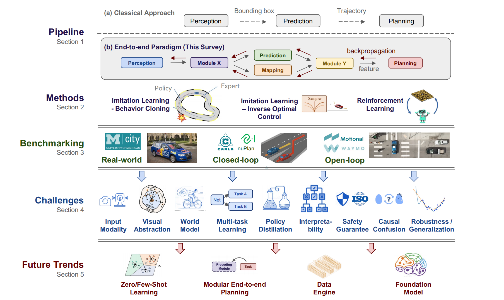
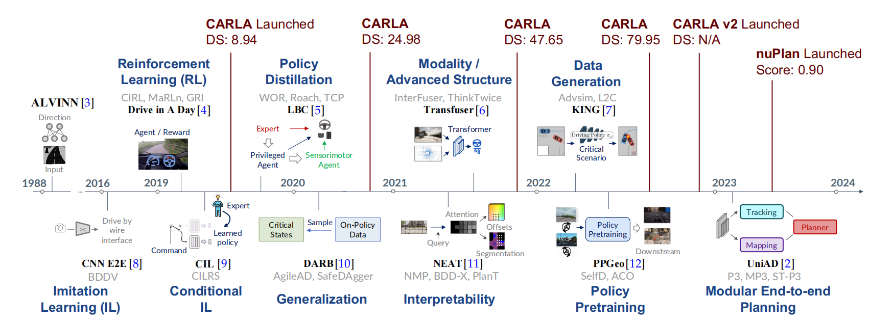
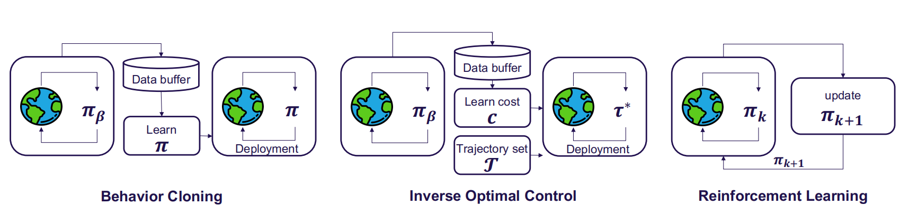
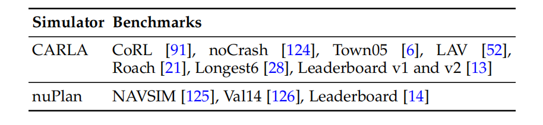

### 0 Abstract

随着大规模数据集的可用性、闭环评估的实现以及对复杂场景下自动驾驶算法性能需求的增长，端到端方法得到了快速发展。

- 对超过270篇关于端到端自动驾驶算法的文献进行了全面分析。
- 涵盖了该领域的动机、发展路线图、方法论、面临的挑战及未来趋势。

**核心**

- 强调了端到端系统相较于模块化流程的优势，即通过联合优化感知和规划的特征来提升性能。
- 探讨了多模态融合、可解释性、因果混淆、鲁棒性和世界模型等关键挑战。
- 分析了基础模型和视觉预训练技术的最新进展，并讨论了如何将这些技术融入端到端驾驶框架中。

### 1 Introduction

#### 背景与动机

- 传统的自动驾驶系统采用模块化设计策略，每个功能（如感知、预测和规划）独立开发并集成到车载车辆中。
- 规划或控制模块负责生成转向和加速度输出，在决定驾驶体验方面起着至关重要的作用。
- 常见的规划方法使用复杂的基于规则的设计，但在处理道路上发生的大量情况时往往无效。
- 端到端自动驾驶系统定义为完全可微的程序，以原始传感器数据作为输入，生成计划和（或）低级控制动作作为输出。
- 与传统方法相比，端到端系统通过联合优化感知和规划的特征，简化了系统结构，提高了计算效率，增强了数据驱动优化的潜力。

#### 传统架构 VS 端到端

**classical pipeline:**

- 每个模型都是独立的组件，对应一个特定的任务（例如交通灯检测）。设计上具有良好的可解释性和易于调试的优点。
- 各模块的优化目标不同，整个系统可能无法统一到最终的规划/控制任务上。
- 顺序过程中各模块的错误可能会累积，导致信息损失。
- 多任务、多模型部署涉及多个编码器和消息传输系统，增加了计算负担，可能导致计算资源的次优利用。

**End-to-end System:**

- 将感知、预测和规划整合到一个单一模型中，可以进行联合训练。整个系统及其中间表示都朝着最终任务进行优化。共享主干网络提高了计算效率。

- 端到端范式并不意味着只有一个黑盒输出规划/控制结果。可以有中间表示和输出，类似于经典方法。一些最先进的系统采用了模块化设计，但通过联合优化所有组件来实现卓越性能。

#### 发展历程

- 1988年，ALVINN开创了端到端自动驾驶的先河，使用相机和激光测距仪的输入，通过简单的神经网络生成转向输出。
- NVIDIA设计了一种基于CNN的端到端系统，重新确立了这一理念。
- 深度神经网络的发展显著推进了模仿学习和强化学习的进步。
- 2021年左右，随着多种传感器配置的出现，研究重点转向了多模态融合和高级架构（如Transformer），以捕捉全局上下文和代表性特征。
- 近期工作集中在提高系统的可解释性和安全性，生成安全关键数据，预训练基础模型或骨干网络，以及倡导模块化的端到端规划哲学。

### 2 Methods

#### 模仿学习 (Imitation Learning, IL)

- **定义与目标:**
  - 模仿学习通过模仿专家的行为来训练代理，要求数据集 $ D = \{ \xi_i \} $ 包含在专家策略 $ \pi_\beta $ 下收集的轨迹，每个轨迹是一系列状态-动作对。
  - 目标是学习一个代理策略 $ \pi $，使其匹配专家策略 $ \pi_\beta $。
  - 代理策略 $ \pi $ 可以输出计划轨迹或控制信号。
- **行为克隆 (Behavior Cloning, BC):**
  - **原理:**
    - 行为克隆通过最小化监督学习的规划损失 $ E(s, a) \ell(\pi_\theta(s), a) $ 来使代理策略与专家策略匹配。
    - 早期应用通常采用端到端神经网络从摄像头输入生成控制信号。
  - **改进:**
    - 多传感器输入、辅助任务和改进的专家设计等增强措施，使基于BC的端到端驾驶模型能够处理复杂的城市场景。
- **逆最优控制 (Inverse Optimal Control, IOC):**
  - **原理:**
    - 逆最优控制利用专家演示来学习奖励函数 $ R(s, a) $。
    - 传统IOC算法假设专家的奖励函数是特征的线性组合。
  - **生成对抗模仿学习 (Generative Adversarial Imitation Learning, GAIL):**
    - 一种专门的IOC方法，设计奖励函数为对抗目标，区分专家和学习策略，类似于生成对抗网络。
  - **成本学习框架:**
    - 端到端方法学习合理的成本 $ c(·) $，并通过算法轨迹采样器选择成本最低的轨迹 $ \tau^* $。
    - 成本表示包括鸟瞰图中的学习成本体积、其他代理未来运动的联合能量或概率语义占用层。
    - 轨迹通常从固定的专家轨迹集中采样或通过运动学模型参数采样。
  - **挑战:**
    - 为了生成更真实的成本，通常需要高精度地图、辅助感知任务和多传感器，增加了学习和构建多模态多任务框架的难度。
    - 尽管如此，成本学习方法显著提升了决策的安全性和可解释性。

#### 强化学习 (Reinforcement Learning, RL)

- **定义与原理:**
  - 强化学习通过试错学习，成功应用于Atari基准测试。
  - DQN训练一个称为评估网络（Q网络）的神经网络，输入当前状态和动作，预测该动作的折扣回报。
  - 策略通过选择预测回报最高的动作隐式定义。
- **挑战:**
  - **数据收集:** RL需要一个允许执行潜在危险动作的环境，以收集新数据。这在现实世界中极具挑战性，因此大多数RL研究仅在仿真环境中进行。
  - **数据量:** RL需要比IL更多的数据进行训练。
  - **模型深度:** RL获得的梯度不足以训练深度感知架构（如ResNet），而这些架构是驾驶所必需的。
- **成功案例:**
  - RL已成功应用于空旷街道上的车道跟随任务，类似的任务早在三十年前就已通过IL完成。
  - 结合监督学习（SL）的RL在端到端驾驶中取得了成功。例如，隐式能力通过SL预训练CNN编码器，再用现代Q学习版本训练浅层策略头。
  - 使用特权模拟器信息的RL也取得了成功，如Roach和WoR。
- **未来方向:**
  - **奖励函数设计:** 当前的工作通常使用简单的奖励函数，如进度和碰撞避免，这可能导致风险行为。设计或学习更好的奖励函数是一个开放问题。
  - **稀疏奖励:** 开发能够处理稀疏奖励的RL算法，直接优化相关指标。
  - **世界模型:** RL可以与世界模型结合，但存在特定挑战。
  - **低维表示:** 当前的RL解决方案严重依赖于场景的低维表示。

### 3 Benchmarking

**核心贡献:**

- 讨论自动驾驶系统的评估方法，包括**真实世界评估**、**在线/闭环仿真**和**离线/开环仿真**。
- 详细介绍了仿真中的四个主要子任务：**参数初始化**、**交通仿真**、**传感器仿真**和**车辆动力学仿真**。
- 总结了目前可用的**开源仿真器**和**基准测试**。

#### 真实世界评估 (Real-world Evaluation)

- **背景:**
  - 早期的自动驾驶基准测试涉及真实世界的评估。DARPA发起了一系列比赛，包括首次赛事（奖金100万美元，要求自主导航240公里的莫哈韦沙漠路线，但没有团队成功）和最终的DARPA城市挑战赛（要求车辆在96公里的模拟城镇课程中遵守交通规则并避开障碍物）。
  - 这些比赛促进了自动驾驶技术的发展，如LiDAR传感器的使用。
  - 密歇根大学建立了MCity，一个大型的受控真实环境，用于测试自动驾驶车辆。
- **挑战:**
  - 学术界由于缺乏数据和车辆，很少用于端到端系统的评估。
  - 产业界拥有资源部署无人驾驶车队，可以依靠真实世界评估来基准测试其算法的改进。

#### 在线/闭环仿真 (Online/Closed-loop Simulation)

- **背景:**
  - 真实世界测试成本高昂且风险大，仿真成为可行的替代方案。
  - 仿真器促进快速原型设计和测试，提供低成本访问多样化的场景，用于单元测试，并提供准确的性能测量工具。
  - 但仿真结果不一定能推广到真实世界。
- **闭环评估:**
  - 闭环评估涉及构建一个接近真实驾驶环境的仿真环境，将驾驶系统部署在仿真中并测量其性能。
  - 系统需要在交通中安全导航并朝着指定的目标位置前进。
  - 发展此类仿真器涉及四个主要子任务：参数初始化、交通仿真、传感器仿真和车辆动力学仿真。

##### 参数初始化 (Parameter Initialization)

- **方法:**
  - **程序生成 (Procedural Generation):**
    - 传统上，初始参数由3D艺术家和工程师手动调整，限制了可扩展性。
    - 最近，一些仿真属性可以通过计算机算法从概率分布中采样，称为程序生成。
    - 程序生成算法结合规则、启发式和随机化，创建多样化的道路网络、交通模式、光照条件和物体放置。
    - 尽管效率较高，但仍需要预定义参数和算法来控制生成的可靠性，耗时且需要大量专业知识。
  - **数据驱动 (Data-Driving):**
    - 数据驱动方法旨在学习所需的参数。最简单的方法是从真实世界驾驶日志中采样，提取道路地图或交通模式等参数。
    - 日志采样的优势在于能够捕捉真实世界数据中的自然变异性，生成更真实的仿真场景。
    - 但它可能无法涵盖测试自动驾驶系统鲁棒性所需的关键罕见情况。初始参数可以优化以增加这些场景的代表性。
    - 另一种高级数据驱动方法是生成建模，利用机器学习算法学习真实世界数据的底层结构和分布，生成新的类似真实世界的场景。

##### 交通仿真 (Traffic Simulation)

- **方法:**
  - **基于规则 (Rule-Based):**
    - 基于规则的交通仿真使用预定义规则生成交通实体的运动。最著名的实现是智能驾驶员模型（IDM）。
    - IDM是一个跟车模型，根据当前速度、前车速度和期望的安全距离计算每辆车的加速度。
    - 尽管广泛使用且简单，但这种方法可能不足以模拟城市环境中的真实运动和复杂交互。
  - **数据驱动 (Data-Driven):**
    - 真实的人类交通行为高度互动和复杂，包括换道、汇入、突然停车等。
    - 数据驱动的交通仿真利用从真实世界驾驶中收集的数据，可以捕捉更细致、真实的行为，但需要大量的标注数据进行训练。
    - 提出了多种基于学习的技术来实现这一任务。

##### 传感器仿真 (Sensor Simulation)

- **重要性:**
  - 传感器仿真对于评估端到端自动驾驶系统至关重要，涉及生成模拟的原始传感器数据，如相机图像或LiDAR扫描。
- **方法:**
  - **基于图形 (Graphics-Based):**
    - 最近的计算机图形仿真器使用环境的3D模型和交通实体模型，通过传感器物理渲染过程的近似生成传感器数据。包括模拟相机图像中的遮挡、阴影和反射。
    - 但基于图形的仿真往往不够真实，或者需要大量计算，难以并行化。
  - **数据驱动 (Data-Driven):**
    - 数据驱动的传感器仿真利用真实世界传感器数据生成仿真，其中自车和背景交通的运动方式可能与记录不同。
    - 流行的方法包括神经辐射场（NeRF）和3D高斯点绘，可以通过学习场景的几何和外观的隐式表示生成新的视图。
    - 这些方法在视觉上可以生成比基于图形的方法更真实的传感器数据，但存在高渲染时间和每个场景独立训练的限制。
    - 另一种方法是领域适应，即最小化真实和基于图形的仿真传感器数据之间的差距。可以使用GAN等深度学习技术提高真实性。

##### 车辆动力学仿真 (Vehicle Dynamics Simulation)

- **重要性:**
  - 驾驶仿真最后一个方面是确保模拟车辆的运动符合物理合理性。
- **方法:**
  - 大多数现有的公开仿真器使用高度简化的车辆模型，如单轮模型或自行车模型。
  - 为了促进算法从仿真到真实世界的无缝转移，必须纳入更准确的车辆动力学物理建模。
  - CARLA采用多体系统方法，将车辆表示为四个轮子上的多个弹簧质量系统。

##### 基准测试 (Benchmarks)

- **概述:**
  - 表1提供了截至当前可用的端到端驾驶基准测试的简洁概述。
  - 2019年，CARLA发布的原始基准测试几乎完美解决。
  - 后续的NoCrash基准测试涉及在特定天气条件下在一个CARLA城镇进行训练，并测试对另一个城镇和天气的泛化能力。
  - Town05基准测试涉及在所有可用城镇进行训练，保留Town05进行测试。
  - LAV基准测试在所有城镇进行训练，保留Town02和Town05进行测试。
  - Roach使用3个测试城镇，尽管都在训练中见过，但不包含Town05和LAV中的安全关键场景。
  - Longest6基准测试使用6个测试城镇。
  - 两个在线服务器（排行榜v1和v2）通过保持评估路线保密来确保公平比较。排行榜v2极具挑战性，因为路线长度较长（平均超过8公里，而v1为1-2公里），并且包含多种新的交通场景。
  - nuPlan仿真器目前可通过NAVSIM项目访问，用于评估端到端系统。
  - 还有两个基准测试，代理通过数据驱动参数初始化输入地图和对象属性，nuPlan Val14 提出了一种使用数据驱动参数初始化的方法。

#### 离线/开环评估 (Offline/Open-loop Evaluation)

- **定义:**
  - 开环评估主要评估系统相对于预先记录的专家驾驶行为的性能。
- **方法:**
  - 开环评估需要包含以下内容的评估数据集：
    1. 传感器读数
    2. 目标位置
    3. 对应的未来驾驶轨迹，通常来自人类驾驶员
  - 给定传感器输入和目标位置作为输入，性能通过将系统预测的未来轨迹与驾驶日志中的轨迹进行比较来衡量。
  - 系统根据其轨迹预测与人类真实轨迹的匹配程度以及辅助指标（如与其他代理的碰撞概率）进行评估。
- **优势:**
  - 开环评估易于实施，使用真实交通和传感器数据，无需仿真器。
- **挑战:**
  - 主要缺点是它不能衡量系统在实际部署中遇到的测试分布中的性能。
  - 在测试过程中，驾驶系统可能会偏离专家驾驶轨迹，验证系统从这种偏差中恢复的能力非常重要。
  - 在多模态场景中，预测轨迹与记录轨迹之间的距离不是一个理想的指标。例如，在汇入转弯车道的情况下，立即汇入或稍后汇入都可能是有效的，但开环评估会惩罚未在数据中观察到的选项。
  - 因此，除了测量碰撞概率和预测误差外，还提出了一些指标来涵盖更全面的方面，如交通违规、进展和驾驶舒适度。
- **数据集:**
  - 这种方法需要全面的轨迹数据集。最流行的数据集包括nuScenes、Argoverse、Waymo 和 nuPlan 。
  - 所有这些数据集都包含大量具有不同程度难度的真实世界驾驶路径。
  - 总的来说，如果可用且适用，建议未来研究中使用现实的闭环基准测试。
