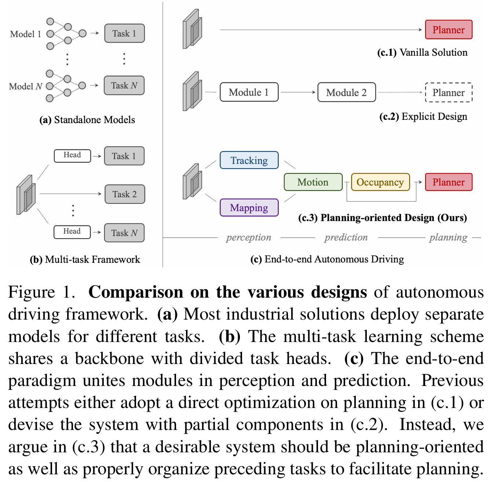

### 1 Abstract

1. **现状与问题**：
   - 现代自动驾驶系统通常按顺序执行模块化任务，包括**感知**、**预测**和**规划**。
   - 当前方法要么为每个任务部署独立模型，要么设计多任务范式，使用不同的头部进行处理。
   - 这些方法可能会遇到**累积误差**或**任务协调不足**的问题。
2. **新方法**：
   - 文章提出了一个理想框架，应该针对最终目标——自动驾驶汽车的规划——进行设计和优化。
   - 因此，重新审视感知和预测的关键组件，并优先考虑所有任务对规划的贡献。
3. **UniAD框架**：
   - 引入了UniAD，这是一个最新的综合框架，包含一个网络中的全栈驾驶任务。
   - 精心设计了该框架，以利用每个模块的优势，并从全局角度为代理交互提供互补的特征抽象。
   - 任务通过统一的查询接口进行沟通，以共同促进规划。
4. **性能验证**：
   - UniAD在具有挑战性的nuScenes基准上进行了实例化。
   - 通过广泛的消融实验，证明了这种哲学的有效性，在各方面显著超越了之前的最先进方法。

### 2 Introduction

1. **现有自动驾驶设计与问题**：
   
   - 随着深度学习的成功发展，自动驾驶算法通常包括一系列任务，例如感知中的检测、跟踪和映射，以及预测中的运动和占用预测。
   - 如图1(a)所示，许多工业解决方案为每个任务独立部署模型，只要车载芯片的资源带宽允许。虽然这种设计简化了各团队的研发难度，但由于优化目标的隔离，可能会导致跨模块的信息丢失、错误积累和特征错位。
   - 更优雅的设计是将广泛的任务整合到一个多任务学习范式中，通过在共享特征提取器中插入多个任务特定的头部，如图1(b)所示。这在包括一般视觉和自动驾驶在内的许多领域是一种流行的做法。
   
   
   
2. **多任务学习的优势与问题**：
   - 多任务学习中的共同训练策略可以利用特征抽象，轻松扩展到其他任务，并节省车载芯片的计算成本。然而，这种方案可能会导致不良的“负迁移”，即某些任务的优化可能会对其他任务产生负面影响。
   
3. **端到端自动驾驶**：
   
   - 相比之下，端到端自动驾驶的出现将感知、预测和规划等所有节点统一起来。前置任务的选择和优先级应有利于规划。系统应以规划为导向，精心设计以包含特定组件，从而减少独立选项中的累积误差或MTL方案中的负迁移。
   - 一种“白板”做法是直接预测计划轨迹，而不进行任何显式的感知和预测监督（如图1(c.1)所示）。虽然先驱工作在闭环仿真中验证了这种简单设计，但它在安全保证和可解释性方面存在不足，特别是在高度动态的城市场景中。
   
4. **提出UniAD框架**：
   - 鉴于此，提出了UniAD，一个统一的自动驾驶算法框架，结合了五个关键任务，旨在构建一个安全和稳健的系统（如图1(c.3)所示）。
   - UniAD的设计**以规划为导向**，强调不是简单地堆叠任务，而是通过**查询设计**将所有节点连接起来。相比于传统的边界框表示，查询具有更大的感受野，可以减轻上游预测的累积错误。查询还灵活地建模和编码各种交互关系，例如多代理之间的关系。

5. **贡献与验证**：
   
   - 本文提出了一个新的自动驾驶框架，遵循规划导向的理念，强调**任务协调**的重要性，而不是独立设计或简单的多任务学习。
   - 提出了UniAD，一个综合的端到端系统，结合了广泛的任务。其关键组件是查询设计，作为连接所有节点的接口，从而享有灵活的中间表示和任务间知识交换，以实现规划。
   - 在挑战性基准上实例化UniAD，通过广泛的消融实验，验证了该方法在各方面显著优于之前的最先进方法。

### 3 Methodology

 
