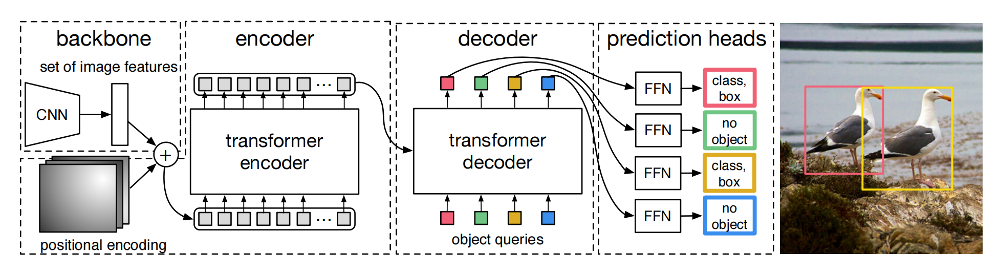

### 0. Abstract

- **基于Transformer的架构**：DETR引入了一种新的目标检测框架，使用Transformer网络，避免了手工设计的anchors和NMS。
- **直接集预测**：DETR将目标检测看作是一个直接的**集预测问题**，使用**二分图匹配损失**确保每个预测唯一对应一个真实目标。
- **全局关系推理**：通过Transformer的全局关系建模，DETR提升了大目标检测的效果。
- **性能表现**：在COCO数据集上，DETR的性能与优化的Faster R-CNN基准相当，尤其在大目标上表现更好，但小目标检测仍是挑战。

### 1. Introduction

**传统目标检测的挑战**：

- 现有目标检测器依赖于anchors，这些锚点需要针对每个数据集和任务进行精细调优。此外，还需要应用NMS来消除冗余预测。

**DETR的主要贡献**：

1. **基于Transformer的设计**：DETR用Transformer网络替代了anchor机制和NMS，直接在一次推理中预测出目标集。
2. **二分图匹配损失**：通过将检测任务看作集预测问题，使用二分图匹配损失确保每个真实目标都有唯一的预测，减少冗余。
3. **端到端架构**：该框架是完全端到端的，简化了训练和推理流程。

### 2. Related work

#### 2.1 Set Prediction

集合预测任务的一个关键挑战是避免预测重复目标。

- 传统的目标检测方法依赖后处理步骤，来解决重复预测问题。
- 早期的深度学习模型尝试通过二分图匹配损失实现集合预测，但大多需要手工设计的后处理。
- DETR则完全去除了这些后处理步骤，直接利用Transformer的全局推理能力和二分图匹配损失来解决重复问题。

#### 2.2 Transformers and Parallel Decoding

Transformer最初在机器翻译中引入，通过自注意力机制有效捕捉序列中的全局关系。虽然最初的Transformers是自回归的，DETR采用并行解码方式，使得多个目标可以同时预测，从而大大减少了推理时间。这种并行解码的方式也使得模型能够在单次前向传播中输出完整的目标集。

#### 2.3 Object detection

**anchor based and anchor free**

初始预测框的设计方式对最终检测性能有显著影响

- 现代目标检测方法通常依赖 anchor 或 proposal，例如 Faster R-CNN 和 YOLO。这些方法的最终性能往往高度依赖 anchor 的设计或 proposal 的生成策略。

- DETR通过直接预测绝对的边界框坐标，简化了检测过程，减少了对先验知识的依赖。

**Set-based loss**

- **早期方法**：仅使用卷积层或全连接层来建模预测之间的关系，依赖于后处理步骤如非极大值抑制（NMS）来提升性能。

- **最近的方法**：使用非唯一的匹配规则和NMS来处理预测结果。

**Learnable NMS methods and relation networks**

这些方法通过注意力机制显式地建模不同的预测结果之间的关系，避免了手工设计的后处理步骤。

- **优点**：不需要传统的NMS步骤，训练过程更加端到端。
- **缺点**：仍然依赖于一些手工设计的场景特征（如提议框坐标），需要一定的先验知识。

**Recurrent Detectors**

这些方法使用双边匹配损失和基于编码器-解码器架构的模型，直接生成一组边界框。

- **局限性**：这些方法通常只在小数据集上进行评估，且基于自回归模型（如RNN），未能利用最近的Transformer架构进行并行解码。
- **与Transformer的对比**：作者的方法不同于这些基于自回归模型的方法，采用了Transformer的并行解码机制，提高了检测效率和性能。

### 3. The DETR model

为了实现直接的集合预测，目标检测需要满足以下两个条件：

1. **集合预测损失（Set Prediction Loss）**：
   - 强制预测的边界框与真实边界框之间进行唯一匹配。
   - 确保每个真实目标只对应一个预测框，避免重复检测。
2. **能够在单次预测中生成对象集合并建模它们之间关系的架构**：
   - 需要一种能够同时预测多个对象并理解它们相互关系的网络架构。

#### 3.1 Object Detection Set Prediction Loss

先使用匈牙利算法去一一匹配**预测**和**真值**，再根据匹配的结果去计算损失。

##### 3.1.1 DETR的预测方式

- **固定大小的预测集合**：DETR 在一次解码过程中生成固定数量的 N（论文中是100） 个预测，其中N通常大于图像中实际的目标数量。
- **训练中的主要挑战**：需要将预测的对象（类别、位置、大小）与真实目标进行有效匹配。

##### 3.1.2 双边匹配损失（Bipartite Matching Loss）

- **匹配过程**：
  - 将预测的 N 个边界框与真实目标集合 y 进行一对一匹配。
  - 使用**匈牙利算法（Hungarian Algorithm）**找到最优匹配，即最小化匹配成本的排列 $\sigma$。
  - **匹配成本（Lmatch）**包含类别预测的损失和边界框相似度的损失。
- **具体定义**：
  - $y$：真实目标集合。
  - $\hat y$：预测的N个边界框集合。
  - 如果 N 大于真实目标数量，y 会被填充为大小为N的集合，剩余部分标记为 $\emptyset$（无对象）。
- **Lmatch的公式**
  - 当真实类别不为空时，考虑类别预测概率和边界框损失。
  - 当真实类别为空时，匹配成本为常数。
$$
L_ {\text{match}}(y_i, \hat{y}_ {\sigma(i)}) = -\mathbb{1}\{c_i \neq \emptyset\} \hat{p} _ {\sigma(i)}(c_i) + \mathbb{1}\{c_i \neq \emptyset\} L_ {\text{box}}(b_i, \hat{b} _ {\sigma(i)})
$$

1. $y_i$：第 $i$ 个真实目标的标注信息，包含类别标签 $c_i$ 和边界框坐标 $b_i$，即 $y_i = (c_i, b_i)$。其中：
   - $c_i$：真实目标的类别标签。
   - $b_i$：真实目标的边界框坐标。
2. $\hat{y} _ {\sigma(i)}$：预测结果中与第 $i$ 个真实目标匹配的预测，包含预测的类别概率 $\hat{p} _ {\sigma(i)}(c_i)$ 和边界框 $\hat{b} _ {\sigma(i)}$。通过Hungarian 算法找到的与 $y_i$ 匹配的预测目标。
3. $\mathbb{1} \{c_i \neq \emptyset \}$：指示函数，表示如果第 $i$ 个真实目标不是“无目标”（即 $c_i \neq \emptyset）$，则该函数值为1；否则为0。这个条件用来确保“无目标”类不会计算边界框损失。
4. $\hat{p} _ {\sigma(i)}(c_i)$：模型预测的第 $i$ 个目标属于类别 $c_i$ 的概率。
5. $L_ {\text{box}}(b_i, \hat{b}_ {\sigma(i)})$：真实目标边界框 $b_i$ 与预测边界框 $\hat{b}_{\sigma(i)}$ 之间的边界框损失。通常包括 L1 损失和广义 IoU 损失的组合，用于衡量预测边界框与真实边界框之间的差异。

- **损失函数设计**：
  - 结合了类别预测的负对数似然损失和边界框的回归损失。
  - 对于 $\emptyset$ 类的预测，类别损失会被下调权重以平衡正负样本的不平衡。

$$
L_ {\text{Hungarian}}(y, \hat{y}) = \sum_{i=1}^{N} \left( -\log \hat{p}_ {\sigma(i)}(c_i) + \mathbb{1}\{c_i \neq \emptyset\} L_ {\text{box}}(b_i, \hat{b}_ {\sigma(i)}) \right)
$$

##### 3.1.3 边界框损失（Bounding Box Loss）

- **传统方法**：相对偏移量预测（Δ Predictions）
    - 工作原理：许多检测器（如 Faster R-CNN、YOLO 等）通过预测相对于某些**初始猜测**（如锚框或提议框）的**偏移量（Δ）**来调整边界框的位置和大小。
    - 优点：利用预定义的锚框可以帮助模型更快地收敛，并且在多尺度和多长宽比的目标检测中表现良好。
    - 缺点：依赖于预定义的初始框设计，增加了模型的复杂性，并且在不同尺度的目标上可能需要大量的锚框。
- **本文方法**：直接预测绝对边界框
    - 工作原理：与传统方法不同，本文方法直接预测相对于输入图像的**绝对位置**的边界框，而不是相对于初始猜测的偏移量。
    - 优点：简化了实现过程，避免了复杂的锚框设计，减少了对先验知识的依赖。
    - 缺点：直接预测绝对位置可能导致不同尺度的边界框在损失计算上存在比例差异，尤其是使用 L1 损失时，小边界框和大边界框的损失规模不同，即使它们的相对误差相似。
- **损失函数设计**：
  - 使用**L1损失**和**GIoU损失（Generalized IoU Loss）**的线性组合，以减轻不同尺度下损失的不一致性。 
  - 所有损失项按批次中的目标数量进行归一化。

$$
L_ {\text{box}}(b_i, \hat{b}_ {\sigma(i)}) = \lambda_ {\text{IoU}} L_ {\text{GIoU}}(b_i, \hat{b}_ {\sigma(i)}) + \lambda_ {L1} ||b_i - \hat{b}_ {\sigma(i)}||_1
$$

1. $b_i$：第 $i$ 个真实目标的边界框。
2. $\hat{b}_{\sigma(i)}$：与真实目标 $b_i$ 匹配的第 $i$ 个预测边界框，通过 Hungarian 算法找到的预测。
3. $L_ {\text{GIoU}}(b_i, \hat{b}_ {\sigma(i)})$：真实边界框 $b_i$ 和预测边界框 $\hat{b}_ {\sigma(i)}$ 之间的广义交并比（GIoU）损失。GIoU 是一种改进的IoU，用来更好地处理边界框不重叠的情况。GIoU 可以衡量两个边界框之间的几何差异，即不仅考虑两个框的交集，还考虑它们的包围区域。
4. $||b_i - \hat{b}_ {\sigma(i)}||_ 1$：真实边界框 $b_i$ 和预测边界框 $\hat{b}_ {\sigma(i)}$ 之间的L1距离，即每个坐标的绝对差值之和。
5. $\lambda_{\text{IoU}}$：权重系数，用于调整广义IoU损失在总损失中的贡献。
6. $\lambda_{L1}$：权重系数，用于调整L1损失在总损失中的贡献。

#### 3.2 DETR Architecture

**核心组件**：

1. **主干网络**：使用 ResNet 模型（如 ResNet-50 或 ResNet-101 ）作为特征提取器，生成输入图像的特征图，并将其传递给 Transformer。
  
2. **Transformer**：DETR 的核心，由编码器-解码器架构组成。
   - **编码器**：处理输入的特征图，通过自注意力机制捕捉全局依赖关系。
   - **解码器**：使用固定数量的学习到的目标查询（object queries）关注图像中的相关部分，预测目标类别和边界框。
  
3. **位置编码**：用于为 Transformer 提供空间信息，包括输入特征图和目标查询的空间位置编码。

4. **集预测损失**：结合分类和边界框回归，通过二分图匹配损失确保预测和真实目标之间的一一对应。

**工作流程**：

- **输入**：图像通过主干网络处理，生成特征图。
- **Transformer编码器**：特征图通过编码器处理，捕捉全局关系。
- **Transformer解码器**：解码器使用目标查询生成目标预测。
- **输出**：输出一组目标检测结果，包含类别标签和边界框。

### 4. Experiments

- **COCO数据集**：DETR 在 COCO 数据集上的表现与高度优化的 Faster R-CNN 相当，尤其是在大目标检测上表现突出。
- **AP评分**：DETR 在大目标的平均精度（APL）上有显著提升，但在小目标检测上存在挑战（APS）。
- **训练复杂性**：DETR 需要更长的训练时间（500个epoch）相比于传统检测器。

**消融实验**：

1. **层数影响**：增加解码器层数显著提升了性能，特别是在 AP 和 AP50 上表现明显。
2. **位置编码的影响**：空间和查询位置编码对有效的目标检测至关重要。

### 5. Conclusion

**未来工作**：DETR 通过移除 anchors 和 NMS 简化了目标检测流程，但小目标检测仍面临挑战。未来研究可以进一步优化训练过程并解决这些问题。

**主要成果**：
- DETR 的端到端设计简化了目标检测的复杂度。
- 它为 Transformer 在其他检测任务中的应用（如全景分割）奠定了基础。
