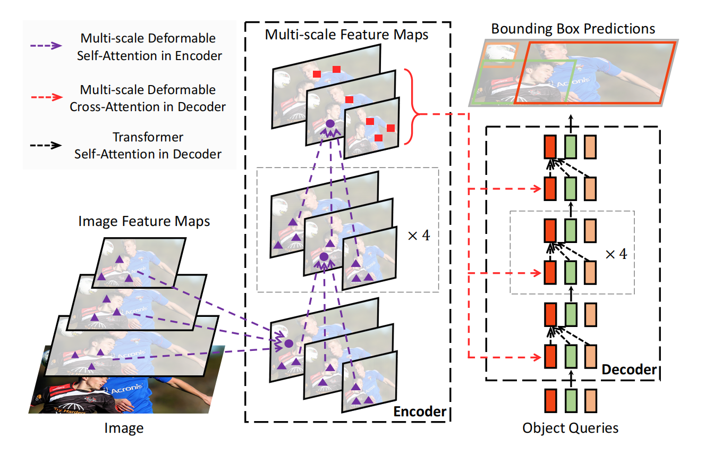
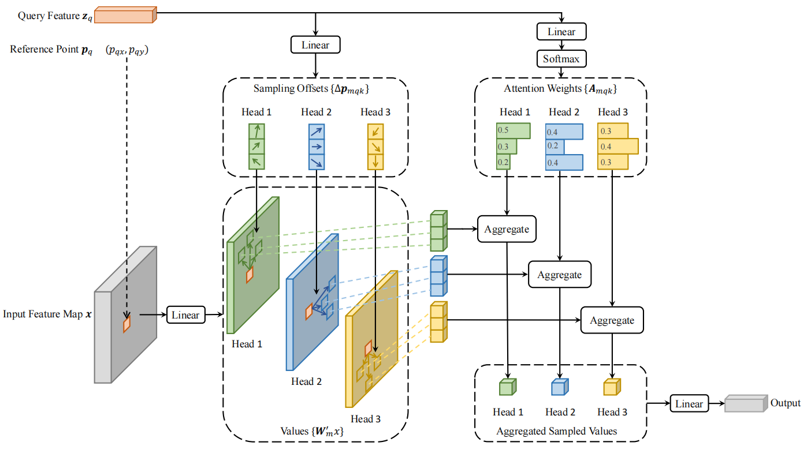

### 0. Abstract

- **改进的Transformer架构**：提出了Deformable DETR，一种改进的基于Transformer的端到端目标检测框架，通过引入可变形注意力机制，提高了对小目标的检测性能。
- **更快的收敛速度**：相比原始的DETR，Deformable DETR在训练时需要的周期减少了10倍。

### 1. Introduction

**DETR的局限性**：

- 原始的DETR虽然在目标检测领域展示了潜力，但在检测小目标和训练收敛速度上存在局限。
- 由于Transformer注意力模块在处理图像特征图时的局限性，导致DETR在高性能目标检测上面临挑战。

**Deformable DETR的贡献**：

1. **可变形注意力机制**：通过只关注参考点周围的少数关键采样点，提高了模型对小目标的检测能力。
2. **多尺度特征聚合**：不需要依赖FPN，Deformable DETR可以直接通过注意力机制聚合多尺度特征。
3. **快速收敛**：在COCO基准测试中，Deformable DETR显示出比DETR更快的收敛速度，并且对小目标的检测性能有显著提升。

### 2. Related Work

#### 2.1 Efficient Attention Mechanism

Transformer模型中的高效注意力机制，尤其是自注意力（self-attention）和交叉注意力（cross-attention）在处理大量键（key）元素时所带来的高时间和内存复杂度问题。为了应对这一挑战，近年来的研究工作大致可以分为以下三类：

1. **使用预定义的稀疏注意力模式**：
   - **固定局部窗口**：通过限制注意力只关注局部区域，从而降低计算复杂度。这种方法虽然有效减少了计算量，但会丢失全局信息。
   - **扩展感受野**：为了弥补局部窗口带来的信息损失，一些研究通过固定间隔地关注关键元素或引入少量特殊令牌，使得注意力机制能够覆盖更广泛的区域。
   - **预定义稀疏模式**：通过添加预先设计的稀疏模式，使得注意力机制能够直接关注远距离的关键元素。
2. **学习数据依赖的稀疏注意力**：
   - **局部敏感哈希（LSH）**：例如Kitaev等人提出的方法，将查询和键元素哈希到不同的桶中，以减少计算量。
   - **k-means聚类**：如Roy等人使用k-means聚类找到最相关的键元素。
   - **块排列学习**：Tay等人通过学习块排列，实现块状的稀疏注意力。
3. **探索自注意力的低秩性质**：
   - **线性投影**：Wang等人通过在尺寸维度上进行线性投影，减少键元素的数量。
   - **核化近似**：Katharopoulos等人和Choromanski等人通过核化方法重新计算自注意力，从而降低复杂度。

在图像处理领域，目前高效注意力机制的设计主要集中在第一类方法。理论上这些方法能够降低复杂度，但是实际实现中它们的速度往往比传统卷积慢至少3倍，这是由于内存访问模式的固有限制。

另一方面，卷积的变体，如**变形卷积**和**动态卷积**，也可以被视为自注意力机制。这些方法在图像识别任务中比Transformer的自注意力机制更高效，但它们缺乏对元素关系的建模能力。

最后，作者提出了一种**变形注意力模块**，受变形卷积的启发，属于第二类方法。该模块仅关注由查询元素特征预测的一小组固定采样点。与Ramachandran等人和Hu等人的方法不同，变形注意力在相同的浮点运算量（FLOPs）下，其速度仅比传统卷积稍慢，同时能够有效建模元素之间的关系。

#### 2.2 Multi-scale Feature Representation

为了有效表示不同尺度的对象，现代目标检测框架通常利用多尺度特征。

- **特征金字塔网络**：如FPN、PANet、BiFPN等，通过不同的结构组合多尺度特征，以适应不同大小的目标检测。
- **多尺度变形注意力模块**：作者提出了一种新的多尺度变形注意力模块，能够通过注意力机制自然地聚合多尺度特征图，而无需依赖上述的特征金字塔网络（FPN等）。这种方法简化了特征融合过程，同时保持了高效的性能。

### 3. Revisiting Transformers and DETR

#### 3.1 **Transformer中的多头注意力机制**

- **基本概念**：
  - **多头注意力（Multi-Head Attention）**：Transformer架构中的核心组件，通过多个注意力头（attention heads）并行计算，能够从不同的表示子空间和不同的位置关注关键信息。
  - **计算过程**：
    - 给定一个查询元素 $z_q$ 和一组键元素 $x_k$，多头注意力通过计算查询与各键的兼容性得出注意力权重 $A_{mqk}$。
    - 每个注意力头 $m$ 有自己的可学习权重矩阵 $W'_m$ 和 $W_m$，用于投影查询和键。
    - 最终，各个注意力头的输出通过线性组合得到多头注意力的最终输出。
- **存在的问题**：
  1. 训练时间长：
     - 当查询和键的数量 $N_q$ 和 $N_k$ 很大时，注意力权重 $A_{mqk}$ 会趋近于均匀分布，导致梯度模糊，模型需要较长的训练时间才能使注意力权重集中于特定的键。
     - 在图像领域，键元素通常是图像像素，数量 $N_k$ 很大，导致训练收敛缓慢。
  2. 计算和内存复杂度高：
     - 多头注意力的计算复杂度为 $O(N_qC^2 + N_kC^2 + N_qN_kC)$。
     - 在图像处理中，查询和键的数量通常相等且与特征图尺寸相关，复杂度主要由 $O(N_qN_kC)$ 决定，随着特征图尺寸的增加，复杂度呈平方增长，限制了模型的可扩展性。

#### 3.2 **DETR**

- **基础结构**：

  基于 Transformer 的Encoder-Decoder架构，结合集合级的 Hungarian 损失，通过双边匹配强制每个预测与一个唯一的真实边界框匹配。

  - 输入处理：
    - 输入特征图 $x$ 由 CNN 骨干网络（如ResNet）提取，包含位置编码。
    - Transformer Encoder将输入特征图转换为一组对象查询的特征。
    - Decoder通过多头注意力模块处理对象查询，生成最终的检测结果。
  - 检测头：
    - 一个三层前馈神经网络（FFN）用于回归预测边界框坐标 $b$。
    - 一个线性层用于分类预测。

- **计算复杂度**：

  - **Encoder中的自注意力**：计算复杂度为 $O(H^2W^2C)$，随着特征图空间尺寸 $H \times W$ 的增加，复杂度呈平方增长。
  - **Decoder中的交叉注意力**：查询数量 $N = 100$，复杂度为 $O(HWC^2 + NHWC)$，随特征图尺寸线性增长。
  - **Decoder中的自注意力**：查询数量 $N$ 较小，复杂度为 $O(2NC^2 + N^2C)$，在对象查询数量适中时是可接受的。

- **存在的问题**：

  1. **小目标检测性能较低**：高分辨率特征图有助于检测小目标，但在DETR中，高分辨率特征图会导致Encoder中的自注意力模块计算复杂度过高，限制了模型对小目标的检测能力。
  2. **训练收敛速度慢**：Transformer 的注意力模块在处理图像特征时难以训练。例如，初始化时交叉注意力模块的注意力权重接近均匀分布，而训练结束时注意力权重变得非常稀疏，仅集中于目标边界。这种显著变化需要较长的训练时间才能实现。

### 4. Method

#### 4.1 Deformable Transformers for End-to-End Object Detection

##### 4.1.1 Deformable Attention Module

受可变形卷积的启发，引入可变形注意力模块。该模块仅关注参考点周围的一小组关键采样点，而不考虑特征图的空间大小。这种方法通过为每个查询分配少量固定的关键点，缓解了收敛性和特征空间分辨率的问题。

- **计算公式**：

  对于每个注意力头 $m$，计算在参考点 $p_q$ 周围的 $K$ 个采样点的加权和，再将所有注意力头融合。
  $$
  \text{DeformAttn} (z_ q, p_ q, x) = \sum_ {m=1}^{M} W_m \left( \sum_ {k=1}^{K} A_ {mqk} \cdot W'_ m x \left(p_ q + \Delta p_ {mqk} \right) \right)
  $$
    其中：

  - 对于查询元素 $q$（具有内容特征 $z_q$ 和二维参考点 $p_q$ ）
  - $z_q$：查询的特征表示。每个查询对应于一个潜在的目标（如图像中的一个物体）。
  - $p_q$ 表示查询的参考点，通常是查询所在位置的二维坐标。

  - $x \in \mathbb{R}^{C \times H \times W}$ 标识输入特征图。

    - $m$ 表示注意力头。
    - $k$ 表示采样点。
    - $A_{mqk}$ 是注意力权重，用于衡量采样点 $k$ 对查询 $q$ 的重要性。其值在 [0, 1] 之间，并且对每个 $m$ 和 $q$，所有 $k$ 的 $A_{mqk}$ 之和为 1。（注意力权重 $A_{mqk}$ 经过归一化，满足 $\sum_{k=1}^{K} A_{mqk} = 1$。）
    - $\Delta p_{mqk}$ 是采样点相对于参考点的偏移量，是一个二维向量，表示在特征图上的位置偏移。
    - 由于 $p_q + \Delta p_{mqk}$ 是小数坐标，采用双线性插值计算 $x(p_q + \Delta p_{mqk})$。

- **复杂度分析**：

  - 对于 Encoder 中的特征图，复杂度为 $O(HWC^2)$，与空间大小线性相关。
  - 对于 Decoder 中的跨注意力模块，复杂度为 $O(NKC^2)$，与空间大小 $HW$ 无关，其中 $N$ 是对象查询的数量。

##### 4.1.2 Multi-scale Deformable Attention Module

现代目标检测框架通常依赖于多尺度特征图，以更好地检测不同大小的目标。

- **计算公式**：

  首先对于每个特征层级 $l$，选择 $K$ 个采样点，进行特征加权求和。然后对于每个注意力头 $m$，在每个特征层级 $l$ 上计算这 $K$ 个采样点的加权和。最后，对所有注意力头在所有特征层级上的加权特征进行线性变换和融合。

  - 输入为多尺度特征图集合 $\{x_l\}_{l=1}^L$，每个特征图 $x_l \in \mathbb{R}^{C \times H_l \times W_l}$。

  - 对于每个查询，使用归一化坐标 $\hat{p}_q$ 来确定参考点位置。

  - 模块在多尺度特征图上采样 $LK$ 个点，计算注意力特征。
  $$
  \text{MSDeformAttn}(z_ q, \hat{p}_ q, \{ x_l \}_ {l=1}^L) = \sum_ {m=1}^{M} W_ m \left( \sum_ {l=1}^L \sum_ {k=1}^{K} A_ {mlqk} \cdot W'_ m x_l \left(\phi_ l(\hat{p}_ q) + \Delta p_ {mlqk}\right) \right)
  $$
    其中：
    - $l$ 表示多尺度特征层层级。
    - $\phi_l(\hat{p}_q)$ 表示将归一化坐标 $\hat{p}_q$ 重新缩放到第 $l$ 层特征图的坐标系。

- **模块特性**：

  - 当 $L = 1$ 且 $K = 1$ 时，模块退化为可变形卷积。
  - 该模块可以看作是 Transformer 注意力的一种高效变体，通过可变形采样位置引入预过滤机制。

##### 4.1.3 Deformable Transformer Encoder

- **设计**：用多尺度可变形注意力模块替换 DETR 中处理特征图的标准 Transformer 注意力模块。
- **输入**：
  - 从 ResNet 的 C3 到 C6 阶段提取多尺度特征图，每个特征图有 $C = 256$ 个通道。
  - 不使用 FPN，因为多尺度可变形注意力模块本身能够在多尺度特征图之间交换信息。
- **嵌入**：为每个查询像素添加尺度级嵌入 $e_l$ 以标识其所在的特征层级，除了位置嵌入之外。

##### 4.1.4 Deformable Transformer Decoder

- **注意力类型**：
  - **跨注意力（Cross-Attention）**：对象查询从 Encoder 输出的多尺度特征图中提取特征。
  - **自注意力（Self-Attention）**：对象查询之间相互作用，保持原有的自注意力机制不变。
- **参考点预测**：每个对象查询通过线性投影和 sigmoid 函数预测其参考点的二维归一化坐标 $\hat{p}_q$。
- **边界框预测**：检测头预测相对于参考点的边界框偏移量，将参考点作为边界框中心的初始猜测，增强 Decoder 注意力与预测边界框的相关性，加速训练收敛。

#### 4.2 Additional Improvements and Variants for Deformable DETR

由于 Deformable DETR 快速收敛、计算和内存效率高，为各种端到端目标检测器的变体提供了可能性。

1. **迭代边界框细化（Iterative Bounding Box Refinement）**：
   - **灵感来源**：光流估计中的迭代细化方法。
   - **方法**：在每个Decoder层中，根据前一层的预测结果迭代细化边界框，以提高检测性能。
2. **两阶段可变形 DETR（Two-Stage Deformable DETR）**：
   - **灵感来源**：两阶段目标检测器的思想。
   - **方法**：
     - **第一阶段**：生成 Region Proposals。为实现高召回率，每个多尺度特征图的像素作为对象查询，预测边界框并选择评分最高的边界框作为区域建议。这一阶段仅使用 Encoder，不包含 Decoder，以避免自注意力模块中查询数量过多带来的计算和内存开销。
     - **第二阶段**：将第一阶段生成的区域建议作为对象查询，输入到 Decoder 中进行进一步细化。
   - **注意**：在第一阶段不应用非极大值抑制（NMS），直接将区域建议输入第二阶段。

### 5. Experiment

- **数据集**：在COCO 2017数据集上进行训练和评估。
- **实现细节**：使用ResNet-50作为骨干网络，不使用FPN，设置 M=8 和 K=4 作为默认的可变形注意力参数。
- **与DETR的比较**：Deformable DETR在训练周期、检测精度和运行速度上都优于DETR。

### 6. Conclusion

Deformable DETR 通过引入可变形注意力模块，有效地提高了目标检测的性能，特别是在小目标检测上。该工作为探索端到端目标检测的新变体提供了可能性，并展示了在图像特征图处理上的高效注意力机制。
