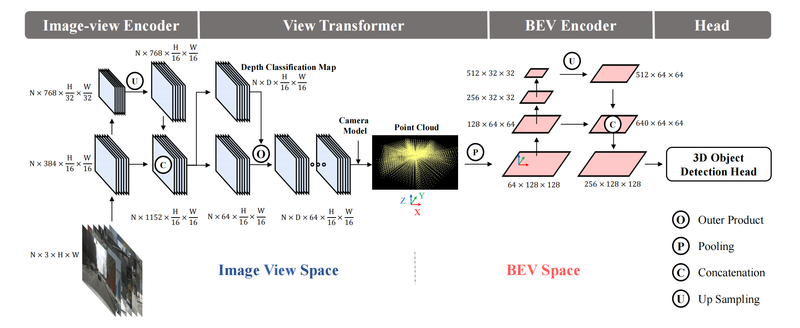
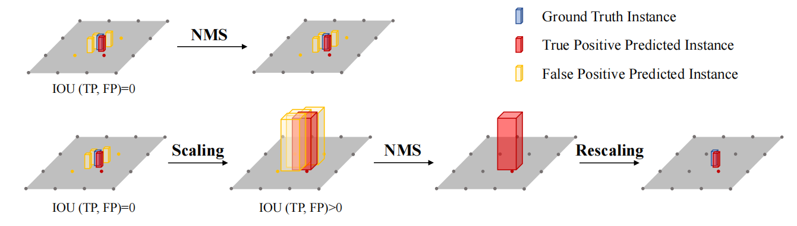

### BEVDet

偏向于工程性的论文，在LSS的基础上提出的一些改进和优化。

BEVDet采用模块化设计，由四个模块组成：

- 使用 Image-view encoder用于图像特征提取，包括主干和颈部
- View transformer将特征从图像视图转换为BEV空间
- BEV Encoder进一步对BEV特征进行编码
- 在BVE特征的基础上构建特定任务的Head，并预测3D对象的目标值

### 方法分析

#### Image-view Encoder

- 特征提取的Backbone
  - ResNet
  - SwinTransformer

- 多尺度特征融合的Neck
  - FPN-LSS（FPN和Lift-Splat-Shoot中提出的颈部结构）

#### View Transformer

利用Lift-Splat-Shoot中提出的View Transformer构建，通过分类方式对深度进行密集预测。然后，利用分类分数和得到的图像视图特征绘制预定义点云。最后，通过沿垂直方向(即Z坐标轴)进行池化操作，可以生成BEV特征。

#### BEV Encoder

结构类似于具有主干和颈部的Image-view Encoder。

#### Head

自动驾驶仪中的3D物体检测主要针对行人、车辆、障碍物等可移动物体的位置、尺度、方向、速度等进行检测。所以这里直接采用CenterPoint第一阶段的3D目标检测头。

### 创新

#### 数据增强策略

**问题**：BEVDet在BEV空间中的过度拟合能力。

**处理**：在Image-view encoder中使用更复杂的数据增强技术。

**问题**：

- 如果存在BEV Encoder模块，仅在Image-view encoder中使用数据增强可能不会有积极效果，甚至可能会降低模型的性能。

- BEV Encoder的学习任务可用的训练样本相对于Image-view encoder较少（6：1）。

- Image-view encoder以逐像素的方式将图像的特征转换到BEV空间，在数据增强的视角下将图像空间和BEV空间解耦，意味着对图像进行的数据增强不会直接影响到BEV空间的特征。

**处理**：

- 对输入图像应用数据增强$A$，这个变换会改变图像中每个像素的位置。但是，我们希望在BEV空间中保持这些像素点的空间关系不变。所以需要在视图变换过程中应用逆变换$A^{-1}$，确保变换后的图像在BEV空间中的表示与原始图像相同。

- 为BEV空间构建了专门的数据增强策略，包括翻转、缩放和旋转等操作。

#### 改进的NMS

**问题**：在BEV空间中，不同类别的对象占据的地面面积是不同的,传统的NMS算法通常使用固定的IOU阈值来决定是否抑制预测框，可能导致对于小面积对象的预测框无法正确地与真实框匹配。

**处理**：Scale-NMS为每个类别定义了一个特定的缩放因子（验证集上进行超参数搜索得到的），根据对象的类别对预测框的大小进行缩放，缩放后通过传统的NMS算法进行处理，最后再将预测框的大小还原。
