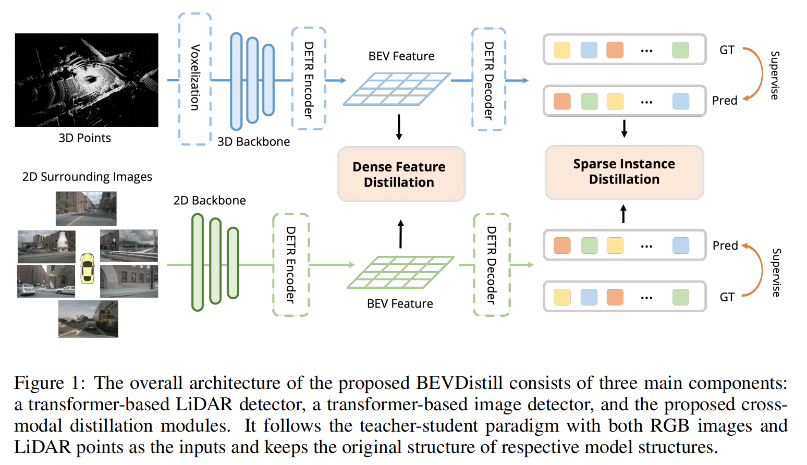

### 摘要

将激光雷达检测器纳入多视图 3D 物体检测，在 BEV 空间中统一图像和激光雷达特征，让图像BEV特征自适应学习点云BEV特征。

### 背景

LiDAR 点可捕获精确的 3D 空间信息，为基于相机的目标检测提供自然指导。鉴于此，最近的相关工作开始探索将点云纳入 3D 目标检测以提高性能。

- 其中一项工作将每个点投影到图像上以形成深度图标签，然后训练深度估计器以显式提取空间信息。这种范式生成中间产品，即深度预测图，因此引入了额外的计算成本。 
- 另一项工作是将 LiDAR 点投影到图像平面。由于学生模型和教师模型在结构上完全相同，因此可以在该框架下自然地进行特征模仿。虽然它解决了不同模态之间的对齐问题，但它错过了追求基于激光雷达的强大教师的机会，这在知识蒸馏范式中确实很重要。

创新：

（i）引入了软前景引导蒸馏来进行非同质密集特征模仿

（ii）提出了一种稀疏样式的实例蒸馏范式，通过最大化互信息来选择性地监督学生。

### 相关工作

大多数用于目标检测的知识蒸馏方法侧重于通过强制匹配**学生的预测**与**教师的预测**来在两个相同类型的检测器之间转移知识。最近的工作发现，模仿特征表示对于检测更有效。一个重要的挑战是确定应从教师模型中提取哪些特征区域。 

- FGFI（2019a）选择被锚框覆盖的特征，其与 GT 的 IoU 大于某个阈值。 

- PGD（2022a）仅关注几个关键的预测区域，使用分类和回归分数的组合作为质量衡量标准。

尽管有大量研究讨论目标检测中的知识蒸馏，但只有少数研究考虑了多模态设置。

- MonoDistill（2021）将点投影到图像平面中，并应用修改后的基于图像的 3D 检测器作为教师来提取知识。这种范式自然地解决了对齐问题，但是，它错过了追求更强大的基于点的教师模型的机会。 

- LIGA-stereo（2021b）通过使用 SECOND（2018）的中间输出来监督基于视觉的模型的 BEV 表示，从而利用 LiDAR 的信息。

- UVTR（2022a）提出了一种简单的方法，通过直接规范学生和教师模型之间的体素表示。他们都选择模仿模型中的特征表示，而忽略不同模态之间的差异。

### 方法分析

#### 1. 基线模型

- **学生模型**：采用基于相机的探测器BEVFormer作为学生模型。它由图像主干特征提取模块、cam2bev 视图转换的空间交叉注意模块和 3D 对象检测的transformer头组成。它也额外提供了一个时间交叉注意模块来感知后续多帧信息以实现更好的预测。
- **教师模型**：选择 Object-DGCNN作为教师模型，用普通的多尺度注意力模块替换了 DGCNN 注意力。首先将 3D 点投射到 BEV 平面上，然后通过基于transformer的标签分配进行一对一的监督。使用 CenterPoint 的预训练模型，并在知识蒸馏过程中修复所有参数。

#### 2. BEVDistill

##### 2.1 密集特征蒸馏

先前的一些工作直接迫使学生模仿老师的特征图并取得显着的性能提升：
$$
L_{\text{feat}} = \frac{1}{H \times W} \sum_{i=1}^{H} \sum_{j=1}^{W} \left\| F_{ij}^{3D} - F_{ij}^{2D} \right\|_2
$$

其中：

- $L_{\text{feat}}$: 表示特征图之间的损失
- $H$: 特征图的高度
- $W$: 特征图的宽度
- $F_{ij}^{3D}$: 在位置 $(i, j)$ 处的3D特征图的值
- $F_{ij}^{2D}$: 在位置 $(i, j)$ 处的2D特征图的值

尽管这种方式通过将两个特征投影到 BEV 平面中消除了视图差异，但不同模态之间仍然存在域差异：图像保存前景和背景区域的像素，但是激光雷达点仅在存在反射光线的物体时才会出现。

区域性3D特征只有在该区域存在点时才有意义，所以需要在有意义的前景区域内进行蒸馏。其次，为了更好的利用前景区域边界信息，引入一种软监督方式。首先，为 BEV 空间中的每个地面实况中心 $(xi, yi)$ 绘制高斯分布：
$$
w_{i,x,y}=\exp\left(-\frac{(x_i-\hat{x}_i)^2+(y_i-\hat{y}_i)^2}{2\sigma_i^2}\right)
$$

其中：

- $w_{i,x,y}$: 在位置 $(x,y)$ 处第 $i$ 个元素的权重
- $x_i, y_i$: 原始坐标值
- $\hat{x}_i, \hat{y}_i$: 预测坐标值
- $\sigma_i$: 表示对象大小标准差（默认设置为 2）

对于同一位置不同$w_{i,x,y}$之间的重叠区域，只需取它们的最大值。然后，让学生模型使用前景引导的 $W$ 来模仿特征，进行密集特征蒸馏：
$$
L_{\text{feat}} = \frac{1}{H \times W \times \sum max(W_{i,j})} \sum_{i}^{H} \sum_{i}^{W} max(W_{ij})\left\| F_{ij}^{3D} - F_{i,j}^{2D} \right\|_2
$$

其中：

- $\max(W_{ij})$: 位置 $(i, j)$ 处的权重的最大值。

这种前景引导的重新权重策略使模型能够专注于教师的前景区域，同时避免模仿背景区域中无用的空 3D 特征。

##### 2.2 稀疏实例蒸馏

BEVDistill 中的学生模型和教师模型都以稀疏预测方式运行，所以需要一个集合到集合的映射来确保实例级蒸馏。

假设教师模型第 $i$ 个查询输出的分类和定位预测为 $c^T_i$ 和 $b^T_i$ ，而学生可以表示为 $c^S_i$ 和 $b^S_i$ ，则可以在输出集之间通过找到使得成本最低的排列 $\hat{\sigma}$，建立教师和学生预测集合之间的对应关系：
$$
\hat {\sigma} = \arg \min \sum_i^N L_{\text{match}}(y_i, \hat {y}_i)
$$

$$
L_{\text{match}}(y_i, \hat y_i) = -\log c_{\sigma (i)}^S(c_i^T) + \left\| b_i^T,b_{\sigma (i)}^S \right\|_1
$$

其中：

- $\hat{\sigma}$: 表示通过优化过程得到的最优参数。
- $L_{\text{match}}(y_i, \hat{y}_i)$: 损失函数，用于衡量预测值 $\hat{y}_i$ 与真实值 $y_i$ 之间的匹配程度。

在此过程中又发现两个问题会阻碍模型性能提升，第一，并非教师的所有预测都应被同等地视为有价值的线索，因为大多数预测都是分类分数较低的误报。另一方面，虽然分类逻辑可以表示丰富的知识，但当输入数据不同时，它可能不成立。直接提取这些预测会给模型带来很大的噪声并降低性能。

所以将分类得分 $c_i$（分类信息）以及预测 $ b_i^{pred} $ 和真实值 $ b_i^{GT} $ 之间的 $\text{IoU}$ 一起考虑，获得质量得分 $q_i$ ：
$$
q_i = (c_i)^{\gamma} \cdot \text{IoU}(b_i^{GT},b_i^{pred})^{1-\gamma}
$$
因此，最终的实例级蒸馏可以写为：
$$
L_{\text{inst}} = \sum_i^N - q_i \left( \alpha L_{cls}(c_{\sigma(i)}^S,c_i^T) + \beta L_{box}(b_i^T,b_{\sigma(i)}^S)   \right)
$$
其中：

- $L_{cls}$ 是 KL 散度损失
- $L_{box}$ 是的 L1 损失
- $\alpha$、$\beta$ 是平衡监督的重新加权因子（默认设置为 1.0 和 0.25）

类别上的预测概率质量函数比起独热标签（one-hot labels）包含了更丰富的信息。这意味着教师模型的输出可能包含了关于类别之间关系更多的信息，而不仅仅是简单的分类标签。但是，预测的概率分布通常是低维的（类别数目的维度），所以只有少量的知识被编码在这些预测中。这在跨模态任务下尤为显著，因为跨模态任务通常涉及到更复杂和结构化的知识表示。

KL散度的一个问题是它将所有维度（或类别）都视为相互独立的，而实际上，在复杂任务中，表示的不同维度通常存在复杂的内在依赖关系。所以选择直接最大化教师模型和学生模型在倒数第二层表示 $h_S$ 和 $h_T$ 之间的互信息，从而捕捉到表示之间的高阶依赖关系，而不是简单地考虑单个维度的差异，所以能够更有效地传递复杂和结构化的知识：
$$
I(h^S;h^T) = \text{KL} \left(p(h^T,h^S) \| \mu(h^T)\nu(h^S)\right)
$$

其中：

- $p(h^T, h^S)$ 是联合分布 

- $\mu(h^T), \nu(h^S)$是边际分布

定义一种条件分布 $q$，用来判断两个变量 $h_T$ 和 $h_S$ 是否一致。如果一致（$\eta = 1$），则使用它们的联合分布 $p(h_T, h_S)$；如果不一致（$\eta = 0$），则使用它们的边缘分布的乘积 $\mu(h_T) v(h_S)$：
$$
q(h^T, h^S \mid \eta = 1) = p(h^T, h^S), \quad q(h^T, h^S \mid \eta = 0) = \mu(h^T) \nu(h^S)
$$

根据贝叶斯法则，得到 $\eta = 1$ 的后验概率：

$$
q(\eta = 1 \mid h^T, h^S) = \frac{p(h^T, h^S)}{p(h^T, h^S) + \mu(h^T)\nu(h^S)}
$$

两边取对数：

$$
\log q(\eta = 1 \mid h^T, h^S) \leq \log \frac{p(h^T, h^S)}{p(h^T, h^S) + \mu(h^T)\nu(h^S)} = I(h^T, h^S)
$$

可以将目标转变为最大化互信息的下界，在没有明确的概率分布形式 $q(\eta = 1 \mid h_T, h_S)$ 的情况下，利用神经网络 $g$ 和 NCE 损失来近似这个概率分布：
$$
L_{\text{cls}}(h^T, h^S) = E_{q(h^T,h^S \mid \eta=1)}[\log g(h^T, h^S)] + E_{q(h^T,h^S \mid \eta=0)}[\log \left(1 - g(h^T, h^S)\right)]
$$

最终的稀疏实例蒸馏损失可以表示为：

$$
L_{\text{inst}} = \sum_i^N -q_i \left(\alpha L_{\text{cls}}(h^S_i, h^T_i) + \beta L_{\text{box}}(b^T_i, b^S_{\sigma(i)})\right)
$$
