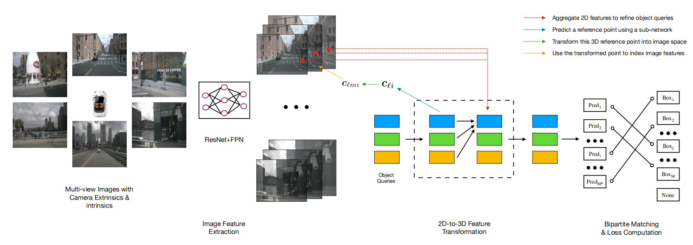

## 问题背景

现有的方法直接从单目图像中估计3D边界框，或者使用深度预测网络从2D信息中生成用于3D目标检测的输入，而DETR3D的方法直接在3D空间中进行预测。该框架从多个相机图像中提取2D特征，然后使用一组稀疏的3D对象查询来索引这些2D特征，使用相机变换矩阵将3D位置链接到多视图图像。最后，对每个对象查询进行边界框预测，使用集对集损失来衡量真实值与预测值之间的差异。

## 方法分析

### **Image Feature Extraction**

- **输入**：多视角图像，相机内外参

- **处理**：使用ResNet+FPN提取特征

- **输出**：Camera Feature

在DETR3D框架中，首先使用ResNet和FPN从多个相机视角图像中提取2D特征。

### 2D to 3D Feature Transformation

- **输入**：Camera Feature & Object Queries
- **处理**：
  - 随机初始化的查询向量
  - 提取reference points
  - 将3D点投影到图像平面 
  - 从图像特征中提取相关信息
  - 使用2D特征优化3D物体表征
- **输出**：Object Feature

DETR3D通过使用一组稀疏的3D对象查询来索引这些2D特征。每个对象查询与一个3D参考点相关联，该参考点被投影到所有相机图像上，通过双线性插值从图像特征中提取信息。这些特征随后通过多头自注意力机制相互交互，优化和细化对象查询，最终生成3D边界框预测。

#### 1. Object Queries and Reference Points

对象查询（Object Query）在DETR和DETR3D中的角色类似于一个先验框或锚点，用于表示和定位目标物体。它们在初始化时是一些随机向量，随着模型的训练和特征提取过程，它们会逐步融合更多的视觉信息，变得更具代表性。

**Object Queries (对象查询)**

对于每一层，预测M个查询向量，这些向量经过神经网络生成M个三维坐标表示该预测边界框的中心位置。

- 每层 $l$ 都有一组对象查询 $Q_l = \{q_{l1}, q_{l2}, ..., q_{lM}\}$，其中$q_{li} \in \mathbb{R}^C$表示第 $i$ 个对象查询，是一个$c$维的向量。

- 这些对象查询通过神经网络 $\Phi ref$ 解码为参考点 $c_{li}$，公式如下：
  $$
  c_{li} = \Phi ref(q_{li})
  $$
  $c_{li}$ 是一个三维坐标，表示第$i$个边界框的中心位置的假设。

**Projection to Camera Images（参考点投影）**

对于每一个预测边界框的中心点，先添加一个维度变成齐次坐标，然后通过相机变换矩阵投影到对应的相机上。

- 将 $c_{li}$ 投影到各个相机图像上，需要使用相机变换矩阵。首先将 $c_{li}$转换为齐次坐标 $c^*_{li}$，公式如下：
  $$
  c^*_{li} = c_{li} ⊕ 1
  $$
  这里 $⊕$ 表示连接操作，即在 $c_{li}$ 后面添加一个维度，使其变成齐次坐标。

- 使用相机变换矩阵 $T_m$ 将 $c^*_{li}$ 投影到第 $m$ 个相机图像上，得到 $c_{lmi}$：
  $$
  c_{lmi} = T_m c^*_{li}
  $$

#### 2. Feature Extraction

**Feature Map Normalization (特征图归一化)**

- 将 $c_{lmi}$ 归一化到 [-1, 1] 的范围，以适应不同分辨率的特征图。

**Feature Collection (特征收集)**

- 使用双线性插值从特征图中提取特征 $f_{lkmi}$：

  **双线性插值**： 双线性插值是一种从图像中提取像素特征的方法，它基于参考点在图像中的位置来插值得到特征值。

  具体公式为：
  $$
  f_{lkmi} = f_{\text{bilinear}}(F_{km}, c_{lmi})
  $$
  其中：

  - $ f_{\text{bilinear}} $ 表示双线性插值操作。
  - $ F_{km} $ 是第 $k$ 个特征层在第 $m$ 个相机的特征图。
  - $c_{lmi}$ 是第 $l$ 层的第 $i$ 个参考点在第 $m$ 个相机图像中的位置。

  双线性插值的具体过程（使用临近的四个像素值来计算目标点的特征值）：

  1. **确定邻近的四个像素**： 假设 $c_{lmi}$ 的坐标是 $(x, y)$，那么它的邻近四个像素的坐标可能是：

     - 左上角：$(x_0, y_0)$
     - 右上角：$(x_1, y_0)$
     - 左下角：$(x_0, y_1)$
     - 右下角：$(x_1, y_1)$

  2. **计算水平和垂直方向的插值**： 首先对水平和垂直方向分别进行线性插值：

     - 水平方向插值：
       $$
       f_{x0} = F_{km}(x_0, y_0) \cdot (1 - (x - x_0)) + F_{km}(x_1, y_0) \cdot (x - x_0)
       $$

       $$
       f_{x1} = F_{km}(x_0, y_1) \cdot (1 - (x - x_0)) + F_{km}(x_1, y_1) \cdot (x - x_0)
       $$

     - 垂直方向插值：
       $$
       f_{lkmi} = f_{x0} \cdot (1 - (y - y_0)) + f_{x1} \cdot (y - y_0)
       $$

  可以得到参考点 $c_{lmi}$ 在特征图 $F_{km}$ 上的特征值 $f_{lkmi}$。

#### 3. Feature Aggregation and Query Update

**Heuristics for Valid Points (有效点的启发式方法)**

- 参考点不一定在所有相机图像中都可见，需要用启发式方法筛选无效点，定义二值变量 $\sigma_{lkmi}$，如果参考点投影到图像平面外，则 $\sigma_{lkmi} = 0$，否则 $\sigma_{lkmi} = 1$。

**Feature Aggregation (特征聚合)**

- 对于每个参考点 $c_{li}$，通过聚合来自不同相机和特征层的特征值来计算聚合特征 $f_{li}$，聚合特征$f_{li}$并更新对象查询 $q_{(l+1)i}$，公式如下：

$$
f_{li} = \frac{1}{\sum_k \sum_m \sigma_{lkmi} + \epsilon} \sum_k \sum_m f_{lkmi} \sigma_{lkmi}
$$

$$
q_{(l+1)i} = f_{li} + q_{li}
$$

其中：

  - $f_{li}$ 是聚合后的特征值。
  - $\sigma_{lkmi}$ 是二值变量，表示参考点是否在图像平面内。
  - $\epsilon$ 是一个小数，防止除以零。

#### 4. Bounding Box and Classification 

- 对于每个对象查询 $q_{li}$，通过两个神经网络  $\Phi reg_l$ 和 $\Phi cls_l$ 分别预测边界框 $b_{li}$ 和类别标签 $c_{li}$，公式如下：

$$
b_{li} = \Phi reg_l(q_{li})
$$

$$
c_{li} = \Phi cls_l(q_{li})
$$

### Loss Calculation 

- 计算每层的预测结果 $B_l$ 和 $C_l$ ：

$$
B_l = \{b_{l1}, b_{l2}, \ldots, b_{lM*}\} \subset \mathbb{R}^9
$$

$$
C_l = \{c_{l1}, c_{l2}, \ldots, c_{lM}\} \subset \mathbb{Z}
$$

​	其中 $ b_{li} $ 表示第 $ l $ 层第 $ i $ 个对象查询预测的边界框。
​	其中 $ c_{li} $ 表示第 $ l $ 层第 $ i $ 个对象查询预测的分类标签。

1. **匹配预测和真实值**

首先，我们需要将预测的边界框和分类标签与真实值进行匹配。设定M个真实值和M个预测值，其中M通常小于M，因此用空值$\emptyset$填充真实值集合以便计算。这一步通常使用匈牙利算法来找到最佳匹配。

2. **边界框回归损失**

对于匹配后的边界框，我们计算L1损失和IoU损失。这些损失衡量预测边界框与真实边界框之间的位置、尺寸和形状的差异。

- **L1损失**：
  $$
  L_{\text{bbox}} = \sum_{(i,j) \in M} \| b_{li} - b^*_{j} \|_1
  $$
  
  其中 $M$ 是匹配对的集合，$b_{li}$ 是预测边界框，$b^*_{j}$ 是真实边界框。

- **IoU损失**：
  $$
  L_{\text{iou}} = \sum_{(i,j) \in M} \left( 1 - \text{IoU}(b_{li}, b^*_{j}) \right)
  $$

3. **分类损失**

分类损失通常使用交叉熵损失来衡量预测的分类标签与真实标签之间的差异。

- **交叉熵损失**：
  $$
  L_{\text{cls}} = \sum_{(i,j) \in M} \text{CE}(c_{li}, c^*_{j})
  $$
  其中 $ c_{li} $ 是预测分类标签，$ c^*_{j} $ 是真实分类标签，CE表示交叉熵损失函数。

4. **总损失**

总损失是边界框回归损失和分类损失的加权和：
$$
L = \lambda_{\text{bbox}} L_{\text{bbox}} + \lambda_{\text{iou}} L_{\text{iou}} + \lambda_{\text{cls}} L_{\text{cls}}
$$
其中 $ \lambda_{\text{bbox}} $、$ \lambda_{\text{iou}} $ 和 $ \lambda_{\text{cls}} $ 是各个损失项的权重系数。

## 结论

DETR3D通过直接在3D空间中进行预测，避免了由于深度预测带来的累积误差问题，简化了检测管道，并提高了效率。核心贡献包括：

- 引入了一种将2D特征提取与3D边界框预测连接的模块，通过几何回投将3D信息无缝地使用到多视角图像中。
- 在不需要NMS的情况下，实现了与现有基于NMS的方法相媲美的性能，显著提高了推理速度。
- 通过在nuScenes数据集上的实验验证，证明了方法的有效性和优越性。

这使得DETR3D成为一种高效、鲁棒且性能优越的3D目标检测方法，为自动驾驶和其他需要高精度3D检测的应用提供了新的解决方案。

