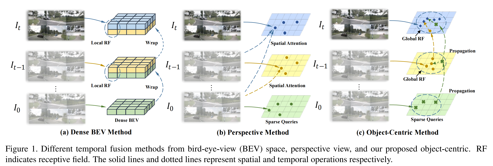
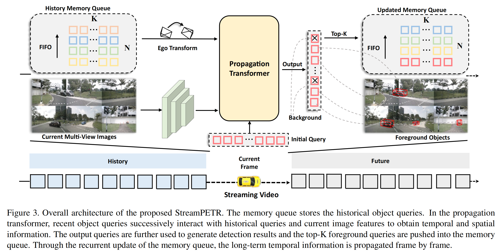
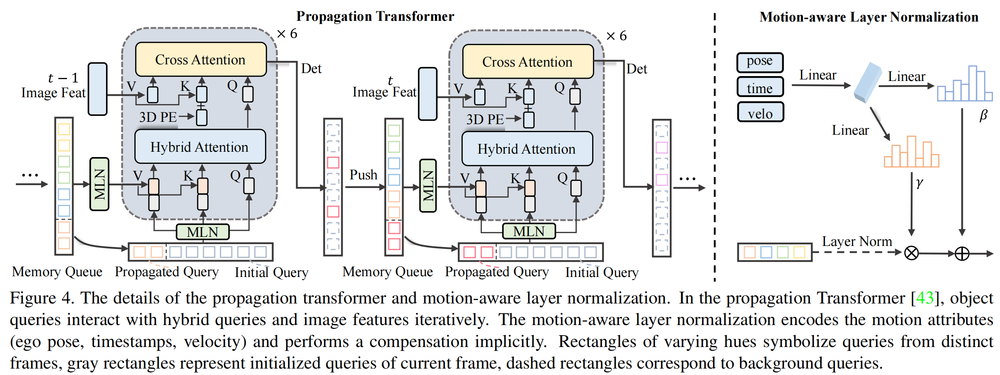

### 1. Introduction

多视图目标检测通过利用时序信息取得了显着的进展，历史特征有利于**遮挡物体**的检测并大大提高性能。根据时序表示的差异，现有方法可以大致分为**BEV时序方法**和**透视时序方法**。

- BEV 时序方法

显式地将 BEV 特征从历史帧扭曲到当前帧，如图 1(a) 所示，其中 BEV 特征充当时序建模的有效中间表示。然而，高度结构化的 BEV 特征限制了移动物体的建模。这种范式需要一个大的感受野来缓解这个问题。

- 透视时序方法 

主要基于 DETR 。稀疏查询设计有利于移动目标的建模。然而，sparse object querie需要与多帧图像特征交互以实现长期时序依赖性（见图 1(b) ），从而导致多次计算。因此，现有的工作要么停留在解决移动物体上，要么引入多重计算成本。

基于上述分析，本文采用稀疏查询作为时序传播的隐藏状态。利用object query来对移动目标进行建模，同时保持高效率。因此设计了一个高效的框架，以目标为中心的时序建模，称为StreamPETR，如图 1(c) 所示。

### 2. Related Work

#### 2.1 Query Propagation

自 DETR 在 2D 目标检测中提出以来，object query已应用于许多下游任务来建模时序交互。

video object detection：

- LWDN 采用类脑记忆机制来传播和更新记忆特征。 
- QueryProp 执行查询交互以减少非关键帧的计算成本，实现了显着的改进并保持了高效率。 
- 3D-MAN 有类似的想法，并将单帧激光雷达探测器扩展到多帧，有效地结合了来自场景不同视角的特征。

object tracking：

- MOTR 和 TrackFormer 提出了跟踪查询来对跨帧的目标关联进行建模。 
- MeMOT 使用内存库来构建长期依赖性，从而进一步提高性能。 
- MOTRv2 通过合并一个额外的检测器来缓解检测和关联任务之间的冲突。 
- MUTR 和 PF-Track 将 MOTR 扩展到多视图 3D 目标跟踪并取得了有希望的结果。

#### 2.2 Delving into Temporal Modeling

本文提出了各种时序建模设计的通用公式。

- 给定透视图特征 $F_{2d} = {F_{2d}^0 \ldots F_{2d}^t}$
- 密集 BEV 特征 $F_{bev} = {F_{bev}^0 \ldots F_{bev}^t}$ 
- 稀疏目标特征 $F_{obj} = {F_{obj}^0 \ldots F_{obj}^t}$

主要的时序建模方法可以表述为： 
$$
\tilde F_{out}=\phi(F_{2d}, F_{bev}, F_{obj})
$$
其中 $\phi$ 是时序融合操作，$\tilde F_{out}$ 是包含时序信息的输出特征。

##### 2.2.1 BEV Temporal Modeling

BEV 时序建模使用网格结构的 BEV 特征来执行时序融合。为了补偿自车运动，最后一帧特征 $F_{bev}^{t-1}$ 通常与当前帧对齐。
$$
\tilde F_{bev}^t = \phi(F_{bev}^{t-1}, F_{bev}^{t})
$$
然后时序融合函数 $\phi$（concat或deformable attention）可以应用于中间时序表示  $F_{bev}^{t}$ 。将上述过程扩展到长时域建模，主要有两条路线。第一个是对齐历史 k 帧 BEV 特征并将它们与当前帧连接起来。
$$
\tilde F_{bev}^t = \phi(F_{bev}^{t-k}, \ldots ,F_{bev}^{t-1}, F_{bev}^{t})
$$
另一方面，长期历史信息通过 BEV 特征 $\tilde F_{bev}^{t-1}$ 的隐藏状态以循环方式传播。
$$
\tilde F_{bev}^t = \phi(\tilde F_{bev}^{t-1}, F_{bev}^{t})
$$
然而，BEV时序融合仅考虑静态BEV特征，忽略了物体的运动，导致空间错位。

##### 2.2.2 Perspective Temporal Modeling

透视时序建模主要通过object query和透视特征之间的交互来执行。时序函数 $\phi$ 通常通过空间交叉注意力来实现：
$$
\tilde F_{obj}^t = \phi(F_{2d}^{t-k}, F_{obj}^{t}) \ldots + \phi(F_{2d}^{t}, F_{obj}^{t})
$$
object query和多帧透视图之间的交叉注意力需要重复的特征聚合，简单地扩展到长期时序建模会大大增加计算成本。

##### 2.2.3 Object-centric Temporal Modeling

以目标为中心的时序建模是本文提出的以目标为中心的解决方案，通过object query对时序交互进行建模。通过object query，可以基于估计状态 $F_{obj}^{t-1}$ 方便地应用运动补偿。
$$
\tilde F_{obj}^{t-1} = \mu(F_{obj}^{t-1},M)
$$
其中 $\mu$ 是显式线速度模型或隐式函数，用于编码运动属性 $M$ （包括相对时间间隔 $\Delta t$ 、估计速度 $v$ 和自车姿态矩阵 $E$ ）。然后，构建全局注意力 $\phi$ 通过object query逐帧传播时序信息：
$$
\tilde F_{obj}^{t} = \phi(\tilde F_{obj}^{t-1}, F_{obj}^{t})
$$

### 3. Method

#### 3.1 Overall Architecture

如图 3 所示，StreamPETR 构建在基于端到端稀疏查询的 3D 目标检测器之上。由**图像编码器**、**递归更新的内存队列**和**传播transformer**组成。图像编码器是标准的2D骨干网络，用于从多视图图像中提取语义特征。然后将提取的特征、内存队列中的信息和object query输入到传播transformer中以执行时空交互。 StreamPETR 和单帧基线的主要区别在于内存队列，可以递归地更新object query的时序信息。与传播transformer相结合，内存队列可以有效地将时序先验从先前帧传播到当前帧。

#### 3.2 Memory Queue

本文设计了一个尺寸为 $N\times K$ 的内存队列，用于有效地进行时序建模。其中，$N$ 代表存储的帧数，$K$ 代表每帧存储的目标数。为了确保在复杂场景下的高召回率，根据经验，将 $N$ 设置为 4，将 $K$ 设置为 256。

在预设的时间间隔 $\tau$ 后，将选择的object query的相对时间间隔 $\Delta{t}$、上下文嵌入 $Q_c$、目标中心 $Q_P$、速度 $v$ 和自车姿态矩阵 $E$ 存储在内存队列中。具体就是选择前景目标（分类分数最高的前 K 个）的上述信息并将其push到内存队列。内存队列按照先进先出（FIFO）规则进行数据存储，当新帧的信息添加到内存队列时，最旧的帧将被移除。

这个内存队列具有高度的灵活性和定制性，可以在训练和推理过程中自由控制最大内存大小 $N\times K$ 和保存间隔 $\tau$。

#### 3.3 Propagation Transformer 

如图4所示，传播transformer由三个主要组件：

- 运动感知层归一化模块根据上下文嵌入(embedding)和内存队列中记录的运动信息隐式更新目标状态； 
- 混合注意力取代了默认的自注意力操作，起到时序建模和去除重复预测的作用； 
- 采用交叉注意力进行特征聚合，可以替换为任意空间操作来构建图像标记和 3D object query之间的关系，例如 PETR 中的全局注意力或 DETR3D 中的稀疏投影注意力。

##### 3.3.1 Motion-aware Layer Normalization

此模块以运动的目标进行建模。以最后一帧 $t−1$ 的变换过程为例，对之前的其他帧采用相同的操作。给定来自最后一帧和当前帧的自车姿态矩阵$E_{t−1}$ 和 $E_t$ ，自车变换 $E_{t−1}^t$ 可以计算为：
$$
E_{t-1}^t = E_t^{inv} \cdot E_{t-1}
$$

假设目标是静态的，内存队列中的 3D 中心 $Q_{t−1}^p$ 可以显式地与当前帧对齐，其公式为：
$$
\tilde Q_p^t = E_t^{inv} \cdot Q_p^{t-1}
$$

其中 $\tilde Q_p^t$ 是对齐的中心。受生成模型中任务特定控制的启发，本文采用条件层归一化来对目标的运动进行建模。如图4所示，层归一化（Layer Normalization）中默认的仿射变换是封闭的。运动属性 $(E_{t−1}^t, v,\Delta t)$ 被展平并通过两个线性层 $(\xi_1, \xi_2)$ 转换为仿射向量 $\gamma$ 和 $\beta$：
$$
\gamma = \xi_1(E_{t-1}^t,v,\Delta t)
$$

$$
\beta = \xi_2(E_{t-1}^t,v,\Delta t)
$$

然后，执行仿射变换以获得运动感知上下文嵌入 $\tilde Q_c^t$ 和运动感知位置编码 $\tilde Q_{pe}^t$ 。
$$
\tilde Q_{pe}^t = \gamma \cdot LN(\psi(\tilde Q_p^t)) + \beta
$$

$$
\tilde Q_c^t = \gamma \cdot LN(Q_c^t) + \beta
$$

其中， $\psi$ 是多层感知器（MLP），它将3D采样点 $\tilde Q_p^t$ 转换为位置编码 $\tilde Q_{pe}^t$ 。为了实现统一，目前的object query也采用了 MLN (motion-aware layer normalization)。当前帧的速度 $v$ 和时间间隔 $\Delta t$ 被初始化为零。

##### 3.3.2 Hybrid Attention layer

DETR 中的自注意力有助于消除重复的预测。本文用混合注意力取代它，还引入了时序交互。如图4所示，内存队列中所有存储的object query 与当前 query 连接以获得混合查询。混合查询被视为多头注意力中的关键。由于混合查询的数量很少（大约2k，远小于交叉注意力中的图像标记），因此混合注意力层带来的计算成本可以忽略不计。

遵循了 PETR，query 可以定义为随机初始化的 3D 锚点。为了充分利用流视频中的空间和上下文先验，内存队列中的一些object query被直接传播到当前帧中。本文将最后一帧的查询与随机初始化的查询连接在一起。为了公平比较，随机初始化查询和传播查询的数量分别设置为 644 和 256。

### 4. Conclusion

本文提出了 StreamPETR，一种有效的长序列 3D 物体检测器。与以前的工作不同，该方法探索了一种以目标为中心的范例，通过 object query 逐帧传播时间信息。此外，采用运动感知层归一化来引入运动信息。 StreamPETR 实现了领先的性能改进，同时引入的存储和计算成本可以忽略不计。它是第一个可与基于激光雷达的方法实现可比性能的在线多视图方法。 
