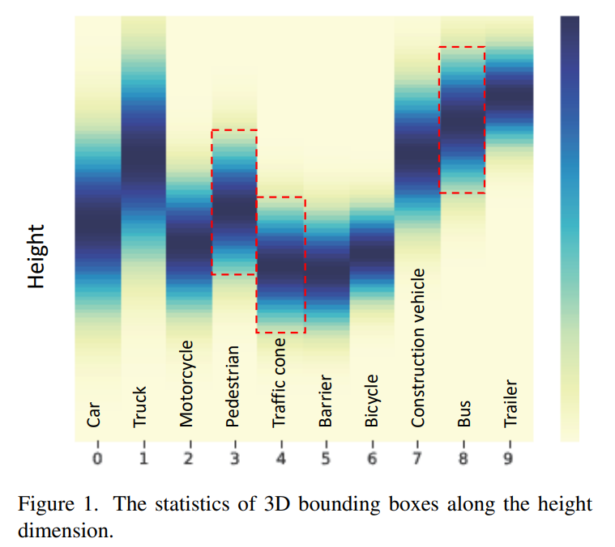
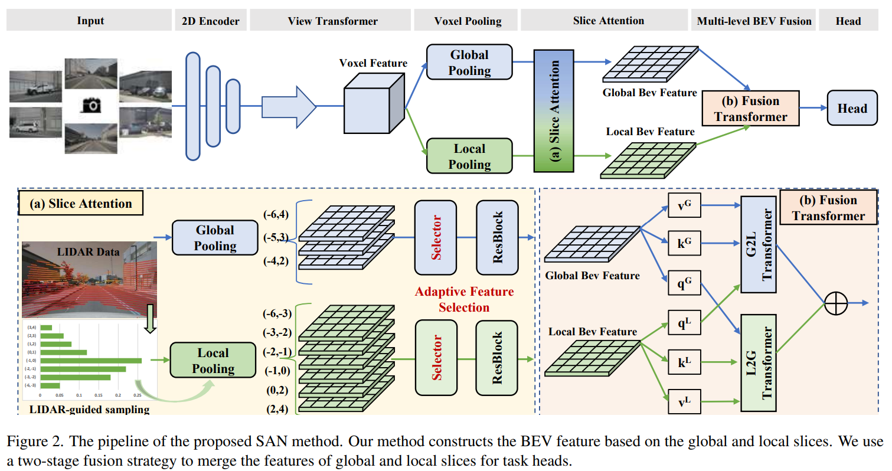
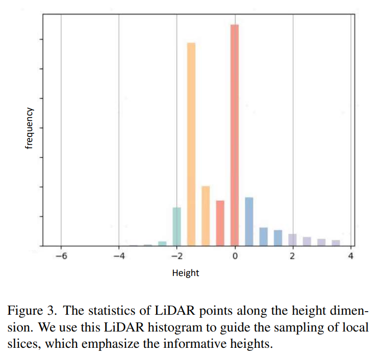

**《BEV-SAN: Accurate BEV 3D Object Detection via Slice Attention Networks》**，作者提出了一种新的用于鸟瞰图（BEV）3D目标检测的方法，称为BEV Slice Attention Network（BEV-SAN）。

### 问题提出

- **现有方法的局限性**：传统的BEV 3D目标检测方法构建BEV特征时，将多视图相机特征聚合到平坦的网格中，但这种方法未能强调不同高度信息的特征，例如，障碍物位于较低的高度，而卡车位于较高的高度。不同物体类别在不同的高度上有不同的分布，因此，仅使用平坦的BEV空间无法充分利用不同高度的优势。

### 方法概述

- **BEV-SAN简介**: 提出了切片注意力网络（BEV-SAN），通过在高度维度上进行采样，构建全局和局部BEV切片，然后通过注意力机制融合这些切片的特征，生成用于任务头的最终特征图。

- **创新点**:
  - **切片注意力模块**: 通过高度采样构建全局和局部切片，然后使用注意力机制融合这些特征。
  - **LiDAR引导采样策略**: 利用LiDAR数据的统计分布来确定局部切片的高度，以选择更有信息量的高度范围。

### 具体方法

1. **全局和局部切片**:

   - **全局切片**: 采样覆盖较大高度范围的BEV空间。
     - 根据经验确定全局切片为[−6,4]，[−5,3]，[−4,2]
     - 高度信息被视为通道维度，所以采用通道注意力来自适应地聚合多个全局级切片

   

   - **局部切片**: 通过LiDAR引导采样，突出显示信息量丰富的高度范围
     - 将LiDAR点转换为BEV空间，并沿高度维计算直方图
     - 将整体高度范围 [−6, 4] 切分为六个区间：[−6, −3], [−3, −2], [−2, −1], [−1, 0], [0, 2], 和 [−2, 4]
     - 根据累积直方图的分布，从这些区间中选择局部切片，重点选择点云密度较高的区间
     - 利用通道关注机制对局部切片进行重加权

   

2. **特征融合**

   - **第一阶段：通道注意力机制融合**
     使用卷积神经网络分别提取全局和局部切片特征，通过通道注意力机制对这些特征进行加权处理，计算每个通道的重要性，增强重要通道的信息，抑制不重要通道的信息。

   - **第二阶段：基于transformer的双分支结构融合** 
     全局和局部特征分别通过transformer编码器进行处理。transformer编码器利用自注意力机制，捕捉特征之间的长距离依赖关系和相关性。处理后的全局和局部特征再进行融合，生成更为丰富、准确的特征表示，从而提升多模态感知系统的整体性能。

### 局限性

1. **计算和存储成本**：尽管提出了优化潜力，但额外的计算和存储成本仍然是一个考虑因素。

2. **对深度值准确性的敏感性**：BEV-SAN遵循BEVDepth的流程，对深度值或深度分布的准确性敏感。

3. **对其他基线方法的适用性**：如何将SAN应用于其他基线方法（如BEVFormer）仍是一个待解决的问题。

### 结论

BEV-SAN通过探索BEV空间中不同高度的内在属性，提供了一种新的3D目标检测方法。通过全局和局部切片的提取以及两阶段融合策略，BEV-SAN在多个评估指标上显示出优越的性能。
