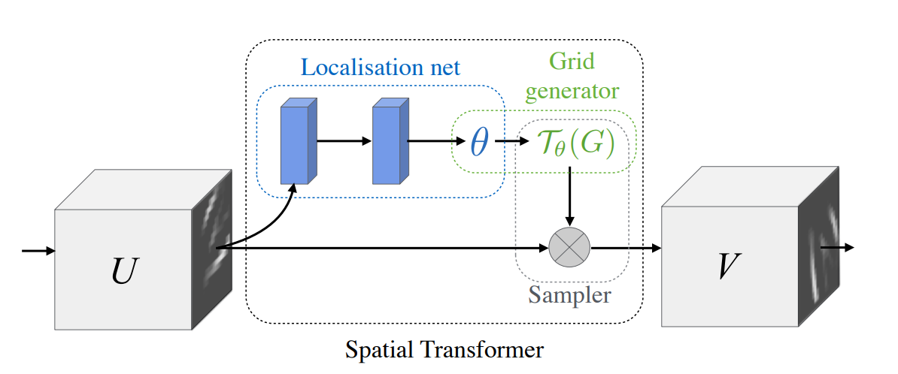
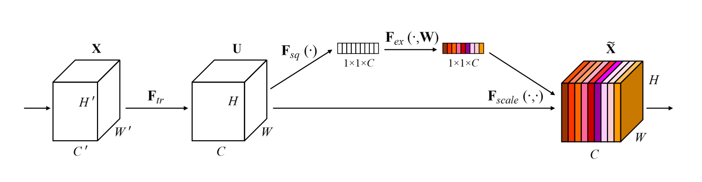
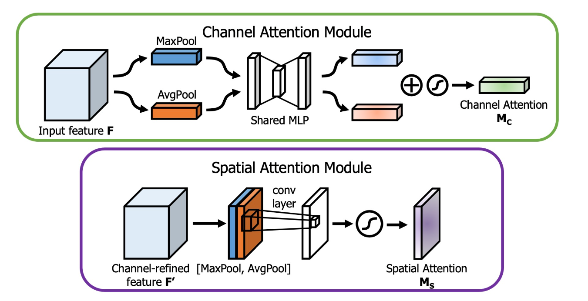
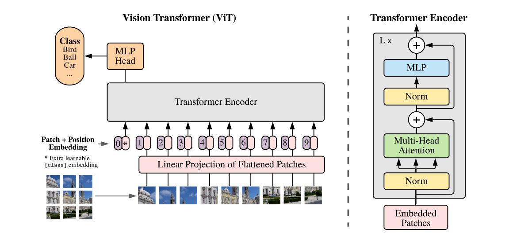
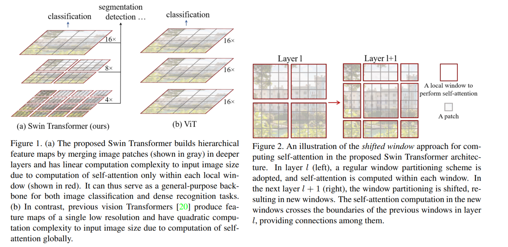
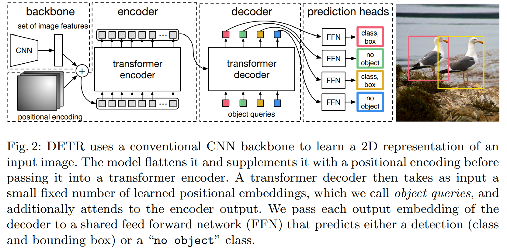
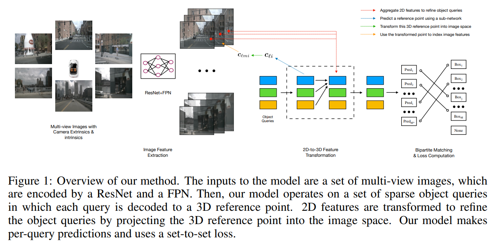

#### 1. 注意力机制概述

注意力机制是深度学习中的一种技术，用于提高模型对重要特征的关注度。主要有三种类型的注意力机制：空间注意力、通道注意力和融合注意力。

##### 空间注意力 (Spatial Attention)

空间注意力机制是一种专注于图像中特定区域的技术，它允许模型在处理图像时能够集中于那些对于任务最为重要的区域。这种机制通常通过计算一个注意力权重矩阵来实现，该矩阵能够为图像中的每个像素分配一个权重，表明其在当前任务中的重要性。空间注意力可以显著提高模型对图像内容的理解能力，特别是在处理具有复杂背景或多个对象的图像时。

**代表性模型：**

- **Spatial Transformer Networks (STN\)**：STN通过学习输入图像中的几何变换来实现空间注意力。它包含三个主要组件：定位网络（Localization Net）、网格生成器（Grid Generator）和采样器（Sampler）。定位网络生成变换参数，网格生成器利用这些参数生成变换后的坐标，采样器根据这些坐标对输入图像进行变换，从而聚焦于图像中的重要区域。

##### 通道注意力 (Channel Attention)

通道注意力机制关注的是特征通道的重要性。与空间注意力不同，通道注意力不关心图像的空间分布，而是关注不同特征通道对最终任务的贡献。通过调整特征通道的权重，通道注意力可以帮助模型识别哪些特征对于当前任务最为关键。这种机制通常通过全局平均池化（GAP）或全局最大池化（GMP）等操作来实现。

**代表性模型：**

- **Squeeze-and-Excitation Networks (SENet\)**：SENet通过一个Squeeze-and-Excitation模块来实现通道注意力。该模块首先全局压缩每个通道的信息，然后通过全连接层和非线性激活函数生成通道权重。

##### 融合注意力 (Hybrid Attention)

融合注意力是一种结合了空间注意力和通道注意力的方法。它旨在同时考虑图像的空间和通道信息，以获得更全面的特征表示。通过这种方式，模型可以更精确地识别图像中的关键区域和关键特征，从而提高处理复杂视觉任务的能力。

**代表性模型：**

- **Convolutional Block Attention Module(CBAM\)**：CBAM不仅包含了空间注意力，还包含了通道注意力。通过交替使用这两种注意力机制，CBAM能够更全面地捕捉图像中的重要特征。

#### 2. Transformer架构在图像处理中的应用

Transformer架构最初在自然语言处理（NLP）领域取得了巨大的成功，其自注意力机制能够很好地捕捉**序列数据**中的长距离依赖关系。近年来，Transformer架构也被引入到图像处理领域，取得了显著的效果。以下是几种主要的基于Transformer的图像处理算法：

##### Vision Transformer (ViT)

ViT是将Transformer直接应用于图像处理的先驱模型。其核心思想是将图像划分为固定大小的图像块（patch），并将这些图像块视为序列输入到Transformer中。ViT在大规模数据集上的表现非常优秀。

- **工作流程**：

  1. **图像块划分**：将输入图像划分为固定大小的图像块（例如16x16的patch）。
  2. **线性嵌入**：将每个图像块展平（flatten）并通过线性变换（Linear Projection）映射到固定长度的向量。
  3. **位置嵌入**：为每个图像块添加位置嵌入（Position Embedding），以保留位置信息。
  4. **Transformer编码器**：将嵌入的图像块序列输入到Transformer编码器中，通过多头自注意力机制和前馈神经网络进行处理。
  5. **分类头**：使用多层感知机（MLP Head）对最终的特征表示进行分类。

- **优点**：通过自注意力机制，ViT能够捕捉图像中的全局依赖关系。
- **缺点**：对于较小的数据集，ViT的表现不如传统的卷积神经网络（CNN）。

##### Swin Transformer

Swin Transformer改进了ViT，通过引入分层的特征表示和滑动窗口（shifted window）机制来提升模型的效率和性能。其分层结构类似于CNN，能够更好地捕捉多尺度信息。

- **工作流程**：

  1. **分层特征表示**：将输入图像划分为不重叠的图像块，并逐层提取特征，每一层的特征分辨率逐渐降低。
  2. **局部自注意力**：在每一层中，使用滑动窗口机制在局部区域内计算自注意力，减少计算复杂度。
  3. **跨窗口连接**：通过Shifted Window机制，将相邻窗口的特征连接起来，捕捉全局信息。
  4. **多层堆叠**：多层的Swin Transformer Block堆叠起来形成整个网络，通过跨层连接和分层特征表示，实现高效的特征提取。
  
  

- **优点**：更高效的计算，适用于多尺度特征提取。
- **缺点**：结构相对复杂。

##### DEtection TRansformer (DETR)

DETR是一种基于Transformer的目标检测算法。它将目标检测问题视为一个集合预测问题，通过Transformer架构直接生成检测框和类别。

- **工作流程**：

  1. **特征提取**：使用CNN从输入图像中提取特征。
  2. **位置编码**：为特征图添加位置编码，以保留空间信息。
  3. **Transformer编码器**：将位置编码的特征图输入到Transformer编码器中，通过多头自注意力机制和前馈神经网络进行处理。
  4. **Transformer解码器**：使用一组可学习的查询（queries）作为输入，解码器通过交互注意力机制生成检测结果，包括边界框和类别。
  5. **损失计算**：使用匈牙利算法进行集合匹配，计算损失并进行反向传播。

- **优点**：简化了传统检测管道，无需手工设计的锚框。

- **缺点**：训练时间较长，对大规模数据集依赖较强。

##### DETR3D

DETR3D是对DETR的扩展，用于3D目标检测。它将3D点云数据投影到多个视角，并通过Transformer架构进行处理，从而实现高效的3D目标检测。

- **工作流程**：
  1. **多视角投影**：将3D点云数据投影到多个2D视角。
  2. **特征提取**：在每个视角上使用CNN提取特征。
  3. **位置编码**：为每个视角的特征图添加位置编码。
  4. **Transformer编码器**：将多视角的特征图输入到Transformer编码器中，通过多头自注意力机制和前馈神经网络进行处理。
  5. **Transformer解码器**：使用一组可学习的查询（queries）作为输入，解码器通过交互注意力机制生成3D检测结果。
  6. **损失计算**：使用匈牙利算法进行集合匹配，计算损失并进行反向传播。

- **优点**：能够处理复杂的3D场景，效果显著。
- **缺点**：计算资源需求高，训练复杂。

### 总结

注意力机制（空间注意力、通道注意力、融合注意力）通过不同方式提升模型对重要特征的关注度，而Transformer架构的引入为图像处理领域带来了新的突破。ViT、Swin Transformer、DETR、DETR3D等模型展示了Transformer在图像处理中的强大能力和广阔前景。
