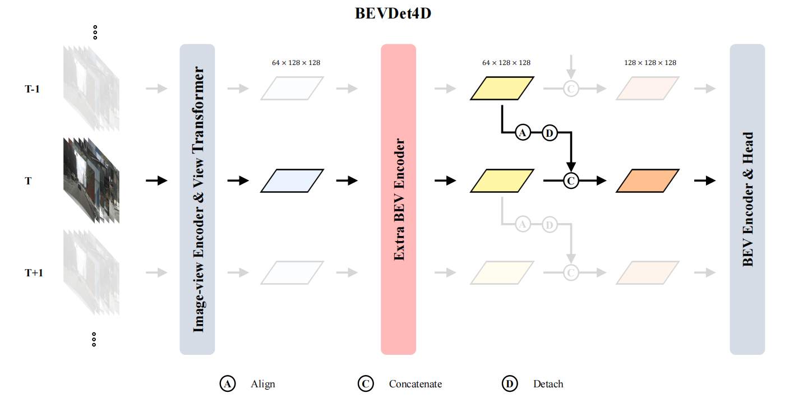
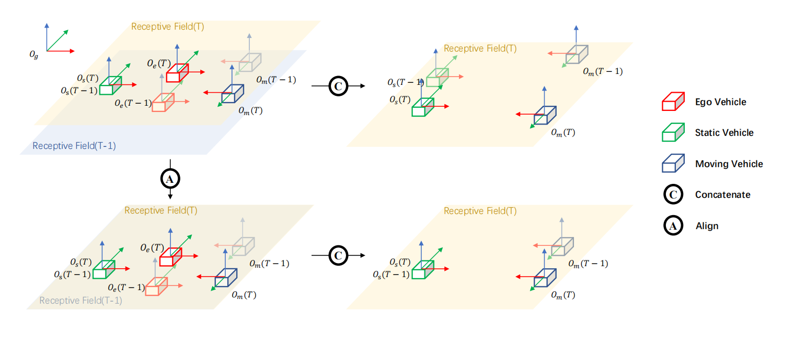

### BEVDet4D

- 升级 BEVDet 框架，将前一帧的特征与当前帧中的相应特征融合，使 BEVDet4D 能够通过查询和比较两个候选特征来访问时间线索。

- 通过将速度预测退化为两个相邻特征中的位置偏移预测来简化速度预测的任务。

### 方法分析

BEVDet4D的总体框架建立在BEVDet基线之上，由四种模块组成：Image-view Encoder、View Transformer、BEV Encoder和Head。

#### 引入时间维度

BEVDet4D相比于BEVDet引入时间维度，通过整合多个时间帧的信息，捕捉物体的动态变化和运动轨迹。

#### 空间对齐操作

在BEV Encoder之后做时序上的特征融合，因为BEV空间以自车坐标为原点建立的，此时前一帧的BEV特征和当前帧的BEV特征在空间是有偏差的、不对齐的，所以不能做直接的相加。

1. **定义坐标及转换**：

- **全局坐标系**：以$O_g-XYZ$表示，是一个固定的参考框架，用于描述场景中所有物体的绝对位置。
- **自我坐标系**：以$O_e(T)-XYZ$表示，是与自动驾驶车辆相关的坐标系，随车辆位置和方向变化。
- **目标坐标系**：以$O_t(T)-XYZ$表示，是用于描述特定目标物体位置的坐标系。

- **坐标系的变换矩阵**：$\text T^{dst}_{src}$表示从源坐标系转换到目标坐标系。例如，$\text T^{ego}_g$表示从全局坐标系转换到自我坐标系。

- **目标坐标**：全局坐标系中，
  - 静态的目标是 $O_s − XYZ$ （绿色），
  - 移动的目标是 $O_m − XYZ$ （蓝色）。
    

2. **操作**：

一个静态对象，在全局坐标系中的位置在两个相邻帧中表示为 $\text P^g_s(\text T)$ 和 $\text P^g_s(\text T−1)$，那么两个特征的位置移动应表述为：

$$
\text P ^ {e(T)} _ {s}(T) - \text P ^ {e(T-1)} _ {s}(T-1)  \\\\
= \text T ^ {e(T)} _ {g} \text P ^ {g} _ {s}(T) - \text T ^ {e(T-1)} _ {g} \text P ^ {g} _ {s}(T-1) \\\\ 
= \text T ^ {e(T)} _ {g} \text P ^ {g} _ {s}(T) - \text T ^ {e(T-1)} _ {e(T)} \text T ^ {e(T)} _ {g} \text P ^ {g} _ {s}(T-1)
$$

如果我们直接连接这两帧特征，那么后面的模块的学习目标（即目标在两个特征中的位置移动）与自我运动相关（即 $ \text T ^ {e( \text T-1 )} _ {e( \text T )} $ )。为了避免这种情况，将相邻帧中的目标移动 $\text T ^ {e(\text T)} _ {e(\text T-1)}$ 消除自我运动的部分。

$$
\text P ^ {e( T)} _ {s}(T) - \text T ^ {e(T)} _ {e(T-1)} \text P ^ {e(T-1)} _ {s}(T-1) \\\\
= \text T ^ {e(T)} _ {g} \text P ^ {g} _ {s}(T) - \text T ^ {e(T)} _ {e(T-1)} \text T ^ {e(T-1)} _ {g} \text P ^ {g} _ {s}(T-1)\\\\
= \text T ^{e(T)} _{g} \text P ^{g} _{s}(T) - \text T ^{e(T)} _{e(T-1)} \text T ^{e(T-1)} _{e(T)} \text T ^{e(T)} _{g} \text P ^{g} _{s}(T-1)\\\\
= \text P ^{e(T)} _{s}(T) - \text P ^{e(T)} _{s}(T-1)
$$

给定前一帧 $\mathbf{F}(T − 1, P^{e(T−1)})$ 和当前帧 $\mathbf{F}(T, P^{e(T)})$ 的特征，可以通过以下方式获得对齐特征：

$$
\mathbf{F'}(T-1, \text P^{e(T)}) = \mathbf{F}(T-1, \text T^{e(T-1)}_{e(T)}\text P^{e(T)})
$$
