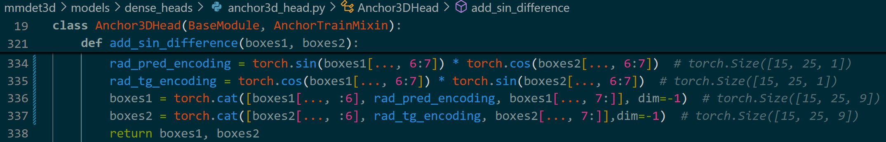

## Debug

### 1. 打断点

- 找到 `tools/train.py` ，在入口函数 `main` 中找到自己想要打断点的地方随便打...


### 2. 添加参数

- 在 `debug`里面编辑 `launch.json` 文件，加上

```json
"args": [
    "configs/fastbev/exp/paper/fastbev_m0_r18_s256x704_v200x200x4_c192_d2_f4.py",
    "--work-dir",
    "work_dir",
    "--gpu-ids",
    "0"
],
```


### 3. 启动调试

- 切换回 `train.py` ，选择 `Python Debugger: Current File` ，点击开始按钮启动调试，稍作等待，代码即可跳到断点处。


## 模型训练概述

### 1. 读取配置参数

| 参数            | 类型     | 默认值 | 说明                                       |
| --------------- | -------- | ------ | ------------------------------------------ |
| `config`        | 位置参数 | 无     | 训练配置文件的路径                         |
| `--work-dir`    | 可选参数 | 无     | 保存日志和模型的目录                       |
| `--resume-from` | 可选参数 | 无     | 从某个检查点文件恢复训练                   |
| `--load-from`   | 可选参数 | 无     | 从某个检查点文件加载模型                   |
| `--no-validate` | 布尔标志 | 无     | 在训练期间不评估检查点                     |
| `--gpus`        | 互斥参数 | 无     | 使用的 GPU 数量（仅适用于非分布式训练）    |
| `--gpu-ids`     | 互斥参数 | 无     | 使用的 GPU ID 列表（仅适用于非分布式训练） |

`--gpus` 和 `--gpu-ids` 是互斥参数，这意味着在命令行中只能使用其中一个。

### 2. 构建网络模型

#### 2.1 初始化网络模型

- 根据配置文件初始化网络模型
- 初始化模型权重参数

```python
model = build_model(
    cfg.model,
    train_cfg=cfg.get('train_cfg'),
    test_cfg=cfg.get('test_cfg'))
model.init_weights()
```

#### 2.2 冻结网络模型

- 根据配置文件中的 `frozen_det` 参数对网络模型部分参数冻结，不计算梯度和更新梯度

```python
frozen_det = cfg.get('frozen_det', False)
if frozen_det:
    print('### freeze detection branch ###')
    model.neck.eval()
    model.neck_fuse.eval()
    model.neck_3d.eval()
    for name, param in model.named_parameters():
        if not 'seg' in name:
            param.requires_grad = False
```

### 3. 构建数据集

- 根据配置文件中的 `data.train` 参数构建数据集

```python
datasets = [build_dataset(cfg.data.train)]
```

### 4. 训练模型

`train_model` 函数是训练框架的核心部分，主要包括：

- 加载数据集，并根据配置进行数据预处理
- 根据配置初始化模型、优化器、学习率调度器等
- 管理训练循环，包括前向传播、损失计算、反向传播和参数更新
- 如果设置了验证选项，会在训练过程中定期进行验证，评估模型的性能
- 保存训练日志和检查点，确保训练过程可追踪和复现

```python
train_model(
    model,
    datasets,
    cfg,
    distributed=distributed,
    validate=(not args.no_validate),
    timestamp=timestamp,
    meta=meta)
```

## 模型训练详解

### 1. 构建网络模型

#### 1.1 模型配置


- `class FreeAnchor3DHead(Anchor3DHead):`


### 2. 构建数据集

- **ConcatDataset**：连接多个数据集，形成一个大的联合数据集。

- **RepeatDataset**：重复同一个数据集多次，增加数据量。

- **SmallDataset**：从一个较大的数据集中抽取一个较小的数据集，用于调试或快速测试。

- **ClassBalancedDataset**：根据类别分布进行平衡采样，解决类别不平衡问题。

- **CBGSDataset**：结合类平衡采样和分组策略来增强数据集。

- **_concat_dataset**：将包含多个标注文件的数据集连接起来，形成一个联合数据集。

- **build_from_cfg**：直接根据配置构建数据集，用于标准配置情况。


1. 平衡数据集中各个类别的样本数量，以便在训练模型时每个类别都有相对均匀的样本分布


### 3. 训练模型

- 图像特征提取


- neck特征融合


- 多尺度融合


1.原始的内参矩阵为什么是4x4单位矩阵，为什么取前 3 行和前 3 列
2.为什么只调整前两维，第三维为什么不缩放


- M2BevNeck


- FreeAnchor3DHead

1. 单尺度处理，数据输入网络，得到 `cls_score`、`bbox_pred`、`dir_cls_preds`。


2. 通过 `AlignedAnchor3DRangeGenerator` （下一节）类生成 anchors 。

3. Loss计算

   - 解码锚框 `anchors_` 和边界框预测 `bbox_preds_`，得到预测的边界框 `pred_boxes`。
   - 计算每个真实框 `gt_bboxes_` 与每个预测框 `pred_boxes` 之间的交并比（IoU）。
   - 计算每个预测框 `pred_boxes` 成为真实框 `gt_bboxes_` 的概率。

   

   - 计算 `gt_bboxes_`（真实边界框）和 `anchors_`（候选框）之间的匹配质量矩阵。

   - 选择每个真实边界框对应的前 `self.pre_anchor_topk` 个最佳匹配的候选框。

   - 提取这些候选框的分类概率。

   - 计算这些候选框的回归目标。

     - 位置增量:

       - 计算相**对于对角线长度**的x和y方向的位移增量。
       - 计算**相对于高度**的z方向的位移增量。

     - 尺寸增量：计算长、宽、高的相对变化（通过取对数的方式）。

     - 旋转角度增量：直接做差。

     - 自定义参数增量：直接做差。

       

   - **计算方向分类损失**

     - 将方向转换为离散区间
       - 将 0-360° 映射到 [0, $\pi$) 和 [$\pi$, $2\pi$)区间，形成二分类

     

     - 使用 `CrossEntropyLoss` 计算方向分类损失

   - **计算 bbox 回归损失**

     - 方向属性特殊处理，使用正弦和余弦的差异来捕捉角度差异

       

     - 生成 bbox weights 调整不同预测框的贡献度

       - 根据配置文件中 `train_cfg.code_weight` 参数调整初始化的 bbox weights

     - 使用 `SmoothL1Loss` 计算 bbox回归损失

   - **合并方向分类损失和bbox回归损失**

   - **总损失**

     - 计算每个尺度的**正样本损失**，然后求出样本的平均损失（总样本损失/样本个数）
       - 对负的损失取指数值，得到与边界框损失相关的匹配概率（较低的损失（即预测和真实值之间的差异较小）会产生较高的匹配概率，而较高的损失会产生较低的匹配概率）
     - 对于每个anchor，根据其分类概率和未匹配到正样本的概率来计算负样本损失

   

   

   - 尽管 `matched_dir_targets` 是根据模型预测的候选框位置和尺寸得出的，它们本质上还是表示了模型需要学习的**真实方向目标**。这个目标是通过一种特定的方式推导出来的，并反映了真实边界框的方向。


- AlignedAnchor3DRangeGenerator
  

最终生成的张量 `[1, 100, 100, 1, 2, 9]` 的每个维度分别代表：

1. **第 1 维 (1)**: 批量大小 (batch size)，这里是 1。
2. **第 2 维 (100)**: 网格在 x 轴方向上的分辨率或网格数。
3. **第 3 维 (100)**: 网格在 y 轴方向上的分辨率或网格数。
4. **第 4 维 (1)**: 网格在 z 轴方向上的分辨率或网格数（在这个例子中是 1，因为所有锚框的 z 轴高度相同）。
5. **第 5 维 (2)**: 不同的旋转角度数量，这里是两个旋转角度（0 和 90 度）。
6. **第 6 维 (9)**: 每个锚框的属性，包括中心点的 x、y、z 坐标，长、宽、高，旋转角度，以及两个自定义值。


生成 anchor 维度`[[[80000, 9] * num_feature_scales] * num_imgs]`


## 附件

```python
FastBEV(
  (backbone): ResNet(
    (conv1): Conv2d(3, 64, kernel_size=(7, 7), stride=(2, 2), padding=(3, 3), bias=False)
    (bn1): BatchNorm2d(64, eps=1e-05, momentum=0.1, affine=True, track_running_stats=True)
    (relu): ReLU(inplace=True)
    (maxpool): MaxPool2d(kernel_size=3, stride=2, padding=1, dilation=1, ceil_mode=False)
    (layer1): ResLayer(
      (0): BasicBlock(
        (conv1): Conv2d(64, 64, kernel_size=(3, 3), stride=(1, 1), padding=(1, 1), bias=False)
        (bn1): BatchNorm2d(64, eps=1e-05, momentum=0.1, affine=True, track_running_stats=True)
        (conv2): Conv2d(64, 64, kernel_size=(3, 3), stride=(1, 1), padding=(1, 1), bias=False)
        (bn2): BatchNorm2d(64, eps=1e-05, momentum=0.1, affine=True, track_running_stats=True)
        (relu): ReLU(inplace=True)
      )
      (1): BasicBlock(
        (conv1): Conv2d(64, 64, kernel_size=(3, 3), stride=(1, 1), padding=(1, 1), bias=False)
        (bn1): BatchNorm2d(64, eps=1e-05, momentum=0.1, affine=True, track_running_stats=True)
        (conv2): Conv2d(64, 64, kernel_size=(3, 3), stride=(1, 1), padding=(1, 1), bias=False)
        (bn2): BatchNorm2d(64, eps=1e-05, momentum=0.1, affine=True, track_running_stats=True)
        (relu): ReLU(inplace=True)
      )
    )
    (layer2): ResLayer(
      (0): BasicBlock(
        (conv1): Conv2d(64, 128, kernel_size=(3, 3), stride=(2, 2), padding=(1, 1), bias=False)
        (bn1): BatchNorm2d(128, eps=1e-05, momentum=0.1, affine=True, track_running_stats=True)
        (conv2): Conv2d(128, 128, kernel_size=(3, 3), stride=(1, 1), padding=(1, 1), bias=False)
        (bn2): BatchNorm2d(128, eps=1e-05, momentum=0.1, affine=True, track_running_stats=True)
        (relu): ReLU(inplace=True)
        (downsample): Sequential(
          (0): Conv2d(64, 128, kernel_size=(1, 1), stride=(2, 2), bias=False)
          (1): BatchNorm2d(128, eps=1e-05, momentum=0.1, affine=True, track_running_stats=True)
        )
      )
      (1): BasicBlock(
        (conv1): Conv2d(128, 128, kernel_size=(3, 3), stride=(1, 1), padding=(1, 1), bias=False)
        (bn1): BatchNorm2d(128, eps=1e-05, momentum=0.1, affine=True, track_running_stats=True)
        (conv2): Conv2d(128, 128, kernel_size=(3, 3), stride=(1, 1), padding=(1, 1), bias=False)
        (bn2): BatchNorm2d(128, eps=1e-05, momentum=0.1, affine=True, track_running_stats=True)
        (relu): ReLU(inplace=True)
      )
    )
    (layer3): ResLayer(
      (0): BasicBlock(
        (conv1): Conv2d(128, 256, kernel_size=(3, 3), stride=(2, 2), padding=(1, 1), bias=False)
        (bn1): BatchNorm2d(256, eps=1e-05, momentum=0.1, affine=True, track_running_stats=True)
        (conv2): Conv2d(256, 256, kernel_size=(3, 3), stride=(1, 1), padding=(1, 1), bias=False)
        (bn2): BatchNorm2d(256, eps=1e-05, momentum=0.1, affine=True, track_running_stats=True)
        (relu): ReLU(inplace=True)
        (downsample): Sequential(
          (0): Conv2d(128, 256, kernel_size=(1, 1), stride=(2, 2), bias=False)
          (1): BatchNorm2d(256, eps=1e-05, momentum=0.1, affine=True, track_running_stats=True)
        )
      )
      (1): BasicBlock(
        (conv1): Conv2d(256, 256, kernel_size=(3, 3), stride=(1, 1), padding=(1, 1), bias=False)
        (bn1): BatchNorm2d(256, eps=1e-05, momentum=0.1, affine=True, track_running_stats=True)
        (conv2): Conv2d(256, 256, kernel_size=(3, 3), stride=(1, 1), padding=(1, 1), bias=False)
        (bn2): BatchNorm2d(256, eps=1e-05, momentum=0.1, affine=True, track_running_stats=True)
        (relu): ReLU(inplace=True)
      )
    )
    (layer4): ResLayer(
      (0): BasicBlock(
        (conv1): Conv2d(256, 512, kernel_size=(3, 3), stride=(2, 2), padding=(1, 1), bias=False)
        (bn1): BatchNorm2d(512, eps=1e-05, momentum=0.1, affine=True, track_running_stats=True)
        (conv2): Conv2d(512, 512, kernel_size=(3, 3), stride=(1, 1), padding=(1, 1), bias=False)
        (bn2): BatchNorm2d(512, eps=1e-05, momentum=0.1, affine=True, track_running_stats=True)
        (relu): ReLU(inplace=True)
        (downsample): Sequential(
          (0): Conv2d(256, 512, kernel_size=(1, 1), stride=(2, 2), bias=False)
          (1): BatchNorm2d(512, eps=1e-05, momentum=0.1, affine=True, track_running_stats=True)
        )
      )
      (1): BasicBlock(
        (conv1): Conv2d(512, 512, kernel_size=(3, 3), stride=(1, 1), padding=(1, 1), bias=False)
        (bn1): BatchNorm2d(512, eps=1e-05, momentum=0.1, affine=True, track_running_stats=True)
        (conv2): Conv2d(512, 512, kernel_size=(3, 3), stride=(1, 1), padding=(1, 1), bias=False)
        (bn2): BatchNorm2d(512, eps=1e-05, momentum=0.1, affine=True, track_running_stats=True)
        (relu): ReLU(inplace=True)
      )
    )
  )
  init_cfg={'type': 'Pretrained', 'checkpoint': 'torchvision://resnet18'}
  (neck): FPN(
    (lateral_convs): ModuleList(
      (0): ConvModule(
        (conv): Conv2d(64, 64, kernel_size=(1, 1), stride=(1, 1), bias=False)
        (bn): BatchNorm2d(64, eps=1e-05, momentum=0.1, affine=True, track_running_stats=True)
      )
      (1): ConvModule(
        (conv): Conv2d(128, 64, kernel_size=(1, 1), stride=(1, 1), bias=False)
        (bn): BatchNorm2d(64, eps=1e-05, momentum=0.1, affine=True, track_running_stats=True)
      )
      (2): ConvModule(
        (conv): Conv2d(256, 64, kernel_size=(1, 1), stride=(1, 1), bias=False)
        (bn): BatchNorm2d(64, eps=1e-05, momentum=0.1, affine=True, track_running_stats=True)
      )
      (3): ConvModule(
        (conv): Conv2d(512, 64, kernel_size=(1, 1), stride=(1, 1), bias=False)
        (bn): BatchNorm2d(64, eps=1e-05, momentum=0.1, affine=True, track_running_stats=True)
      )
    )
    (fpn_convs): ModuleList(
      (0): ConvModule(
        (conv): Conv2d(64, 64, kernel_size=(3, 3), stride=(1, 1), padding=(1, 1), bias=False)
        (bn): BatchNorm2d(64, eps=1e-05, momentum=0.1, affine=True, track_running_stats=True)
      )
      (1): ConvModule(
        (conv): Conv2d(64, 64, kernel_size=(3, 3), stride=(1, 1), padding=(1, 1), bias=False)
        (bn): BatchNorm2d(64, eps=1e-05, momentum=0.1, affine=True, track_running_stats=True)
      )
      (2): ConvModule(
        (conv): Conv2d(64, 64, kernel_size=(3, 3), stride=(1, 1), padding=(1, 1), bias=False)
        (bn): BatchNorm2d(64, eps=1e-05, momentum=0.1, affine=True, track_running_stats=True)
      )
      (3): ConvModule(
        (conv): Conv2d(64, 64, kernel_size=(3, 3), stride=(1, 1), padding=(1, 1), bias=False)
        (bn): BatchNorm2d(64, eps=1e-05, momentum=0.1, affine=True, track_running_stats=True)
      )
    )
  )
  init_cfg={'type': 'Xavier', 'layer': 'Conv2d', 'distribution': 'uniform'}
  (neck_3d): M2BevNeck(
    (fuse): Conv2d(1024, 256, kernel_size=(1, 1), stride=(1, 1))
    (model): Sequential(
      (0): ResModule2D(
        (conv0): ConvModule(
          (conv): Conv2d(256, 256, kernel_size=(3, 3), stride=(1, 1), padding=(1, 1), bias=False)
          (bn): BatchNorm2d(256, eps=1e-05, momentum=0.1, affine=True, track_running_stats=True)
          (activate): ReLU(inplace=True)
        )
        (conv1): ConvModule(
          (conv): Conv2d(256, 256, kernel_size=(3, 3), stride=(1, 1), padding=(1, 1), bias=False)
          (bn): BatchNorm2d(256, eps=1e-05, momentum=0.1, affine=True, track_running_stats=True)
        )
        (activation): ReLU(inplace=True)
      )
      (1): ConvModule(
        (conv): Conv2d(256, 192, kernel_size=(3, 3), stride=(2, 2), padding=(1, 1), bias=False)
        (bn): BatchNorm2d(192, eps=1e-05, momentum=0.1, affine=True, track_running_stats=True)
        (activate): ReLU(inplace=True)
      )
      (2): ResModule2D(
        (conv0): ConvModule(
          (conv): Conv2d(192, 192, kernel_size=(3, 3), stride=(1, 1), padding=(1, 1), bias=False)
          (bn): BatchNorm2d(192, eps=1e-05, momentum=0.1, affine=True, track_running_stats=True)
          (activate): ReLU(inplace=True)
        )
        (conv1): ConvModule(
          (conv): Conv2d(192, 192, kernel_size=(3, 3), stride=(1, 1), padding=(1, 1), bias=False)
          (bn): BatchNorm2d(192, eps=1e-05, momentum=0.1, affine=True, track_running_stats=True)
        )
        (activation): ReLU(inplace=True)
      )
      (3): ConvModule(
        (conv): Conv2d(192, 192, kernel_size=(3, 3), stride=(1, 1), padding=(1, 1), bias=False)
        (bn): BatchNorm2d(192, eps=1e-05, momentum=0.1, affine=True, track_running_stats=True)
        (activate): ReLU(inplace=True)
      )
      (4): ResModule2D(
        (conv0): ConvModule(
          (conv): Conv2d(192, 192, kernel_size=(3, 3), stride=(1, 1), padding=(1, 1), bias=False)
          (bn): BatchNorm2d(192, eps=1e-05, momentum=0.1, affine=True, track_running_stats=True)
          (activate): ReLU(inplace=True)
        )
        (conv1): ConvModule(
          (conv): Conv2d(192, 192, kernel_size=(3, 3), stride=(1, 1), padding=(1, 1), bias=False)
          (bn): BatchNorm2d(192, eps=1e-05, momentum=0.1, affine=True, track_running_stats=True)
        )
        (activation): ReLU(inplace=True)
      )
      (5): ConvModule(
        (conv): Conv2d(192, 192, kernel_size=(3, 3), stride=(1, 1), padding=(1, 1), bias=False)
        (bn): BatchNorm2d(192, eps=1e-05, momentum=0.1, affine=True, track_running_stats=True)
        (activate): ReLU(inplace=True)
      )
    )
  )
  (neck_fuse_0): Conv2d(256, 64, kernel_size=(3, 3), stride=(1, 1), padding=(1, 1))
  (bbox_head): FreeAnchor3DHead(
    (loss_cls): FocalLoss()
    (loss_bbox): SmoothL1Loss()
    (loss_dir): CrossEntropyLoss()
    (convs): Identity()
    (conv_cls): Conv2d(192, 80, kernel_size=(1, 1), stride=(1, 1))
    (conv_reg): Conv2d(192, 72, kernel_size=(1, 1), stride=(1, 1))
    (conv_dir_cls): Conv2d(192, 16, kernel_size=(1, 1), stride=(1, 1))
  )
  init_cfg={'type': 'Normal', 'layer': 'Conv2d', 'std': 0.01, 'override': {'type': 'Normal', 'name': 'conv_cls', 'std': 0.01, 'bias_prob': 0.01}}
)


```

