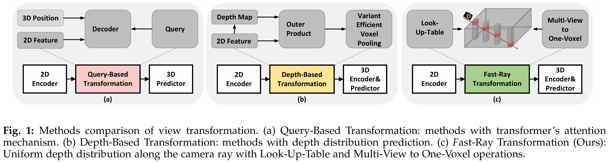
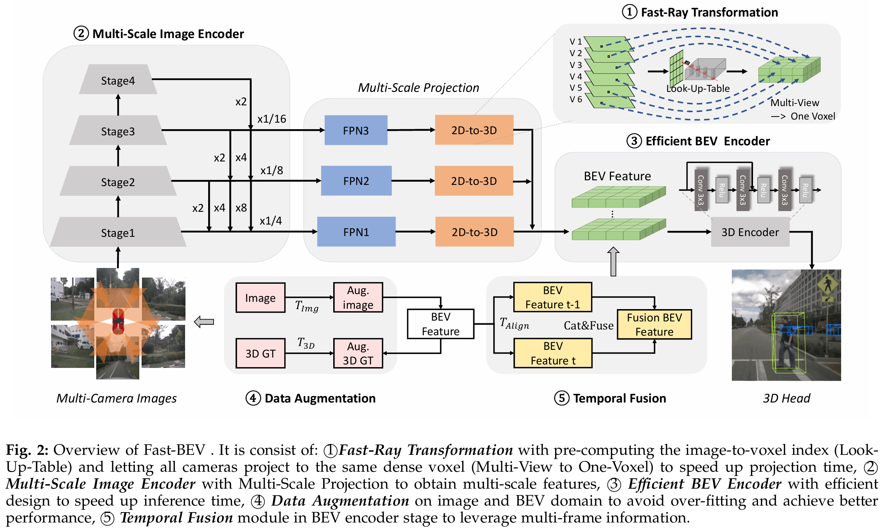
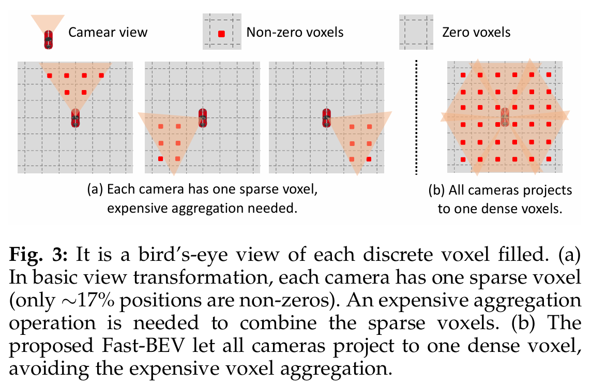
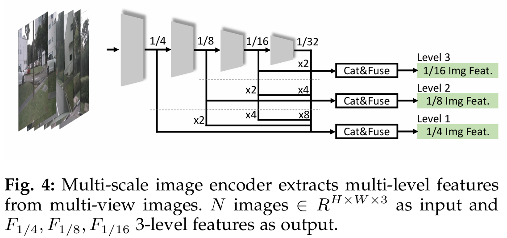
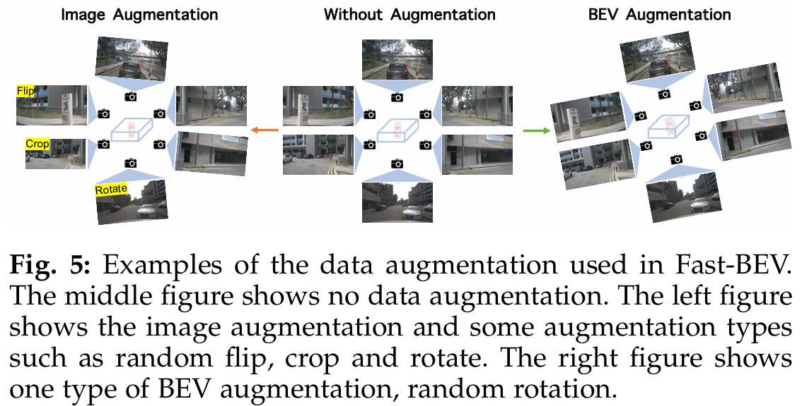
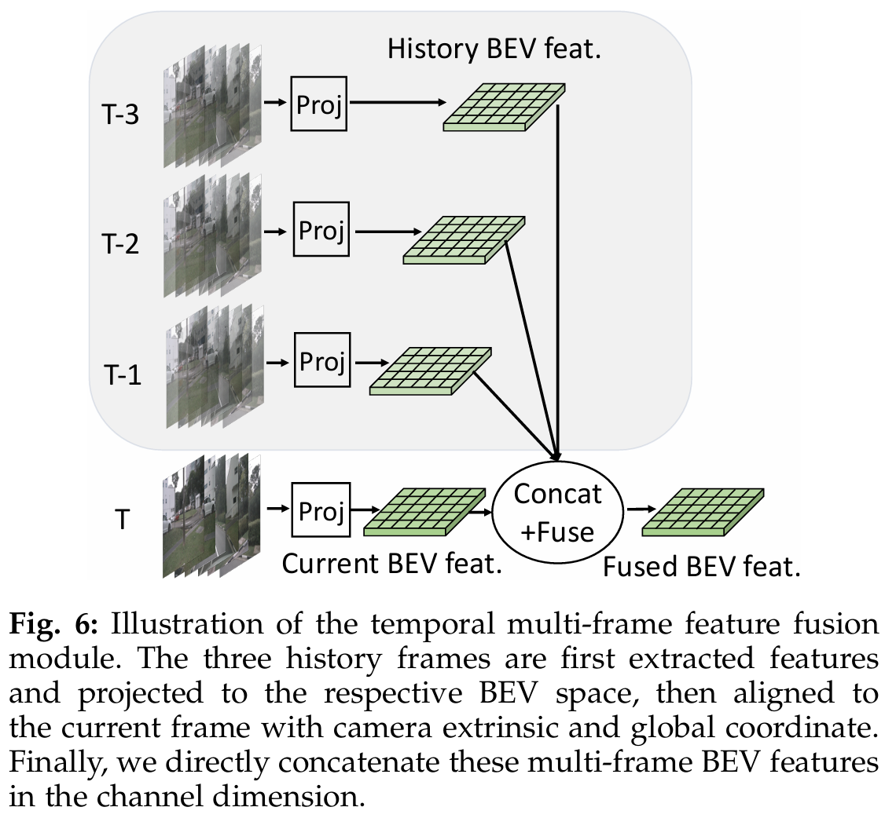
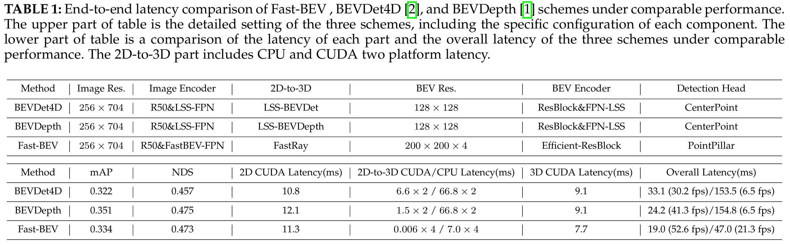
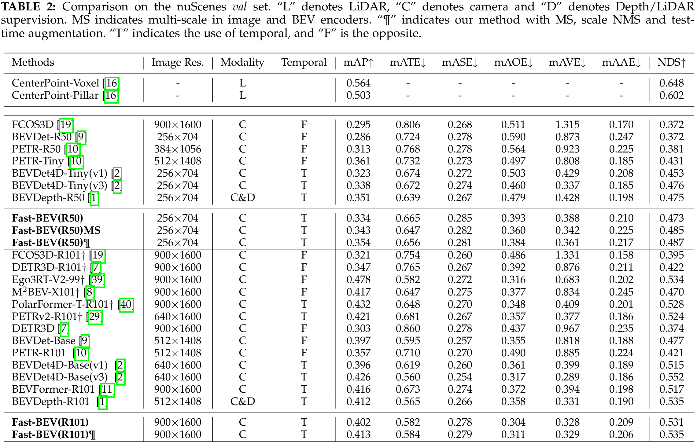

### 1 摘要

Fast -BEV 由五个部分组成，创新地提出

- 轻量级部署友好的视图转换，可快速将 2D 图像特征转换到 3D 体素空间
- 利用多尺度信息获得更好性能的多尺度图像编码器
- 高效的 BEV 编码器，专门设计用于加速车载推理
- 图像和 BEV 空间的强大数据增强策略，以避免过度拟合
- 多帧特征融合机制，以利用时间信息

### 2 引言

纯视觉的鸟瞰（BEV）方法最近以其令人印象深刻的 3D 感知能力和经济成本显示出巨大的潜力。它们基本遵循的范式是：将多摄像头的 2D 图像特征转换为小车坐标下的 3D BEV 特征，然后在统一的BEV特征上应用特定的头部来执行特定的 3D 任务，如 3D 检测、分割等。统一的 BEV 表示既可以单独处理单个任务，也可以同时处理多个任务，具有高效率和灵活性。为了从 2D 图像特征中执行 3D 感知，nuScenes 上最先进的BEV方法要么使用**基于查询的转换**，要么使用**隐式/显式基于深度的转换**。

- 基于查询转换的方法如图1(a)所示。由于解码器需要transformer中的注意机制进行计算，实际部署的芯片需要能够支持注意算子(涉及矩阵乘法和 MLP 层)，因此这些方法通常需要专用芯片来支持。
- 基于深度变换的方法如图1(b)所示。这些方法通常需要加速不友好的体素池化操作，甚至多线程 CUDA 内核也可能不是最佳解决方案。此外，在资源受限或 CUDA 加速推理库不支持的芯片上运行也不方便。

本文为车载芯片设计一个具有友好部署，高推理速度和竞争性能的 BEV 感知框架。如 Xavier、Orin、Tesla T4 等。

同时，根据 M$^2$BEV 在图像到 BEV(2d到3d) 视图转换过程中沿相机光线深度分布均匀的原理，提出了如图1(c)所示的 Fast-Ray 变换，通过查找表和多视图到单体素的操作将 BEV 转换加快到一个新的水平。

基于Fast-Ray变换，我们进一步提出了 Fast-BEV，这是一种更快、更强的全卷积 BEV 感知框架，不需要昂贵的视图转换器或深度表示。本文提出的Fast-BEV由**Fast-Ray变换**、**多尺度图像编码器**、**高效 BEV 编码器**、**数据增强**和**时间融合**五个部分组成。

### 3 方法

#### 3.1 重新思考 BEV 感知 2d 到 3d 投影

##### 1. Query-based 方法

这种方法通过transformer中的注意力机制将 2D 特征转换为 3D BEV 特征。公式如下：
$$
F_{bev}(x, y, z) = Attn(q, k, v)
$$
其中 $q, k, v$ 表示 query, key, value,  $q \subset P_{xyz}$ , $k, v \subset F_{2D}(u, v)$。$P_{xyz}$ 是三维空间中预定义的锚点，$F_{2D}(u, v)$ 表示从图像中提取的二维特征。$x, y, z$ 表示三维空间中的坐标，$u, v$ 表示二维空间中的坐标。

注意力机制在一些计算平台上部署时存在挑战，限制了这些方法的实际应用。

##### 2. Depth-based 方法

这种方法通过计算 2D 特征与预测深度的外积来获得 3D BEV 特征。具体过程如下：
$$
F_ {bev} (x, y,z) = Pool\{F_ {2D} (u, v) \otimes D(u, v)\} _ {x,y,z}
$$
其中 $F_{2D}(u, v)$ 表示从图像中提取的 2D 特征，$D(u, v)$ 表示从 2D 特征中进行深度预测。$\otimes$表示外部积，$Pool$表示体素池化操作。$x, y, z$ 表示三维空间中的坐标，$u, v$ 表示二维空间中的坐标。

这种方法在 GPU 平台上通过 CUDA 多线程支持，显著提高了推理速度，但在更大分辨率和特征维度时会遇到计算速度瓶颈，而且在没有推理库支持的非 GPU 平台上表现不佳。

##### 3. Fast-Ray 转换方法

提出了一种基于光线投影的 Fast-Ray 转换方法，通过查找表和多视图到单体素操作，实现了在 GPU 平台上极快的 2D 到 3D 推理速度。此外，由于其标量索引的高效性，在 CPU 平台上运行时，速度表现也优于现有解决方案，从而使其可以转移到更多平台上。

#### 3.2 Fast-BEV 概述

##### M2BEV 方法
M2BEV 是首个解决多摄像头、多任务感知的统一 BEV（鸟瞰图）表示方法。它通过多摄像头 RGB 图像作为输入，输出预测的 3D 边界框和地图分割结果。M2BEV 的主要组成部分包括：
1. 2D 图像编码器，从多摄像头图像中提取图像特征。
2. 2D 到 3D 视图变换模块，将 2D 图像特征映射到 3D BEV 空间。
3. 3D BEV 编码器，处理 3D 特征。
4. 任务特定的头部，执行感知任务。

##### Fast-BEV 方法
受 M2BEV 简洁性的启发，提出了 Fast-BEV 方法，以优秀的速度和性能表现为目标。其主要框架分为以下五个关键模块：

1. **Fast-Ray 转换**
   - 投影从图像空间到体素空间的延迟占主导地位。
   - Fast-Ray 转换通过沿相机光线将多视图 2D 图像特征投影到 3D 体素。
   - 预先计算固定投影索引并存储为静态查找表，提高推理效率。
   - 所有相机投影到相同的体素，避免昂贵的体素聚合。

2. **多尺度图像编码器**
   - 多尺度设计可带来性能提升。
   - 利用 Fast-Ray 转换的速度优势，设计多尺度 BEV 感知范式，从统一的单尺度图像输入中获取多尺度图像特征。

3. **高效的 BEV 编码器**
   - 实验发现更多的块和更大的分辨率在 3D 编码器中导致推理延迟急剧增加，但对模型性能提升不显著。
   - 使用单层多尺度级联融合和多帧级联融合模块以及较少的残差结构作为 BEV 编码器，显著减少推理延迟而不损害准确性。

4. **数据增强**
   - 在训练后期，基础框架中发生严重的过拟合问题。
   - 添加强数据增强，例如随机翻转和旋转等，提高训练效果。

5. **时序融合**
   - 在实际自动驾驶场景中，输入是时间连续的，跨时间的补充信息非常重要。
   - 引入时序特征融合模块，使用当前帧BEV特征和存储的历史帧特征作为输入，进行端到端训练。

#### 3.3 Fast-Ray Transformation

##### 基本视图转换
视图转换是将 2D 图像空间的特征转化为 3D BEV 空间特征的关键步骤，通常在整个管道中耗时较多。本文的方法假设深度分布沿射线均匀分布。利用相机的内参和外参，可以轻松计算 2D 到 3D 的投影矩阵。由于这里不使用可学习参数，可以轻松计算图像特征图与 BEV 特征图之间的对应矩阵。为了进一步加速这一过程，提出了两种优化方法：预计算投影索引（查找表）和密集体素特征生成（多视图到单体素）。

##### 查找表（Look-Up-Table）
投影索引是 2D 图像空间到 3D 体素空间的映射索引。由于感知系统建立时相机的位置及其内参和外参是固定的，并且该方法不依赖于数据相关的深度预测或 transformer，所以投影索引对每个输入都是相同的。因此，不需要在每次迭代中计算相同的索引，而是预计算固定的投影索引并将其存储为静态查找表。在推理期间，可以通过查询查找表来获取投影索引，这是一种在边缘设备上成本非常低的操作。此外，如果从单帧扩展到多帧，也可以轻松预计算内参和外参并预对齐到当前帧。通过相机参数矩阵投影，建立与输出 3D 体素空间具有相同维度的查找表 LUT 。遍历每个体素单元，计算对应 3D 坐标的 2D 像素坐标。如果获得的 2D 像素坐标合法，将其填充到 LUT 中以建立数据无关的索引映射。

##### 多视图到单体素（Multi-View to One-Voxel）
基本视图转换使用简单的体素聚合操作，将每个摄像机视图的离散体素特征存储起来，然后聚合生成最终的体素特征。由于每个相机视角有限，每个体素特征非常稀疏，例如只有约17%的位置是非零的。这些体素特征的聚合由于其巨大规模而非常昂贵。为避免昂贵的体素聚合，提出了生成密集体素特征的方法。具体来说，**让来自所有摄像机视角的图像特征投影到同一个体素特征上**，最终形成一个密集体素，称为多视图到单体素。如图3(b)所示，这是密集体素填充的鸟瞰图。

##### Fast-Ray转换算法
Fast-Ray 转换算法将输入的多视图 2D 图像特征转换为单体素 3D 空间，其中每个体素单元由预计算的查找表填充相应的 2D 图像特征。对于具有重叠区域的多视图情况，直接采用第一个遇到的视图来提高表格构建速度。结合查找表和多视图到单体素的加速设计，视图转换操作具有极快的投影速度。

通过这些改进，Fast-Ray转换方法在GPU上的延迟可以忽略不计，在CPU平台上的推理速度也远超其他解决方案，使其在边缘设备上具有很高的应用潜力。

#### 3.4 Multi-Scale Image Encoder

由于Fast-Ray转换的极高速度，骨干网络可以充分利用多尺度操作的性能潜力。

1. **图像输入和编码**
   - 输入N个形状为 $(R^{H×W×3})$ 的图像到图像编码器网络（如ResNet-50）中。
   - 在图像编码器网络中，得到四阶段特征 $(F1, F2, F3, F4)$ ，其形状分别为 $(H/2^{i+1} × W/2^{i+1} × C)$。

2. **多尺度特征融合**
   
   - 使用三层多尺度 FPN 结构在图像编码器输出部分。
   - 每层 FPN 通过1×1卷积融合相同大小的特征，这些特征是在后续层中通过上采样得到的。
   - 最终获得三个级别的综合图像特征输出：$(F_{1/4}, F_{1/8}, F_{1/16})$。
   
   
   
3. **特征投影**
   - 从多视图图像中提取多尺度图像特征后，通过基于 Fast-Ray 转换的多尺度投影，将三个级别的特征$(F = \{R^{N×W_i ×H_i ×C}|i ∈ [4, 8, 16]\})$投影到多尺度BEV特征空间$(V = \{R^{X_i×Y_i×Z×C}|X_i, Y_i ∈ [200, 150, 100]\})$。

#### 3.5 Efficient BEV Encoder

##### BEV特征和时序融合
- **BEV特征**：BEV特征是一个4D张量，时序融合将叠加这些特征，使得BEV编码器需要处理大量的计算。

##### 三种降维操作
为了加速编码器的计算，使用了三种降维操作：

1. **空间到通道转换（Space-to-Channel, S2C）操作**
   - S2C 操作将 4D 体素张量 $(V \in R^{X×Y×Z×C})$ 转换为3D BEV张量 $(V \in R^{X×Y×(ZC)})$，从而避免了内存昂贵的 3D 卷积操作。

2. **多尺度拼接融合（Multi-Scale Concatenation Fusion, MSCF）操作**
   - 在应用 MFCF 操作之前，注意到通过多尺度投影获得的 BEV 特征具有不同的尺度。首先将多尺度 BEV 特征在 X 和 Y 维度上进行上采样，使其达到相同的大小，如200×200。
   - MSCF 和 MFCF 操作在通道维度上拼接多尺度多帧特征，并将它们从更高的参数量融合到更低的参数量，从而加速 BEV 编码器的计算时间。
   - 融合公式： 

   $$
   Fuse(Vs | Vs ∈ R ^ { X×Y×( ZCF _ sT ) } ) \implies V | V ∈ R ^ { X×Y×C _ {MSCF \\& MFCF} }
   $$
   
   ​		这里 $s ∈ 3$ 级表示具有三个步幅的多尺度 BEV 特征。
   
3. **多帧拼接融合（Multi-Frame Concat Fusion, MFCF）操作**
   - MFCF 操作在通道维度上拼接多帧特征，通过减少参数量来加速计算。

另外，实验发现，BEV 编码器的块数量和 3D 体素分辨率的大小对性能影响较小，但会占用大量的计算速度。因此，使用较少的块和较小的体素分辨率也更为关键。

#### 3.6 Data Augmentation

##### 数据增强的意义
- 数据增强的好处已在学术界达成共识。
- 3D 数据集（如NuScenes和KITTI）由于标注困难且昂贵，导致样本数量较少，因此数据增强可以显著提升性能。

##### 图像增强
- 在 3D 目标检测中，图像增强比 2D 检测更具挑战性，因为 3D 场景中的图像与 3D 摄像机坐标直接相关。因此，对图像进行数据增强时，也需要相应地修改摄像机内参矩阵。
- 常见的图像增强操作包括翻转、裁剪和旋转。在图5的左侧部分展示了一些图像增强的例子。

##### BEV 增强
- 类似于图像增强，BEV 空间也可以应用类似的操作，例如翻转、缩放和旋转。
- 需要注意的是，增强变换应该同时应用于 BEV 特征图和 3D 真值框，以保持一致性。
- BEV 增强变换可以通过相应修改摄像机外参矩阵来控制。在图5的右侧部分展示了随机旋转增强，这是 BEV 增强的一种类型。

总的来说，数据增强在 3D 目标检测中，通过在图像空间和 BEV 空间进行各种增强操作，可以有效增加数据集的多样性，提高模型的泛化能力，从而提升检测性能。

#### 3.7 Temporal Fusion

##### 时间特征融合
- **灵感来源**：受 BEVDet4D 和 BEVFormer 的启发，Fast-BEV 也引入了历史帧与当前帧进行时间特征融合。
- **特征融合方法**：
  - 使用空间对齐操作和连接操作，将历史帧的特征与当前帧的特征融合。
  - 时间特征融合可以被看作是帧级别的特征增强，较长的时间序列（在一定范围内）可以带来更大的性能提升。

##### 具体实现
- **历史帧采样**：采样当前帧以及三个历史关键帧，每个关键帧之间间隔0.5秒。
- **对齐和连接**：采用 BEVDet4D 的多帧特征对齐方法。如图6所示，得到四个对齐的 BEV 特征后，直接将它们连接起来并输入 BEV 编码器。
- **训练与测试阶段**：
  - 在训练阶段，历史帧特征在线提取。
  - 在测试阶段，历史帧特征可以离线保存，直接取出使用，从而加速推理。

##### 与现有方法对比
- **BEVDet4D**：仅引入一个历史帧，认为不足以充分利用历史信息。Fast-BEV 使用三个历史帧，显著提升了性能。
- **BEVFormer**：
  - 使用两个历史帧，性能稍好于 BEVDet4D。
  - 由于内存问题，训练阶段历史特征与梯度分离，这并非最佳。
  - 使用RNN风格顺序融合特征，效率低。
- **Fast-BEV 的优势**：
  - 所有帧均以端到端方式训练，常规 GPU 更易于训练。
  - 提供更高效的训练和推理性能。

#### 3.8 Detection Head

##### 方法描述
- **基于PointPillars**：Fast-BEV 参考 PointPillars 的方法，使用三层平行的1 × 1卷积在 BEV 特征上执行 3D 检测任务。这些卷积可以预测每个物体的类别、框大小和方向。

##### 损失函数
- **损失计算**：使用与 PointPillars 相同的损失函数公式。损失函数 $( L_{det} )$ 定义如下：
  $$
  L_{det} = \frac{1}{N_{pos}} (\beta_{cls} L_{cls} + \beta_{loc} L_{loc} + \beta_{dir} L_{dir})
  $$
  
  - $N_{pos}$：正锚点的数量。
  - $L_{cls}$：分类损失，使用焦点损失（Focal Loss）。
  - $L_{loc}$：位置损失，使用平滑L1损失（Smooth-L1 loss）。
  - $L_{dir}$：方向损失，使用二元交叉熵损失（Binary Cross-Entropy Loss）。

##### 解释
- **正锚点**：在目标检测中，正锚点是与真实物体框匹配的预测框。
- **焦点损失**：用于处理类别不平衡问题，通过对难分类的样本赋予更大的权重。
- **平滑L1损失**：用于回归任务，平衡精度和稳定性。
- **二元交叉熵损失**：用于二分类任务，计算预测值与真实值之间的误差。

### 4 实验

#### 表 1：在可比性能下 Fast-BEV、BEVDet4D 和 BEVDepth 方案的端到端延迟比较

表上半部分为三种方案的详细设置，包括各部件的具体配置。

表的下半部分是在性能比较的情况下，每个部分的延迟和三种方案的总体延迟的比较。2D-to-3D部分包括CPU和CUDA两个平台的延迟。

#### 表 2：nuScenes 验证集上的比较

Fast-BEV 在 nuScenes 验证集上的性能比较显示出优越性。在使用 ResNet-50 作为图像编码器时，Fast-BEV 达到 0.334 mAP 和 0.473 NDS，明显超过了类似图像编码器和分辨率的相机方法，如 BEVDet4D-Tiny 和 PETR-R50。通过使用多尺度（MS）、比例非极大值抑制（scale NMS）和测试时增强配置，Fast-BEV 的性能提升至 0.354 mAP 和 0.487 NDS，超越了基于相机深度的 BEVDepth。

当使用更大的 ResNet-101 图像编码器和更高分辨率时，Fast-BEV 达到 0.402 mAP 和 0.531 NDS，而在上述配置下，性能提升至 0.413 mAP 和 0.535 NDS，与 BEVDepth-R101 相当，并超越了 BEVDet4D-Base 和 BEVFormerR101。Fast-BEV 注重效率和部署，尽管在视图转换过程中不使用任何深度信息，但仍具有竞争力的性能，这归功于其围绕 Fast-Ray 的整体模型架构设计、图像编码器、BEV 编码器和检测头的设计，以及其独特的预训练策略和多尺度特征策略。

 
