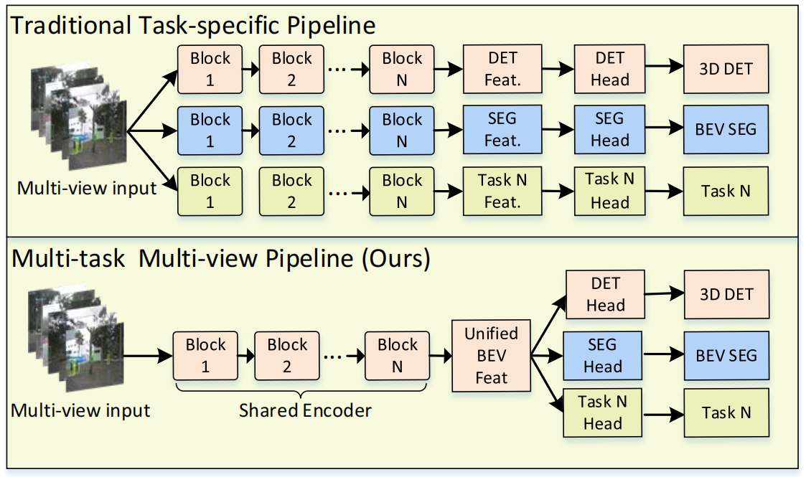
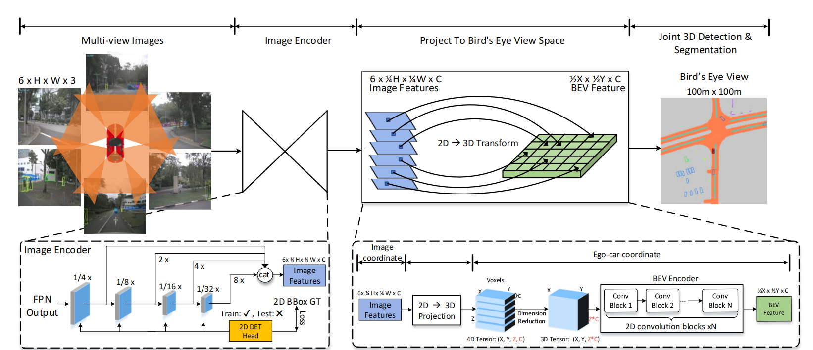
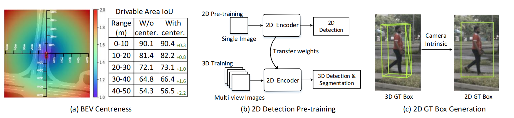

### 0. Abstract

- **统一框架：** 同时处理 3D 目标检测和 BEV 分割，采用统一模型代替分开处理，提高效率。

- **特征转换：** 将多视角 2D 图像特征高效转换为自车坐标系中的 3D BEV 表示，并通过共享 Encoder 处理多任务。

- **创新：**
  1. **高效的 BEV Encoder：** 降低体素特征图的空间维度，提升效率；
  2. **动态框匹配：** 通过学习匹配 3D 真实框和锚点；
  3. **BEV 中心性加权：** 增加对远距离目标的检测权重；
  4. **2D 预训练与辅助监督：** 利用大规模 2D 数据提升 3D 任务的准确性。

在 nuScenes 数据集上，M2BEV 在 3D 目标检测中达到 42.5 mAP，在 BEV 分割中达到 57.0 mIoU，具有最先进的性能。

### 1. Introduction

**主要目标：**
- 设计统一的 BEV 表示框架，用于自动驾驶中的 3D 目标检测和 BEV 分割。

**现有方法的不足：**
- 单目检测需要后处理，不鲁棒，且无法端到端推理。(如 CenterNet 和 FCOS3D)
- 伪 LiDAR 方法对深度估计误差敏感。(如 pseudo-LiDAR)
- Transformer 方法只关注目标查询，无法处理多任务。(如 DETR3D)

**M2BEV 贡献：**
1. **统一框架**：首次在单一框架下处理 3D 检测与 BEV 分割。
2. **新设计**：
   - 高效 BEV Encoder。
   - 动态框匹配。
   - BEV 中心性重新加权。
3. **2D 预训练与辅助监督**：提高 3D 任务的性能，提升标注效率。

**框架亮点：**

- 通过 S2C (空间到通道) 操作优化 BEVEncoder，减少内存消耗。
- 动态框匹配通过学习策略优化 3D 边界框检测。

### 2. Related Work

1. **单目 3D 检测：**
   - 单目 3D 检测比 2D 检测更复杂，早期方法通过 2D 边界框回归到 3D。
   - 其他方法使用伪 LiDAR 等技术预测深度。
   - FCOS3D 结合了无锚点检测器，直接预测 3D 距离和边界框。

2. **多视图 3D 检测：**
   - 多视图检测器如 ImVoxelNet，通过将 2D 特征投影为 3D 体素进行检测。
   - DETR3D 使用 Transformer 框架，但尚未明确如何将其扩展至 BEV 分割。

3. **BEV 分割：**
   - VPN、PON、LSS 等方法通过不同方式将 2D 特征转换为 BEV 表示，用于环境分割。
   - NEAT 和 Panoptic-BEV 采用了 Transformer 框架，但局限于单视图，不处理物体高度估计。

### 3. Method

#### 设计概述

**M2BEV Pipeline 总览：**
- **输入：** 系统以来自多视图摄像头的 N 张 RGB 图像及其外参和内参为输入。
- **输出：** 输出为 3D 目标的边界框和环境的分割结果。
- **过程：** 输入的多视图图像先通过 2D 图像 Encoder 提取特征，然后将这些 2D 特征投影到 3D 空间构建体素 (voxel)。之后，体素特征被输入高效 BEV Encoder 生成 BEV 表示，最后通过专门的任务头部生成 3D 检测或 BEV 分割结果。

#### 核心组件描述

1. **2D 图像Encoder：**
   - 使用共享的 CNN 主干网络（例如 ResNet）和特征金字塔网络 (FPN) 提取多层次特征 F1、F2、F3、F4。每个视图提取的特征会被上采样并融合为一个张量 F。
   - 这些多视图特征接下来会被投影到 3D 自车坐标系中。

2. **2D→3D 投影：**
   - 将 2D 图像特征 F 投影到 3D 空间，得到体素 V。体素特征包含所有视图的图像信息，形成了统一的表示。这一步是 M2BEV 中实现多任务训练的关键。

3. **3D BEV Encoder：**
   - 输入的 4D 体素张量 V 需要通过 BEV Encoder减少 Z 维度，输出 3D BEV 特征。为了提高效率，M2BEV 设计了 "空间到通道" (S2C) 操作，将 4D 张量转换为 3D 张量，然后使用 2D 卷积来减少通道维度。

4. **3D 检测头：**
   - 在生成的 BEV 特征上直接使用基于 PointPillars 的检测头。这个检测头非常简单高效，由三个平行的 1×1 卷积组成，用于生成 3D 锚框并预测物体类别、边框尺寸和方向。
   - 不同于 PointPillars，M2BEV 提出了动态框匹配策略，用于将锚框与真实标注进行匹配，以适应摄像头输入的特性。

5. **BEV 分割头：**
   - BEV 分割头使用四个 3×3 卷积和一个 1×1 卷积生成最终的分割结果。分割头主要用于生成可行驶区域和车道线的分割，采用 BEV centerness 策略对不同距离的像素进行加权。

---

#### 关键技术设计

1. **高效的 2D→3D 投影：**
   - 假设深度分布沿着摄像头射线是均匀的，所有沿射线的体素共享与该像素对应的特征。这种假设减少了计算和内存开销。
   - **与 LSS 的对比：** LSS 预测非均匀深度分布，并将 2D 特征提升为 3D 表示。然而，这种方法内存消耗较大，限制了使用更大主干网络和更高分辨率图像的能力。相比之下，M2BEV 的 2D→3D 投影更加高效，并且无需学习参数，能够支持更高分辨率和更大模型。

2. **S2C 操作：**
   - M2BEV 提出的 "空间到通道" (S2C) 操作将 4D 体素张量转换为 3D 张量，通过 "torch.reshape" 操作将 Z 维度展开到通道维度。随后通过 2D 卷积减少通道数量，从而实现高效的特征提取。
   - **与 3D 卷积对比：** 3D 卷积在 Z 维度上进行下采样会导致更高的计算和内存消耗，而 S2C 操作使得堆叠更多的 2D 卷积成为可能，提高了计算效率。

3. **动态框匹配：**
   - M2BEV 借鉴了 FreeAnchor 方法中的学习匹配策略，扩展到 3D 检测中。通过分类分数和定位精度的加权和来区分正样本和负样本。
   - 与 LiDAR 基于 IoU 的固定锚框匹配不同，M2BEV 的动态框匹配更适合摄像头输入下的 BEV 表示。

4. **BEV 中心性 (Centerness)：**
   
   - 为了让模型更多关注远距离的区域，M2BEV 扩展了 2D 检测中的 "中心性" 概念到 3D BEV 坐标系。远离自车的 BEV 区域在图像中的像素较少，因此网络需要对这些区域施加更大的关注权重。通过中心性策略，距离越远的区域对损失函数的影响越大。
   
   BEV 中心性定义为以下公式：

$$
\text{BEV~Centerness} = 1 + \sqrt{\frac{(x_i - x_c)^2 + (y_i - y_c)^2}{(\max(x_i) - x_c)^2 + (\max(y_i) - y_c)^2}}
$$

其中：
- $(x_i, y_i)$ 表示 BEV 坐标系中某一点的坐标范围，通常为 -50m 到 +50m。
- $(x_c, y_c)$ 是自车在 BEV 表示中的中心位置，即车辆位置的坐标。
- $\max(x_i)$ 和 $max(y_i)$ 分别表示 BEV 空间中的最大 $x$ 和 $y$ 坐标。

5. **2D 预训练与辅助监督：**

- 通过在大型 2D 数据集（如 nuImage）上进行预训练，显著提升了 3D 任务的性能。在训练过程中还加入了 2D 辅助检测头，用于计算损失，但在推理时不会增加计算开销。
- 2D 辅助监督通过将 3D 边界框反投影到 2D 图像空间来生成 2D 真实标注框，从而提升图像特征对目标的感知能力。

---

#### 损失函数设计

M2BEV 的总损失函数由三个部分组成：3D 检测损失、BEV 分割损失和 2D 辅助检测损失。

1. **3D 检测损失 (Ldet3d)：**
   - 3D 检测损失包括分类损失、定位损失和方向损失，其总损失公式为：

$$
\mathcal{L}_ { \text{det}_ {3d} } = \frac{1}{N_ {\text{pos}}} \left( \beta_ {\text{cls}} \mathcal{L}_ {\text{cls}} + \beta_ {\text{loc}} \mathcal{L}_ {\text{loc}} + \beta_ {\text{dir}} \mathcal{L}_ {\text{dir}} \right)
$$

其中：
- $\mathcal{L}_{\text{cls}}$ 是分类损失 (Focal Loss)；
- $\mathcal{L}_{\text{loc}}$ 是定位损失 (Smooth-L1 Loss)，用于回归 3D 边界框的 $(x, y, z, w, h, l, \theta, v_x, v_y)$；
- $\mathcal{L}_{\text{dir}}$ 是方向损失 (Binary Cross-Entropy Loss)，用于预测物体方向；
- $N_{\text{pos}}$ 是正样本的数量，权重参数为 $\beta_{\text{cls}} = 1.0$、$\beta_{\text{loc}} = 0.8$、$\beta_{\text{dir}} = 0.8$。

2. **BEV 分割损失 (Lseg3d)：**

   - BEV 分割损失结合了 Dice 损失和二元交叉熵损失，其总损失公式为：

$$
\mathcal{L}_ { \text{seg}_ {3d}} = \beta_ {\text{dice}} \mathcal{L}_ {\text{dice}} + \beta_ {\text{bce}} \mathcal{L}_ {\text{bce}}
$$
其中：
- $\mathcal{L}_{\text{dice}}$ 是 Dice 损失，用于处理类别不平衡问题；
- $\mathcal{L}_{\text{bce}}$ 是二元交叉熵损失；
- 权重参数为 $\beta_{\text{dice}} = 1$、$\beta_{\text{bce}} = 1$。

3. **2D 辅助检测损失 (Ldet2d)：**

   - 2D 辅助检测损失基于 FCOS 的损失函数，包含分类损失、边框回归损失和中心性损失，公式为：

$$
\mathcal{L}_ {\text{det}_ {2d}} = \mathcal{L}_ {\text{cls}} + \mathcal{L}_ {\text{box}} + \mathcal{L}_ {\text{centerness}}
$$
其中：
- $\mathcal{L}_{\text{cls}}$ 是分类损失；
- $\mathcal{L}_{\text{box}}$ 是边框回归损失；
- $\mathcal{L}_{\text{centerness}}$ 是中心性损失，用于提升物体中心区域的检测效果。

---

4. **总损失函数：**

   - M2BEV 的总损失函数为：

$$
\mathcal{L}_ {\text{total}} = \mathcal{L}_ {\text{det}_ {3d}} + \mathcal{L}_ {\text{seg}_ {3d}} + \mathcal{L}_ {\text{det}_ {2d}}
$$

### 4. 结论

**任务重点：** 3D 目标检测和 BEV 分割是多摄像头自动驾驶感知的两个核心任务。

**框架核心：** 将多视图特征投影到 BEV 空间，生成统一的 BEV 表示，检测和分割在此表示上进行操作。

**预训练优势：** 在 2D 数据上预训练可提升 3D 任务的标注效率。

**未来方向：** 框架未来可以扩展到时间序列任务，如 3D 目标跟踪、运动预测和轨迹预测。
