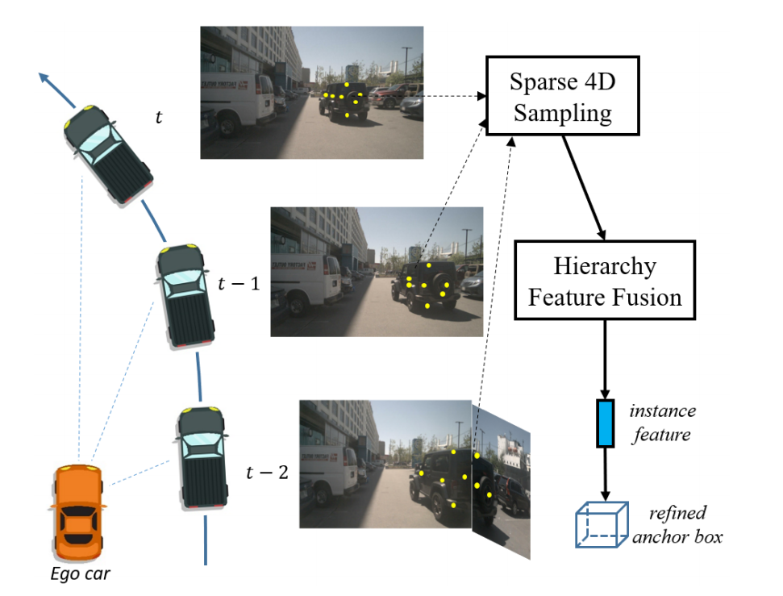
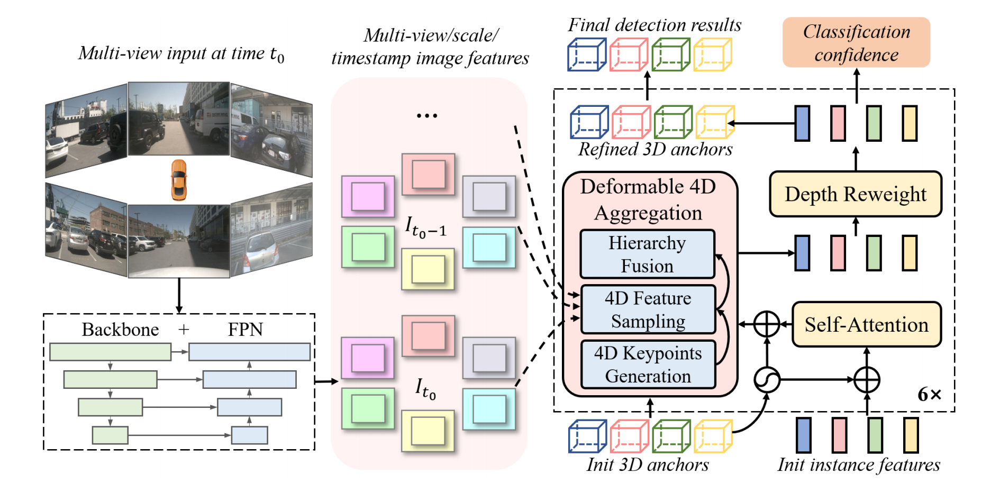
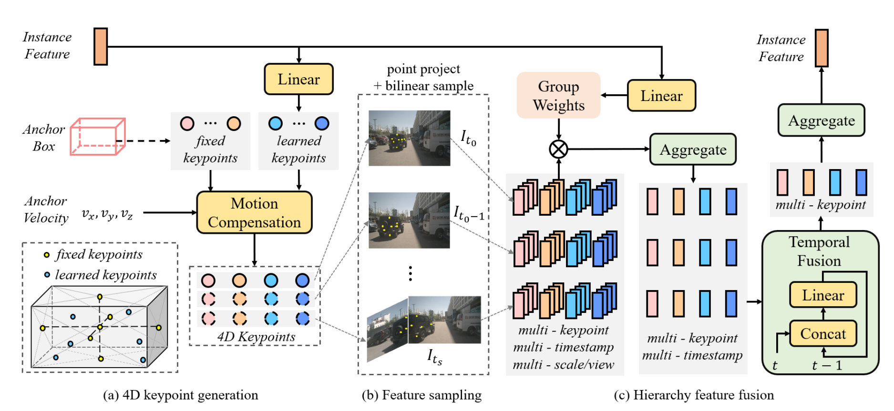
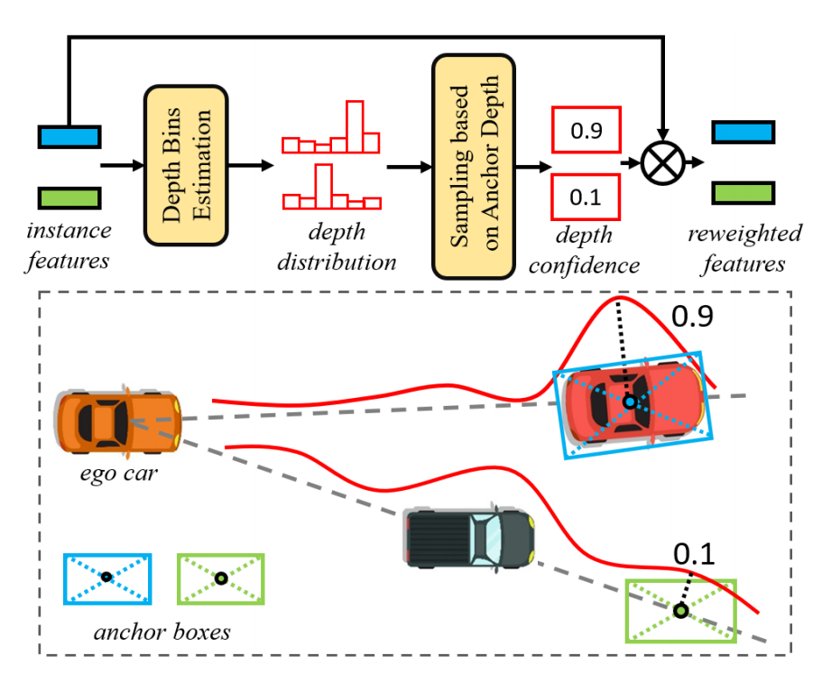

[原文链接：Sparse4D: Multi-view 3D Object Detection with Sparse Spatial-Temporal Fusion](https://arxiv.org/abs/2211.10581)

[Sparse4D Github](https://github.com/linxuewu/Sparse4D)

### 0. Abstract

随着基于鸟瞰图（BEV）的多视图 3D 检测方法的快速发展，基于稀疏的方法在性能上稍显落后，但它们在计算效率和边缘设备部署方面具有显著优势。本文介绍了一种名为 Sparse4D 的新方法，它通过**稀疏采样**和**融合时空特征**更精细迭代锚框，以实现有效的 3D 检测。

- **稀疏采样**：为每个 3D 锚点分配多个 4D 关键点，然后将这些关键点投影到多视角/尺度/时间戳图像特征以采样相应的特征；
- **层次特征融合**：将不同视角/尺度、不同时间戳和不同关键点的采样特征分层融合，生成高质量的实例特征。

同时引入了实例级深度重加权模块来缓解 3D-to-2D 投影中的不适定问题。实验表明，该方法在nuScenes数据集上的检测性能优于所有基于稀疏的方法和大多数基于Bev的方法。

### 1. Introduction

#### 1.1 多视角视觉 3D 感知的挑战

从 2D 图像进行 3D 感知是一个复杂的任务，特别是在没有明确深度线索的情况下，如何有效融合多摄像头图像以完成 3D 检测是一个长期存在的挑战。目前的方法主要有两类：**基于BEV的方法**和**基于稀疏的方法**。

##### 1.1.1 基于BEV的方法

通过将多视角图像特征转换到统一的 BEV 空间来解决 3D 检测，并获得出色的性能提升。但是也存在一些缺陷：

- 图像到 BEV 的透视转换需要密集的特征采样或重排，对于边缘设备部署来说，这是复杂和计算昂贵的
- BEV 特征的最大感知范围受 BEV 特征地图大小的限制，难以在感知范围、效率和精度之间权衡
- BEV 特征压缩了高度维度，丢失了线索

##### 1.1.2 基于稀疏的方法

不需要密集的透视变换模块，直接采样稀疏特征进行 3D 锚点细化，从而缓解了上述问题。

- 最具代表性的稀疏 3D 检测方法 DETR3D，它的模型容量是有限的，因为对于每个锚点查询，DETR3D 只采样单个 3D 参考点的特征。

- SRCN3D 利用 ROI-Align 对多视角特征进行采样，但效率不高，不能精确对齐不同视角的特征点。

现有的稀疏 3D 检测方法没有利用丰富的**时间**背景，与现有的基于 BEV 的检测方法相比，存在着显著的性能差距。

#### 1.2 Sparse4D的主要贡献

与 DETR3D 这种一个 query 只有一个 3D 参考点的方式和 ROI-Align 方式相比，Sparse4D 的采样方式有两个主要优点：

- 可以高效地提取每个锚框内丰富而完整的上下文（一个 query 多个参考点）
- 可以简单地扩展到时间维度作为 4D 关键点，从而可以有效地对齐时间信息

对于 4D 关键点，如Fig.1所示：

- Sparse4D 首先对每个关键点执行多时间戳、多视图和多尺寸的操作
- 这些采样的特征经过分层融合模块，生成高质量的实例特征，细化 3D 目标框

此外，为了缓解基于摄像机的 3D 检测的不适定性问题，提高感知性能：

- Sparse4D 显式地增加了实例级深度重加权模块，实例特征通过从预测的深度分布采样的深度置信度来重加权
- 该模块采用稀疏方式进行训练，不需要额外的激光雷达点云监控

### 2. Related Work

#### 2.1 稀疏目标检测

- 早期的目标检测方法依赖于密集预测和非极大值抑制（NMS）

- DETR 提出了一种新的检测范式，使用基于集合的损失和 transformer 直接预测稀疏检测结果

- 随后，Deformable DETR 提出了一种基于参考点的局部交叉注意算法，加快了模型的收敛速度，降低了计算复杂度

- Sparse R-CNN 基于区域提议的思想提出网络结构极其简单有效的另一种稀疏检测框架

#### 2.2 单目3D目标检测

单目3D检测算法从单个图像中输出 3D 边界框，由于**缺乏深度信息**，这一问题本身是不适定的。

- FCOS3D 和 SMOKE 等方法通过完全卷积网络直接回归每个物体的深度。将 2D 图像转换为具有单目深度估计结果的 3D 伪点云信号，然后使用基于 LiDAR 的检测网络来完成 3D 检测。
- OFT 和 CaDDN 借助视图转换模块将密集的 2D 图像特征转换到 BEV 空间，然后将 BEV 特征传递给检测器，完成 3D 目标检测。不同的是，OFT 使用 3D 到 2D 的逆投影关系来完成特征空间变换，而 CADDN 是基于 2D 到 3D 的投影，这更像是一种伪 LiDAR 方法。

#### 2.3 多视图3D目标检测

多视图 3D 检测的研究主要集中在密集算法上，它利用密集的特征向量进行视角变换、特征融合或目标框预测。目前，基于BEV 的方法是稠密算法的主要组成部分。

- BEVFormer 采用可变形的关注度来完成 BEV 特征生成和密集时空特征融合
- BEVDet 使用 Lift-Splat 操作来实现视图转换
- BEVDepth 在 BEVDet 的基础上，增加了显式深度监督，显著提高了检测的准确性
- BEVStereo 和 SOLOFusion 将时间立体技术引入 3D 检测，进一步提高了深度估计效果
- PETR 利用 3D 位置编码和全局交叉注意进行特征融合，但全局交叉注意的计算量很大。与 Vanilla DETR 一样，PERT不能被视为一种纯粹的稀疏方法
- DETR3D 是稀疏方法的一个代表性工作，它基于稀疏参考点进行特征采样和融合
- Graph DETR3D 在 DETR3D 的基础上引入了图网络来实现更好的空间特征融合，特别是对于多视角重叠区域

### 3. Methodology

#### 3.1 总体框架

如 Fig.2 所示，Sparse4D 采用了 Encoder-Decoder 结构。图像 Encoder 用于提取共享权重的图像特征，包含一个主干网络（如 ResNet 和 VoVNet ）和一个颈部网络（如 FPN ）。

- 给定在时刻 $t$ 的 $N$ 个视角图像，图像 Encoder 提取多视角多尺度 $S$ 特征图，记为 $I_t = \{I_{t,n,s} | 1 \leq s \leq S, 1 \leq n \leq N\}$ 。
- 为了利用时间上下文，Sparse4D 提取最近 $T$ 帧的图像特征，形成图像特征队列 $I = \{I_t\}_{t_0}^{t=ts}$ ，其中 $ts = t_0 - (T - 1)$。

接下来，Decoder 以迭代细化的方式预测检测结果，包含一系列细化模块和分类头，最终预测分类置信度。

- 每个细化模块接收图像特征队列 $I$、3D anchor $B \in \mathbb{R}^{M \times 11}$ 及相应的实例特征 $F \in \mathbb{R}^{M \times C}$ 作为输入，然后输出更新后的 3D 预测框和实例特征。其中，$M$ 是 3D anchor 数量，$C$ 是特征通道数。anchor 的格式为 $\{x, y, z, \ln w, \ln h, \ln l, \sin \text{yaw}, \cos \text{yaw}, v_x, v_y, v_z\}$，所有 3D anchor 在统一的 3D 坐标系中设置（例如，中心激光雷达坐标）。

- 在每个细化模块中：
  - 首先采用自注意力机制实现实例间的交互，并在前后添加 3D anchor 参数的embedding
  - 然后进行可变形 4D 聚合，融合多视角、多尺度、多时间戳和多关键点特征
  - 接着引入深度重加权模块以缓解基于图像的 3D 检测中的不适定问题
  - 最后使用回归头通过预测真实值与当前 anchor 之间的偏移来细化当前 anchor

#### 3.2 可变形4D聚合

实例特征的质量对稀疏感知系统的整体性能有重要影响。如 Fig.3 所示，可变形 4D 聚合模块通过稀疏特征采样和分层特征融合来获得高质量的实例特征。

##### 3.2.1 4D关键点生成

对于第 $m$ 个 anchor 实例，我们分配 $K$ 个 4D 关键点 $P_m \in \mathbb{R}^{K \times T \times 3}$，由 $K_F$ 个固定关键点和 $K_L$ 个可学习关键点组成。如 Fig.3 (a) 所示，在当前时间戳 $t_0$ 处，

- 将固定关键点 $P^F_{m,t_0}$ 直接放置在 anchor 的立体中心和六个面中心
- 可学习关键点随不同实例特征而变化，使神经网络能够找到每个实例最具代表性的特征

给定实例特征 $F_m$ 和 anchor  embedding，我们通过子网络 $\Phi$ 生成可学习关键点 $P^L_{m,t_0}$：

$$
D_m = R_{yaw} \cdot [\text{sigmoid} (\Phi(F_m)) - 0.5] \in \mathbb{R}^{K_L \times 3} \tag{1}
$$

> 其中：
>
> - 输入特征 $F_m$：这是给定的实例特征，包含有关锚点的所有信息
> 
> - 子网络 $\Phi$：这个神经网络对 $F_m$ 进行处理，生成一个输出，这个输出可以被看作是对关键点的一个初步估计
> 
> - sigmoid 函数：对输出应用 sigmoid 函数可以将其压缩到 (0, 1) 区间。然后减去 0.5，将范围变为 (-0.5, 0.5)(为了实现每一个关键点的坐标为 anchor 的中心点)
> 
> - 旋转矩阵 $R_{yaw}$：表示在三维空间中的偏航旋转，用于调整生成的关键点位置，使其适应实际的方向和姿态。这里的乘法表示在生成的偏移 $D_m$ 上应用偏航旋转，得到在 3D 空间中的位移
> 
> - 输出：最终，$D_m$ 是一个大小为 $K_L \times 3$ 的矩阵，其中 $K_L$ 是可学习关键点的数量，每个关键点都有三个维度$(x, y, z)$

$$
P^L_{m,t_0} = D_m \times [w_m, h_m, l_m] + [x_m, y_m, z_m] \tag{2}
$$

> 其中：
>
> - $D_m$：来自公式1的深度偏移，用于调整关键点位置
> 
> - 尺寸参数 $[w_m, h_m, l_m]$ ：这是与当前 anchor 相关的宽度、高度和长度的向量，用于缩放偏移量。表示生成的关键点会根据 anchor 的实际尺寸进行调整
> 
> - 锚框中心位置 $[x_m, y_m, z_m]$：这是当前 anchor 的中心位置，表示在 3D 空间中锚点的基准位置
> 
> - 输出：最终，$P^L_{m,t_0}$ 是可学习关键点的位置。它是通过将调整后的偏移应用到锚框中心位置，得到的结果。因此，这个关键点的位置不仅受到锚框中心的影响，还受到实例特征的影响（通过深度偏移调整）

时间特征对 3D 检测至关重要，可以提高深度估计的准确性。因此，在获取当前帧的 3D 关键点后，需要将其扩展为 4D，以准备进行时间融合。对于过去的时间戳 $t$，我们首先建立一个恒速模型，以便在当前帧的 3D 坐标系统中移动每个 3D 关键点：
$$
P'_ {m,t} = P_ {m,t_0} - d_t \cdot (t_0 - t) \cdot [v_{xm}, v_{ym}, v_{zm}] \tag{3}
$$
通过将速度向量与时间差和时间间隔相乘，得到在时间 $t$ 时 3D 关键点相对 $t_0$ 的移动量。这个移动量从 $P_{m,t_0}$ 中减去，从而得到 $P'_{m,t}$，表示在当前帧的 3D 坐标系统中，过去时间戳 $t$ 下的关键点位置。

> 其中：
>
> - $P_{m,t0}$：这是在当前时间戳 $t_0$ 下的 3D 关键点位置
> 
> - 时间间隔 $d_t$：表示两个相邻帧之间的时间间隔，这个值用于计算在时间上的移动量
> 
> - 时间差 $(t_0 - t)$：表示当前时间戳与过去时间戳 $t$ 之间的差值。这个值是正数，表示从 $t_0$ 到 $t$ 的时间流逝
> 
> - 速度 $[v_{xm}, v_{ym}, v_{zm}]$：这是自我车辆在三个维度 $(x, y, z)$ 的速度向量，表示车辆的运动方向和速度

然后，我们使用自我车辆的运动信息将 $P'_ {m,t}$ 转换为过去 $t$ 帧的坐标系统：
$$
P_ {m,t} = R_ {t_0 \to t} P'_ {m,t} + T_ {t_0 \to t} \tag{4}
$$
通过先旋转 $P'_ {m,t}$（当前坐标系中的关键点位置），然后加上位移 $T_ {t_0 \to t}$，将关键点转换到过去时间戳 $t$ 的坐标系统中。这样，就能得到在过去时刻 $t$ 下的 3D 关键点位置 $P_ {m,t}$。

> 其中：
>
> - $P_ {m,t}$：来自公式3的结果，表示在当前帧坐标系中计算出的过去时间戳 $t$ 的关键点位置
> 
> - 旋转矩阵 $R_ {t_0 \to t}$：表示从当前帧 $t_0$ 转换到过去帧 $t$ 时的旋转信息，考虑了自我车辆的朝向和姿态变化
> 
> - 位移 $T_ {t_0 \to t}$：表示从当前帧 $t_0$ 到过去帧 $t$ 的平移量，这同样反映了车辆在时间 $t$ 时的位置信息

##### 3.2.2 稀疏采样

基于上述 4D 关键点 $P$ 和图像特征图队列 $F$，可以高效地采样出具有强表示能力的稀疏特征。

- 首先，通过变换矩阵 $T_{cam}$ 将 4D 关键点投影到特征图上：

$$
P^{img}_ {t,n} = T_ {cam,n} P_t, \quad 1 \leq n \leq N \tag{5}
$$

> 其中：
>
> - $P_t$：这是在时间 $t$ 下的 4D 关键点，包含了关于该时刻的位置和特征
>
> - 变换矩阵 $T_{cam,n}$ ：这是用于将 3D 关键点从世界坐标系转换到相机坐标系的矩阵。每个相机 $n$ 可能有不同的变换矩阵，以反映它们的位置和姿态
>
> - 输出 $P^{img}_{t,n}$ ：这是投影后的关键点在相机 $n$ 的特征图上的位置。这个位置将在后续的特征采样过程中使用

- 接下来，通过双线性插值对每个视图和每个时间戳进行多尺度特征采样：

$$
f_{m,k,t,n,s} = \text{Bilinear} \left( I_{t,n,s}, P^{img}_{m,k,t,n} \right) \tag{6}
$$

> 其中：
>
> - $I_{t,n,s}$：这是在时间 $t$ 下，相机 $n$ 的尺度 $s$ 的特征图。特征图包含了从图像中提取的视觉信息
> 
> - 双线性插值：这是一种常用的图像处理方法，用于在给定位置计算像素值。它根据目标位置的邻近像素值进行加权平均，从而实现平滑的特征采样
> 
> - 输出 $f_{m,k,t,n,s}$：这是为第 $m$ 个 anchor、关键点 $k$、时间戳 $t$、相机 $n$ 和尺度 $s$ 采样得到的特征向量。通过这种方式，能够提取出与每个 4D 关键点相关的图像特征

- 至此，我们为第 $m$ 个 anchor 获得了多关键点、时间戳、视角和尺度的特征向量 $f_m \in \mathbb{R}^{K \times T \times N \times S \times C}$，其中 $C$ 为特征通道数。

##### 3.2.3 分层融合

为了生成高质量的实例特征，Sparse4D 以分层方式融合上述特征向量 $f_m$。如 Fig.3 (c) 所示，对于每个关键点，首先使用预测权重在不同视图和尺度中聚合特征，然后通过序列线性层进行时间融合。具体而言，给定加入 anchor embedding 的实例特征 $F_m$，首先通过线性层 $\Psi$ 预测组加权系数：
$$
W_m = \Psi(F_m) \in \mathbb{R}^{K \times N \times S \times G} \tag{7}
$$

> 其中：
>
> - 实例特征 $F_m$：这是加入 anchor embedding 后的实例特征，包含了与当前锚框相关的信息
> 
> - 线性层 $\Psi$：通过这个层，模型根据输入的实例特征生成组加权系数。该系数用于在特征聚合过程中调整不同特征组的贡献
> 
> - 输出 $W_m$：这个权重矩阵的维度为 $K \times N \times S \times G$，表示对于每个关键点 $k$、每个相机 $n$、每个尺度 $s$，有 $G$ 个权重组

通过这个方式，可以以不同权重聚合不同组的通道，类似于组卷积。然后对每组的加权特征向量在**尺度**和**视图**维度上进行求和，再连接各组以获得新的特征 $f'_ {m,k,t}$：
$$
f'_ {m,k,t,i} = \sum_ {n=1}^{N} \sum_ {s=1}^{S} W_ {m,k,n,s,i} f_ {m,k,t,n,s,i} \tag{8}
$$

> 其中：
>
> - $f_{m,k,t,n,s,i}$：这是第 $m$ 个锚点、关键点 $k$、时间戳 $t$、相机 $n$ 和尺度 $s$ 的特征向量。
> 
> - 加权求和：通过将每组的权重 $W_{m,k,n,s,i}$ 应用到对应的特征向量上，计算加权特征的总和。这样可以使得不同组的特征以不同的权重对最终结果产生影响。

$$
f'_ {m,k,t} = [f'_ {m,k,t,1}, f'_ {m,k,t,2}, \ldots, f'_ {m,k,t,G}] \tag{9}
$$

这个公式将所有组的加权特征 $f'_ {m,k,t,i}$ 连接在一起，形成一个新的特征向量 $f'_ {m,k,t}$。这一步使得特征维度得到扩展，包含了多个特征组的信息。

接下来，使用连接操作和线性层 $\Psi_ {temp}$，特征的时间戳维度 $f'_ {m,k,t}$ 将按顺序融合：
$$
f''_ {m,k,ts} = f'_ {m,k,ts} 
$$

$$
f''_ {m,k,t} = \Psi_ {temp} \left( [f'_ {m,k,t}, f''_ {m,k,t-1}] \right)
$$

$$
f''_ {m,k} = f''_ {m,k,t_0} = \Psi_ {temp} \left( [f'_ {m,k,t_0}, f''_ {m,k,t_0-1}] \right)   \tag{10}
$$

> 其中：
>
> - 时间戳维度融合：首先将当前时间戳 $ts$ 的特征直接赋值给 $f''_{m,k,ts}$ 。
> 
> - 线性层 $\Psi_{temp}$：对当前时间戳和前一个时间戳的特征进行融合。这一过程通过序列融合的方法增强了时间序列信息，使模型能更好地捕捉动态变化。

最终，在时间融合后的多关键点特征 $f''_ {m,k}$ 将进行求和，以完成最终特征聚合并获得更新后的实例特征：
$$
F'_ {m} = \sum_ {k=1}^{K} f''_ {m,k} \tag{11}
$$

#### 3.3 深度重权模块

3D 到 2D 的转换（公式（5））存在一定的模糊性，即不同的 3D 点可能对应相同的 2D 坐标。对于不同的 3D anchor，可能会采样到相同的特征（见 Fig.4 ），这增加了神经网络拟合的难度。为了解决这个问题，Sparse4D 引入了一个显式的深度估计模块 $\Psi_{\text{depth}}$，该模块由多个带有残差连接的多层感知器（MLP）组成。

对于每个聚合特征 $F'_{m}$，我们估计一个离散的深度分布，并使用 3D 锚框中心点的深度来采样相应的置信度 $C_m$，该置信度将用于对实例特征进行重加权：

$$
C_m = \text{Bilinear} \left( \Psi_{\text{depth}}(F'_{m}), \sqrt{x^2_m + y^2_m} \right) \tag{12}
$$

> 其中：
>
> - $C_m$：这是为第 $m$ 个实例计算的深度置信度
> 
> - $\Psi_ {\text {depth}}(F'_ {m})$：这是通过深度估计模块生成的深度特征，用于表示与聚合特征 $F'_{m}$ 相关的深度信息
> 
> - $\sqrt{x^2_m + y^2_m}$：这是实例在 2D 图像中的坐标（即锚框中心的 $x$ 和 $y$ 坐标），用于指示当前特征在图像平面上的位置
> 
> - Bilinear：该函数表示使用双线性插值来计算深度置信度。通过结合深度特征和 2D 坐标，系统能够为特征分配一个表示深度准确性的置信度值

$$
F''_ {m} = C_m \cdot F'_ {m} \tag{13}
$$

> 其中：
>
> - $F''_{m}$：这是重加权后的实例特征。通过乘以深度置信度 $C_m$，系统能够对实例特征进行调整，降低深度估计不准确的实例对整体模型的影响。
>
> - $C_m$：深度置信度，它将影响实例特征的最终值。如果某个实例的 3D 中心点远离真实深度，其对应的深度置信度趋近于零，从而使得该实例特征在最终计算中也趋向于零。

通过这种方式，对于那些 3D 中心点在深度方向上远离真实值的实例，即使其 2D 图像坐标与真实值非常接近，相应的深度置信度也会趋向于零。因此，相应的实例特征 $F''_{m}$ 在重加权后也会趋向于 0。

引入显式的深度估计模块可以帮助视觉感知系统进一步提高感知精度。此外，深度估计模块可以设计和优化为一个独立部分，以促进模型性能的提升。

#### 3.4 Training

Sparse4D 通过采样具有 $T$ 帧的视频片段来进行端到端的检测器训练。连续帧之间的时间间隔在 $\{dt, 2dt\}$ 中随机采样（$dt \approx 0.5$）。参考 DETR3D，我们使用匈牙利算法将每个真实值与一个预测值匹配。损失函数包含三个部分：分类损失、边界框回归损失和深度估计损失：

$$
L = \lambda_1 L_{\text{cls}} + \lambda_2 L_{\text{box}} + \lambda_3 L_{\text{depth}} \tag{14}
$$
> 其中：
>
> - $\lambda_1$、$\lambda_2$ 和 $\lambda_3$ 是平衡梯度的权重项
> 
> - 分类采用 focal loss
> 
> - 边界框回归采用 L1 损失
> 
> - 深度估计采用二元交叉熵损失

在深度重加权模块中，直接使用**标注边界框中心的深度**作为真值来监督每个实例的深度。由于Sparse4D仅估计每个实例的深度，而非稠密深度，训练过程摆脱了对激光雷达数据的依赖。

### 4. Experiment

在nuScenes 数据集上进行的实验表明，Sparse4D 在 3D 检测任务上超越了所有基于稀疏的方法和大多数基于BEV的方法。此外，Sparse4D 在跟踪任务上也表现良好。

### 5. Conclusion

Sparse4D 通过**可变形 4D 聚合模块**实现**多时间戳**和**多视图**的特征级融合，并使用迭代精细化实现 3D 框回归。Sparse4D 在 nuScenes 排行榜上超越了所有现有的稀疏算法和大多数 BEV 基算法，展示了其作为稀疏 3D 检测新基线的巨大潜力。
