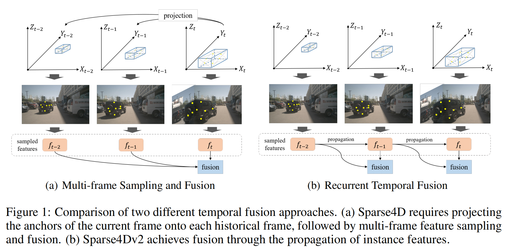
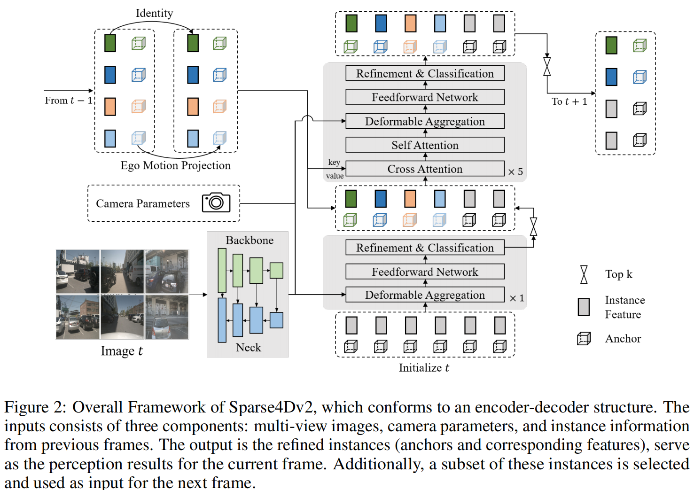
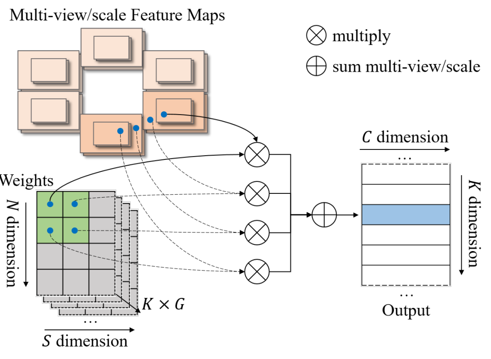

[原文链接：Sparse4D v2: Recurrent Temporal Fusion with Sparse Model](https://arxiv.org/abs/2305.14018)

[Github：Sparse4Dv2](https://github.com/linxuewu/Sparse4D)

### 0. Abstract

稀疏算法为多视角，多时序感知任务提供了极大的灵活性。

Sparse4D 解耦**图像特征**和**结构化锚点特征**的做法，有利于实现时序特征的高效转换，因此仅需通过稀疏特征的逐帧传输即可实现多帧时序融合。

本文中通过实**现循环形式的多帧特征采样**来改进时间融合模块。

循环时序融合有两个主要的优势：

- 时序融合的计算复杂度从 $O(T)$ 降低到 $O(1)$ ，从而显著提高了推理速度和内存利用率。
- 实现长时序融合，有更明显的性能改进。

Sparse4Dv2进一步提高了稀疏感知算法的性能，并在nuScenes 3D检测基准上实现SOTA。

### 1. Introduction

**BEV算法的局限性**：

- **特征转化复杂性**：BEV算法将图像特征转化到鸟瞰图空间，虽然提升了感知效果，但这种特征重组增加了模型复杂性，同时未引入额外信息。
- **计算复杂度与场景适应性**：不同驾驶场景（高速、城市、乡村）对感知范围、准确性和计算资源有不同需求，BEV算法难以高效平衡这些要求。
- **端到端模型的整合性**：BEV算法通常依赖密集特征，而稀疏算法生成的实例特征更容易与图模型（如Transformer）整合。

**PETR 系列算法的架构和局限性**：

- PETR采用查询（query）机制和全局交叉注意力（global cross-attention）实现多视图特征融合，省去了 BEV 中的密集视图转换模块。
- 类似于 DETR，PETR 的全局注意力计算代价较高，不是完全的稀疏算法，仍有较高的理论计算复杂度。

基于上述分析，作者选择了 Sparse4D 作为基线算法，进一步优化感知性能并适应端到端自动驾驶。

**Sparse4D 的时序模块局限性**：

- **多帧采样的计算代价**：Sparse4D 时序模块需要采样多帧历史数据进行特征融合，计算复杂度随着帧数线性增加，导致推理速度下降、显存占用增加，以及长时间特征难以有效整合。

**Sparse4Dv2 的时序模块改进**：

- **基于实例的循环方法**：使用类似于查询跟踪（query-based trackers）和 SteamPETR 的循环机制代替多帧采样，设计如下：

  1. **第一帧**：通过单帧 Sparse4D 检测，生成 3D 边界框及实例特征。

  2. **后续帧**：对于前一帧的输出结果，实例特征保持不变，实例信息（3D bbox等）作为 anchor，根据自车运动数据（ego motion）投影到当前帧，并重新编码 anchor 的 position embedding。

  3. **新增模块**：在每层解码器中引入时序交叉注意力模块，增强实例特征的时序关联性。

  4. **处理新增目标**：

     - 已检测目标通过轨迹跟踪（tracklets）处理。
     - 对于新增目标，通过单帧单层解码器检测，选取高分目标传递给后续解码器。

     这样，能够有效避免增加过多 anchor 数量，使得推理速度与非时序模型相当。

- **可变形聚合（deformable aggregation）操作重构**：
  - 将双线性网格采样与加权求和整合为一个 CUDA 操作，显著降低显存占用并提升训练速度。

- **相机参数编码**：
  - 在可变形聚合中引入相机参数编码，结合图像与输出坐标增强，提升感知鲁棒性和性能。

- **稠密深度监督**：
  - 利用 LiDAR 点云进行稠密深度监督，优化训练并提高检测精度。

### 2. Related Work

#### **2.1 Camera-only 3D Detection（基于相机的3D检测）**
目标：通过2D图像估算物体的深度或3D坐标。分为单目3D、双目3D和多视图3D三类研究方向。

##### **1. 单目3D检测（Monocular 3D）**
单目3D是一个病态问题（ill-posed problem），因为从单张图像推断深度缺乏直接的信息支持。依赖于神经网络的强拟合能力，通过从图像中提取多种信息回归深度或相机坐标系中的3D坐标，因此深度估计精度受限。

##### **2. 双目3D检测（Stereo 3D）**
两台或更多相机，视角之间存在较多重叠部分。一般使用特征点匹配与方程优化计算目标点深度。或通过构建**代价体积（cost volume）**来预测深度。相比单目 3D 更可靠，但对硬件要求较高，特别是相机的校准和同步。

##### **3. 多视角3D检测（Multi-view 3D）**
多台相机，视角之间的重叠程度介于单目和双目之间。一般结合多视角和时序特征融合，进一步提升深度估计的精度。在对不同视角信息进行融合时需解决跨视角的一致性和遮挡问题。

#### **2.2 Multi-view Feature Fusion（多视角特征融合）**

目标：融合多个视角的特征信息以提升深度估计精度，特别是对于视角重叠区域的感知效果。

##### **1. LSS 算法**

利用深度估计结果将图像特征投影到 3D 空间，并在 BEV 平面上进行密集特征融合。在深度估计精度较高时，感知性能显著提升。计算复杂度依赖于输入特征图的分辨率和输出 BEV 特征的大小。

##### **2. BEVFormer 算法**
采用3D到2D反投影。使用可变形注意力（deformable attention）实现特征融合。由于需要输出稠密的 BEV 特征，注意力查询数量较大（如 200×200），限制了训练和推理效率。

##### **3. PETR 系列**
摒弃 BEV 概念，使用稀疏查询（sparse queries）完成感知任务。通过 3D 位置编码建立 2D 与 3D 信息的对应关系。使用全局注意力（global attention）处理特征。受图像分辨率影响较大，高分辨率（如 4K 以上）时效率低下。

##### **4. Sparse-based 算法**
DETR3D使用稀疏查询和稀疏特征采样，头部计算复杂度与图像分辨率无关，理论计算效率较高。与稠密算法相比，性能存在一定差距。

#### **2.3 Temporal Feature Fusion（时序特征融合）**

目标：通过多帧信息融合提高目标定位和速度估计性能，提升感知结果的稳定性。

##### **1. 基础方法：双帧融合**
- **BEVDepth 和 BEVDet4D**：缓存前一帧的 BEV 特征。将其变换到当前时间步，拼接当前帧特征进行融合。
- **PETRv2**：当前帧与前一帧特征作为交叉注意力的键值（keys）使用。相对简单，但对长时特征融合能力有限。

##### **2. 长时特征融合**
- **Sparse4D**：使用 4D 关键点跨多帧采样特征，并通过全连接网络进行融合。能提升感知性能，但计算复杂度较高。
- **SOLOFusion**：缓存多帧特征（滑动窗口长度可达16帧），显著提升性能。
- **VideoBEV**：将 SOLOFusion 的并行融合改为循环形式，降低融合计算复杂度。
- **StreamPETR**：使用稀疏查询实现循环特征传播，性能达到当前最优。

### 3. Methodology

#### **3.1 Overall Framework（整体框架）**

- **输入：** 多视图多尺度特征图（$I_s \in \mathbb{R}^{N \times C \times H_s \times W_s}$），其中 $S$ 为尺度数，$N$ 为视角数。
- **结构：**
  1. **单帧层x1：** 包含可变形聚合（Deformable Aggregation）、前馈网络（FFN）和输出层（用于精炼和分类）。
  2. **多帧层x5：** 除单帧层的模块外，增加了 **多头注意力机制**：
     - **交叉注意力（Cross Attention）：** 融合时序特征。
     - **自注意力（Self Attention）：** 实现实例间特征交互。
- **流程：**
  - 初始化实例，包括 anchor 和 对应的特征（类别等）向量。
  - 在单帧层中精炼和评分，选择高置信度的前景实例作为输入给多帧层。
  - 多帧层的输入来源于单帧层和历史帧的输出，并保持每层（单帧层和多帧层都在内）实例数量一致。
  - 多帧层输出当前帧的检测结果，并选择部分高置信度实例输入到下一帧。

#### **3.2 Instance Temporal Propagation（实例时序传播）**

#### **实例表示：**
包括 Anchor、实例特征（Instance Feature）和 Anchor Embedding。

- **Anchor：** 描述实例的结构化信息（如位置、尺寸、速度等），具有实际物理意义。
- **实例特征：** 从图像中提取的**高阶语义特征**。
- **Anchor Embedding：** 使用小型 anchor 编码器 ($\Psi$) 将 anchor 信息映射到高维特征空间。

#### **传播机制：**
- **设计优点：** 将图像特征与 anchor 框状态完全解耦，便于引入先验知识。

  - **更新方式：** 使用投影函数更新 anchor，通过 anchor 编码器生成 anchor  embedding，实例特征保持不变：
  $$
  A_t = \text{Project}_ {t-1 \to t}(A_ {t-1}), \quad E_t = \Psi(A_t), \quad F_t = F_ {t-1}
  $$

其中：

1. $A_t$：
   
   当前帧 ($t$) 的 Anchor。
   
   包括描述实例在物理空间中状态的结构化信息：
   $A_t = \{x, y, z, w, l, h, \sin(\text{yaw}), \cos(\text{yaw}), v_x, v_y, v_z\}_ t$
   
   
   
2. $\text{Project}_ {t-1 \to t}(A_ {t-1})$：
   
   投影函数，用于将上一帧的 anchor $A_{t-1}$ 映射到当前帧 $A_t$。
   
   考虑了传感器的运动（如自车的旋转和平移）和时间间隔 $d_t$，过程的详细公式如下：
   
   - **投影位置更新**：
     $$
     [x, y, z]_ t = R_ {t-1 \to t}([x, y, z] + d_t [v_x, v_y, v_z])_ {t-1} + T_ {t-1 \to t}
     $$
   
   - **尺寸保持不变**：
   
   $$
   [w, l, h]_ t = [w, l, h]_ {t-1}
   $$
   
   - **方向更新**：
   
   $$
   [\cos(\text{yaw}), \sin(\text{yaw}), 0]_ t = R_{t-1 \to t} \cdot [\cos(\text{yaw}), \sin(\text{yaw}), 0]_ {t-1}
   $$
   
   - **速度更新**：
   
   $$
   [v_x, v_y, v_z]_ t = R_ {t-1 \to t} \cdot [v_x, v_y, v_z]_ {t-1}
   $$
   
   其中：
   
   - 旋转矩阵 $R_ {t-1 \to t}$：表示从上一帧到当前帧的旋转。
   - 平移向量 $T_ {t-1 \to t}$：表示自车在两帧之间的平移。
   - 时间间隔 $d_t$：用于根据速度 $(v_x, v_y, v_z)$ 更新位置。
   
3. $\Psi(A_t)$：
   - 一个小型 Anchor Encoder，将 anchor $A_t$ 的几何信息映射到一个高维空间，生成 anchor embedding $E_t$。
   
4. $E_t$：
   - 当前帧 Anchor Embedding，表示 anchor 的结构化信息（如位置、尺寸、方向等）在高维特征空间中的表示。
   
5. **$F_t$**：
   - 实例的特征向量（Instance Feature），表示实例的语义信息（如类别、外观特征等）。在时间传播过程中保持不变（从上一帧继承）。
   
6. **$F_{t-1}$**：
   - 上一帧 ($t-1$) 的特征向量。

#### **3.3 Efficient Deformable Aggregation（高效可变形聚合）**

##### **基本机制：**
- 从多尺度特征图中进行采样，并通过加权求和完成特征融合（参见 Algorithm 1）。
- 缺点：
  - 需要频繁访问高带宽内存（HBM），导致内存占用和推理速度问题。
  - 存储大量中间变量，训练时对显存消耗较高。

>### Algorithm 1: Basic Deformable Aggregation
>
>#### Input:  
>
>1. **Feature maps** $ I = \{ I_s \in \mathbb{R}^{N \times C \times H_s \times W_s} \mid 1 \leq s \leq S \} $  
> - $N$: Number of views  
> - $C$: Number of feature channels  
>  - $H_s, W_s$: Height and width of feature maps at scale $s$  
>2. **Projected 2D points** $ P \in \mathbb{R}^{K \times N \times 2} $  
>  - $K$: Number of points  
>3. **Weights** $ W \in \mathbb{R}^{K \times N \times S \times G} $  
>  - $G$: Number of groups  
>
>#### Output:
>Features $ F \in \mathbb{R}^C $
>
>### Steps
>
>1. All inputs are stored in high-bandwidth memory (HBM).
>
>2. Initialize an empty list $ f $.
>
>3. **For** $ i \leftarrow 1 $ **to** $ S $ **do**:  
>
>    ​	Write $ \text{Blinear}(I_s, P) \in \mathbb{R}^{N \times C \times K} $ to HBM and add to $ f $.  
>
>4. Stack and reshape $ f $ to a shape that can be broadcast to $ W $, and write it to HBM.
>
>5. Multiply sampled features and weights: 
>     $$ f = f \times W \in \mathbb{R}^{K \times N \times S \times C} $$ 
>     Write result to HBM.
>   
>6. Sum $ f $ along the view/scale/point dimensions and write it to HBM as output $ F $.
>
>---

##### **优化：**

- **EDA（Efficient Deformable Aggregation）：**
  - 将特征采样和加权操作封装为 CUDA 运算，在单步完成多点特征计算。
  - 完全并行化 $K$ 和 $C$ 维度，单线程复杂度降低至 $N \times S$。
  - 在多视图场景中，单点最多投影至两视图，进一步降低计算复杂度。
- **结果：**
  - 显著提高 GPU 和 AI 芯片上的运行效率，减少内存消耗和推理时间。

#### **3.4 Camera Parameter Encoding（相机参数编码）**

##### **Sparse4Dv1 的问题：**
可变形聚合的权重通过全连接层计算，相机参数隐式嵌入到权重中：
- 存在**对训练集的过拟合**问题。
- 图像顺序变换或大规模数据增强可能影响权重收敛速度。

##### **优化设计：**
**显式引入相机参数**：将从输出空间到图像坐标空间的变换矩阵映射为高维特征向量。该特征向量与实例特征相加，再用于计算权重。这样能够提升对相机参数变化的泛化能力。避免对训练数据分布的过度依赖。

#### **3.5 Dense Depth Supervision（密集深度监督）**

针对稀疏方法在训练早期阶段的收敛能力和速度不足。引入多尺度密集深度估计作为监督信号（基于点云）。

- 对于每个尺度的特征图，使用 $1×1$ 卷积输出深度值，结合等效焦距和相机参数进行计算。
- 损失函数：普通的 L1 损失。

在推理阶段该子网络不会激活。同时移除了 Sparse4Dv1 中的深度重加权模块（depth-reweight）。

### 4. Experiment

#### 4.1 Benchmark

1. **数据集：**
   实验使用了 **nuScenes benchmark** 数据集：
   - 数据集总计包含 1000 个场景：
     - **700 个**用于训练；
     - **150 个**用于验证；
     - **150 个**用于测试。
   - 每个场景包含一个 **20 秒的视频片段**，以**每秒 2 帧（ 2 fps）的频率采集，涵盖 6 个相机视角**的图像。
   - 数据集提供：
     - **10 种目标类别**的 3D 边界框标签。
     - **车辆运动状态**和**相机参数**信息。
2. **评价指标：**
   采用以下评价指标：
   - **mAP（平均精度）**：衡量目标检测的整体准确性。
   - **mATE（平移误差平均值）**：评估目标位置预测的准确性。
   - **mASE（尺度误差平均值）**：评估目标大小预测的准确性。
   - **mAOE（方向误差平均值）**：衡量目标方向预测的准确性。
   - **mAVE（速度误差平均值）**：评估速度估计的准确性。
   - **mAAE（属性误差平均值）**：衡量目标属性预测的准确性。
   - **NDS（nuScenes检测评分）**：其他指标的加权平均值。
3. **对比模型：**
   - **直接基线**：Sparse4Dv1，用于验证新方法的改进效果。
   - **其他对比模型**：与其他基于 BEV 的最新 SOTA 算法进行比较，展现稀疏算法的竞争力。

#### 4.2 实现细节（Implementation Details）

1. **模型架构：**

   - 使用的骨干网络：
     - ResNet50、ResNet101。
     - VoVNet-99。
   - 颈部网络（neck）：FPN（特征金字塔网络）。
   - 预训练权重：
     - ResNet 网络权重来源于 **ImageNet-1K** 和 **nuImages 数据集**。
     - VoVNet 的权重由 **DD3D** 提供。

2. **训练配置：**

   - 训练周期：100 轮。
   - 优化器：AdamW。
   - 数据增强：
     - 图像数据增强。
     - 激光雷达旋转增强。
   - 不使用 **CBGS**（Class-Balanced Group Sampling）。

   > **CBGS** 通过平衡每个类别的采样频率，使得稀有类别的数据能够更频繁地参与训练，从而提升对这些类别的检测性能。它的具体方法包括：
   >
   > **分组采样：**
   >
   > - 数据集中的样本被分成若干个子集，每个子集对应一个目标类别。
   > - 确保在每个训练批次中，各类别的数据都能被均匀采样。
   >
   > **动态调整：**
   >
   > - 在训练过程中，动态调整每个类别的权重，使得模型对稀有类别进行更多关注。
   >
   > **适应多任务：**
   >
   > - 对多任务学习（例如目标检测和属性预测）也有帮助，因为它能够让稀有任务的数据更均匀地参与优化。
   >
   > 
   >
   > 虽然 CBGS 能改善类别不平衡问题，但它也有一些局限性：
   >
   > 1. **额外计算开销：** CBGS 需要在每个训练批次中动态调整数据采样权重，增加了训练复杂度。
   > 2. **对稀疏方法的影响有限：** Sparse4Dv2 本身基于稀疏特征，不完全依赖于数据分布的平衡，因此不需要像 CBGS 这样的均衡策略。
   > 3. **对时间效率的优化：** Sparse4Dv2 注重加速和减少内存占用，使用 CBGS 可能会对这些目标产生负面影响。

   - 为提高时间模型的训练效率，采用了从 **SOLOFusion** 借鉴的**顺序迭代策略**。

3. **实例锚点（Instance Anchors）：**

   - 总计使用了 900 个实例锚点：
     - **600 个**来自历史帧的时间实例。
     - **300 个**来自单帧层。

4. **超参数设置：**

   - 除上述配置外，其余超参数与 Sparse4Dv1 保持一致。

### 5. Conclusion

#### 5.1 论文核心内容

论文关注**稀疏算法**在多视角时序感知任务中的性能提升。以**Sparse4D**为基础，提出了改进后的**Sparse4Dv2**模型，并在多个方面进行了优化：

1. **结构改进**：
   - 将时间模块从原来的多帧采样机制改为递归形式，这种方式更高效地处理了时序信息。
   - 引入了相机参数编码，使模型能更好地利用相机位置信息进行感知任务。
2. **训练优化**：
   - 增加了密集深度（dense depth）的监督信号作为辅助，改善了模型的训练性能，特别是在早期收敛速度和稳定性方面。
3. **效率提升**：
   - 提出了**高效可变形聚合（Efficient Deformable Aggregation, EDA）**，通过减少显存使用，提高了训练效率，并加速了推理过程。

在**nuScenes 3D检测数据集**上进行了实验，结果表明，Sparse4Dv2在推理速度和检测性能方面都有显著提升，达到了当前的SOTA水平。

#### 5.2 未来研究方向

1. **验证Sparse4Dv2**：
   - 测试其在不同场景下的**泛化能力**。
   - 评估其在复杂场景下的**鲁棒性**。
   - 探索其在**远距离检测性能**上的表现。
2. **稀疏算法的进一步研究**： 稀疏算法在以下领域仍有很大的潜力：
   - **高精地图（HD map）构建**：从感知结果中提取并构建高精度地图的拓扑结构。
   - **轨迹预测**：预测目标的未来位置和运动轨迹。
   - **端到端规划**：直接将感知结果应用于自动驾驶决策和路径规划。

论文希望Sparse4Dv2可以成为一个新的**基准模型**（baseline），为未来的研究提供启发和方向。
