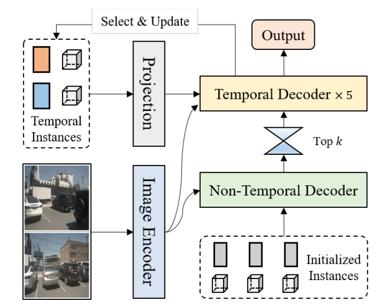
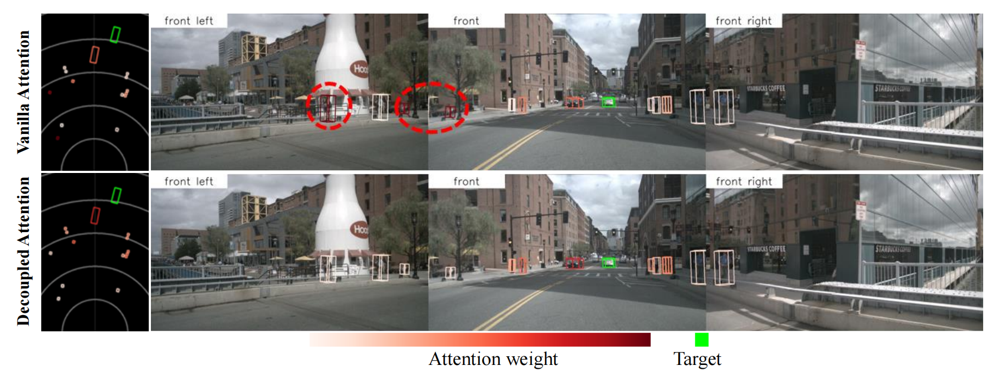
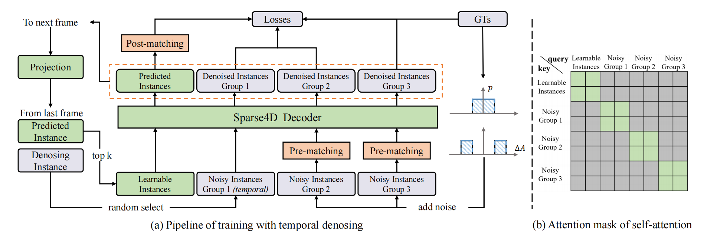
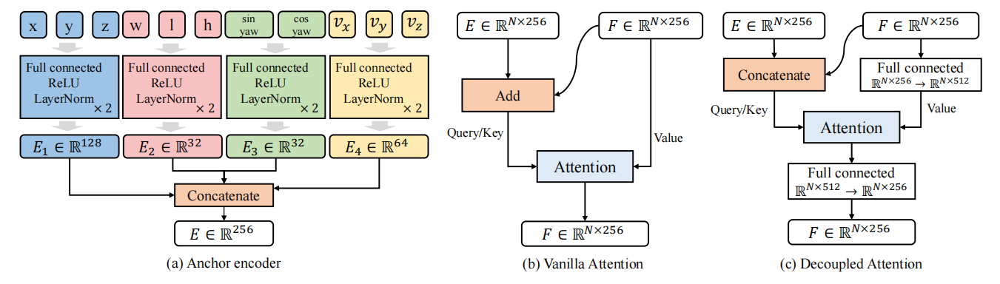

[Github：Sparse4Dv3](https://github.com/linxuewu/Sparse4D)

### 0. Abstract

在自动驾驶感知系统中，3D**检测**和**跟踪**是核心任务。这两个任务互相关联，准确的目标检测是实现稳定跟踪的基础。

- 文章基于Sparse4D框架进行了深入探讨，并提出了两个辅助训练任务：**时间实例去噪**（Temporal Instance Denoising）和**质量评估**（Quality Estimation）。研究还提出了一种解耦注意力机制，以实现结构上的改进，从而显著提升检测性能。

- 研究通过一种简单的方法将**检测器扩展为跟踪器**，在推理过程中为实例分配 ID，这进一步突出了基于查询的算法的优势。通过在 nuScenes 基准上进行的广泛实验，验证了所提改进的有效性。

使用 ResNet50 作为骨干网络，研究中获得了 mAP（平均精度）、NDS（导航检测分数）和 AMOTA（平均对象检测跟踪准确性）分别提升了 3.0%、2.2% 和 7.6%的成绩，最终在 nuScenes 测试集上，最佳模型取得了 71.9% 的NDS 和 67.7% 的 AMOTA。

### 1. Introduction

在**时序多视角感知**研究领域，与基于**密集BEV（鸟瞰视图）算法**相比，**稀疏算法**在感知性能上已接近，并具有几个优点：

1. **自由视图变换**：稀疏方法不需要将图像空间转换为 3D 向量空间。
2. **检测头的计算负载恒定**：计算负载与感知距离和图像分辨率无关。
3. **下游任务集成的实现更简单**：可以通过端到端的方式实现集成。

在研究中，选择 Sparse4Dv2 作为基线算法进行改进。算法的总体结构（如 Fig.1 所示）包括图像编码器将多视图图像转换为多尺度特征图，解码器块利用这些特征图来细化实例并生成感知结果。

研究发现，稀疏算法在**收敛性方面面临更大挑战**，这会影响最终性能。

- 主要是由于使用了一对一的正样本匹配，在训练初期不稳定，正样本数量有限，降低了解码器训练的效率
- Sparse4D 采用稀疏特征采样而非全局交叉注意力，进一步抑制了编码器的收敛

为解决这些问题，文章提出：

- 引入**辅助监督的去噪任务**来增强模型性能，确保正样本匹配的稳定性，并显著增加正样本数量
- 引入**质量评估任务**作为辅助监督，合理化输出置信度得分，从而提高检测结果的准确性
- 研究还增强了 Sparse4D 中的自注意力和时序交叉注意力模块，引入了**解耦注意力机制**，以减少在计算注意力权重时的特征干扰（如 Fig.2 所示）

其中：

- 第一行显示了原始的自我注意中的注意权重，其中红色圆圈中的行人显示了与目标车辆的意外相关性（绿框）
- 第二行显示了解耦注意中的注意权重，有效地解决了这个问题

最后，研究将 **3D 多目标跟踪任务**集成到 Sparse4D 框架中，实现对象运动轨迹的直接输出。与传统的基于检测的跟踪方法不同：

- 本文的方法**不需要数据关联和过滤**，所有跟踪功能集成到检测器中
- 同时也**不需要修改训练过程或损失函数**

本文的贡献总结如下：

1. 提出了 Sparse4D-v3，一个强大的 3D 感知框架，采用了三种有效策略：**时间实例去噪**、**质量评估**和**解耦注意力**。
2. 将 Sparse4D 扩展为端到端的跟踪模型。
3. 在 nuScenes 上验证了改进的有效性，在检测和跟踪任务中达到最新的性能水平。

### 2. Related Work

#### 2.1 端到端检测的改进

- **DETR**（检测转化器）利用Transformer架构及一对一匹配训练方法，消除了对非极大抑制（NMS）的需求，实现了端到端检测。此方法引发了一系列改进：
  - **Deformable DETR**：将全局注意力转变为基于参考点的局部注意力，缩小了模型的训练搜索空间，提高了收敛速度，并降低了注意力的计算复杂度
  - **Conditional-DETR**：引入条件交叉注意力，分离查询中的内容和空间信息，通过点积独立计算注意力权重，加速了模型收敛
  - **Anchor-DETR**：在 Conditional-DETR 的基础上，显式初始化参考点作为 anchor 
  - **DAB-DETR**：在 anchor 初始化和空间查询编码中加入边界框维度
  - **DN-DETR**：在解码器输入中加入带噪声的真实标签编码，通过去噪任务提供辅助监督
  - **DINO**：引入噪声负样本和混合查询选择，进一步提升 DETR 性能
  - **Group-DETR**：在训练过程中将查询复制为多个组，提供更多的训练样本
  - **Co-DETR**：在训练期间引入密集头，全面训练骨干网络并增强解码器的训练
  - **DETR3D**：将可变形注意力应用于多视角 3D 检测，实现端到端的空间特征融合
  - **PETR系列**：引入 3D 位置编码，利用全局注意力进行多视图特征融合和时间优化
  - **Sparse4D系列**：在实例特征解耦、多点特征采样和时间融合等方面增强 DETR3D，提升感知性能

#### 2.2 多目标跟踪

大多数多目标跟踪方法使用基于检测的跟踪框架，依赖检测器输出进行数据关联和轨迹过滤，导致 **复杂的 pipeline** 和 **众多超参数需要调整**。这些方法未能充分利用神经网络的能力。

- **GCNet**、**TransTrack** 和 **TrackFormer** 在 DETR 框架中直接集成跟踪功能，通过跟踪查询实现检测目标的跨帧转移，显著减少了对后处理的依赖
- **MOTR** 推进了跟踪的完全端到端过程，**MOTRv3** 解决了 MOTR 中检测查询训练的限制，显著提升了跟踪性能
- **MUTR3D** 将这种基于查询的跟踪框架应用于3D多目标跟踪。

这些端到端跟踪方法具有一些共同特征：
1. 训练期间基于跟踪目标约束匹配，确保跟踪查询的一致 ID 匹配，仅为检测查询匹配新目标。
2. 使用高阈值传递时间特征，仅将高置信度查询传递到下一帧。

与现有方法不同，本文的方法不需要修改检测器的训练或推理策略，也不需要提供跟踪 ID 的真实标签。

### 3. Methodology

用于 3D 多目标跟踪的深度学习模型 Sparse4Dv3 在 Sparse4Dv2 的基础上进行了扩展和改进。

#### 3.1 时序实例去噪（Temporal Instance Denoising）

在 2D 目标检测中，引入去噪任务可以提高模型的收敛稳定性和检测性能。本文将 2D 单帧去噪扩展到 3D 时序去噪。在Sparse4D模型中，实例（称为查询）被解耦为隐式实例特征和显式 anchor 。在训练过程中，初始化两组 anchor：

- 使用 k-means 方法初始化的，在检测空间中均匀分布的可学习参数
- 通过在真实标注（GT）上添加噪声生成的，这种噪声添加方式是为 3D 检测任务特别设计的

anchor 的生成方式如下：
$$
A_ {gt} = \{(x, y, z, w, l, h, \text{yaw}, v_ {xyz})_ i \,|\, i \in \mathbb{Z}_ N\} \tag{1}
$$

$$
A_ {\text{noise}} = \{A_ i + \Delta A_ {i,j,k} \,|\, i \in \mathbb{Z}_ N, j \in \mathbb{Z}_ M, k \in \mathbb{Z}_ 2\} \tag{2}
$$

其中：

$A_{gt}$：表示真实 anchor 集合（GT），其中每个 anchor 由以下几个参数组成：

- $(x, y, z)$：表示 anchor 在 3D 空间中的坐标位置
- $(w, l, h)$：分别表示 anchor 的宽度、长度和高度，用于描述目标的尺寸
- $\text{yaw}$：表示 anchor 的偏航角，通常用于表示目标的朝向
- $v_{xyz}$：表示目标在 3D 空间中的速度向量，包含三个维度的速度信息
- $i \in \mathbb{Z}_N$：表示 anchor 的索引，$N$ 是 anchor 的总数。这个集合包含了所有真实目标的 anchor 信息

$A_{\text{noise}}$：表示带噪声的 anchor 集合，用于模拟真实世界中的不确定性和误差:

- $A_i$：表示第 $i$ 个真实 anchor （来自 $A_ {gt}$）。

- $\Delta A_{i,j,k}$：表示添加到真实 anchor 上的随机噪声。这个噪声是通过以下方式生成的：

  - $j \in \mathbb{Z}_M$：表示噪声组的索引，$M$ 是噪声实例的组数。
- $\Delta A_{i,j,1}$：均匀随机分布在 $(-x, x)$ 范围内（距离GT较近，会作为正样本）
  - $\Delta A_{i,j,2}$：均匀随机分布在 $(-2x, -x) \cup (x, 2x)$ 范围内（距离GT较远，会作为负样本）

通过对每个真实 anchor 添加随机噪声，从而 **增加训练样本的多样性**。这一方法有助于模型在训练过程中提高鲁棒性，适应不同的检测场景和条件。

但是 DINO-DETR 将 $\Delta A_{i,j,1}$ 当成正样本，而将 $\Delta A_{i,j,2}$ 当成负样本，存在误分配的潜在风险，因为 $\Delta A_{i,j,2}$ 可能更接近GT box。为了完全消除歧义，我们对每组 $A_{\text{noise}}$ 和 $A_{\text{gt}}$ 使用二分图匹配来确定正样本和负样本。

此外，通过时序传递对上述单帧噪声实例进行扩展，以更好地与稀疏传递训练过程相匹配：

- 在每一帧的训练过程中，从噪声实例中随机选择 $M'$ 组投影到下一帧上。
- 时序传递策略与非噪声实例的传递策略一致（anchor 进行自我姿态和速度补偿），而实例特征作为后续帧特征的直接初始化。

在处理带噪声的 anchor 和正常 anchor 时，确保不同实例组之间的互相独立性，并避免它们之间的特征交互（如 Fig.3 (B)）。这种方法确保在每个组中，GT box 最多与一个正样本匹配，有效地避免了任何潜在的歧义。

#### 3.2 质量评估（Quality Estimation）

现有的基于稀疏表示的方法主要估计正负样本的分类置信度，以衡量与 GT box 的对齐程度。但是，不同正样本之间的匹配质量存在显著差异。因此，分类置信度不是评估预测边界框质量的理想指标。为了帮助网络理解正样本的质量，本文引入了预测质量估计任务，一方面能够加速收敛，另一方面能够使预测排序更合理 。对于3D检测任务，定义了两个质量度量：中心性（centerness）和偏航角（yawness）。

- **中心性**：
  $$
  C = \exp\left(-\|[x, y, z]_ {\text{pred}} - [x, y, z]_ {\text{gt}}\|^2\right)
  $$

  - **解释**：计算预测边界框中心与真实边界框中心之间的欧几里得距离的平方，并通过指数函数将其转换为中心性的度量。距离越小，中心性越高，表示预测越接近真实值。

- **偏航角**：
  $$
  Y = [\sin \text{yaw}, \cos \text{yaw}]_ {\text{pred}} \cdot [\sin \text{yaw}, \cos \text{yaw}]_ {\text{gt}}
  $$

  - **解释**：此公式使用预测和真实边界框的偏航角（yaw）来计算二者的余弦相似度，反映了方向上的匹配程度。

**损失函数的定义**：

- **损失函数**：
  $$
  L = \lambda_1 \text{CE}(Y_{\text{pred}}, Y) + \lambda_2 \text{Focal}(C_{\text{pred}}, C)
  $$

  - 解释：该损失函数结合了中心性和偏航角的损失。
    - **CE**：交叉熵损失，用于评估偏航角预测的准确性。
    - **Focal Loss**：聚焦损失，用于增强分类置信度的学习，强调难以分类的样本。

网络输出分类置信度的同时，还估计中心度和偏航度。它们的损失函数分别定义为交叉熵损失和焦点损失。

#### 3.3 解耦注意力（Decoupled Attention）

对 Sparse4Dv2 中的 anchor 编码器、自注意力和时序交叉注意力进行了简单的改进。

- 设计原则是将不同模态的特征以 **Concatenate 的方式组合**，而不是使用 Add 方法 (能够保留更多信息)

- 与 Conditional DETR 相比，改进了 **查询之间的注意力**，而不是查询和图像特征之间的交叉注意力
- 交叉注意力仍然使用 Sparse4D 中的可变形聚合
- 在 **多头注意力级别** 而不是单头注意力级别外部 **进行位置嵌入和查询特征的串联**

#### 3.4 扩展到跟踪（Extend to Tracking）

##### 3.4.1 Sparse4Dv2中的时序建模

Sparse4Dv2 框架中的时序建模采用了循环（recurrent）形式，这意味着它会将前一帧中的实例（instances）投影到当前帧作为输入。这些时序实例与基于查询的跟踪器中的跟踪查询（tracking queries）类似，但有所不同：

- 跟踪查询受到较高阈值的约束，代表高度自信的检测结果
- 而 Sparse4Dv2 中的时序实例数量更多，且大多数可能无法准确表示前一帧中检测到的对象

##### 3.4.2 从检测到跟踪的扩展

在 Sparse4Dv2 框架内，通过以下方式直接将检测边界框（detection bounding box）的实例重新定义为轨迹（trajectory）来扩展到多目标跟踪：

- 轨迹包括一个 ID 和每个帧的边界框
- 由于设置了大量的冗余实例，许多实例可能无法与精确的目标关联，因此不会被分配一个确定的 ID（尽管如此，这些实例仍然可以被传递到下一帧）

##### 3.4.3 实例的锁定和ID分配

一旦某个实例的检测置信度超过阈值 $T$，它就被认为是锁定在目标上，并被分配一个 ID。这个 ID 在时序传递过程中保持不变。因此，实现多目标跟踪就像对输出感知结果应用 ID 分配过程一样简单。

##### 3.4.4 跟踪过程中的生命周期管理

在 Sparse4Dv2 中，跟踪过程中的生命周期管理由 top-k 策略无缝处理，无需额外修改。在实验中，观察到训练的时序模型在没有针对跟踪约束进行微调的情况下，就展现出了卓越的跟踪效果。

>Algorithm 1: Tracking Pipeline of Sparse4Dv3
>
>**Input**:
>
>1. **Sensor Data** $D$
>2. **Temporal Instances** $I_t = $ &lbrace; $(c, a, id)_ i | i \in \mathbb{Z}_ {N_ t}$ &rbrace;
>3. **Current Instances** $I_{cur} = $ &lbrace; $a_i | i \in \mathbb{Z}_ {N_ {cur}}$ &rbrace; 
>   - The terms $c$, $a$, and $id$ correspond to confidence, anchor box, and object ID, respectively, where the $id$ may be empty. 
>
>**Output**:
>
>- **Perception Results** $R = $  &lbrace; $(c, a, id)_ i | i \in \mathbb{Z}_ {N_ r}$ &rbrace;
>
>- **Updated Temporal Instances** $I'_ t = $ &lbrace; $(c, a, id)_ i | i \in \mathbb{Z}_ {N_  t}$ &rbrace;
>
>
>
>>1.  Define the confidence threshold $T$.
>>2.  Define the confidence decay scale $S$.
>>3.  Initialize $R = $  &lbrace;  &rbrace;. (包括置信度、anchor 和对象 ID)
>>4.  Forward the model $R_{det} = Model(D, I_t, I_{cur}) = $ &lbrace; $(c', a')_ i | i \in \mathbb{Z}_ {N_ t + N_ {cur}}$ &rbrace;.
>>5.  For $i$ from $1$ to $N_t + N_{cur}$ do
>>6.  — — If $c'_i \geq T$ then (置信度大于 $T$)
>>7.  — — — — If $i > N_t$ or $id_i$ is empty then (当前帧产生了新的目标)
>>8.  — — — — — — Generate the new $id_i$. (加入新 $id$ )
>>9.  — — — — Put $(c'_i, a'_i, id_i)$ into $R$. (保存当前帧结果)
>>10.  — — If $i \leq N_t$ then
>>11.  — — — — Update $c'_i = \max(c'_i, c_i \times S)$. (根据置信度衰减比例 $S$ 更新置信度)
>>12. Select the top $N_t$ instances with the highest confidence $c'$ from $R_{det}$ to serve as $I'_t$.
>>13. Return $R$ and $I'_t$.

### 4. Experiment

Sparse4Dv3 框架通过一系列实验验证了其在 3D 目标检测和多目标跟踪中的有效性。研究团队使用 nuScenes 数据集进行基准测试，划分为**700个训练**、**150个验证** 和 **150个测试场景**，评估多个指标如 mAP 和 NDS。

实验结果表明，Sparse4Dv3 在不同主干网络下均实现了性能提升，其中 mAP 和 NDS 在使用 ResNet101 时分别提高了 **3.2%** 和 **2.9%** 。

消融实验显示，去噪和质量估计（如 centerness 和 yawness ）的引入显著改善了模型性能，尤其是在降低距离误差和提高检测结果排名准确性方面。

此外，云计算能力的利用使得模型在处理未来帧特征时进一步提升性能，实现了 mAP 的显著增长。

整体而言，Sparse4Dv3 展示了在自动驾驶领域中结合先进技术和强大计算能力的潜力，为未来的视觉感知任务奠定了坚实基础。

### 5. Conclusion and Outlook

本文首先介绍了几种方法来增强 Sparse4D 的检测性能。这些增强主要集中在三个方面：时间实例去噪（Temporal Instance Denoising）、质量估计（Quality Estimation）和解耦注意力机制（Decoupled Attention）。

接着，文章展示了如何将 Sparse4D 扩展为一个端到端的跟踪模型。通过实验表明，这些改进在 nuScenes 数据集上显著提高了性能，使得 Sparse4Dv3 处于该领域的前沿位置。

基于 Sparse4D 框架，还有很大的研究潜力。具体包括以下几个方面：
1. **跟踪性能的进一步提升**：当前的跟踪尝试是初步的，有很大的空间可以进一步提高跟踪性能
2. **扩展到仅激光雷达或多模态模型**：将 Sparse4D 扩展为仅使用激光雷达或结合多种传感器的多模态模型是一个有前景的研究方向
3. **引入更多下游任务**：在端到端跟踪的基础上，可以通过引入预测和规划等额外的下游任务来进一步推进研究
4. **集成其他感知任务**：例如在线地图构建、二维标志和交通信号灯检测等其他感知任务的集成也是值得探索的方向

