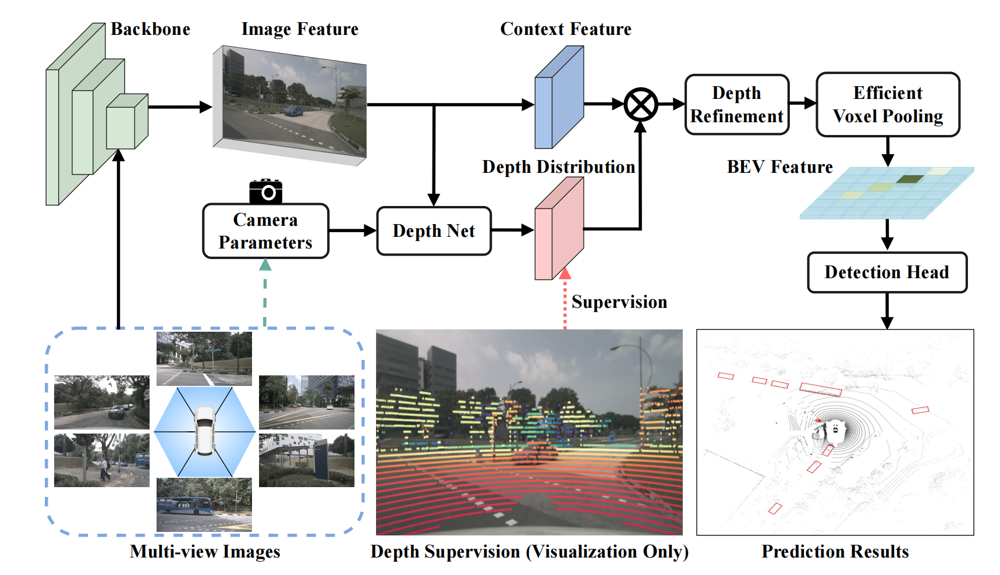
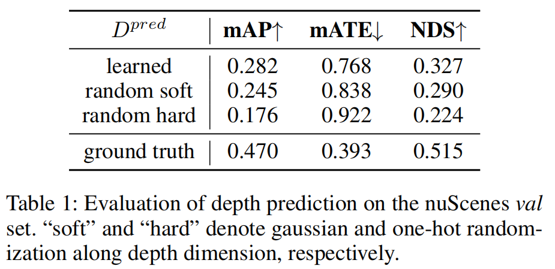
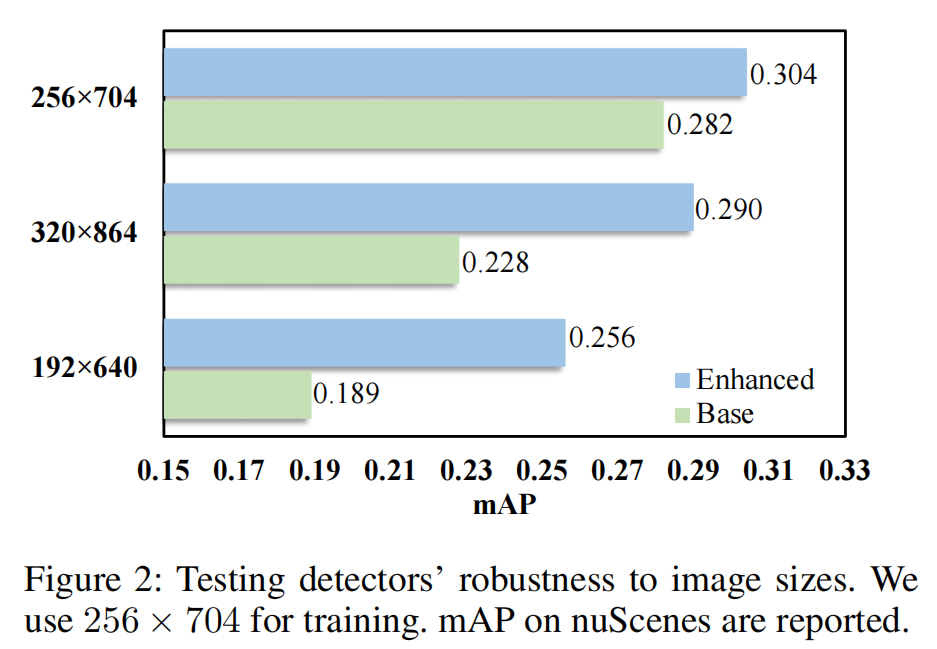
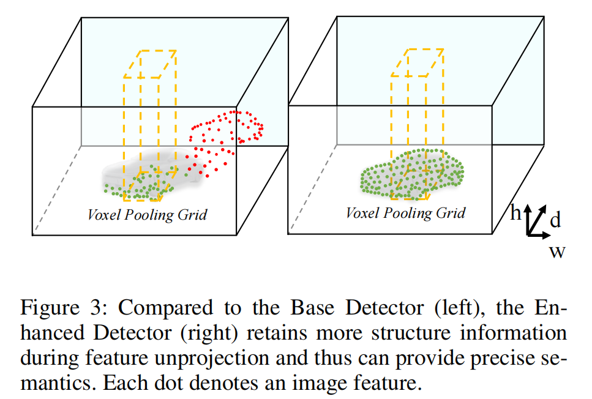

#### 摘要

1. BEVDepth，一种新的多视图3D检测器，它利用来自点云的深度监督来指导深度学习。
2. 创新地提出将相机的内在和外在特征编码到一个深度学习模块中，使检测器对各种相机设置具有鲁棒性。
3. 引入深度细化模块对学习深度进行细化。

#### 相关工作

1. **基于视觉的3D目标检测**
   - 直接从2D图像特征预测3D边界框
     - CenterNet (2019)可以用于3D检测，只需对检测头进行微小的更改。
     - M3D-RPN (2019)提出了深度感知卷积层来增强空间感知。
     - D4LCN (2020)采用深度图来指导动态核学习。
     - FCOS3D (2021)通过将3D目标转换为图像域，预测物体的2D和3D属性。
     - PGD (2022)提出了几何关系图，便于三维目标检测的深度估计。
     - DD3D (2021)证明深度预训练可以显著提高端到端3D检测。
   - 预测3D空间中的物体（将二维图像特征转换为三维空间）
     - LSS (2020)提出了一种视图变换方法，预测深度分布并将图像特征投影到鸟瞰视图(BEV)上。
     - BEVFormer (2022)通过局部关注和网格状BEV查询执行2D-to-3D转换。
     - DETR3D (2022)通过变形器和对象查询检测3D对象。
     - PETR (2022)通过引入3D位置感知表示进一步提高了性能。
2. **基于激光雷达的3D目标检测**
   - VoxelNet (2018)将点云体素化，将其从稀疏体素转换为密集体素，然后在密集空间中提出边界框，以帮助卷积期间的索引。
   - SECOND (2018)通过引入基于VoxelNet的更有效的结构和采样技术，提高了在KITTI数据集上的性能。稀疏卷积也用于SECOND以提高速度。
   - PointPillars (2019)使用柱子而不是3D卷积过程对点云进行编码，使其快速但保持良好的性能。
   - CenterPoint (2021)提出了一种无锚点检测器，将CenterNet (2019)扩展到3D空间，并在nuScenes数据集和Waymo开放数据集上实现高性能。
   - PointRCNN (2019)与上面讨论的基于网格的方法不同，它直接从点云创建建议。然后使用激光雷达分割来识别提议的前景点，并在第二阶段产生边界框。使用霍夫投票来收集点特征，然后从聚类中提出边界框。
   - PV-RCNN (2020)在保持效率的同时允许点特征的可调节接受域。

#### 问题背景

1. 当检测器在没有深度损失的情况下进行训练时（就像 Lift-splat 一样），它仅通过学习部分深度来检测物体。用一个随机初始化张量替换Lift-splat的 $D^{pred}$ ，并在训练和测试阶段冻结它。结果表示，在用随机软值代替 $D^{pred}$ 后，mAP只下降了3.7%。进一步将软随机深度替换为硬随机深度(每个位置一次热激活)，mAP下降了6.9%。这说明，只要在正确位置的深度被激活，检测头就可以工作。

2. Lift-splat检测器仅学习预测部分区域的深度。大多数像素都没有经过训练来预测合理的深度，可能导致其对图像大小、相机参数等超参数非常敏感，缺乏泛化能力。使用输入大小 256×704 训练Lift-splat检测器和改进的检测器，然后使用192×640、256×704和320×864尺寸进行测试。

3. 在没有深度监督的情况下，图像特征无法正确投影。因此，池化操作仅聚合部分语义信息。增强型检测器在这种情况下表现更好。

#### 方法分析

##### 1. 显示深度监督

Lift-splat中深度模块的唯一监督来自于检测损失，但是单独的检测损失远远不足以监督深度模块。因此，可以从点云数据中导出的真实 $D_{gt}$ 来监督中间深度预测 $D^{pred}$。通过从点云数据 $P$ 中提取真实深度信息 $D_{gt}$，并将其投影到相机视图以生成2.5D图像坐标。具体步骤如下：

- **坐标转换**： 使用旋转矩阵 $R_i \in \mathbb{R}^{3 \times 3}$ 和平移向量 $t_i \in \mathbb{R}^{3}$ 将LiDAR点云从LiDAR坐标系转换到第 $i$ 个相机坐标系： 

$$
P_{\text{cam}, i} = R_i \cdot P + t_i
$$

- **投影到图像平面**： 使用相机的内参矩阵 $K_i \in \mathbb{R}^{3 \times 3}$ 将三维点投影到二维图像平面，同时保留深度信息，得到2.5D图像坐标 $P_{\text{img}, i}(u, v, d)$，其中 $u$ 和 $v$ 表示像素坐标，$d$ 表示深度： 

$$
\begin{pmatrix} u \\ v \\ 1 \end{pmatrix} = K_i \cdot P_{\text{cam}, i}
$$

- **处理投影结果**： 如果某个点云的2.5D投影没有落入第 $i$ 个视图，就直接丢弃它。然后，在 $P_{\text{img}, i}$ 上应用最小池化和单热化操作，以确保投影点云和预测深度之间的形状对齐。这些操作定义为 $\phi$：

$$
D_{gt} = \phi(P_{\text{img}, i})
$$

- **深度监督**： 最后，使用二元交叉熵损失函数 $L_{\text{depth}}$ 来监督模型的中间深度预测 $D_{pred}$： 

$$
L_{\text{depth}} = \text{Binary Cross-Entropy}(D_{gt}, D_{pred})
$$

##### 2. 相机感知深度预测

经典视觉模型中估计深度与相机内参相关，而相机可能具有不同的 FOV（Field of View）。因此，可以将相机内参作为 DepthNet 的输入之一。具体步骤如下：

- **相机内参的引入**： 深度估计与相机内参有关，特别是在视场（FOV）不同的多视角数据集中。为此，将相机内参作为DepthNet的输入之一。

- **内参特征化**：首先，将相机内参通过MLP扩展到特征空间的维度。

- **重权重图像特征**：使用Squeeze-and-Excitation（SE）模块对图像特征 $F_{2d}^{i}$ 进行重新加权，自适应地调整特征的权重，增强相关特征和抑制无关特征。

- **拼接相机外参**：将相机的外参（包括旋转矩阵 $R_i$ 和平移向量 $t_i$）与内参拼接，帮助DepthNet感知图像特征 $F_{2d}^{i}$ 在自车坐标系中的空间位置。

- **整体架构**：原始的DepthNet记为 $\psi$，总体的相机感知深度预测可以表示为： 

$$
D_{pred}^{i} = \psi(SE(F_{2d}^{i} \mid MLP(\xi(R_i) \oplus \xi(t_i) \oplus \xi(K_i))))
$$

其中，$\xi$ 表示扁平化操作， $\oplus$ 表示拼接操作。

##### 3. 深度细化模块

新设计的深度优化模块（Depth Refinement Module），为了进一步增强深度预测的质量。具体步骤如下：

- **特征重新调整**：首先，将特征张量 $F_{3d}$ 从形状 $[C_F, C_D, H, W]$ 重新调整为 $[C_F \times H, C_D, W]$。这里，$C_F$ 是特征通道数，$C_D$ 是深度维度，$H$ 和 $W$ 是图像的高度和宽度。

- **卷积处理**：在调整后的特征平面 $C_D \times W$ 上堆叠多个 $3 \times 3$ 卷积层进行处理。

- **输出重塑**：卷积层的输出再次调整回原来的形状，然后输入到后续的体素/柱体池化（Voxel/Pillar Pooling）操作中。
