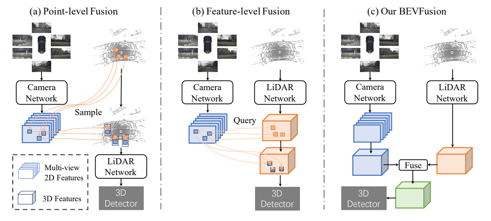
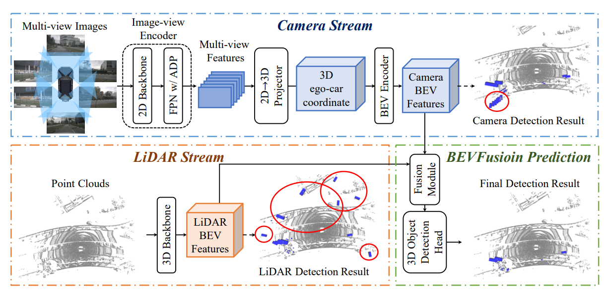
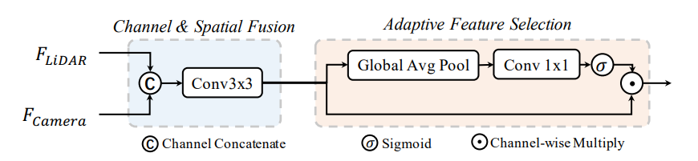

### 问题背景

1. **激光雷达输入的依赖性**：当前的LiDAR-Camera融合方法本质上依赖于LiDAR传感器的原始点云。如果缺少LiDAR传感器输入，现有的融合方法无法产生有意义的结果。
2. **激光雷达和相机模态分解为两个独立的流**：理想框架应该能够在单一模态存在时独立工作，而不会因为缺少另一模态而失败。同时，融合多种模态应进一步提高感知精度

### 方法分析

#### 1. 图像点云融合方法对比

- **Point-level Fusion**：主要依赖于点云数据进行融合
- **Feature-level Fusion**：主要依赖于点云特征进行融合
- **BEVFusion**：均衡地依赖于点云和图像，利用两种模态的信息进行融合

在BEVFusion框架中，有三个主要模块：Camera模块、LiDAR模块和Fusion模块。

#### 2. Camera模块

- **输入**：多视角图像

- **2D Backbone提取特征**

  - **输入**：图像特征
  - **处理**：
    - 使用Dual-Swin-Tiny作为backbone，替代传统的卷积神经网络ResNet。
    - 特征金字塔网络（FPN）和自适应特征模块（ADP）进行多尺度融合
  - **输出**：多尺度融合特征

- **2D到3D转换**

  - **输入**：backbone输出的多尺度融合特征
  - **处理**：
    - 使用Lift-Splat-Shoot方法中的2D到3D视图投影，预测深度分布
    - 通过矩阵运算将每个像素映射到3D空间，生成伪体素特征
  - **输出**：3D伪体素特征（按定义的深度划分体素）

- **3D到BEV转换**
  - **输入**：3D伪体素特征

  - **处理**：

    - 通过Spatial to Channel (S2C)操作压缩伪体素张量

    - 使用稀疏3D卷积网络高效地产生BEV空间特征

  - **输出**：BEV空间特征

- **输出**：图像BEV特征

#### 3. LiDAR模块

- **输入**：原始点云

- **3D Backbone提取特征**

  - **输入**：点云特征

  - **处理**：
    - 使用参数化体素化方法处理原始点云，减少Z维度
    - 使用三种流行的方法PointPillars、CenterPoint和TransFusion进行特征提取
    - 压缩到BEV空间
  - **输出**：LiDAR BEV特征

- **输出**：点云BEV特征

#### 4. Fusion模块

- **输入**：点云和图像的BEV特征
- **处理**：
  - 在通道维度级联点云和图像BEV特征，通过卷积网络提取级联后的特征
  - 使用全局平均池化和卷积预测，对级联特征进行自适应选择
- **输出**：融合特征

### 结论

BEVFusion框架通过将相机和LiDAR数据独立处理并融合，克服了传统融合方法对LiDAR的依赖性，显著提高了在实际应用中的鲁棒性和准确性。通过利用不同模态的数据，框架实现了高效的3D目标检测，并在缺少某一模态时仍能保持稳定的性能。
