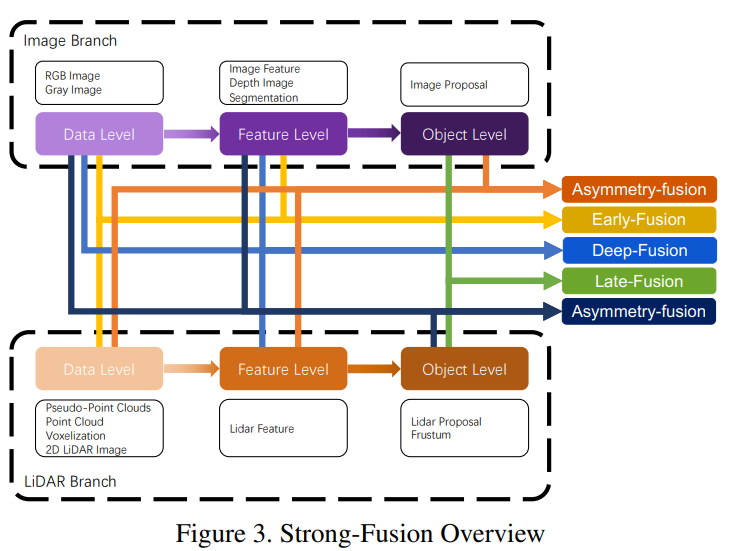
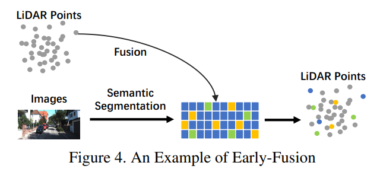
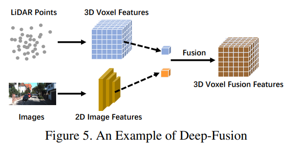
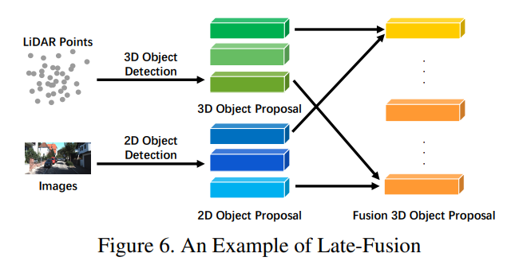

### 1. 为什么要做融合（单模态的缺陷）

单模态（单一传感器类型）的感知系统在复杂环境中容易受到局限。以下是一些主要缺陷：

- **环境敏感性**：
  - **摄像头**：在光线条件不佳的情况下，如夜晚、强逆光或雾霾天气，摄像头的性能会显著下降，导致图像质量变差，目标物体难以识别。
  - **激光雷达（LiDAR）**：虽然LiDAR在多种环境光照下都能提供稳定的三维数据，但在雨雪等恶劣天气中，LiDAR的激光束会被散射或吸收，影响点云的质量和密度。积水或积雪地面也会导致LiDAR数据的反射失真。
- **数据稀疏性**：
  - **LiDAR**：LiDAR点云数据本质上是稀疏的，尤其是距离传感器较远的地方，点云密度显著下降。LiDAR通常只能生成有限数量的扫描线（通常是16线、32线或64线），这使得点云数据在某些区域可能不连续或缺失。
  - **摄像头**：尽管摄像头可以生成高分辨率的二维图像，但在某些情况下，如低对比度或纹理缺失的表面上，图像信息也可能不完整或不清晰。
- **信息维度限制**：
  - **摄像头**：摄像头捕捉的图像是二维的，无法直接提供物体的距离和深度信息。要从二维图像中提取三维信息，通常需要复杂的计算和假设，如立体视觉或单目深度估计，这些方法往往依赖于场景中的纹理和几何特征，精度可能受限。
  - **LiDAR**：LiDAR提供的点云数据是三维的，能够精确测量物体的距离和形状。但是，LiDAR点云缺乏丰富的颜色和纹理信息，难以区分具有相似形状但不同颜色的物体，也难以识别道路标志、交通信号灯等需要颜色信息的目标。

融合技术通过整合来自不同传感器的数据，弥补了单模态的缺陷。具体优势包括：

- **综合环境信息**：融合摄像头和LiDAR数据，可以在各种环境条件下提供更加稳定和准确的感知能力。例如，LiDAR可以在夜间或强光条件下提供可靠的三维结构信息，而摄像头可以在白天提供丰富的颜色和纹理信息。
- **密集且连续的数据**：通过融合，可以在点云数据中添加图像的密集信息，使得最终的数据既包含三维的几何结构，又有丰富的纹理和颜色信息。这种融合可以有效地填补LiDAR点云的稀疏性和不连续性问题。
- **多维信息利用**：融合后的数据既包含二维图像的细节信息，也有三维点云的空间信息，能够更全面地描述环境中的物体和场景。这样，感知系统可以更准确地进行物体检测、分类和跟踪，提高整体系统的性能和可靠性。

### 2. 融合有哪些方式

在感知系统中，数据融合可以分为前融合（数据级融合）、深度融合（特征级融合）、后融合（决策级融合）和不对称融合。以下是每种融合方式的详细介绍：

#### 前融合（数据级融合）

前融合指的是在数据层面上进行融合，直接将不同传感器的原始数据整合在一起。这种方法通过将不同类型的传感器数据进行预处理和对齐，从而在早期阶段就融合信息。

前融合主要分为图像到点云数据的融合和点云数据到图像的融合：

- **图像 -> 点云**：在这种方式中，摄像头捕获的2D图像数据被投影到LiDAR点云的3D空间中，使每个点云点都具有颜色和纹理信息。这个过程通常涉及对摄像头和LiDAR进行外部校准，使它们的坐标系对齐。通过这种方式，点云不仅包含空间信息，还具有丰富的语义信息。

- **点云 -> 图像**：这种方式将LiDAR点云的数据投影到摄像头图像上，使图像中的每个像素都具有深度信息。这一过程通常涉及将3D点云投影到2D图像平面上，并结合像素位置与深度值。这对于理解场景的几何结构非常有帮助，例如在自动驾驶中，可以更准确地检测障碍物和行人。

#### 深度融合（特征级融合）

深度融合是在特征层面进行融合，即通过深度学习模型提取来自不同传感器的数据特征，然后在特征空间中进行融合。这种方法通常依赖于神经网络来进行特征提取和融合。

- **特征提取与融合**：在这种方法中，首先分别从图像和点云数据中提取特征。例如，可以使用卷积神经网络（CNN）从图像中提取特征，使用PointNet或其他点卷积网络从点云中提取特征。然后，这些特征在中间层进行融合。通过在特征层面进行融合，可以充分利用不同传感器的数据特点，实现更丰富的表示和更高的感知准确性。

- **融合方式**：深度融合的具体实现可以有多种方式，例如简单的特征拼接、特征加权平均或使用更复杂的融合模块（如注意力机制）来动态调整不同特征的重要性。通过这些方法，融合后的特征可以捕捉到更多的语义信息和空间关系。

#### 后融合（决策级融合）

后融合是在决策层面进行融合，即对来自不同传感器的数据分别进行处理，得到各自的感知结果，然后将这些结果进行融合。

- **结果整合**：在这种方法中，不同传感器的数据通过各自的处理，得到独立的感知结果（如物体检测、分类或跟踪结果）。然后，通过某种规则（如置信度、时空一致性或优先级）将这些结果进行整合。后融合可以利用不同传感器的独立判断，从而提高整体决策的可靠性和鲁棒性。

- **融合策略**：常见的后融合策略包括投票机制、置信度加权、基于规则的整合以及基于机器学习的方法（如融合网络）。这些策略可以根据具体应用需求进行选择，以最大化融合效果。

#### 不对称融合

不对称融合是指不同传感器的数据在不同阶段或不同层级进行融合，利用每个传感器的独特优势。

- **层级不对称融合**：在这种方法中，可以在低层级使用一种传感器的数据进行预处理和粗略感知，在高层级使用另一种传感器的数据进行细节处理和精细感知。例如，可以先用LiDAR点云进行粗略物体检测，然后用摄像头图像进行精细分类和定位。
- **阶段不对称融合**：这种方法在不同处理阶段利用不同传感器的数据。例如，首先利用LiDAR点云数据进行初步检测和跟踪，然后在后处理阶段结合摄像头图像数据进行更详细的分析和验证。

### 3. 融合BEV感知算法

- **前融合在BEV中的应用**：通过将图像和点云数据投影到共同的BEV坐标系中，生成包含多模态信息的全局视图。
- **深度融合在BEV中的应用**：在深度学习模型中，从图像和点云数据中分别提取特征，并在中间层进行融合。
- **后融合在BEV中的应用**：对图像和点云数据分别进行处理，得到各自的BEV感知结果，然后将这些结果进行融合。
- **不对称融合在BEV中的应用**：在不同阶段或层级上利用不同传感器的数据，充分发挥各自的优势。

### 参考文献

[1] [Multi-modal Sensor Fusion for Auto Driving Perception: A Survey](https://arxiv.org/abs/1910.12832)

