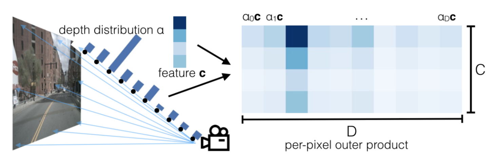
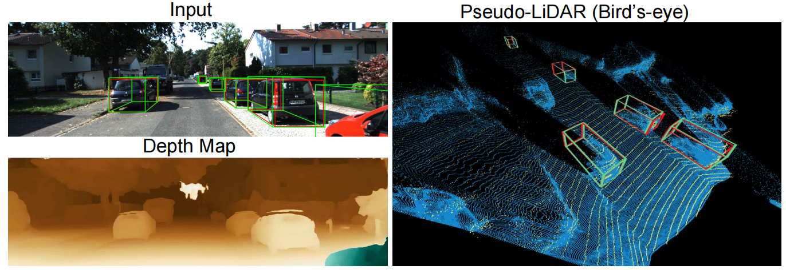

### 2D到3D转换

#### 1. 图像生成鸟瞰图（BEV，Bird's Eye View）的过程

在生成BEV时，我们需要经历两个主要步骤：

1. **从2D到3D空间的转换**
2. **从3D空间到BEV的转换**

这两个步骤确保我们能够从原始的2D图像生成精确的三维BEV。

#### 2. 为什么需要将2D图像转换成3D空间？

**场景的几何结构**

1. **深度信息获取**：
   - 2D图像仅包含平面信息，无法直接提供物体的距离或深度信息。
   - 转换到3D空间可以通过深度估计获取物体与相机之间的距离，从而了解场景的立体结构。
2. **空间位置确定**：
   - 在2D图像中，相同大小的物体在不同位置看起来大小不同，而3D转换可以精确确定每个物体在空间中的实际位置和尺寸。

**消除视角变形**

1. **视角统一**：
   - 2D图像是从特定视角（相机位置）拍摄的，存在视角变形问题。
   - 通过3D重建，可以将不同视角的图像统一到一个标准的鸟瞰视角，从而消除变形。
2. **遮挡问题处理**：
   - 2D图像中，前景物体可能遮挡背景物体，导致信息丢失。
   - 在3D空间中，可以处理遮挡关系，更全面地重建场景。

**生成精确的鸟瞰图（BEV）**

1. **精确的平面投影**：
   - 将3D空间中的信息投影到鸟瞰图平面，能够准确表示物体的位置和形状。
   - 可以避免因相机角度导致的投影误差，生成真实的鸟瞰视图。
2. **融合多视角信息**：
   - 可以将来自不同相机或不同时间点的图像信息融合在一起，生成更加全面和详细的鸟瞰图。
   - 3D空间提供了一个统一的融合框架，使得信息融合更加自然和准确。

#### 3. 从2D到3D的转换

在将2D图像转换到3D空间时，深度信息是至关重要的。深度信息决定了每个像素在三维空间中的位置，从而影响最终的3D重建效果。

**深度值在2D到3D转换中的作用**：

- 深度值用于确定图像中每个像素点的三维坐标。
- 精确的深度估计有助于提高3D重建的准确性。

#### 4. 深度分布的两种方式

在实际操作中，深度分布可以采用两种方式：

1. **离散深度分布**：（LSS方案）

   

   - 在这种方法中，深度值被离散化为多个固定的层或区间。
   - 每个像素的深度值被分配到最近的离散深度层。
   - **优点**：实现较为简单，计算效率较高。
   - **缺点**：深度分辨率受限，可能导致深度信息的丢失。

2. **连续深度分布（伪点云）**：（Pseudo Lidar）

   

   - 在这种方法中，深度值是连续的，并且可以为每个像素精确地估计深度。
   - 生成的伪点云包含了更细致的深度信息。
   - **优点**：高深度分辨率，能够生成更精确的3D重建。
   - **缺点**：计算复杂度较高，可能需要更多的计算资源。

将2D图像转换为3D空间表示，并通过进一步的转换生成BEV，是为了更全面和准确地理解和表示场景。这一过程涉及到深度估计、3D重建和投影变换等多个步骤。选择合适的深度分布方式（离散或连续）对于生成高质量的3D表示和BEV至关重要，每种方式都有其优缺点，需要根据具体应用场景和计算资源来选择。通过这一过程，可以有效地处理视角变形、遮挡问题，并提高场景理解的准确性。
