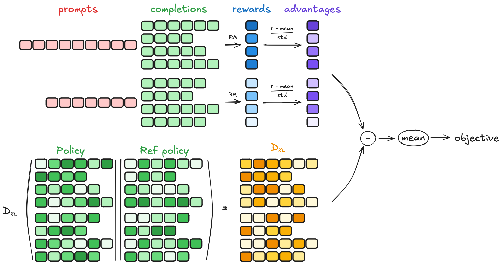

# GRPO

## 核心流程概述



1. **打成 batch 数据，右对齐+padding**

   - 将训练数据（prompt + label）按 batch_size 分组，每组包含多条序列（seq）。
   - 每条序列右对齐（即让结尾对齐），并在前面填充 `<pad>` token，使得所有序列长度一致，方便并行处理。
   - `padding_token` 一般选取模型词表中的专用 pad id。

2. **Reference Model 生成 n 个回答**

   - 对 batch 中每条序列，使用 Reference Model（可以是预训练模型或对齐后参考模型）进行解码。

   - 每个输入生成 **n 个回答**，例如通过 beam search 或 top-k sampling 采样多样性结果。

   - 得到的回答为：
     $$
     \{ y_{i,1}, y_{i,2}, \ldots, y_{i,n} \} \quad \forall i \in [1, \text{batch\\_size}]
     $$

3. **拼接原始输入和回答，送入 Reward Model 打分**

   - 对于每条输入和对应的 n 个回答，拼接形成完整序列（prompt + generated answer），并输入 Reward Model 进行评分。
   - Reward Model 给出每个拼接后的完整序列的打分 $r_{i,j}$。

4. **计算 KL 散度（正则化项）**

   - 对生成的回答，计算 Reference Model 的概率分布 $P_{\text{ref}}(y|x)$ 和当前训练模型 $P_{\theta}(y|x)$ 的 KL 散度：
     $$
     \text{KL}( P_{\theta} \| P_{\text{ref}} ) = \sum_{y} P_{\theta}(y|x) \log \frac{P_{\theta}(y|x)}{P_{\text{ref}}(y|x)}
     $$

   - 这个 KL 正则化项用于约束训练模型不要偏离参考模型太远，保持训练稳定性。

5. **计算优势（Advantage）或偏好得分**

- 根据 Reward Model 的得分 $r_{i,j}$，可以计算每个样本的相对优势（类似 PPO 中的 advantage）。例如：
  $$
  A_{i,j} = r_{i,j} - \text{baseline}(x_i)
  $$
  baseline 可以是对应 prompt 的平均 reward 或参考模型的预估 reward。

6. **构造优化目标（GRPO 损失函数）**

- 目标是最大化奖励，同时使用 KL 散度约束模型更新：
  $$
  L_{\text{GRPO}} = \mathbb{E}_ {x,y \sim P_{\theta}} \left[ A(x,y) \log P_{\theta}(y|x) \right] - \beta \cdot \text{KL}( P_{\theta}(y|x) \| P_{\text{ref}}(y|x) )
  $$
  其中，$\beta$ 控制 KL 正则项权重。

7. **反向传播和参数更新**

- 对上述损失进行反向传播，更新训练模型 $P_{\theta}$ 的参数。

8. **重复训练循环**

- 不断重复上述步骤，直至收敛。可以采用多 GPU 并行、混合精度加速。


## 伪代码示意

```python
for batch in dataloader:
    batch_input = pad_and_align(batch)  # 步骤1
    n_responses = [generate_n_answers(reference_model, x, n) for x in batch_input]  # 步骤2
    scored_responses = []
    for x, ys in zip(batch_input, n_responses):
        for y in ys:
            full_seq = concat(x, y)
            reward = reward_model(full_seq)  # 步骤3
            scored_responses.append((x, y, reward))
    
    kl_loss = compute_kl(current_model, reference_model, batch_input)  # 步骤4
    advantage = compute_advantage(scored_responses)  # 步骤5
    loss = compute_grpo_loss(scored_responses, kl_loss, advantage)  # 步骤6
    loss.backward()
    optimizer.step()  # 步骤7
```

