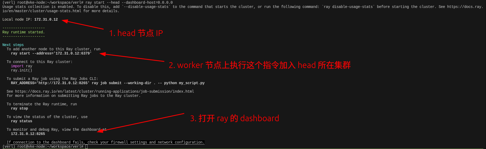
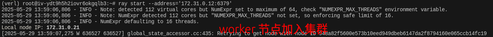
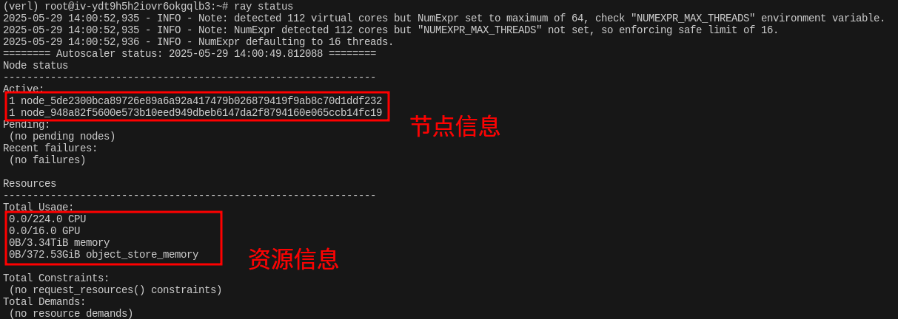
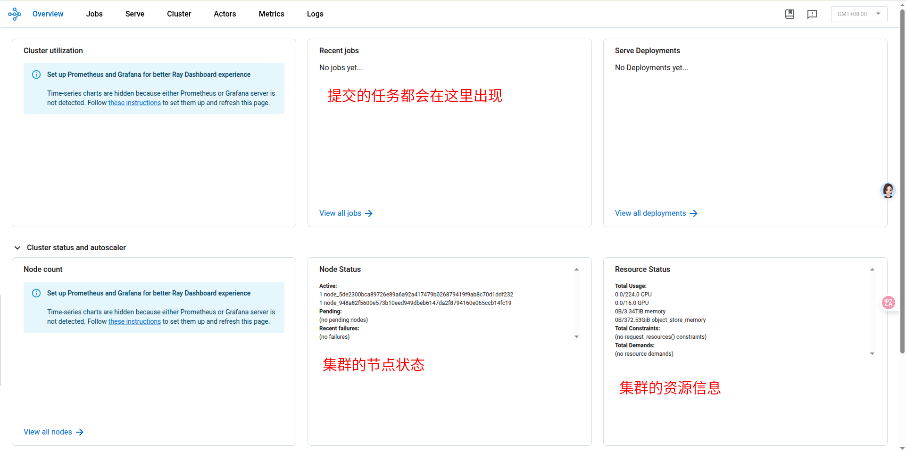
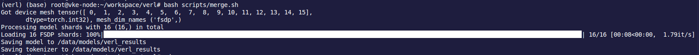

# verl multi-node train

## 启动 head 节点

> ### ⚠️ NumExpr的线程数警告
>
> ```
> Note: detected 112 virtual cores but NumExpr set to maximum of 64, check "NUMEXPR_MAX_THREADS" environment variable.
> Note: NumExpr detected 112 cores but "NUMEXPR_MAX_THREADS" not set, so enforcing safe limit of 8.
> NumExpr defaulting to 8 threads.
> ```
>
> 🔍 **原因**：
>
> - 服务器检测到 **112 个虚拟核心**（多线程处理器）。
> - `NumExpr`是一个高效的数值计算库（numpy 背后的计算加速），它默认对线程数做了安全限制以防止过度占用 CPU 资源。
> - 如果没有设置 `NUMEXPR_MAX_THREADS` 环境变量，它会强制限制为 **8 个线程**。
>
> ✅ **解决办法（可选）**：
>  如果你需要让NumExpr使用更多线程（比如接近核心数），可以设置：
>
> ```bash
> export NUMEXPR_MAX_THREADS=112
> ```
>
> 当然，这通常只是提醒，并不会影响 Ray 或 Verl 的运行，除非你用到大量NumExpr计算。

在 head 节点上执行以下指令，启动 ray 

```
ray start --head --dashboard-host=0.0.0.0
```




## 启动 worker 节点

在 worker 节点上执行以下指令，加入集群

```bash
ray start --address='172.31.0.12:6379'
```




## 查看集群信息

在任意节点上执行 ray status，可以看到集群的节点信息和资源信息。



也可以使用 dashboard 查看集群信息。




## 执行任务

只需将需要执行的任务在任意一台机器上向集群提交即可。

1. 在配置文件中（verl/trainer/runtime_env.yaml）加上 GLOO_SOCKET_IFNAME 环境变量 

```
working_dir: ./
excludes: ["/.git/"]
env_vars:
  TORCH_NCCL_AVOID_RECORD_STREAMS: "1"
  # If you are using vllm<=0.6.3, you might need to set the following environment variable to avoid bugs:
  # VLLM_ATTENTION_BACKEND: "XFORMERS"
  GLOO_SOCKET_IFNAME: "eth0"
```


2. 编辑训练的 shell 脚本并运行

   注意下面的脚本是在 head 节点上执行的，脚本中的 job submit 地址填的是 127.0.0.1。

```bash
set -x
ray job submit --address="http://127.0.0.1:8265" \
    --runtime-env=verl/trainer/runtime_env.yaml \
    --no-wait \
    -- \
python3 -m verl.trainer.main_ppo \
    algorithm.adv_estimator=grpo \
    data.train_files=/root/verl/data/hdfs/train.parquet \
    data.val_files=/root/verl/data/hdfs/test.parquet \
    data.train_batch_size=1024 \
    data.max_prompt_length=512 \
    data.max_response_length=1024 \
    data.filter_overlong_prompts=True \
    data.truncation='error' \
    actor_rollout_ref.model.path=Qwen/Qwen3-32B \
    actor_rollout_ref.actor.optim.lr=1e-6 \
    actor_rollout_ref.model.use_remove_padding=True \
    actor_rollout_ref.actor.ppo_mini_batch_size=128 \
    actor_rollout_ref.actor.ppo_micro_batch_size_per_gpu=16 \
    actor_rollout_ref.actor.use_kl_loss=True \
    actor_rollout_ref.actor.kl_loss_coef=0.001 \
    actor_rollout_ref.actor.kl_loss_type=low_var_kl \
    actor_rollout_ref.actor.entropy_coeff=0 \
    actor_rollout_ref.model.enable_gradient_checkpointing=True \
    actor_rollout_ref.actor.fsdp_config.param_offload=False \
    actor_rollout_ref.actor.fsdp_config.optimizer_offload=False \
    actor_rollout_ref.rollout.log_prob_micro_batch_size_per_gpu=16 \
    actor_rollout_ref.rollout.tensor_model_parallel_size=4 \
    actor_rollout_ref.rollout.name=vllm \
    actor_rollout_ref.rollout.gpu_memory_utilization=0.6 \
    actor_rollout_ref.rollout.n=8 \
    actor_rollout_ref.ref.log_prob_micro_batch_size_per_gpu=8 \
    actor_rollout_ref.ref.fsdp_config.param_offload=True \
    algorithm.use_kl_in_reward=False \
    trainer.critic_warmup=0 \
    trainer.logger=['console','wandb'] \
    trainer.project_name='verl_grpo_example_gsm8k' \
    trainer.experiment_name='qwen3_32b_2nodes' \
    trainer.n_gpus_per_node=8 \  # 每个节点 8 GPU
    trainer.nnodes=2 \  # 两个节点
    trainer.save_freq=20 \
    trainer.test_freq=5 \
    trainer.total_epochs=1 $@
```


## 流式查看 log

使用已下指令在终端查看流式日志，或在 dashboard 网页中查看

```
ray job logs raysubmit_iCE8j5WD3fN5W9uX -f 
```


## 模型合并

两个节点分布式训练之后的模型权重文件会分别保存在两个节点上，此时我们需要将训练完的**权重合并到同一个节点的同一个目录中**。

官方在 verl/scripts/model_merger.py 中实现了模型合并脚本，用于将 FSDP 和 Megatron 后端的 checkpoints 合并成 huggingface 模型。

> - To merge FSDP checkpoints:
>
> ```sh
> python scripts/model_merger.py merge \
>     --backend fsdp \
>     --local_dir checkpoints/verl_fsdp_gsm8k_examples/qwen2_5_0b5_fsdp_saveload/global_step_1/actor \
>     --target_dir /path/to/merged_hf_model
> ```
>
> - To merge Megatron checkpoints:
>
> ```sh
> python scripts/model_merger.py merge \
>     --backend megatron \
>     --tie-word-embedding \
>     --local_dir checkpoints/verl_megatron_gsm8k_examples/qwen2_5_0b5_megatron_saveload/global_step_1/actor \
>     --target_dir /path/to/merged_hf_model
> ```

这里我们使用 FSDP 的方式训练的模型，所以我们在 scripts/ 路径下，新建脚本，编辑如下信息：

```bash
python scripts/model_merger.py merge \
    --backend fsdp \
    --local_dir /tmp/ray/session_2025-05-28_15-53-09_958478_132003/runtime_resources/working_dir_files/_ray_pkg_c461f3378ff510ed/checkpoints/verl_grpo_example_gsm8k/qwen3_32b_2nodes/global_step_7/actor \
    --target_dir /data/models/verl_results
```

执行 shell 脚本，就可以在我们指定的路径下生成 huggingface 的模型，以便后面的部署推理。




## 坑

ValueError: Model architectures ['Qwen3ForCausalLM'] failed to be inspected. Please check the logs for more details.

```
ValueError: Model architectures ['Qwen3ForCausalLM'] failed to be inspected. Please check the logs for more details.

ERROR 11-29 06:51:24 registry.py:297] RuntimeError: Error raised in subprocess:
ERROR 11-29 06:51:24 registry.py:297] Error: mkl-service + Intel(R) MKL: MKL_THREADING_LAYER=INTEL is incompatible with libgomp-a34b3233.so.1 library.
ERROR 11-29 06:51:24 registry.py:297]   Try to import numpy first or set the threading layer accordingly. Set MKL_SERVICE_FORCE_INTEL to force it.
```

[github issue](https://github.com/vllm-project/vllm/issues/10759) 中有解决方案，最终是更新了 numpy 版本解决的。
