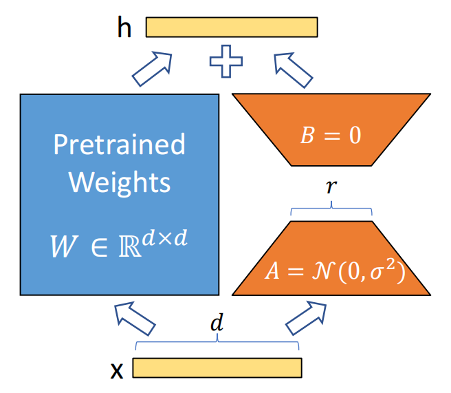

## LoRA

[原文链接：LoRA: Low-Rank Adaptation of Large Language Models](https://arxiv.org/abs/2106.09685)

[Github：LoRA: Low-Rank Adaptation of Large Language Models](https://github.com/microsoft/LoRA)

### 0x00 Abstract

自然语言处理的一个重要范式：先在通用领域数据上进行大规模预训练，然后适应特定任务或领域.随着预训练模型规模的增大，全面微调（重新训练所有模型参数）变得不太可行。

论文提出了低秩适应（Low-Rank Adaptation， LoRA）方法，冻结预训练模型权重，在 Transformer 架构的每一层注入可训练的低秩分解矩阵，从而大幅减少下游任务的可训练参数数量。

与使用 Adam 优化器对 GPT-3 175B 进行微调相比，LoRA 可以将可训练参数数量减少 10000 倍，并将 GPU 内存需求减少 3 倍。

尽管 LoRA 的可训练参数更少、训练吞吐量更高，并且与适配器不同，推理时不会增加额外的延迟，但在模型质量上，LoRA 的表现与 RoBERTa、DeBERTa、GPT-2 和 GPT-3 的微调相当，甚至更好。

### 0x01 Introduction

#### 背景和问题

许多自然语言处理（NLP）应用依赖于将一个大规模预训练语言模型适配到多个下游任务。这种适配通常通过**微调**（fine-tuning）来实现，微调会更新预训练模型的所有参数。微调的一个主要问题是，微调后的模型参数数量与原始模型相同，因此需要存储和加载大量参数。

随着语言模型的规模不断增大（如 GPT-3 有 1750 亿个可训练参数），这个问题变得越来越严重。尤其是对于大型模型（例如 GPT-3 ），存储和部署的成本变得非常高，成为一个**关键的部署挑战**。

#### 解决方案：低秩适应（LoRA）

为了解决这个问题，研究者们探索了一些方法，只调整部分参数或为新任务学习外部模块。这些方法只需要存储和加载少量的任务特定参数，从而提高了部署的效率。然而，现有的方法通常会带来**推理延迟**，或者降低模型的有效序列长度。同时，这些方法通常不能达到微调基准的效果，因此在**效率和模型质量之间存在权衡**。

LoRA 的灵感来源于 Li et al. (2018) 和 Aghajanyan et al. (2020) 的研究，他们发现**过参数化的模型实际上位于一个低维空间**。在 LoRA 中，作者假设模型适应过程中权重的变化也具有**低内在秩**，因此可以通过低秩矩阵的方式进行参数更新。这种方式使得在适应过程中，只更新低秩矩阵而不更新整个预训练模型的权重，从而达到高效适配。

#### LoRA的核心思想

LoRA 的核心想法是通过优化**秩分解矩阵**来间接训练神经网络中的一些稠密层，而**冻结**预训练模型的权重。作者以GPT-3 为例，指出即使在一个非常高的秩（例如 12,288 ）下，低秩（比如秩为 1 或 2 ）也足够进行适应，从而**在存储和计算上都更高效**。

**LoRA的优势**

1. **共享预训练模型**：一个预训练模型可以被用来构建多个 LoRA 模块，适应不同的任务。通过冻结共享模型，只需更换低秩矩阵 A 和 B，即可切换任务，极大减少了存储需求和任务切换的开销。
2. **训练更高效**：LoRA 通过只优化较小的低秩矩阵，而不需要计算大部分参数的梯度或维护优化器状态，从而提高了训练效率，降低了硬件要求。使用自适应优化器时，训练效率可以提高多达 3 倍。
3. **无推理延迟**：LoRA 的设计允许将训练得到的低秩矩阵与冻结的预训练权重合并，因此在部署时，不会增加推理延迟，性能与全微调模型相当。
4. **与其他方法兼容**：LoRA 与许多现有的方法是**正交**的，可以与它们结合使用，比如与 prefix-tuning 结合。

### 0x02 LoRA Use Cases

LoRA 方法本身与具体的训练目标无关，可以用于各种任务。在论文中，作者选择了**语言建模**作为主要的应用场景来展示其有效性。语言建模的目标是给定一个**输入序列**（如文本），通过预训练的语言模型来生成一个**条件概率分布**。其目标是最大化给定任务特定提示（prompt）的条件概率。

#### 语言建模的框架

**预训练自回归语言模型**：假设我们有一个预训练的自回归语言模型 $P_\Phi(y|x)$，其中 $\Phi$ 表示模型的参数。这类模型通常是基于 Transformer 架构（如GPT）训练的，能够进行多任务学习。

**下游任务的适应**：该预训练模型可以通过微调来适应不同的下游任务，比如：摘要生成（summarization）， 机器阅读理解（MRC）， 自然语言转SQL（NL2SQL）。

每个下游任务都由一组**上下文-目标对**（$Z = \{(x_i, y_i)\}_{i=1}^N$）组成，其中 $x_i$ 是输入序列（上下文），而 $y_i$ 是目标输出（如 SQL 命令或摘要）。例如：

- 在 NL2SQL 中，$x_i$ 是自然语言查询，$y_i$ 是对应的 SQL 命令；
- 在摘要生成中，$x_i$ 是文章内容，$y_i$ 是摘要。

#### 微调过程

##### 全量微调

- **全微调的方式**：在全微调中，模型的初始参数为 $\Phi_0$，通过多次迭代更新权重 $\Phi_0$ 到 $\Phi_0 + \Delta \Phi$，其中 $\Delta \Phi$ 是在训练过程中计算得到的更新量，目标是通过梯度下降来最大化条件语言建模目标：

$$
\max_{\Phi} \sum_{(x, y) \in Z} |y| \sum_{t=1}^{|y|} \log P_\Phi(y_t | x, y_{<t})
$$

这里的 $P_\Phi(y_t | x, y_{<t})$ 是条件概率，表示在给定输入 $x$ 和前面已经生成的部分 $y_{<t}$ 的情况下生成 $y_t$ 的概率。

- **全微调的缺点**：全微调的主要问题是，**每个下游任务都需要学习一组新的参数** $\Delta \Phi$，而这组参数的维度等于预训练模型参数的维度 $|\Delta \Phi| = |\Phi_0|$。因此，对于大型模型（例如 GPT-3，拥有大约 1750 亿个参数），存储和部署多个微调后的模型变得非常具有挑战性。

##### 提出的参数高效方法

- **LoRA 的参数高效方法**：为了避免全微调中参数量庞大的问题，作者提出了一个更加**参数高效**的方法，其中每个任务特定的参数增量 $\Delta \Phi$ 被进一步编码为一个更小规模的参数集 $\Theta$，且 $|\Theta| \ll |\Phi_0|$。在这种方法下，优化的目标变为优化小规模的参数集 $\Theta$，而不是整个 $\Delta \Phi$：

$$
\max_{\Theta} \sum_{(x, y) \in Z} |y| \sum_{t=1}^{|y|} \log \left( P_{\Phi_0 + \Delta \Phi(\Theta)}(y_t | x, y_{<t}) \right)
$$

​		也就是说，作者通过优化一个小的任务特定参数集 $\Theta$ 来更新预训练模型 $\Phi_0$，而不是更新整个参数集 $\Delta \Phi$，这显著减少了所需的参数量。

- **低秩表示**：在接下来的部分中，作者会提出使用低秩表示来编码 $\Delta \Phi$，这使得计算和内存开销更加高效。
- **GPT-3 为例**：以 GPT-3 为例，LoRA 方法中的任务特定参数 $\Theta$ 可能只占原始模型参数的 0.01%。这种方式极大地减少了训练和存储所需的参数数量，使得大型预训练模型在下游任务中的应用更加高效。

### 0x03 Background

作者指出，**模型适应**的问题并不新鲜。自从迁移学习（Transfer Learning）出现以来，许多工作已经致力于让模型的适应过程更加**参数高效（parameter-efficient）**和**计算高效（compute-efficient）**。作者提到有两种显著的策略用于高效适应（efficient adaptations）：

1. **适配器层（Adapter Layers）**：这种方法在每个 Transformer 块中添加额外的适配器层，从而使模型可以更高效地适应下游任务。
2. **优化输入层激活（Prefix Tuning）**：通过优化输入序列的前缀部分来调整模型的行为，而不是调整整个模型的参数。

这两种方法的缺点是在**大规模和延迟敏感的生产环境**中存在的局限性。

#### 适配器层的局限性

适配器层的设计目的是通过在 Transformer 的每个块中插入一小段额外的层来增加适应性，而不会显著增加模型的参数量。通常，这些适配器层的参数量会远小于原始模型（有时只有原始模型的 1% ）。尽管适配器层的设计是为了控制计算量（如通过小的瓶颈维度来限制 FLOP），但在实际应用中，**适配器层的计算是顺序执行的**，这带来了以下问题：

- **推理延迟增加**：适配器层需要逐层处理，这会影响**在线推理**中的延迟，尤其是当批量大小很小（如 1 ）时。由于大部分深度神经网络依赖硬件并行来降低延迟，而适配器层的顺序处理无法充分利用这一点，因此在单 GPU 上运行模型时，适配器层会显著增加延迟（即使瓶颈维度非常小，依然会观察到延迟增加）。
- **分布式问题**：如果模型需要进行分片（如在大规模分布式训练中使用），适配器层会导致额外的 **GPU 同步操作**（例如 AllReduce 和 Broadcast ），除非适配器层的参数被冗余存储多次。

#### 优化输入层激活的挑战

另一种高效适应的方法是**优化输入层激活**，比如**前缀调优（ prefix tuning ）**。这种方法通过调整输入序列的前缀部分来改变模型的行为，而不直接修改模型的其他参数。尽管这种方法在一定程度上提高了参数效率，但它也面临一些挑战：

- **优化困难**：前缀调优的优化过程非常困难，且其性能在可训练参数的数量变化时表现为非单调变化。这意味着，增加可训练的前缀参数并不总是能显著提高性能，反而可能会有负面影响。
- **序列长度限制**：前缀调优需要保留一部分**序列长度**来进行适应，这会减少可用于处理下游任务的序列长度。在一些情况下，这可能导致前缀调优在性能上的劣势，特别是当下游任务需要处理较长的输入序列时。

### 0x04 LoRA Method

#### 低秩参数化的更新矩阵

首先，LoRA 的基本原理是将神经网络中更新的权重矩阵（例如 Transformer 中的注意力矩阵）表示为低秩的分解形式。假设预训练的权重矩阵为 $W_0 \in \mathbb{R}^{d \times k}$，则更新项 $\Delta W$ 被表示为两个低秩矩阵的乘积：$\Delta W = BA$，其中 $B \in \mathbb{R}^{d \times r}$ 和 $A \in \mathbb{R}^{r \times k}$，秩 $r$ 远小于 $d$ 或 $k$（通常是几到几十个维度）。

- **冻结预训练权重**：在训练过程中，原始的权重矩阵 $W_0$ 被冻结，不更新，只训练低秩矩阵 $B$ 和 $A$，从而减少了需要训练的参数数量。
- **前向传播修改**：在标准的前向传播中，原始的计算为 $h = W_0 x$。经过 LoRA 的修改后，前向传播变为 $h = W_0 x + \Delta W x = W_0 x + BA x$，即在原有计算的基础上加入了低秩更新项。
- **初始化和缩放**：在训练开始时，矩阵 $A$ 被随机初始化为高斯分布，而 $B$ 初始化为零，因此初始时 $\Delta W = 0$。在训练过程中，LoRA 对更新项进行缩放，以减少超参数调节的需求，尤其是当改变秩 $r$ 时，能显著减少需要重新调整的超参数数量。

##### LoRA 的泛化

LoRA 提供了一种**比传统全量微调更高效**的适应方法。LoRA 不需要将每个下游任务的模型更新矩阵（如 $\Delta \Phi$）表示为全秩矩阵，而是通过低秩矩阵来表示。随着训练过程中可训练参数数量的增加，LoRA 在一定程度上恢复了全量微调的表达能力，但仍然比传统微调节省了大量计算和存储资源。

##### 不增加推理延迟

在部署时，LoRA 允许通过**显式计算并存储**更新后的权重 $W = W_0 + BA$，在推理过程中无需额外的计算延迟。若切换到其他下游任务，只需从 $W_0$ 中减去旧的 $BA$，然后加上新的 $B'A'$，这一操作非常高效且内存开销很小。这使得 LoRA 在推理时与全量微调的模型相比，**不会引入额外的推理延迟**。

#### 将LoRA应用于Transformer

LoRA 不仅限于 Transformer 模型，但在本研究中，作者主要讨论了如何将其应用于 Transformer 模型中的自注意力层（self-attention module）和多层感知机（MLP）模块。

- **注意力层**：Transformer 的自注意力模块中有四个主要的权重矩阵：$W_q, W_k, W_v, W_o$。在 LoRA 应用中，作者仅对这些注意力矩阵进行低秩更新，并冻结MLP模块（即不对MLP层的权重进行训练）。
- **实验的简化**：由于 LoRA 的重点是减少参数量和计算量，作者选择**仅适应注意力权重**，而不训练其他层的参数，以简化实验并提高参数效率。

##### 实际优势

1. **显著降低内存和存储使用**：通过使用 LoRA，尤其是在大规模 Transformer 模型（如 GPT-3 175B ）中，作者能够大幅减少训练时的显存消耗。在 GPT-3 175B 上，LoRA 将显存消耗从 1.2TB 降至 350GB，减少了约 2/3  的显存使用。当秩为 4，同时**只适应查询和值投影矩阵**时，模型 checkpoint 的大小可以减少 **10,000倍**（从 350GB 降至 35MB）。
2. **节省计算资源**：由于大多数参数被冻结，仅对少量低秩矩阵进行训练，LoRA 还能够在训练过程中提高效率，减少计算量，从而提高训练速度。与全量微调相比，GPT-3 175B 的训练速度提高了约 25% 。
3. **任务切换的高效性**：LoRA 使得在部署时能够高效地在不同任务之间切换，只需替换相应的 LoRA 权重，而不需要替换整个模型的参数。这不仅节省了内存，还降低了在多个任务间切换的成本。

##### LoRA 的局限性

尽管 LoRA 有显著优势，但也有一些局限性，尤其是在推理时：

- **批处理问题**：如果将低秩矩阵 $A$ 和 $B$ 吸收到 $W$ 中进行推理，那么在同一个前向传递中，难以对来自不同任务的输入进行批处理，因为每个任务可能会有不同的 $A$ 和 $B$。虽然可以避免合并权重并根据任务动态选择LoRA模块，但这可能会导致推理延迟问题，尤其是在实时要求较高的场景中。

### 0x05 Experiment

#### LoRA 在 RoBERTa 和 DeBERTa 上的表现

- 在 GLUE 基准上，对 RoBERTa 和 DeBERTa 的测试表明，LoRA 在多个任务上能够与全量微调（FT）方法媲美，且参数量大幅减少。
- **RoBERTa Base** 与 LoRA 相比，表现相当，LoRA 在多个任务上略优于适配器（AdapterD、AdapterH等），尽管其参数量只有 0.3M。
- **RoBERTa Large**，LoRA 再次表现出色，接近于或超越了适配器基线。
- **DeBERTa XXL**（1.5B）上的结果也表明，LoRA 在 GLUE 任务中表现与全量微调相当。

#### LoRA 在 GPT-2 上的表现

- 在 E2E NLG Challenge 上，LoRA 在 GPT-2 Medium 和 Large 模型中也超越了多个适配器基线，并且在参数量相近或更少的情况下表现出色。
- 对比了多种适配方法，如 AdapterL、AdapterH、PreLayer 等，LoRA 以更少的参数量在 BLEU、ROUGE 等指标上表现优异。
- GPT-2 Medium（354.92M参数）和 Large（774.03M参数）的 LoRA 在生成任务中都能取得较好的结果。

#### LoRA 在 GPT-3 上的表现

- 在 GPT-3 175B（1750亿参数）上进行的测试显示，LoRA 不仅能够与全量微调（FT）模型匹敌，而且在多个任务（如 WikiSQL、MultiNLI-matched、SAMSum）上超越了其他适配方法。
- 例如，在 WikiSQL 任务中，LoRA 的表现非常接近全量微调模型，且相对其它方法，LoRA 的参数量显著减少。
- 参数量过多时可能带来的性能下降，特别是在使用过多特殊标记（例如前缀嵌入和前缀层调整时）。

#### 训练和参数量的考量

- LoRA 的优势不仅仅体现在低参数量上，它也能保持或超越全量微调模型的性能，尤其是在多种任务下。训练的效率和效果方面，LoRA 是一个可行的高效替代方法。
- 表格中详细列出了各种方法在不同任务上的表现，LoRA 在许多任务中表现稳定且优于其他低参数量的方法。

#### LoRA 结果总结

- LoRA 在多个预训练模型上的实验表明，它是一种高效的适配方法，能够显著减少训练参数，同时保持较高的任务性能，尤其在大规模模型（如GPT-3）上，表现尤为突出。

### 0x06 Conclusion And Future Work

#### LoRA的优点

- 传统的对大型语言模型的微调（fine-tuning）非常昂贵，既需要大量的硬件资源，也需要高昂的存储和任务切换成本。而 LoRA 通过对模型进行低秩适应，避免了这些问题，既不会引入推理延迟，也不会减少输入序列长度，同时保持了较高的模型质量。
- LoRA 特别适用于服务部署，因为它能够快速切换任务，同时共享绝大多数的模型参数。
- 虽然本文主要聚焦于 Transformer 语言模型，但 LoRA 的原理也适用于任何具有密集层（dense layers）的神经网络。

#### 未来的研究方向

- **LoRA 与其他适应方法的结合**：LoRA 可以与其他高效适应方法结合，可能会提供互补的性能提升。
- **微调或 LoRA 背后的机制不清晰**：目前我们还不清楚模型在预训练阶段学习到的特征是如何转化为下游任务表现的。LoRA 的出现使得理解这一过程变得更加可行，尤其是相比于完全微调方法。
- **选择应用 LoRA 的权重矩阵的策略**：目前，LoRA 的应用主要依赖启发式方法来选择权重矩阵，但未来可能存在更有原则的选择方式。
- **权重矩阵的秩缺陷问题**：LoRA 方法的低秩调整启示我们，原始权重矩阵可能本身就存在秩缺陷，这也可以成为未来研究的一个方向。
