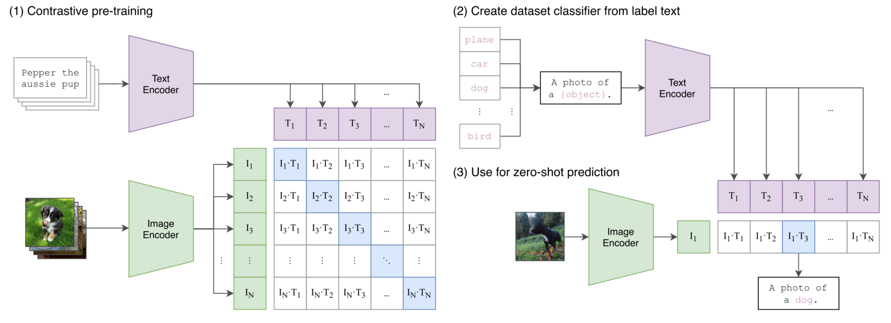
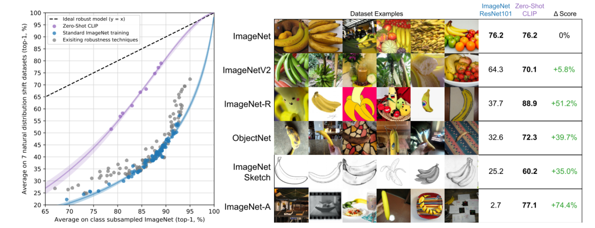
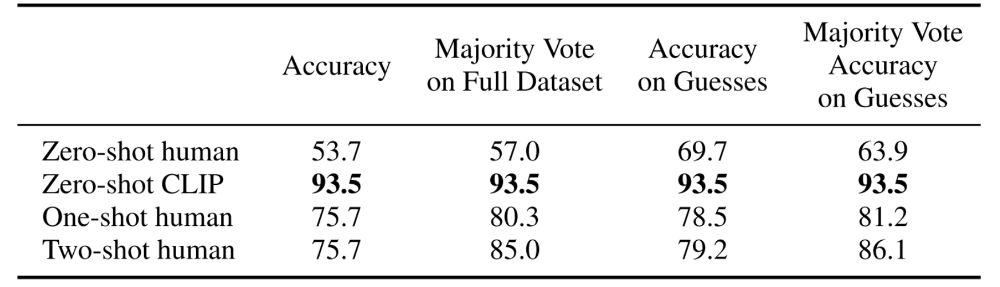

# CLIP

## Abstract

传统的计算机视觉系统通常只能识别一组**固定的类别**，比如猫、狗、汽车等等。这些类别是在训练时提前规定好的，因此如果想让模型识别新的东西，比如“手拿咖啡杯的人”，那就必须重新收集数据、打标签、重新训练，非常麻烦。

为了打破这种局限，CLIP 提出了一个新的思路：
 ➡️ **直接从文本中学习视觉概念**。
 也就是说，不是用“这是猫”“这是狗”的标签去训练，而是用自然语言描述，比如“一个黑色的猫咪蹲在沙发上”，配合图片一起学习。
 这种方法能利用互联网上海量的（图片，文字）数据，而不需要人工逐个标注。

CLIP 做了一个很简单但有效的预训练任务：
 ➡️ **给定一张图片和很多描述，让模型学会配对**：哪句描述是对应这张图片的？
 虽然任务看起来很简单，但因为数据量巨大（4亿对图片和文字！），模型学到了非常强的视觉理解能力。

预训练完成后，CLIP 可以直接用**自然语言**来完成各种新任务，比如：

- 给出描述"一只穿着红衣服的狗"，让模型去找到匹配的图片
- 给出类别名称，让模型在新数据集上进行分类
   而且做到这一切**不用再进行任何额外的训练**，这就是所谓的 **zero-shot transfer**（零样本迁移）。

为了验证这种方法的效果，CLIP 团队在 30 多个不同的视觉任务上进行了测试，包括：

- OCR（文字识别）
- 视频动作识别
- 地理定位
- 各种精细分类任务

结果很惊人：即使**不针对每个任务单独训练**，CLIP 的表现也往往能接近甚至媲美传统的、有专门训练过的模型。例如，它在 ImageNet 上 zero-shot 的准确率，就能追平经典的 ResNet-50，而 ResNet-50 可是用了一百多万张标注图训练出来的！

最后，OpenAI 也把他们的代码和预训练模型权重开源了，地址是：https://github.com/OpenAI/CLIP。

## Introduction & Motivating Work

### 1. 自然语言领域的启发：NLP 靠预训练起飞了

过去几年，自然语言处理（NLP）领域发生了翻天覆地的变化。
 ➡️ **关键原因是：直接从原始文本上进行大规模预训练**。

像 GPT、BERT 这些模型，通过一些简单的通用目标（比如“预测下一个词”或者“填补缺失词”），在极大的数据量和算力支持下，模型能力不断提升。
 而且，它们用的是统一的输入输出格式（比如“text-to-text”），这样模型就能**零样本迁移**到各种新任务上，不需要为每个任务单独改网络结构或者微调。

**例子**：GPT-3 只用少量甚至不需要训练数据，就能在很多任务上打败传统特制模型。

这说明，**互联网上的大规模文本**里本身就蕴含了巨量的监督信号，远远超过了人工标注的小数据集。

### 2. 视觉领域的现状：还停留在小数据集

相比之下，计算机视觉领域还停留在一种传统做法：
 ➡️ **靠人工打标签的数据集来训练，比如 ImageNet**。

虽然这让模型学得很精准，但显然受限很大：

- 类别数目固定
- 需要大量人工成本
- 每换一个任务就要重新收集数据和训练

所以一个自然的问题是：**能不能像 NLP 一样，从互联网文本中学习视觉模型？**

### 3. 过去的一些探索：早期的“图文结合”尝试

其实，早在 20 多年前，就有人尝试过用图像和文字一起训练模型，比如：

- 让模型预测配图文档中的名词和形容词（Mori et al., 1999）
- 用图像和标题学到更高效的表示（Quattoni et al., 2007）
- 训练神经网络预测图片的标题、标签（Joulin et al., 2016）
- 后面还出现了 VirTex、ICMLM、ConVIRT 这样的基于 Transformer 的尝试。

这些工作证明了一个事实：
 **用自然语言来指导视觉学习是可行的**。

但问题是，这些方法大多只能作为“概念验证”，真正效果并不太好。

### 4. 为什么以前没火起来？

主要原因是：**性能太差了**。

比如 Li et al. (2017) 的方法在 ImageNet 上 zero-shot 准确率只有 11.5%，远低于当时有监督方法的 88.4%。
 甚至比传统机器视觉的方法还差。

于是，工业界更倾向于走一种折中的路线：

- 用带噪声的弱标注数据（比如 Instagram 的标签）来预训练
- 比如 Mahajan et al. (2018) 就在 Instagram 上做了类似 ImageNet 标签预测的任务，提升了 ImageNet 性能。

不过，这种方法依然有很多限制：

- 只能覆盖固定数量的类别（ 1000 到 18000 多个）
- 预测头是静态的（ softmax 分类器），没法灵活应对新任务

相比自然语言，这种方法**在灵活性和泛化能力上明显受限**。

### 5. 规模才是关键：CLIP 的不同之处

一个很重要的观察是：
 ➡️ 以前这些尝试虽然方向对了，但**训练规模太小了**。

像 VirTex、ICMLM、ConVIRT 这些方法，只在几十万到百万级图片上训练过几天。
 而工业界的弱监督方法（比如 Mahajan 等）可是用**亿级别的数据训练了好几年的算力时间**！

于是 CLIP 这篇工作提出了：

- 收集了 **4 亿对图像-文字对**
- 设计了一个简单的对比学习任务
- **真正大规模地训练**了一个自然语言监督的视觉模型

CLIP 的训练和设计思路是：

- 基于 ConVIRT 的简化版，进行大规模训练
- 训练了 8 个不同规模的模型，跨了将近两个数量级的算力规模
- 观察到了：**transfer 性能随着训练规模平滑提升**

### 6. 关键结果

CLIP 预训练出来的模型，在很多任务上可以：

- 直接用自然语言描述进行 zero-shot 预测
- 在 30 多个视觉任务上**零样本迁移**效果非常好
- 超过了很多基于 ImageNet 有监督预训练的模型
- 更重要的是：**更鲁棒**，抗干扰性比有监督模型好

这说明：**像 NLP 领域一样，视觉领域也能靠自然语言 + 大数据突破**！

## Approach

本文提出的方法是：
 **用自然语言监督（Natural Language Supervision）来大规模训练视觉模型。**
 核心思想是，不是靠传统的人工分类标注，而是从互联网上大量现成的**图像-文本对**中学习，使得模型在训练时不仅学到视觉特征，还能学会把视觉和语言关联起来，从而实现很强的**零样本（zero-shot）迁移能力**。

具体包括以下五个步骤：

- **2.1. 自然语言监督**：强调自然语言本身可以作为强大的监督信号，不需要经典的 1-of-N 分类标注。
- **2.2. 构建大规模数据集**：现有数据集太小，于是作者自己从互联网收集了 **4 亿对图像-文本**的新数据集，称为 **WIT（WebImageText）**。
- **2.3. 高效的预训练方法**：采用**对比学习（contrastive learning）**而不是生成或预测具体文本，极大提高训练效率。
- **2.4. 模型设计与扩展**：同时探索了改进版的 **ResNet** 和 **Vision Transformer (ViT)** 作为图像编码器，文本编码器用 Transformer。
- **2.5. 训练细节**：训练了多个规模的模型，细节上简化了很多预处理和增强操作以保证高效。

### 2.1 Natural Language Supervision

- 过去图像-文本联合学习有很多名字：自监督、弱监督、监督学习……但本质上都是用**自然语言**来指导视觉表征学习。
- 随着深度学习（比如上下文语言模型）发展，现在能更好处理自然语言了，所以可以充分利用这种“免费”的监督信号。
- 优势：
  - **扩展性强**：不需要一张一张人工打标签，能直接利用互联网上现成的图文。
  - **零样本迁移能力**：模型在学视觉的同时也学了语言表达，因此能直接根据自然语言描述推理新的概念。

### 2.2 Creating a Sufficiently Large Dataset

- 现有的数据集（比如 MS-COCO、Visual Genome ）规模太小（仅 10 万级图片）。
- YFCC100M 虽然有 1 亿张，但很多描述质量很差，需要筛选，最终有效数据只有 1500 万张。
- 作者自己构建了一个新的超大规模数据集：
  - 收集了 **4 亿**对图像和文本，来自互联网公开资源。
  - 为了尽可能覆盖更多概念，用了 **50 万个查询词**（包括热门维基词条、WordNet 同义词集等）进行搜索。
  - 控制了类别平衡（每个查询最多 2 万对图文）。
  - 数据量级和 WebText 相近（GPT-2 训练的数据来源）。
- 新数据集名字叫 **WIT（WebImageText）**。

### 2.3 Selecting an Efficient Pre-Training Method

- 一开始作者尝试了直接让模型预测文本内容（类似 Captioning），但发现训练很慢、效率低。
- 启发来自对比学习（contrastive learning）研究：
  - 不是预测完整的文字内容，而是只学**正确匹配的图像-文本对**，效率更高。
- 采用了 **InfoNCE**（一种经典的对比损失函数）：
  - 给定一批 $N$ 个图像-文本对，让模型在 $N^2$ 种可能匹配中，找出真实的 $N$ 个配对。
  - 训练目标是最大化正确配对的相似度，最小化错误配对的相似度。
- 结果：训练效率提升了 **4 倍**，零样本 ImageNet 分类速度也快了很多。
- 小细节：训练中还直接优化了 softmax 温度参数（$τ$），使其不需要手动调参。

### 2.4 Choosing and Scaling a Model

- 图像编码器尝试了两种：
  - 改进版 **ResNet-50**：加了 ResNet-D 结构优化、抗锯齿采样（antialiased blur pooling）、最后用 Attention Pooling 代替平均池化。
  - **Vision Transformer (ViT)** ：基本跟 ViT 标准实现一样，加了一点小修改（比如多加一层 LayerNorm）。
- 文本编码器是 Transformer：
  - 基于 BPE（Byte Pair Encoding）分词，最大序列长度 76。
  - 特别用 [EOS] 标记提取文本特征。
- **扩展方式**：参考 EfficientNet 的思路，同时增加宽度、深度和输入分辨率，而不是只放大某一个维度。
- 文本编码器只扩宽度，不扩深度，因为实验中发现文本编码器容量对性能影响比较小。

### 2.5 Training

- 实际训练了多种规模的模型，包括 5 个 ResNet 版本和 3 个 ViT 版本。
- 为了效率，训练过程尽量简化：
  - 图像增强只用简单的随机裁剪。
  - 训练从头开始，不用预训练权重（比如 ImageNet 预训练）。
  - 训练细节更偏向直接、粗暴而有效的方法。

## Experiments

### 3.1 零样本迁移 (Zero-Shot Transfer)

这部分是CLIP论文的亮点之一。作者们在这里展示和分析了 CLIP 模型最令人兴奋的能力：**在从未见过的数据集上进行图像分类，仅仅通过提供类别的文本描述，而不需要任何针对该数据集的额外训练。** 这就是所谓的“零样本迁移”。

#### 3.1.1 动机 (MOTIVATION)

- **核心思想:** 传统上，“零样本学习”指的是识别模型在训练中没见过的物体类别。但 CLIP 这里把它扩展了，指的是模型能泛化到完全没见过的数据集上。
- **为什么这么做?** 作者认为，测试模型能否泛化到新数据集，更能代表模型是否具备**学习新任务**的能力，而不仅仅是学习好的图像特征（表示学习）。很多研究关注后者，但 CLIP 更关注前者——模型是否足够“聪明”去理解并执行一个用自然语言描述的新任务。
- 数据集的区分:
  - 有些数据集（如 SVHN 街景门牌号）确实对应一个明确的“真实世界任务”。在这些数据集上做零样本迁移，是测试模型的**任务泛化**能力。
  - 但很多经典数据集（如 CIFAR-10）更像是为了推动通用图像分类研究而创建的基准，它们来自特定的数据源（如 TinyImages ），但不一定代表一个明确的“任务”。在这些数据集上做零样本迁移，更多的是测试模型对**数据分布变化**的鲁棒性（即领域泛化）。
- 灵感来源:
  - **Visual N-Grams:** 这是早期研究类似“零样本迁移到现有数据集”的工作，是 CLIP 的一个重要参照点。
  - **NLP领域 (GPT系列):** GPT 等语言模型的研究表明，大规模预训练可以带来“意外的”任务学习能力，模型可以在没有明确监督的情况下执行新任务（零样本）。CLIP 借鉴了这种思路，想在视觉领域实现类似的效果。

#### 3.1.2 使用 CLIP 进行零样本迁移 (USING CLIP FOR ZERO-SHOT TRANSFER)

- **核心机制:** CLIP 预训练的核心任务就是判断“图片 A 和文本 B 是否匹配”。零样本分类就巧妙地复用了这个能力。
- 具体步骤:
  1. 拿到一张要分类的图片。
  2. 获取目标数据集的所有类别名称（比如 ImageNet 的 1000 个类名："金毛猎犬", "虎斑猫", "集装箱船"...）。
  3. 用图像编码器提取图片的特征向量。
  4. 用文本编码器提取**每一个**类别名称的文本特征向量。
  5. 计算图片特征向量与**每一个**文本特征向量之间的**余弦相似度**。
  6. 相似度得分最高的那个文本类别，就是模型预测的图片类别。
- 一种有趣的解读:
  - 可以将这个过程看作是一个**动态生成的分类器**。
  - **图像编码器**：提取图片特征。
  - **文本编码器**：根据输入的类别文本描述，**实时生成**一个线性分类器的权重。这有点像“超网络”（Hypernetwork）的概念。
  - 整个过程就像是用自然语言“编程”了一个分类器。
- **预训练的视角:** 从这个角度看，CLIP 的每一次预训练迭代，都可以看作是在优化一个“代理”分类任务：这个任务有 32768 个类别（由文本描述定义），每个类别只有一个样本（配对的图片）。
- **效率:** 对于一个数据集，所有类别的文本特征向量（即零样本分类器的“权重”）只需要计算一次并缓存，之后可以快速地对该数据集的所有图片进行分类预测，分摊了文本编码的成本。

#### 3.1.3 与 Visual N-Grams 的初步比较 (INITIAL COMPARISON TO VISUAL N-GRAMS)

- **核心对比:** 将 CLIP 与之前提到的 Visual N-Grams 在零样本迁移任务上进行比较。

- 惊人结果:

  - 在 ImageNet 上，最好的 CLIP 模型将零样本准确率从 Visual N-Grams 的 **11.5% 大幅提升到 76.2%** ！
  - 这个 76.2% 的零样本准确率，竟然**媲美**了在 ImageNet 上**完整训练**的 ResNet-50 模型的性能（后者可是用了 128 万张标注图片训练的！）。
  - CLIP 的 Top-5 准确率（前五个预测中包含正确答案的比例）更高，达到了 95%，追平了当时很强的 Inception-V4 模型。
  - 在另外两个数据集 aYahoo 和 SUN 上，CLIP 也远超 Visual N-Grams。

- **重要意义:** 在零样本设定下能达到强监督基线的水平，表明 CLIP 是迈向灵活实用零样本视觉分类器的重要一步。

- 公平性说明 (Caveats):

   作者强调，这个对比主要是为了展示 CLIP 的能力水平，而不是严格的“方法”对比，因为两者有很多差异没控制：

  - CLIP用了 **10 倍**大的数据集。
  - CLIP的视觉模型计算量（每次预测）大 **100 倍**。
  - CLIP训练总计算量可能大了 **1000 倍**以上。
  - CLIP用了 Transformer，当时 Visual N-Grams 还没有。

- **更公平的对比:** 作者做了一个补充实验，用和 Visual N-Grams **相同**的数据集（YFCC100M）训练了一个 CLIP ResNet-50 模型，发现在一天 GPU 时间内就达到了 Visual N-Grams 报告的 ImageNet 性能。这说明 CLIP 的基本方法是有效的，即使没有超大规模数据和算力。

- **扩展评估:** 为了更全面地测试，作者将评估从 3 个数据集扩展到了 **30 多个**，并与 **50 多个**现有系统进行了比较。

#### 3.1.4 提示工程与集成 (PROMPT ENGINEERING AND ENSEMBLING)

- 面临的问题:

  1. **数据集标签质量:** 很多数据集的类别标签只是简单的单词（如 "crane" ），没有上下文，容易产生歧义（多义性 Polysemy）。比如 ImageNet 里既有 “起重机(crane)” 也有 “鹤(crane)”；宠物数据集里的 "boxer" 是狗，但模型可能理解为拳击手。
  2. **分布差异:** CLIP 预训练时看到的文本通常是描述图像的完整句子，而不仅仅是单个词。直接用单个类别词去匹配，效果可能不好。

- 解决方案1: 提示工程 (Prompt Engineering):

  - **基本技巧:** 不直接用类别标签`{label}`，而是把它嵌入一个模板句子里，比如`"A photo of a {label}."`（一张{ label }的照片）。这能提供上下文，告诉模型这是关于图像内容的描述。仅此一项就能让 ImageNet 准确率提高1.3%。

  - 高级技巧:

     针对不同任务定制提示。

    - 细粒度分类（如宠物、食物、飞机）：加入类别信息，如`"A photo of a {label}, a type of pet."`（一张{ label }的照片，一种宠物）。
    - OCR（文字识别）：给要识别的文字加上引号，如`"a photo of the word '{label}'"`。
    - 卫星图像：明确指出是卫星图，如`"a satellite photo of a {label}."`。

  - **类比GPT-3:** 这跟当时 GPT-3 社区流行的“提示工程”很像，好的提示词能显著提升模型表现。

- 解决方案2: 集成 (Ensembling):

  - **方法:** 不只用一个提示模板，而是用多个不同的提示（比如`"A photo of a big {label}"`, `"A photo of a small {label}"`, `"A photo of a {label} in the wild"`等）。对每个提示生成的文本特征向量进行**平均**（在嵌入空间做平均，而不是概率空间），得到一个更鲁棒的“融合”类别表示。
  - **好处:** 计算成本低。平均后的文本特征向量可以缓存，之后分类时跟用单个提示一样快。
  - **效果:** 稳定提升性能。在 ImageNet 上，用了 80 个不同提示进行集成，准确率又提升了 3.5%。

- **综合效果:** 提示工程 + 集成，总共让 ImageNet 的零样本准确率提升了近 5%。

#### 3.1.5 零样本 CLIP 性能分析 (ANALYSIS OF ZERO-SHOT CLIP PERFORMANCE)

- **核心问题:** 深入探究零样本 CLIP 的能力边界、优势、劣势以及与其他方法的比较。
- 对比基准1: 监督学习基线 (Logistic Regression on ResNet-50 features):
  - **方法:** 使用一个在 ImageNet 上预训练好的 ResNet-50 提取图片特征，然后在这个特征上训练一个简单的线性分类器（逻辑回归）来完成**每个特定数据集**的分类任务。这是一个常见的、不算太弱的监督学习基线。
  - **结果:** 在评估的 27 个数据集中，零样本 CLIP 在 **16 个**上表现**优于**这个监督基线。
  - 亮点:
    - 在一些细粒度分类（如 Stanford Cars, Food101）上**大幅领先**（超过 20%）。
    - 在通用物体分类（ImageNet, CIFAR 等）上**略有优势**。
    - 在 STL10 数据集上达到 **99.3%** 准确率，创下新纪录，而且是**零样本**！
    - 在视频动作识别（Kinetics700, UCF101）上**显著优于** ResNet-50 特征基线。作者推测可能是因为自然语言能更好地描述动作（动词），而 ImageNet 主要关注物体（名词）。
  - 弱点:
    - 在一些非常专业化、复杂或抽象的任务上表现较差：卫星图像分类 (EuroSAT, RESISC45)、医学图像（淋巴结肿瘤检测 PatchCamelyon）、计数 (CLEVRCounts)、自动驾驶相关（德国交通标志GTSRB，车辆距离KITTI Distance）、某些细粒度分类（Flowers102, FGVCAircraft）
    - **反思:** 这些任务对人类专家来说也可能很难（如肿瘤检测），或者需要特定的先验知识（如计数）。这表明零样本 CLIP 在处理复杂、需要特定推理或专业知识的任务上能力有限。零样本迁移对于模型完全没接触过的困难任务，可能不是最合适的评估方式。
- 对比基准2: 少样本学习 (Few-Shot Learning):
  - **逻辑:** 零样本可以看作是少样本（给少量样本学习）的极限情况（0 个样本）。所以和少样本比更直接。
  - **方法:** 比较零样本 CLIP 与在**相同 CLIP 特征**上进行少样本学习（1-shot, 2-shot, 4-shot... 即每类给1, 2, 4...个样本训练逻辑回归）的性能。
  - **惊人发现:** 零样本 CLIP 的性能竟然**相当于**在它自己提取的特征上进行 **4-shot** 学习！（零样本 CLIP 的性能，竟然和给它看了 4 个例子的模型差不多！甚至能媲美当时最好的图像模型看了 16 个例子后的水平！）
  - 原因推测:
    - **零样本（语言指导）:** 通过自然语言直接“告知”模型要识别的概念是什么，信息明确。
    - **少样本（样例学习）:** 模型需要从极少的、可能包含无关信息的样本中“推断”出要学习的概念，难度更大，尤其是在只有1个样本（1-shot）时。
  - **结合零样本和少样本?** 作者尝试将零样本生成的分类器权重作为少样本学习的先验（正则化项），但发现效果不佳，模型倾向于直接用零样本结果。如何更好地结合两者是一个未来研究方向。
  - **与其他模型特征的少样本比较:** 零样本 CLIP 的性能大致相当于当时**最好的公开 ImageNet 模型（BiT-M ResNet-152x2）**提取特征后进行 **16-shot** 学习的水平！这再次凸显了 CLIP 零样本能力的强大。
- 数据效率 (Data Efficiency):
  - **问题:** 零样本 CLIP 相当于多少个标注样本的价值？
  - **估计方法:** 对于每个数据集，看需要给多少个标注样本（k-shot）训练的线性分类器（在CLIP特征上），才能达到零样本CLIP的性能。
  - **结果:** 变化范围很大。有些数据集（Flowers102, EuroSAT）零样本还不如1-shot。但**一半**的数据集只需要**少于5个**样本/类就能赶上零样本性能（中位数5.4）。平均需要约20.8个样本/类（被一些需要很多样本的数据集拉高了）。在 ImageNet 上，零样本 CLIP 约等于**16-shot**。
  - **结论:** 零样本迁移在某些任务上非常数据高效。
- 性能上限 (Headroom):
  - **问题:** 零样本 CLIP 离“完美”还有多远？
  - **比较:** 将零样本 CLIP 性能与其在**相同 CLIP 特征**上进行**全量数据监督训练**（即用该数据集所有训练数据训练线性分类器）的性能进行比较。后者可以看作是当前 CLIP 特征在这个任务上的性能上限。
  - **结果:** 大多数数据集上，零样本性能比全监督性能低 **10%-25%** 。说明还有很大的提升空间。
  - **相关性:** 零样本性能和全监督性能**强正相关**（0.82）。说明 CLIP 的底层表示能力和任务学习能力确实能有效地转化为零样本迁移能力。
  - **接近上限的情况:** 在少数几个数据集上（STL10, CIFAR10, Food101等），零样本性能非常接近全监督性能（都在90%以上）。这表明当 CLIP 的特征对某个任务本身就非常适合时，零样本迁移的效果会特别好。
- 规模效应 (Scaling Law):
  - **问题:** 模型越大，零样本能力越强吗？
  - **方法:** 考察不同大小的 ResNet CLIP 模型（计算量跨度 44 倍）在 36 个数据集上的平均零样本错误率。
  - **结果:** 存在类似 GPT 模型的**对数-对数线性关系**。即，模型计算量（大致代表模型大小和训练量）以指数级增长时，零样本错误率也近似以指数级下降（性能以对数线性方式提升）。
  - **结论:** 增大模型规模确实能系统性地提升CLIP的零样本泛化能力。

### 3.2 表示学习 (Representation Learning)

- **核心关注点:** 前面主要讨论了 CLIP 的**任务学习**能力（通过零样本迁移）。这一节转而关注更传统的评估方式：模型学习到的**特征表示**（Representation）本身有多好？
- 如何评估表示质量?
  - **方法1: 线性探测 (Linear Probing):** 冻结预训练模型的骨干网络（比如CLIP的图像编码器），只训练一个简单的线性分类器（如逻辑回归）作用于提取出的特征上，看在下游任务上的表现。
  - **方法2: 端到端微调 (End-to-end Fine-tuning):** 在下游任务数据上，对整个预训练模型（或其中一部分）进行进一步训练。
- 为什么选择线性探测而非微调（CLIP 团队主要选择了线性探测）?
  - **微调的优势:** 通常能获得更高的下游任务性能，因为它会调整表示以适应特定任务。
  - CLIP 选择线性探测的原因:
    1. **目标一致性:** 作者的目标是开发一个**任务/数据集无关**的预训练方法。微调会使表示适应特定任务，可能**掩盖**预训练阶段表示不够通用或鲁棒的问题。
    2. **暴露问题:** 线性分类器能力有限，更能**凸显**预训练表示本身的优劣。如果表示不好，线性分类器也救不了。
    3. **与零样本可比性:** 线性探测的设置与 CLIP 的零样本分类器（本质也是特征+线性层）非常相似，便于比较分析。
    4. **评估成本和公平性:** 微调涉及更多超参数和设计选择，对大量模型（66个）和数据集（27个）进行公平且全面的微调评估，计算成本极高且难以标准化。线性探测则简单、标准化、计算成本低。
- 性能对比结果 (基于线性探测):
  - 基准 1 (Kornblith 等人的12个数据集):
    - 小型 CLIP 模型（ResNet-50/101）表现尚可，优于一些旧模型，但不如在更大 ImageNet-21K 上训练的模型(BiT-M)或同等计算量的 EfficientNet。
    - **规模效应显著:** **大型 CLIP 模型 (ResNet-50x64)** 表现出色，在线性探测的平均分和计算效率上都**略微超过**了当时的最强模型 (Noisy Student EfficientNet-L2)。
    - **ViT更高效:** CLIP 的 Vision Transformer (ViT) 模型比其 ResNet 版本**计算效率高约 3 倍**，能在同等算力下达到更高性能，印证了 ViT 在大数据训练下的优势。
    - **最佳模型:** 在这个基准上，最佳 CLIP 模型是一个在 336 像素分辨率下额外微调了一轮的 ViT-L/14。
  - 基准 2 (更广泛的27个数据集):
    - **动机:** Kornblith 基准可能偏向 ImageNet 风格的任务。CLIP 能学习更广泛的任务（OCR、地理定位、情感识别、动作识别等），这些任务在该基准中未被充分评估。
    - **扩展评估:** 加入了覆盖上述任务以及交通标志（GTSRB）、VTAB 等更多样化的数据集。
    - 结果:
      - CLIP 的优势**更加明显**。
      - **所有 CLIP 模型**在计算效率方面都优于其他所有被评估的模型。
      - 最佳 CLIP 模型相比之前最佳模型的平均得分优势从 **2.6% 扩大到 5%** 。
      - 自监督学习方法（如SimCLRv2）在这个更广泛的基准上表现也相对更好。
    - **启示:** 需要更广泛、更多样化的评估基准来真正衡量模型的“通用”性能。
  - 单项数据集对比 (最佳 CLIP vs EfficientNet-L2 ):
    - CLIP 在 27 个数据集中赢了 **21 个**。
    - **显著优势领域:** OCR（文字识别）、地理定位/场景识别、视频动作识别、细粒度汽车/交通标志识别。作者推测这可能反映了 ImageNet 监督信息的局限性（比如只有一个笼统的“交通标志”类别，导致模型忽略细节）。
    - **相对劣势领域:** ImageNet 本身（EfficientNet 就在上面训练的）、低分辨率数据集（CIFAR10/100，可能与 CLIP 缺乏特定尺度的数据增强有关）、以及一些两者表现都还不太好的困难任务（PatchCamelyon, CLEVRCounts）。

### 3.3 对自然分布漂移的鲁棒性 (Robustness to Natural Distribution Shift)

- **核心问题:** 现实世界的数据总是在变化的（光照、角度、风格等），模型在标准测试集上表现好，但在这些稍微“变样”的数据上表现如何？这就是**分布漂移**问题。现有 ImageNet 训练的模型在这方面表现不佳，存在明显的**鲁棒性差距**。

- 传统模型的困境:

  - 在 ImageNet 测试集上超越人类表现，但在 ImageNetV2（一个重新收集的、与原 ImageNet 分布略有差异的数据集）、ImageNet-Sketch（手绘风格）、ObjectNet（不同角度、背景的物体）等“自然分布漂移”数据集上性能**大幅下降**。
  - **原因猜测:** 模型可能过度拟合了训练集（ImageNet）中存在的**虚假关联** (spurious correlations)，这些关联在真实或稍有变化的分布中并不成立。

- CLIP的特殊性:

  - CLIP 是在**超大规模、多样化**的网络图文数据上训练的，而非仅仅 ImageNet。
  - 它的**零样本**能力意味着它在评估时**没有**针对特定测试集（包括 ImageNet）的分布进行训练。
  - **假设:** 因此，零样本 CLIP 可能不会依赖 ImageNet 特有的虚假关联，从而表现出**更好的鲁棒性**。

- 衡量鲁棒性 (Taori 等人提出的框架):

  - **自然分布漂移数据集:** 关注真实世界变化（ImageNetV2, Sketch, ObjectNet等），而非人工合成的扰动（如加噪声、风格化）。
  - **有效鲁棒性 (Effective Robustness):** 标准模型在分布漂移数据集上的性能下降通常与其在原始数据集（如 ImageNet ）上的性能相关（越好则下降后也相对较好）。“有效鲁棒性”指的是模型在漂移数据上的表现**优于**基于这种相关性所**预期**的水平。也就是说，它的性能下降得**比预期的要少**。

- 零样本 CLIP 的鲁棒性表现:

  - **惊人结果:** **所有零样本CLIP模型**都表现出**极高的有效鲁棒性**。它们将在 ImageNet 上的准确率与在自然分布漂移数据集上的准确率之间的**差距**，最多**缩小了 75%** ！
  - **解释:** 这强烈支持了假设，即零样本评估（不依赖特定训练集分布）可以显著提高模型对自然分布变化的抵抗力。

- 验证：当 CLIP 适应 ImageNet 分布后会怎样？

  - **实验:** 使用第 3.2 节的方法，在 CLIP 提取的特征上训练一个针对 ImageNet 的线性分类器。这使得 CLIP 模型“适应”了 ImageNet 的分布。
  - 结果:
    - 模型在 **ImageNet 验证集**上的准确率**大幅提升**了 9.2%，达到了很高的水平。
    - 但是，在 **7 个自然分布漂移数据集上的平均准确率几乎没有提升，甚至略有下降**！
  - **深度分析:** 这 9.2% 的 ImageNet 准确率提升，似乎主要来自于模型学会了利用 ImageNet **特有的**模式或捷径，这些东西在其他分布的数据集上并不管用（甚至有害）。在 ImageNet-R, ObjectNet, Sketch 等数据集上性能反而下降了。
  - **重要启示:** 这个实验有力地证明了，仅仅针对某个特定分布（如 ImageNet ）进行训练或微调，确实可能导致模型学到**脆弱的、非泛化**的知识，从而损害其在面对真实世界数据变化时的鲁棒性。零样本 CLIP 则避免了这个问题。

  > 这个对比说明了什么？很可能，追求在ImageNet上更高分数的传统训练方式，确实让模型学到了一些只在ImageNet里管用的‘小聪明’，牺牲了应对真实世界变化的鲁棒性。而**CLIP的零样本方法，因为它不针对任何特定数据集进行优化，反而‘因祸得福’，获得了更强的泛化能力和鲁棒性。**

- 其他提升鲁棒性的因素:

  - **定制化零样本分类器:** 对于分布漂移数据集，CLIP 可以根据该数据集**实际的类别名称**动态生成零样本分类器，而不是像传统模型那样必须映射回 ImageNet 的 1000 类（这种映射有时很粗糙）。这样做能进一步提升在部分漂移数据集上的性能和有效鲁棒性。
  - **零样本 vs. 少样本鲁棒性:** 即使是在 CLIP 特征上进行少样本学习（1-shot, 2-shot...），其有效鲁棒性也比传统模型高。但随着使用的 ImageNet 训练样本增多，这种鲁棒性优势会逐渐**减弱**。零样本 CLIP 始终是最鲁棒的。
  - **结论:** 似乎**最小化**模型接触特定分布训练数据的程度，是获得高有效鲁棒性的关键，尽管这可能牺牲一点在该特定分布上的峰值性能。

- 更广泛的意义:

  - 这项工作表明，**大规模、任务/数据集无关的预训练 + 零/少样本评估 + 广泛的评估基准**，是开发更鲁棒 AI 系统的有效途径，也能更准确地评估模型的真实能力。
  - 作者也期待在 NLP 领域（如 GPT 模型）看到类似的鲁棒性研究。

## Comparison to Human Performance

- **核心问题:** CLIP 的表现与人类相比如何？特别是在零样本和少样本学习方面，人类和 CLIP 有什么异同？

- 实验设计:

  - **任务:** 使用 Oxford-IIIT Pets 数据集（包含 37 种猫狗品种），让人类和 CLIP 进行品种识别。
  - **人类参与者:** 5 位人类评估员。
  - 评估条件:
    1. **零样本 (Zero-shot):** 只给人类评估员提供 37 个品种的名称列表，不给任何示例图片，并且不允许上网搜索。让他们尽力识别测试集中的图片属于哪个品种，或者选择“不知道”。
    2. **一样本 (One-shot):** 给评估员展示**每个**品种的**一张**示例图片。
    3. **二样本 (Two-shot):** 给评估员展示**每个**品种的**两张**示例图片。
  - **数据质量控制:** 通过在其他数据集(STL-10)上的高准确率（94%）以及注意力检查图片上的高准确率（97-100%），确认人类评估员是认真参与的。

- 实验结果:

  

  - **人类零样本:** 平均准确率约为 **54%** 。在不确定的情况下选择“不知道”后，在做出猜测的样本上准确率约为 64-70%。
  - **人类一样本:** 平均准确率**大幅跃升**至约 **76%** 。
  - **人类二样本:** 平均准确率与一样本相比**几乎没有提升**。
  - **提升来源:** 从零样本到一样本的巨大性能提升，几乎完全来自于那些人类最初选择“不知道”（即非常不确定）的图片。
  - **CLIP零样本:** 在这个数据集上，零样本 CLIP 的准确率高达 **93.5%** 。

- 解读与启示:

  - 人类学习特点:
    - **零样本:** 尽管拥有丰富的常识，但在没有具体示例的情况下，精确识别特定、细分的品种对人类来说也相当困难。
    - **极高样本效率:** 人类从**零到一样本**的学习效率极高！仅仅一张示例图片就能显著提升性能，帮助他们解决之前不确定的问题。这表明人类非常擅长“知道自己不知道什么”，并能利用极少量信息快速更新认知。
    - **边际效益递减:** 从一样本到二样本，信息增益很小，性能提升不明显。
  - CLIP vs. 人类:
    - **零样本:** CLIP 凭借其从海量数据中学到的知识，在**零样本迁移**任务上**远超**没有经过特定训练的人类（93.5% vs 54%）。
    - **少样本:** 人类从 0 到 1 样本的**学习效率**远超本论文中评估 CLIP 少样本能力的方法（即线性探测）。线性探测方法随着样本数增加性能是逐渐提升的，并没有展现出人类这种“一点即通”的飞跃。
  - **算法差距:** 当前机器学习中的少样本方法（即使是基于高质量预训练特征的线性探测，这已接近 SOTA）与人类的少样本学习效率之间仍存在巨大鸿沟。人类显然更有效地利用了先验知识。
  - **未来方向:** 需要开发新的算法，能够更好地将 CLIP 这类模型强大的**先验知识**与**少量新样本**信息结合起来，以缩小与人类学习效率的差距。
  - **错误相关性:** 对 CLIP 来说困难的识别任务（错误率高的类别），对人类来说通常也比较困难。作者推测这可能是因为数据集本身存在噪声（如错误标注）或者某些图片确实是异常/困难样本，对模型和人类都构成了挑战。

