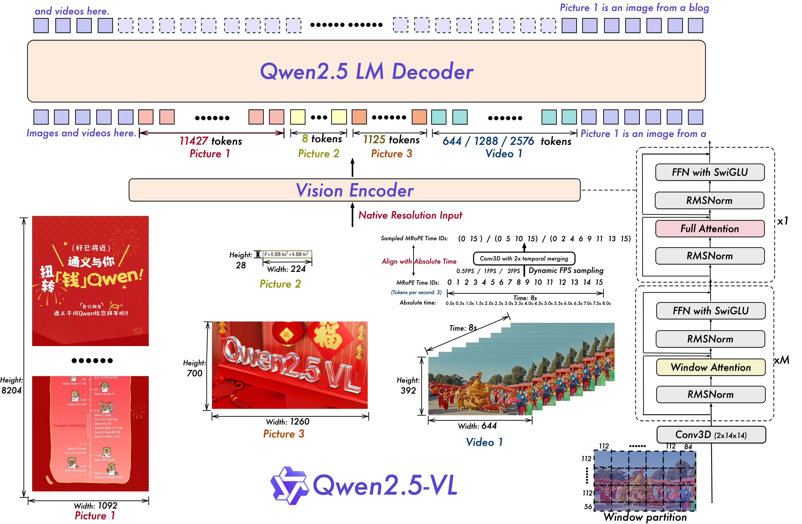
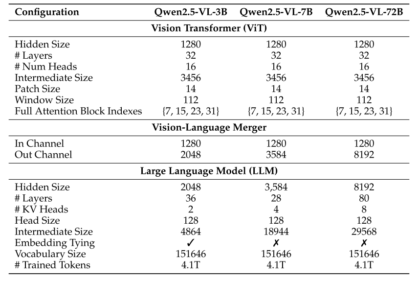

# Qwen2.5-VL

年初，Qwen团队推出了最新的视觉-语言（Vision-Language, VL）模型 —— **Qwen2.5-VL**。
 作为Qwen视觉语言系列的旗舰新作，这一代带来了很多**基础能力**和**创新功能**上的大跃进。

## 核心升级亮点

### 1. 更强的视觉理解力

Qwen2.5-VL在以下几个方面表现非常突出：

- **图像识别**：能更准确地认出图片里的物体。
- **精准定位**：可以用**边界框（bounding box）**或**关键点（points）**精确标出物体位置。
- **文档解析**：发票、表格、文档都能稳稳地抽取出结构化数据。
- **图表/布局分析**：对图表、流程图、布局等复杂图片也能做出细致理解。

🔵 想象你给模型一张发票，它可以告诉你：这是谁开的？多少钱？税号是多少？全部一键提取！


### 2. 长视频理解也不怕

Qwen2.5-VL特别引入了两项新技术：

- **动态分辨率处理（Dynamic Resolution Processing）**
  → 意思是它可以灵活处理不同大小的图片或不同长度的视频，不会被尺寸卡死。
- **绝对时间编码（Absolute Time Encoding）**
  → 可以精准定位到视频中的“第几秒发生了什么事”，而且可以处理**长达数小时**的视频！

而且，它实现了这些能力，**不需要传统的归一化（Normalization）操作**，这让模型能更自然地感知空间和时间变化。


### 3. 自研动态分辨率ViT

Qwen2.5-VL从头训练了一个**动态分辨率版Vision Transformer（ViT）**，并引入了**Window Attention机制**。

这有什么好处？

- **算力负担更小**：不会因为处理高分辨率图像而爆炸。
- **保留原图信息**：不像传统方法需要缩小图片，能看清每个细节。


### 4. 不只是静态理解，更能交互操作！

Qwen2.5-VL不仅能理解静态图片、文档，还可以做“交互式视觉代理”：

- 推理分析
- 使用工具（比如打开手机App，浏览网页）
- 执行任务（比如模拟鼠标点点点，完成一个流程）

🔵 未来你有可能只用拍一张手机屏幕，模型就帮你“远程操控”完成文件上传！


### 5. 强泛化，无需额外微调

在各种不同领域（文档、网页、日常照片、视频等）都能表现出很强的**零样本（zero-shot）泛化能力**。
 换句话说，大多数情况下**直接用就行**，不需要专门给它每个任务都微调。


Qwen2.5-VL一共有**三个版本**，覆盖从边缘设备到高性能服务器的各种场景：

- **Qwen2.5-VL-3B**：轻量级，适合资源受限的环境。
- **Qwen2.5-VL-7B**：中等规模，综合性能好。
- **Qwen2.5-VL-72B**：旗舰大模型，性能媲美 GPT-4o 和 Claude 3.5 Sonnet，特别擅长文档和图表理解！

而且，不仅视觉理解厉害，Qwen2.5-VL依然保持了Qwen2.5系列一贯优秀的**语言理解和生成能力**！


## Introduction

### LVLM（Large Vision-Language Models）？

简单来说，LVLM就是能“又看又懂”的大模型 —— 它们既能看图、读视频，又能用自然语言描述和推理。

这种多模态的融合，让AI不只是“读文字”，还能真正“理解世界”，比如识别图片里的场景、理解视频里的动作、分析文档里的结构信息等。

不过，虽然LVLMs发展迅速，目前它们还像一块夹心饼干的“中间层”：

- ✅ 能胜任各种任务
- ❌ 但在**精细感知**、**复杂推理**方面，离真正的卓越还有距离


### LVLM 进化

- **底层：精细视觉感知（Fine-grained Perception）**
  → 这就像饼干的底座，没有好的细粒度视觉理解，楼再高也不稳。
- **中层：一般多模态能力**
  → 现有LVLM基本能做个体面的“中层”，但还称不上完美。
- **顶层：多模态推理（Multi-modal Reasoning）**
  → 真正高阶的是多模态推理，比如看完表格后总结规律、看完视频后推断意图。

Qwen2.5-VL这次就是冲着**打牢底座、突破顶层**这两个目标去的！


### LVLM 的推动力

1. **架构创新**
   LVLM通常采用：
   - 一个**视觉编码器**（看图）
   - 一个**跨模态投影器**（桥接视觉和文本）
   - 一个**大型语言模型（LLM）**（理解和生成）
2. **精细感知模型的发展**
   越来越多模型专注于细粒度视觉理解，比如识别小物体、解析复杂图表。
3. **Omni架构、MoE机制**
   新一代架构（比如Omni模型、MoE稀疏专家机制）启发了更灵活、可扩展的设计思路。
4. **视觉编码器和分辨率扩展的改进**
   视觉编码器不断升级，加上动态分辨率技术，让模型看得更清晰、处理得更快。
5. **更好的数据集**
   高质量、覆盖更多场景和语言的多模态数据，是训练更强LVLM的基础。


### LVLM 面临的挑战

虽然进步很多，但现阶段LVLM还有明显短板，比如：

- **推理链条短**：上下文理解有限，复杂推理能力不足
- **精细感知弱**：小细节、复杂结构容易漏掉或误判
- **计算成本高**：推理慢、内存吃紧
- **长序列处理不稳**：视频太长或内容太多时容易丢信息


### Qwen2.5-VL 创新突破

Qwen2.5-VL这次提出了**四大技术亮点**：

**视觉编码器中引入窗口注意力（Window Attention）**

- 降低计算量，推理更快
- 保持高分辨率的同时节省资源

🔵 可以理解为模型一次只关注小范围的局部细节，而不是整个图像，提高了处理效率。

**动态FPS采样（Dynamic FPS Sampling）**

- **动态分辨率**概念扩展到了**时间维度**！
- 让模型可以根据需要灵活调整视频采样率，从而更好理解不同长度的视频。

🔵 比如短视频可以高频采样，长视频可以低频采样+重点细节高采样。

**升级版MRoPE时间编码（Temporal MRoPE）**

- 时间编码对齐到**绝对时间**
- 让模型更聪明地学习时间上的因果关系和顺序变化

🔵 模型可以真正知道“某事件发生在视频第几秒”，而不是模糊感知。

**数据量大爆发（从1.2T扩展到4.1T tokens）**

- 预训练+监督微调都用上了更优质、更丰富的数据
- 这样不仅视觉更强，语言能力也同步升级！


### Qwen2.5-VL 的明星能力总结

- **超强文档解析**：从简单 OCR 升级成“全能文档解析”，支持多场景、多语言、各种复杂文档（手写、表格、化学式、乐谱……）
- **高精度物体定位**：支持用绝对坐标、JSON等多种方式标注和推理物体位置
- **超长视频理解**：原生支持小时级长视频处理，同时秒级提取关键事件
- **超能交互代理**：在电脑、手机上做复杂操作（比如滑动、点选、填表），实现更强的自主行动能力


## Approach



### 2.1 Model Architecture

Qwen2.5-VL模型架构包括三大组件：

- **Large Language Model (LLM)**
  - 基于 Qwen2.5 LLM 预训练权重初始化。
  - 用 **Multimodal Rotary Position Embedding Aligned to Absolute Time** 替换了传统的 1D RoPE，以适配多模态时序理解。
- **Vision Encoder**
  - 基于重新设计的 ViT（Vision Transformer）。
  - 加入 **2D-RoPE** 和 **Window Attention**。
  - 输入图像会被处理成尺寸是 28 的倍数，打成14×14的小patch。
  - 大部分层使用局部窗口注意力（窗口大小 112×112，即 8×8 patches），只有 4 层使用全局自注意力，降低计算复杂度。
  - 视频输入支持 **3D patch partitioning**（每两帧组成一个patch group）。
- **MLP-based Vision-Language Merger**
  - 采用简单有效的 MLP 对视觉特征降维：
    - 将空间上邻近的 4 个 patch 特征拼接，通过两层 MLP 投影，压缩成与文本 embedding 对齐的维度。
    - 减少特征长度，提高效率，且能动态压缩不同长度的视觉特征序列。



#### 2.1.1 Fast and Efficient Vision Encoder

- 核心：**Window Attention** + **原生输入分辨率处理**。
- **输入无需强制缩放或padding**，原生分辨率训练，保留图像真实信息。
- **采用RMSNorm** 和 **SwiGLU**，提高计算效率与 LLM 兼容性。
- 训练过程：
  - **CLIP 预训练**、**视觉-语言对齐**、**端到端微调**。
  - **动态采样原生分辨率图片**以增强鲁棒性。

#### 2.1.2 Native Dynamic Resolution and Frame Rate

- 空间维度：
  - 图像直接根据**实际尺寸**生成 token 序列（而不是归一化坐标）。
- 时间维度（视频处理）：
  - 引入**动态帧率（FPS）训练**。
  - 通过**绝对时间编码**对齐，不增加推理开销。

#### 2.1.3 Multimodal Rotary Position Embedding Aligned to Absolute Time

- 继承并改进了 Qwen2-VL 的 Multimodal RoPE（MRoPE）：
  - 将位置编码分成**时间、宽、高**三部分。
  - 对文本输入：与 1D RoPE 一致。
  - 对图像输入：时间 ID 固定，高宽根据空间位置变化。
  - 对视频输入：时间 ID 逐帧递增。
- **新改进**：
  - 以**绝对时间**对齐MRoPE的时间分量，不再仅根据帧数计算。
  - 能适应不同FPS，捕捉时间动态。


### 2.2 Pre-Training

描述预训练数据和流程。

#### 2.2.1 Pre-Training Data

- 训练数据量：**从1.2万亿tokens扩展到约4万亿tokens**。
- 数据来源：清洗的网页数据、合成数据
- 覆盖多模态数据种类：
  - 图像描述、图文插入数据、OCR识别、视觉知识问答、定位数据、文档解析、视频描述、视频定位、Agent交互数据等。

**Interleaved Image-Text Data（交融式图文数据）**

文章特别强调了**图文交错数据**的重要性，它有三个好处：支持图文混合的上下文学习、保留纯文本能力、包含丰富的通用信息。

**问题**： 很多现有的图文交错数据质量不高，图片和文字关联不强，或者信息嘈杂。

**解决方案**： Qwen2.5-VL 团队开发了一套**评分和清洗流程**来确保数据质量。

- 先进行标准的数据清洗。
- 然后使用一个内部模型进行**四阶段评分**：1) 纯文本质量，2) 图文相关性，3) 图文互补性（图片和文字是否提供了互补的新信息），4) 信息密度平衡（图文信息量分布是否均衡）。

这种严格筛选保证了模型能从高质量的图文交错数据中学习复杂的推理和生成能力。


**Grounding Data with Absolute Position Coordinates（带绝对坐标的定向标注数据）**

为训练模型具备精准的视觉定位能力，构建了高质量的 Grounding 数据：

- **绝对坐标训练**：标注使用的是原始图像尺寸下的绝对位置（而非归一化到0~1区间），保留了真实尺寸比例，有助于提升模型在实际应用中的定位准确率。
- **合成数据增强**：
  - 使用 **Grounding DINO** 检测器生成更多目标框标注。
  - 使用 **SAM**（Segment Anything Model）切分出精细物体区域。
  - 采用 **Copy-Paste增强**：将切分出的物体随机粘贴到不同背景中，模拟不同场景，提高模型的泛化能力。
- **类别扩展**：覆盖超过10,000个细粒度类别，支持Open-Vocabulary Detection（开放词汇检测）和极端小物体检测，确保模型具备良好的长尾识别和微小目标识别能力。


**Pointing Data（指点数据）**

指向式理解能力（比如用户点击物体、问"这个是什么？"）需要专门的数据支撑，因此构建了多来源的指点数据集：

- **公开数据集利用**：使用如PixMo等公开指点数据集，补充基础训练样本。
- **检测分割数据转换**：从已有的目标检测、分割数据中，自动生成"点"标注（如取物体中心、边缘等位置作为指点点位）。
- **自动化合成指点数据**：基于规则和模型推理，生成指向不同物体部位、遮挡区域、复杂场景中物体边界点的精准指点标注，提升模型处理复杂点击指令的能力。


**Document Omni-Parsing Data（文档全能解析数据）**

为使模型能够理解和解析复杂文档（如PDF、扫描件、网页）中的结构与内容，构建了专门的文档解析数据集：

```html
<html><body>
# paragraph
<p data-bbox="x1 y1 x2 y2"> content </p>
# table
<style>table{id} style</style><table data-bbox="x1 y1 x2 y2" class="table{id}"> table content
</table>
# chart
<div class="chart" data-bbox="x1 y1 x2 y2"> <table> chart content
</table></div>
# formula
<div class="formula" data-bbox="x1 y1 x2 y2">  <div> formula
content </div></div>
# image caption
<div class="image caption" data-bbox="x1 y1 x2 y2"> <p> image
caption </p></div>
# image ocr
<div class="image ocr" data-bbox="x1 y1 x2 y2"> <p> image ocr
</p></div>
# music sheet
<div class="music sheet" format="abc notation" data-bbox="x1 y1 x2 y2">  <div> music sheet content </div></div>
# chemical formula content
<div class="chemical formula" format="smile" data-bbox="x1 y1 x2 y2">  <div> chemical formula content </div></div>
</html></body>
```

- **统一HTML格式转化**：将各类文档（扫描图片、PDF、网页快照等）解析成统一的HTML格式，清晰标注出文档的层级和逻辑结构。
- **布局框（Layout Boxes）**：标注每个段落、标题、图片、表格等元素的位置框，训练模型识别文档布局。
- **插图描述（Figure Captions）**：为图表、插图等提供关联的文字描述，提升跨模态理解能力。
- **段落与图表坐标标注**：细粒度标注文本段落、图表等元素的绝对位置信息，支持模型进行精细的版面推理和交互。

目标是让模型具备“一体化文档理解”能力，能够直接从复杂文档中完成版面重建、内容提取、推理分析等多种任务。


**OCR Data（OCR数据）**

为了让模型具备“看图识字”的能力，Qwen2.5-VL使用了**合成数据、开源数据以及自建数据**三类OCR数据源：

- **合成数据**：通过视觉文本生成引擎制造出来的高质量文本图像。简单来说，就是“人工制造”街头招牌、商品标签等真实场景里的文字图像，确保多样性和清晰度。
- **多语种支持**：不止中文英文，还涵盖了法语、德语、西班牙语、葡萄牙语、阿拉伯语、俄语、日语、韩语、越南语等多种语言。通过一个大规模的多语种OCR数据集，模型能识别全球多语言的文本图像。
- **场景多样性**：不仅有合成图像，还有真实世界中自然场景的图像（如街头标牌、商品包装）。这种组合让模型能适应复杂的环境条件，比如模糊、阴影、扭曲等情况。

此外，对于更结构化的视觉信息：

- **图表数据**：使用 `matplotlib`、`seaborn` 和 `plotly` 等可视化库，合成了**100万张图表样本**，涵盖柱状图、关系图、热力图等。这类数据让模型具备解读统计图的能力。
- **表格数据**：从真实世界收集了**600万个表格**，通过表格识别模型进行处理，再过滤掉低置信度、重叠或空白过多的表格，确保训练样本质量。


**Video Data（视频数据）**

视频数据带来了“时间”这一新维度，训练模型理解视频内容也就变得更具挑战。

- **动态采样帧率**（FPS）：在训练时不固定帧率，而是**动态采样**不同的FPS值，以适应各种视频格式，从流畅的高帧动画到低帧监控录像都能识别。

- **长视频处理**：特别针对**超过30分钟**的视频，设计了一条合成流程，通过多帧联合生成长视频的字幕数据，提升模型处理长时序视频的能力。

- **视频时间定位**：支持两种时间戳格式：

  - 秒级（如 135s）
  - 帧级（如 00:02:15:10）——小时:分钟:秒:帧

  这使得模型能精准地进行视频片段的定位与理解，适用于任务如“给出某场比赛关键瞬间的截图”或“视频总结摘要”等。


**Agent Data（代理数据）**

如果说前面是让模型“能看懂世界”，那么 Agent 数据就是让它“能动起来”。

**感知（Perception）**：

- 收集了**移动端、网页、桌面**三种平台的截图。
- 使用合成引擎生成了：
  - **UI元素的文字描述**（captioning）：例如“点击‘确认’按钮提交表单”。
  - **元素定位标注**（grounding）：标出图中哪个元素是“确认”按钮。

这种训练让模型不仅能理解图形界面，还知道每个按钮、输入框的功能。

**决策（Decision-making）**：

- 将各平台的用户操作**统一成函数调用格式**（function call），简化了跨平台操作的抽象。
- 收集并重构了多个由人类和模型共同生成的多步骤任务轨迹（如打开网页 -> 输入网址 -> 点击按钮），每一步都配上了截图、操作前后变化、和**操作背后的推理解释**。
- 使用模型过滤器清理掉质量低的解释内容，从而让模型不只是学到“点哪个”，而是理解“为什么点它”。


#### 2.2.2 Training Recipe

Qwen2.5-VL 训练过程就像建造一座复杂的桥梁，将视觉和语言这两个世界连接起来，并且这个过程是分步完成的，每个阶段都有特定的目标和方法。

**模型的基础：强大的“基石”**

Qwen2.5-VL 的构建并非从零开始。它利用了两个已经很强大的“基石”：

1. **视觉编码器 (Vision Transformer, ViT):** 负责理解图像的部分。它不是凭空训练的，而是首先在 DataComp 和一些内部数据集上进行了预训练。这就像是让它提前学习了如何“看”世界。
2. **语言模型 (Large Language Model, LLM - Qwen2.5):** 负责理解和生成文本的部分。直接使用了预训练好的 Qwen2.5 大型语言模型作为初始化。这就像是它已经具备了强大的语言表达和推理能力。

训练的目标，就是让这两个强大的组件协同工作，真正实现“眼观六路，耳听八方”。


**分阶段的训练：循序渐进增强能力**

整个训练过程被精妙地分为了三个不同的阶段，每个阶段都在前一个阶段的基础上，逐步提升模型的多模态能力：

1. **第一阶段：构建视觉与语言的“桥梁基座”**

   - **目标：** 核心是让视觉编码器 (ViT) 能够更好地与语言模型“对话”。这一步的目标是打下坚实的多模态理解基础。
   - **训练对象：** 只有 ViT 部分被训练，而 LLM 部分是冻结的（参数不改变）。
   - **使用数据：** 主要使用图像-文本配对数据，比如图像描述（captions）、视觉知识问答、以及 OCR (光学字符识别) 数据。
   - **目的：** 通过这些数据，ViT 学习如何从图像中提取出那些对语言模型有意义的视觉特征，为后续的深度融合做准备。

2. **第二阶段：多模态能力的全面融合与增强**

   - **目标：** 在第一阶段建立的基础上，全面提升模型处理复杂视觉信息和建立视觉-语言深层联系的能力。

   - **训练对象：** 所有模型参数都被“解冻”，ViT、LLM 以及它们之间的连接部分都参与训练。

   - 使用数据：

     数据类型变得非常丰富和多样化，包括：

     - **交错数据 (interleaved data):** 图像和文本穿插出现，模拟更自然的对话或文档。
     - **多任务学习数据集 (multi-task learning datasets):** 包含多种不同类型的视觉-语言任务。
     - **视觉问答 (VQA):** 回答关于图像内容的问题。
     - **多模态数学 (multimodal mathematics):** 理解包含数学符号和图示的图像。
     - **基于智能体 (agent-based tasks):** 需要模型理解视觉环境并做出决策。
     - **视频理解 (video understanding):** 虽然不是主要焦点，但引入了理解序列视觉信息的能力。
     - **纯文本数据 (pure-text datasets):** 保持和增强 LLM 的语言能力。

   - **目的：** 通过这些更复杂、更需要推理的数据，模型学习如何将视觉信息与语言信息进行更深层次的对齐和交互，处理更复杂的任务。

3. **第三阶段：提升长序列推理和高级任务处理能力**

   - **目标：** 进一步增强模型在处理长序列信息（如视频、复杂的智能体任务）时的推理能力。
   - **训练对象：** 在第二阶段的基础上继续训练所有参数。
   - **使用数据：** 重点加入了视频和基于智能体的数据。
   - **关键调整：** **显著增加了输入序列的长度**。
   - **目的：** 增加序列长度让模型能够捕捉更长范围的依赖关系，这对于理解视频的时间序列、处理复杂的智能体决策链等任务至关重要，使得模型能够处理更高级、更精密的任务。


**训练中的优化：平衡负载**

在训练这样一个包含大型视觉和语言组件的模型时，一个巨大的挑战是不同数据（大小各异的图像，长度不一的文本）会导致计算负载不均衡，浪费计算资源。Qwen2.5-VL 的训练采取了一种“聪明”的优化方式来解决这个问题：

- **挑战：** 主要的计算成本来自 LLM 和 ViT。不同输入会导致它们的计算量差异很大。
- **观察：** ViT 的参数相对较少，并且通过引入窗口注意力（window attention）进一步优化了其计算效率。
- **解决方案：** 将优化重点放在了平衡 **LLM** 的计算负载上。他们不是简单地批量处理数据，而是根据输入到 LLM 的文本序列长度，动态地将数据样本进行“打包”。
- **效果：** 这种动态打包确保了每个计算单元（比如 GPU）上的 LLM 计算负载尽可能保持一致，极大地提高了训练效率。
- **具体实践：** 在第一和第二阶段，数据被打包到序列长度为 8,192；在第三阶段，为了适应处理更长序列的需求，打包长度增加到了 32,768。


### 2.3 Post-training

Qwen2.5-VL 通过多阶段的预训练学会了“看”和“理解”世界。但就像一个资优生还需要经过专门辅导和实践才能应对各种考试和应用一样，强大的预训练模型也需要一个关键步骤来变得更加实用、更能准确遵循人类指令——后训练 (Post-training)

Qwen2.5-VL 的后训练过程设计得非常巧妙，它采用了 **“监督微调 (Supervised Fine-Tuning, SFT)”** 和 **“直接偏好优化 (Direct Preference Optimization, DPO)”** 这两个阶段，就像是一个双管齐下的策略，既提升模型的“硬实力”（理解并执行指令），也优化模型的“软实力”（行为更符合人类偏好）。

#### 监督微调 (SFT)

SFT 阶段的目标是弥合预训练模型学到的通用知识与实际下游任务需求之间的差距。简单来说，就是教会模型如何根据具体的指令来生成恰当的多模态响应。

在这个阶段，一个重要的改变是引入了 **ChatML 格式** 来组织训练数据。虽然这不同于预训练时使用的数据格式，但模型的整体架构是保持一致的。采用 ChatML 格式带来了几个关键优势：

1. **明确对话角色：** 能够清晰地区分用户和模型的发言，使得多轮对话成为可能，尤其是在处理交替出现的图像和文本时。
2. **结构化处理视觉信息：** 可以将图像的嵌入（模型理解图像后产生的数字表示）以结构化的方式与文本指令结合在一起，确保模型在处理指令时能够有效地利用图像信息。
3. **保持跨模态位置关系：** 在打包数据时，ChatML 格式有助于维护图像和文本在输入序列中的相对位置关系，这对于理解复杂的图文交织内容至关重要。

通过在增强的 ChatML 格式下，向模型展示经过精心组织的大量“指令-响应”对，SFT 阶段让模型在不破坏原有强大能力的前提下，学会了如何精准地执行指令。

#### SFT 阶段的数据

SFT 的效果很大程度上取决于训练数据的质量和多样性。Qwen2.5-VL 使用了一个庞大且经过精心策划的数据集：

- **规模：** 大约 200 万条数据。

- **构成：** 纯文本数据和多模态数据（包含图像-文本、视频-文本）各占一半 (50%)。虽然数量均等，但多模态数据由于包含视觉信息，占用的计算资源更多。

- **语言：** 主要包含中文和英文，并补充了一些其他语言的数据以提升多语言能力。

- **复杂度：** 涵盖了单轮对话和多轮对话，以及涉及单张图像或多张图像序列的场景，模拟真实的交互情境。

- **来源广泛：** 数据来源于开源数据集、购买的数据集以及在线抓取的数据，确保了广泛的覆盖面。

- 任务全面：

  数据集包含了各种专门的任务类型，例如：

  - **通用视觉问答 (VQA)** 和 **图像描述 (Captioning)**
  - **数学问题求解** 和 **编程相关任务**
  - **安全相关的查询**
  - 以及针对 **文档和 OCR (Doc and OCR)**、**视觉定位 (Grounding)**、**视频分析 (Video Analysis)**、**智能体交互 (Agent Interactions)** 等更专业领域的任务。

这种全面而多样的数据集结构，确保了 SFT 阶段能够有效地将预训练模型的通用能力，转化为能够应对各种细致入微的多模态下游任务的强大执行力。

#### 数据清洗流程

我们知道，“垃圾进，垃圾出”的原则在模型训练中尤为适用。开源和合成数据常常包含噪音、重复或低质量的样本。为了确保 SFT 的效果，Qwen2.5-VL 引入了一个严谨的两阶段数据过滤流程：

1. **第一阶段：领域专项分类**
   - 使用一个从 Qwen2-VL-72B 衍生出来的专门分类模型 (Qwen2-VL-Instag)，将问答对分门别类。
   - 数据被分到 8 个主领域（如编程与规划），再细分为 30 个子类别。
   - 这样做的好处是可以针对不同领域和子领域的特点，采用更具针对性的清洗策略。
2. **第二阶段：领域定制化过滤**
   - 结合了**基于规则**和**基于模型**的方法进行精细过滤。
   - **基于规则：** 使用预设的规则，例如剔除文档/OCR/定位数据中的重复模式，去除不完整、截断或格式错误的回应，以及过滤掉与查询无关或可能产生有害输出的内容。
   - **基于模型：** 使用在 Qwen2.5-VL 系列上训练的奖励模型，从多个维度评估问答对的质量。模型会评估问题的复杂性和相关性，以及答案的正确性、完整性、清晰度、与问题的相关性和实用性。对于涉及视觉定位的任务，还会特别检查模型是否准确理解和使用了视觉信息。只有通过这些严格评估的高质量数据才能进入 SFT 训练。

#### “拒绝采样”提升推理能力

除了结构化的数据过滤，Qwen2.5-VL 还使用了“拒绝采样 (Rejection Sampling)”这种技术来进一步提炼数据集，特别是在增强模型的推理能力方面。

> 在构造训练数据时，我们不盲目使用所有模型生成的样本，而是**挑选那些“推理过程正确、结果准确”的样本用于训练**。这就像老师只让学生看解题正确的范例，而忽略错误或不清晰的解答。

这个方法对于数学、编程等需要多步骤推理的任务尤为重要。研究表明，引入思维链 (Chain-of-Thought, CoT) 推理可以显著提升模型的推理表现。拒绝采样就是用来确保训练数据中的 CoT 过程是高质量且准确的。

- **过程：** 从包含正确答案（ground truth）的数据集开始。使用一个能力较强的 Qwen2.5-VL 版本来生成推理过程和答案。**只保留那些模型生成的答案与正确答案完全匹配的样本。**
- **进一步优化：** 还会过滤掉那些推理过程混乱、冗长、重复或包含代码切换（code-switching）的样本，确保思维链清晰连贯。
- **挑战与应对：** 多模态模型的推理需要同时利用文本和视觉信息。确保思维链中的每一步都准确地整合了视觉信息是一个挑战。为此，他们开发了规则和模型相结合的过滤策略来验证推理步骤是否有效地利用了视觉信息。

通过拒绝采样获得的这种高保真、强调准确推理的数据，极大地提升了模型处理复杂推理任务的能力。

#### 后训练的“训练秘籍”

总结来说，Qwen2.5-VL 的后训练流程是：

1. **SFT 阶段：** 在 ViT 参数**冻结**（不改变）的情况下，使用包括文本、图像-文本、视频-文本在内的各种多模态指令数据进行微调。数据来源多样，包括通用 VQA、通过拒绝采样得到的高质量推理数据，以及文档、OCR、定位、视频、智能体等领域的专业数据。
2. **DPO 阶段：** 在 SFT 之后进行，专注于使用偏好数据（例如，模型对同一个指令给出的不同回应，哪一个更好）来进一步将模型行为与人类偏好对齐。这个阶段仅使用图像-文本和纯文本的偏好数据，并且每个样本只处理一次以提高效率。同样，ViT 参数在此阶段也是冻结的。

通过 SFT 和 DPO 这两个阶段，Qwen2.5-VL 在预训练的强大基础上，通过结构化的指令学习和人类偏好对齐，被塑造成一个更加实用、可靠且能够精准理解和执行复杂多模态指令的 AI 助手。数据质量的严格把控和推理能力的特别强化，是其成功的关键所在。

