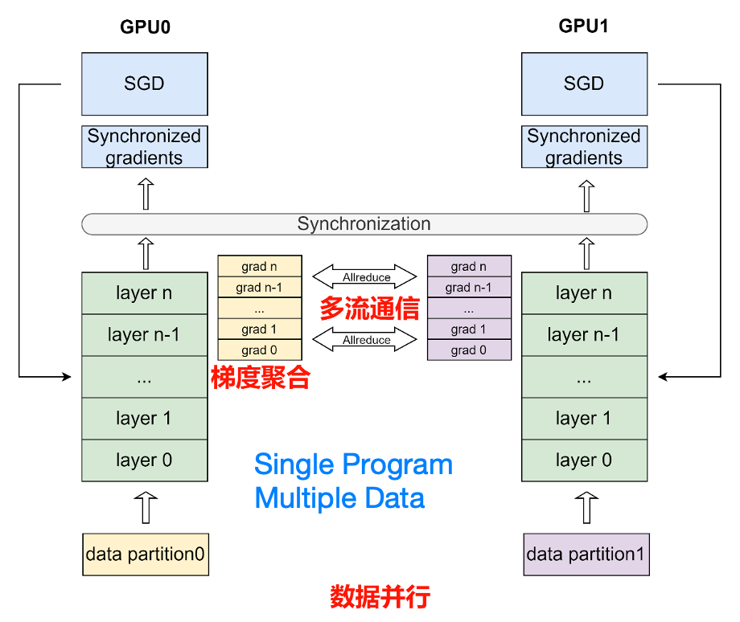
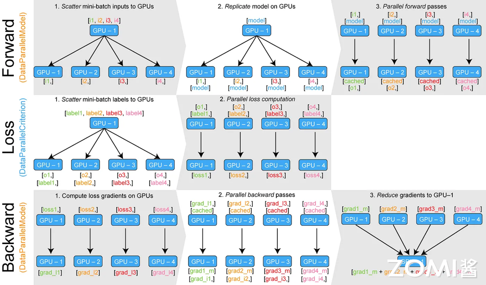
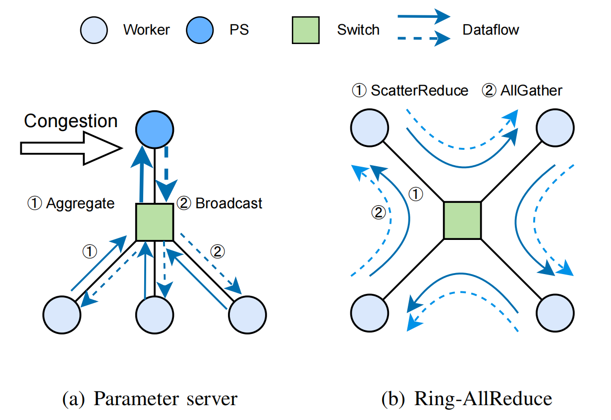
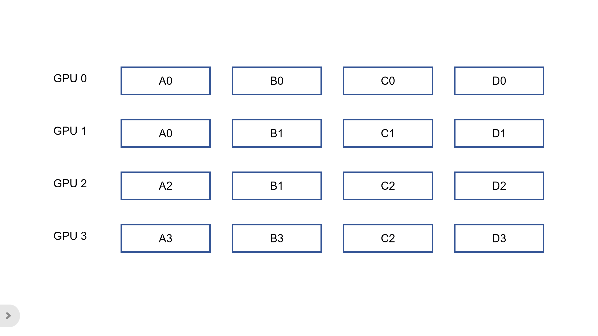
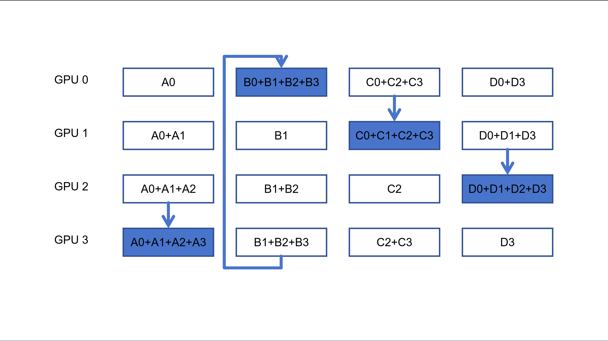

深度学习模型通常包含大量的参数，随着模型规模和数据量的增长，单一设备往往无法承载训练过程中的计算与存储需求。为了解决这个问题，**分布式训练**技术应运而生，它能够有效地利用多台设备（如 GPU/TPU 集群），并通过协同工作加速训练过程，处理大规模数据集。**数据并行**作为分布式训练的核心策略之一，主要通过将数据切分到多个设备上进行并行计算，达到加速模型训练的目的。

下面重点介绍两种常用的分布式数据并行策略——**数据并行（DP）** 和 **分布式数据并行（DDP）**，并分析它们各自的优缺点、基本原理及实现方式。此外，还会探讨一些与分布式训练密切相关的通信机制，如 All-Reduce 算法，以及如何通过计算和通信的重叠来提高训练效率。


## 数据并行

数据并行是深度学习领域最常用的并行方法。在此策略下数据集被平均分为多份，每个卡上保存完整的模型参数并独立处理一份子数据集，以加速模型训练过程。

在数据并行训练过程中，每个卡上的输入数据是不同的。各个卡独立地执行网络的前向传播和反向传播，计算出各自卡上的参数梯度。随后，使用 AllReduce 等集合通信原语，将各个卡上计算出的参数梯度进行累加聚合，得到最终的全局参数梯度。最后，全局参数梯度进入优化器进行参数更新，完成一个完整的 mini-batch 训练流程。




>通讯原语（Communication Primitives）是指在并行计算和分布式计算中，用于不同计算节点或进程之间进行数据交换和同步的基础操作。这些操作为高效的数据传输和同步提供了底层支持，常见的通讯原语包括：
>
>1. **点对点通信（Point-to-Point Communication）**：
>   - **发送（Send）**：一个进程将数据发送到另一个进程或计算节点。
>   - **接收（Receive）**：接收方进程从发送方获取数据。
>2. **集体通信（Collective Communication）**：
>   - **广播（Broadcast）**：一个进程将数据发送给所有其他进程。
>   - **归约（Reduce）**：将多个进程的数据进行某种形式的聚合操作（如求和、最大值等），并将结果发送给特定进程。
>   - **散布（Scatter）**：将数据从一个进程分发到多个进程。
>   - **收集（Gather）**：将多个进程的数据集中到一个进程中。
>3. **同步操作（Synchronization）**：
>   - **屏障（Barrier）**：所有进程在屏障点上等待，直到所有进程都到达屏障点，然后才能继续执行。
>
>在深度学习分布式训练中，通信原语通常由底层的通讯库（如NCCL、MPI等）提供支持，用于实现数据并行和模型并行等策略的高效通信。


### 1. DP

DP（Data Parallelism，数据并行）将数据批次（batch）切分到多个设备，每个设备拥有完整的模型副本，独立计算梯度后同步更新。


#### 基本流程

- **模型复制**：将整个模型复制到多个设备（通常是多个 GPU）上，每个设备上拥有一份完整的模型参数。
- **输入切分**：将一个 batch 的输入数据沿着 batch 维度分割成若干份，每份分配给一个 GPU（如batch_size=64，4卡则每个卡处理16个样本）。
- **并行计算**：各个 GPU 上的模型副本分别进行前向传播和反向传播，**计算出各自的损失和梯度**。
- **梯度汇总**：在反向传播结束后，将各个 GPU 上计算的梯度汇总（累加）到主 GPU（默认GPU 0），更新模型参数。
- **参数同步**：更新后的参数需要在各个 GPU 间同步，主 GPU 将模型参数广播给所有 GPU，确保所有模型副本一致。

>DP 的过程是在主 GPU 上更新完模型后将主 GPU 的模型复制到别的 GPU 上还是，将梯度传递给每个 GPU，让每个 GPU 去做梯度计算?




#### 实现方式

```python
import torch
import torch.nn as nn
import torch.optim as optim
from torchvision import datasets, transforms, models
from torch.utils.data import DataLoader
from tqdm import tqdm

def main():
    # 设置超参数
    batch_size = 32
    epochs = 10
    learning_rate = 0.001

    # 检查 GPU 可用性
    device = torch.device("cuda" if torch.cuda.is_available() else "cpu")
    
    # 加载预训练的 ResNet 模型
    model = models.resnet18(pretrained=True).to(device)
    
    # 替换最后一层以匹配 CIFAR-10 的类别数（10）
    model.fc = nn.Linear(model.fc.in_features, 10).to(device)

    # 如果有多张 GPU，使用 DataParallel
    if torch.cuda.device_count() > 1:
        print(f"Using {torch.cuda.device_count()} GPUs!")
        model = nn.DataParallel(model)

    # 定义损失函数和优化器
    criterion = nn.CrossEntropyLoss()
    optimizer = optim.Adam(model.parameters(), lr=learning_rate)

    # 数据预处理
    transform = transforms.Compose([
        transforms.Resize((224, 224)),  # ResNet 的标准输入尺寸为 224x224
        transforms.ToTensor(),
        transforms.Normalize(mean=[0.485, 0.456, 0.406], std=[0.229, 0.224, 0.225])  # 使用预训练模型的规范化
    ])

    # 下载并加载 CIFAR-10 数据集
    train_dataset = datasets.CIFAR10(root='./data', train=True, transform=transform, download=True)
    test_dataset = datasets.CIFAR10(root='./data', train=False, transform=transform, download=True)

    train_loader = DataLoader(train_dataset, batch_size=batch_size, shuffle=True, num_workers=4)
    test_loader = DataLoader(test_dataset, batch_size=batch_size, shuffle=False, num_workers=4)

    # 定义训练和测试函数
    def train(model, device, train_loader, optimizer, criterion, epoch):
        model.train()
        for batch_idx, (data, target) in enumerate(tqdm(train_loader, desc=f"Training Epoch {epoch}")):
            data, target = data.to(device), target.to(device)
            optimizer.zero_grad()
            output = model(data)
            loss = criterion(output, target)
            loss.backward()
            optimizer.step()

    def test(model, device, test_loader, criterion):
        model.eval()
        test_loss = 0
        correct = 0
        with torch.no_grad():
            for data, target in test_loader:
                data, target = data.to(device), target.to(device)
                output = model(data)
                test_loss += criterion(output, target).item()  # 将批次损失累加
                pred = output.argmax(dim=1, keepdim=True)  # 获取预测结果
                correct += pred.eq(target.view_as(pred)).sum().item()  # 统计正确预测的数量

        test_loss /= len(test_loader.dataset)
        accuracy = 100. * correct / len(test_loader.dataset)
        print(f"\nTest set: Average loss: {test_loss:.4f}, Accuracy: {correct}/{len(test_loader.dataset)} ({accuracy:.0f}%)\n")

    # 训练和测试模型
    for epoch in range(1, epochs + 1):
        train(model, device, train_loader, optimizer, criterion, epoch)
        test(model, device, test_loader, criterion)

if __name__ == "__main__":
    main()
```


#### 缺陷

**通信开销大**

- **梯度汇总瓶颈**：所有 GPU 的梯度需要汇总到主 GPU，再进行更新，然后再将更新后的参数广播到其他 GPU。在 GPU 数量增多时，这一步的通信量和延迟会急剧上升。
- **数据复制开销**：输入数据切分、模型复制、梯度复制等操作会引入额外的内存拷贝和通信开销，特别是在跨 GPU 通信时，这部分开销显得尤为明显。

**单进程限制**

- **GIL 影响**：在 Python 中，DP 通常运行在单个进程下，这可能受限于全局解释器锁（GIL）及单进程调度，无法充分利用多核 CPU 的并发优势。
- **扩展性不足**：由于所有的操作都在一个进程内进行管理，难以自然扩展到多节点（跨机器）的分布式训练。

**内存占用高**

- 每个 GPU 都保存一份完整的模型副本，对于非常大的模型来说，会导致 GPU 内存消耗过高，甚至可能无法容纳模型。

**多机支持不足**

-  DP 仅支持单机多卡，无法直接扩展到多机。


### 2. DDP

DDP（Distributed Data Parallel, 分布式数据并行） 通过 **去中心化的 All-Reduce 通信** 替代 DP 的主从架构，每个 GPU 直接与其他 GPU 通信，避免将梯度集中到单一设备，消除了单点瓶颈，同时可以方便地扩展到多节点训练，适合大规模分布式场景。

DDP 将整个模型复制到多个 GPU（或节点）上，每个 GPU 对不同的数据子集进行前向与反向传播，得到局部的梯度；然后通过跨进程（跨设备）的通信（通常使用 all-reduce 算法）将各个进程计算得到的梯度同步（通常是求平均），从而确保所有模型副本在参数更新后保持完全一致。这种方法在数学上与单卡训练完全等价，同时可以充分利用多 GPU 的并行计算能力。

>1. Rank
>
>Rank是指分布式训练中的一个计算节点或进程的唯一标识符。每个节点在集群中都有一个唯一的rank编号（通常从0开始）。
>
>- 作用：rank用于区分不同的进程，每个rank负责处理不同部分的数据或模型。在数据并行训练中，每个rank处理不同的mini-batch数据；在模型并行训练中，rank负责不同的模型部分。
>
>- 例子：假设有4个节点参与训练，每个节点的rank分别是0、1、2、3。在使用 PyTorch 的 DDP（Distributed Data Parallel）时，每个进程会有一个不同的rank，控制其在训练中的行为。
>
>2. Local Rank
>
>local rank是指在单个节点上，多个进程中的rank编号。与全局rank（global rank）对应，每个节点可以有多个进程，在节点内每个进程的rank称为local rank。
>
>- 作用：在多机多卡的训练中，每个节点上的local rank可以用来区分不同的GPU或进程。local rank通常与物理设备（如GPU）直接相关。
>
>- 例子：假设在每个节点上有2个GPU，而总共有4个节点参与训练，那么节点0的local rank是0和1，节点1的local rank是0和1，以此类推。
>
>3. Global Rank
>
>global rank是指在整个分布式训练集群中，每个进程的唯一标识符。它是跨节点的编号，通常从0开始，按顺序递增，直到所有进程都有一个唯一的global rank。
>
>- 作用：global rank用于全局标识每个进程，不同节点上的进程会有不同的global rank。
>
>- 例子：假设在一个集群中有4个节点，每个节点上有2个GPU，总共有8个进程，global rank的值会从0到7。
>
>4. World Size
>
>world size是指参与分布式训练的进程总数，也就是所有节点和GPU的总数。
>
>- 作用：它决定了分布式训练中进程的数量，通常用于设置分布式训练环境的参数，比如在PyTorch中会用到`torch.distributed.init_process_group()`中的`world_size`参数。
>
>- 例子：如果你有4个节点，每个节点有2个GPU，那么world size是8。
>
>5. Local World Size
>
>local world size是指单个节点上的进程数量，通常对应每个节点上的GPU数量。
>
>- **作用**：它是节点级别的进程总数，与global world size不同，local world size仅限于当前节点。
>
>- **例子**：如果每个节点有2个GPU，那么local world size就是2。


#### 基本流程

##### 初始化阶段

1. **环境与进程组初始化**
   每个进程调用 `dist.init_process_group()`（通常使用 NCCL 后端用于 GPU 设备）建立跨进程通信组，同时各进程通过环境变量或命令行参数确定其全局编号（rank）、局部编号（local_rank）以及总进程数（world_size）。
2. **模型同步**
   - 在各个进程中创建模型和优化器副本并将其移动到对应的 GPU 上。
   - 在构造 DDP 模型时，DDP 会从 rank0 进程将模型参数和缓冲区广播到所有其他进程，保证初始状态一致。
3. **构造分布式数据采样器**
   为了避免多个进程训练时使用重复数据，需要用 `DistributedSampler` 将数据集按进程编号划分，保证每个进程得到的数据子集不重叠，同时可保证每个 epoch 内数据随机但各进程使用的随机种子一致。


##### 训练阶段

1. **前向传播**
   - 每个进程分别对其本地数据子集进行前向传播，计算输出与损失。
   - 如果模型中有 BatchNorm 等需要同步的状态，DDP 会在前向传播开始时同步各进程的 buffer。
2. **反向传播与梯度同步**
   - 在每个进程中进行反向传播，此时通过事先注册在参数上的 autograd hook 触发梯度同步操作。
   - DDP 内部将所有参数按照预设顺序分到不同的 “bucket” 中；当桶内所有参数的梯度都计算完成后，立即启动异步 all-reduce 操作对该桶的梯度进行求和（或平均）。
   - 采用梯度分桶的目的在于：合并多个小张量以提高通信效率，同时允许部分梯度计算与同步重叠执行。
3. **优化器更新**
   同步完成后，每个进程获得完全一致的梯度，然后各自使用自己的优化器步进更新本地模型参数。因为梯度相同，所以更新后所有模型保持一致。
4. **（可选）梯度累积与 no_sync**
   为减少通信开销，有时可以使用 `model.no_sync()` 进行梯度累积，即在多个 mini-batch 上不进行同步，待累计一定步数后再同步一次。


##### 保存模型

1. **保存/加载模型**
   由于模型参数在各进程上保持一致，因此通常只在 rank0 进程保存模型，避免重复保存；加载时也需要确保在构造 DDP 模型之前进行。


#### 实现方法

```python
import torch
import torch.nn as nn
import torch.optim as optim
import torch.distributed as dist
from torch.nn.parallel import DistributedDataParallel as DDP
from torch.utils.data import DataLoader
from torch.utils.data.distributed import DistributedSampler
import torchvision
from torchvision import datasets, transforms
import argparse
import os


def train(local_rank, world_size, epochs, batch_size, lr):
    # 初始化进程组
    dist.init_process_group("nccl", rank=local_rank, world_size=world_size)
    torch.cuda.set_device(local_rank)

    # 数据增强和预处理
    transform_train = transforms.Compose(
        [
            transforms.RandomCrop(32, padding=4),
            transforms.RandomHorizontalFlip(),
            transforms.ToTensor(),
            transforms.Normalize((0.4914, 0.4822, 0.4465), (0.2023, 0.1994, 0.2010)),
        ]
    )

    transform_test = transforms.Compose(
        [
            transforms.ToTensor(),
            transforms.Normalize((0.4914, 0.4822, 0.4465), (0.2023, 0.1994, 0.2010)),
        ]
    )

    # 加载数据集
    train_dataset = datasets.CIFAR10(
        root="./data", train=True, download=True, transform=transform_train
    )
    test_dataset = datasets.CIFAR10(
        root="./data", train=False, download=True, transform=transform_test
    )

    # 创建分布式采样器
    train_sampler = DistributedSampler(
        train_dataset, num_replicas=world_size, rank=local_rank, shuffle=True
    )
    test_sampler = DistributedSampler(
        test_dataset, num_replicas=world_size, rank=local_rank, shuffle=False
    )

    # 创建数据加载器
    train_loader = DataLoader(
        train_dataset,
        batch_size=batch_size,
        sampler=train_sampler,
        num_workers=4,
        pin_memory=True,
    )
    test_loader = DataLoader(
        test_dataset,
        batch_size=batch_size,
        sampler=test_sampler,
        num_workers=4,
        pin_memory=True,
    )

    # 创建模型并修改结构以适应CIFAR10
    model = torchvision.models.resnet50(
        weights=torchvision.models.ResNet50_Weights.DEFAULT
    )
    model.conv1 = nn.Conv2d(3, 64, kernel_size=3, stride=1, padding=1, bias=False)
    model.maxpool = nn.Identity()  # 移除原始maxpool
    model.avgpool = nn.AdaptiveAvgPool2d((1, 1))  # 自适应平均池化
    model.fc = nn.Linear(2048, 10)  # 修改全连接层

    model = model.cuda(local_rank)
    model = DDP(model, device_ids=[local_rank])

    # 定义损失函数和优化器
    criterion = nn.CrossEntropyLoss().cuda(local_rank)
    optimizer = optim.SGD(model.parameters(), lr=lr, momentum=0.9, weight_decay=5e-4)

    # 训练循环
    for epoch in range(epochs):
        model.train()
        train_sampler.set_epoch(epoch)

        for batch_idx, (data, target) in enumerate(train_loader):
            data = data.cuda(local_rank, non_blocking=True)
            target = target.cuda(local_rank, non_blocking=True)

            optimizer.zero_grad()
            output = model(data)
            loss = criterion(output, target)
            loss.backward()
            optimizer.step()

            if batch_idx % 100 == 0 and local_rank == 0:
                print(
                    f"Train Epoch: {epoch} [{batch_idx * len(data)}/{len(train_loader.dataset)} "
                    f"({100. * batch_idx / len(train_loader):.0f}%)]\tLoss: {loss.item():.6f}"
                )

        # 分布式验证
        model.eval()
        total = 0
        correct = 0
        with torch.no_grad():
            for data, target in test_loader:
                data = data.cuda(local_rank, non_blocking=True)
                target = target.cuda(local_rank, non_blocking=True)
                output = model(data)
                _, predicted = torch.max(output.data, 1)
                total += target.size(0)
                correct += (predicted == target).sum().item()

        # 汇总所有进程的结果
        total = torch.tensor(total, device=local_rank)
        correct = torch.tensor(correct, device=local_rank)
        dist.all_reduce(total, op=dist.ReduceOp.SUM)
        dist.all_reduce(correct, op=dist.ReduceOp.SUM)

        if local_rank == 0:
            accuracy = 100.0 * correct.item() / total.item()
            print(f"\nTest set: Accuracy: {correct}/{total} ({accuracy:.2f}%)\n")

    # 清理进程组
    dist.destroy_process_group()


def main():
    epochs = 2
    batch_size = 16
    lr = 0.1

    # 从环境变量获取分布式训练参数
    world_size = int(os.environ["WORLD_SIZE"])
    local_rank = int(os.environ["LOCAL_RANK"])
    print(f"Running basic DDP example on rank {local_rank}. World size: {world_size}")

    train(local_rank, world_size, epochs, batch_size, lr)


if __name__ == "__main__":
    main()
# 请注意，这段代码中的训练循环与 dp.py 中的训练循环非常相似。
# 唯一的区别是，我们在每个 epoch 结束时使用 dist.all_reduce() 函数对所有进程的测试结果进行汇总。这样，我们就可以在每个进程上计算测试集的准确率，并在主进程上打印出来。
```

代码使用以下指令执行：

```bash
torchrun --nproc_per_node=2 --nnodes=1 --node_rank=0 file_name.py
```


#### 通信机制

##### All-Reduce 的核心目标

All-Reduce 是一种分布式训练中的通信策略，其核心目标是将多个设备上的数据（如梯度）进行聚合（通常是求和或求平均），然后将结果同步到所有设备。其优点在于，采用如 Ring All-Reduce 算法时，通信量与设备数量无关，仅与数据量相关，因此适合大规模集群，并且能够高效地利用计算资源和通信带宽。相比之下，另一种常见的分布式训练策略是 Parameter Server，它采用集中式架构，其中各个设备将梯度传输到一个或多个参数服务器进行聚合和更新，再将更新后的模型参数返回给设备。虽然 Parameter Server 在内存占用和灵活性上有一定优势，但其通信量通常与设备数量成正比，容易出现瓶颈，尤其是在大规模设备场景下。




##### Ring AllReduce 的步骤

假设有 N 个设备组成一个逻辑环（例如设备 0→1→2→…→N→0 ），数据被均匀分片为 N 块：

1. **Scatter-Reduce 阶段**：  
   - 每个设备将自身的数据分片发送给下一个设备，并接收前一个设备的另一块分片进行累加。  
   - 经过 N-1 次迭代后，每个设备最终持有完整聚合结果的一个分片。



2. **All-Gather 阶段**：  
   - 每个设备将自身分片的聚合结果广播给其他设备。  
   - 经过 N-1 次迭代后，所有设备获得完整的聚合结果。



##### NCCL 库的优化

- **硬件加速**： 
  NCCL 利用 GPU 的 RDMA（远程直接内存访问）技术，绕过 CPU 直接传输数据，降低延迟。
- **拓扑感知**： 
  自动优化通信路径，优先使用 NVLink、PCIe 或 InfiniBand 等高速通道。


#### DDP 计算通信重叠

计算通信重叠的核心思想是**在梯度同步时，继续进行计算**，比如前向传播和反向传播。这意味着在进行梯度同步的同时，其他设备可以开始下一轮的计算，从而最大限度地利用GPU的计算能力，减少等待时间。DDP 的重叠机制基于以下关键点：

- 梯度计算与通信的异步执行
  - 在反向传播期间，**梯度的生成是逐层进行的**。
  - DDP 使用**分桶策略**（Bucking）将梯度按反向顺序分组。当某一分桶内的所有梯度计算完成后，立即触发该分桶的通信（如 AllReduce/AllGather），而同时**后续层的梯度仍在计算**。
  - 通过将**通信与后续梯度的计算异步执行**，达到两者并行化的目的。

- CUDA 流的异步性
  - **计算流**（Default Stream）：用于执行前向和反向传播的计算任务。
  - **通信流**（Communication Stream）：专用于执行梯度同步的通信任务。
  - 两者分离后，**通信流的 AllReduce 操作不会阻塞计算流的梯度计算**，从而实现并行。


#### 缺陷

##### 显存占用较高

每个设备仍需存储完整的模型副本，训练超大模型时显存不足。


### 参考文献

1. [Rina: Enhancing Ring-AllReduce with In-network Aggregation in Distributed Model Training](https://arxiv.org/pdf/2407.19721)

2. [AI System](https://chenzomi12.github.io/05Framework04Parallel/README.html)

3. [分布式训练简介](https://www.paddlepaddle.org.cn/documentation/docs/en/guides/06_distributed_training/distributed_overview.html)
