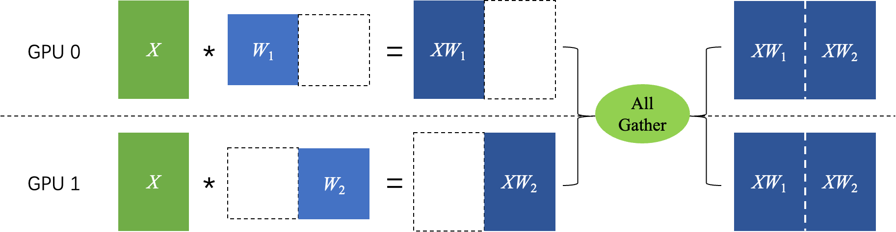
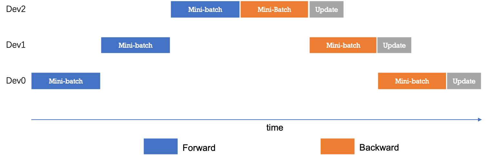
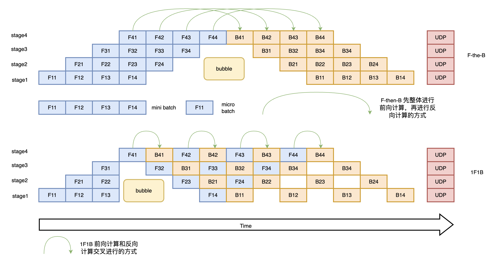

## 模型并行

随着深度学习模型的规模不断增大，单个设备的计算能力和显存逐渐无法满足训练的需求，特别是当模型的参数量达到数亿甚至更多时，模型并行（Model Parallelism）成为了一种有效的解决方案。模型并行策略通过将模型的不同部分分配到多个设备上进行计算，来解决大规模模型训练时单设备无法承载的瓶颈。

与数据并行不同，模型并行的关键在于将一个非常大的神经网络模型分割成多个部分，每部分放置在不同的设备上进行计算。每个设备只处理一部分计算任务，并在需要时通过通信同步数据。这种方式有效地克服了单设备存储和计算能力的限制。


### 基本流程

1. **模型切分**： 将模型的不同部分划分到多个设备上。例如，某个大模型的前几层可能放在 GPU 0 上，而后续的几层则放在 GPU 1 上。
2. **前向传播**： 每个设备计算模型的一部分（如部分层的前向传播），然后将计算结果传递给下一个设备继续计算。
3. **反向传播**： 反向传播的过程中，同样需要各个设备之间的协作。每个设备计算自己部分的梯度，并将结果传递到前一个设备进行梯度累加。
4. **参数更新**： 所有设备计算完成梯度后，进行参数更新。通常这种更新过程是全局同步的，可以通过像 All-Reduce 等机制来完成。


### Tensor Parallelism

张量并行（Tensor Parallelism，TP）是一种更细粒度的模型并行方法，它将模型单个层内部的参数和计算任务拆分到不同的设备上执行，这种方法特别适合于具有大量参数的大规模模型。最初是在 Megatron-LM 论文中提出的，它是一种高效的模型并行技术，可用于训练大型 Transformer 模型。

例如，对于深度学习模型中常见的矩阵乘法运算 $Z=X∗W$ ，假设 $X$ 和 $W$ 都是二维张量，$W$ 是模型参数，那么可以有以下两种方式进行张量模型并行计算：

- 对张量 $W$ 按列进行切分，然后各个卡独立计算矩阵乘法，最后通过 AllGather 通信得到最终的计算结果，即：
  $$
  Z = X * W = X * [W_ 1, W_ 2] = [X * W _ 1, X * W_ 2]
  $$
  

- 对张量 $W$ 按行进行切分，同时对输入 $X$ 按列进行切分，最后通过 AllReduce 通信得到最终的计算结果，即：
  $$
  Z = [X_ 1, X_ 2] * \begin{bmatrix}W_ 1 \\\\ W_ 2\end{bmatrix} = X_ 1 * W_ 1 + X_2 * W_ 2
  $$
  

  


#### **代码示例**

```python
# TODO: update tp code
```


### Pipeline Parallelism（PP）

**流水线并行（Pipeline Parallelism）**是一种通过将模型的不同层分配到不同设备上的方式来进行并行计算的方法。每个设备计算模型的一部分层，计算完成后将结果传递给下一个设备。流水线并行的关键思想是分阶段计算，通过流水线的方式在多个设备间传递数据。

如下图所示，网络共包含 4 层，可以把第 0 层放置在卡 0 上运行，第 1 层和第 2 层放置在卡 1 上运行，第 4 层放置在卡 2 上运行。在训练过程中，卡 0 接收输入数据进行计算，并将计算结果发送给卡 1；卡 1 接收到卡 0 的计算结果后进行计算，并将计算结果发送给卡 2；卡 2 接收到卡 1 的计算结果后进行计算，得到损失函数值，完成前向计算。反向计算逻辑与前向刚好相反。


朴素的流水线并行调度逻辑。无论是前向还是反向计算，每个时刻有且仅有一个设备进行计算，其他设备均处于空闲状态，设备利用率和计算效率较差。



为了优化流水线并行中设备的计算效率，可以进一步将 mini-batch 切分成若干更小粒度的 micro-batch，以提升流水线并行的并发度，进而达到提升设备利用率和计算效率的目的。如下图所示，一个 mini-batch 被切分为 4 个 micro-batch；前向阶段，每个设备依次计算单个 micro-batch 的结果；从而增加了设备间的并发度，降低了流水线并行 bubble 空间比例，提高了计算效率。




#### 代码示例

```
# TODO: update pp code 
```


### 参考文献

1. [分布式训练简介](https://www.paddlepaddle.org.cn/documentation/docs/en/guides/06_distributed_training/distributed_overview.html)

2. [AI System](https://chenzomi12.github.io/05Framework04Parallel/README.html)

