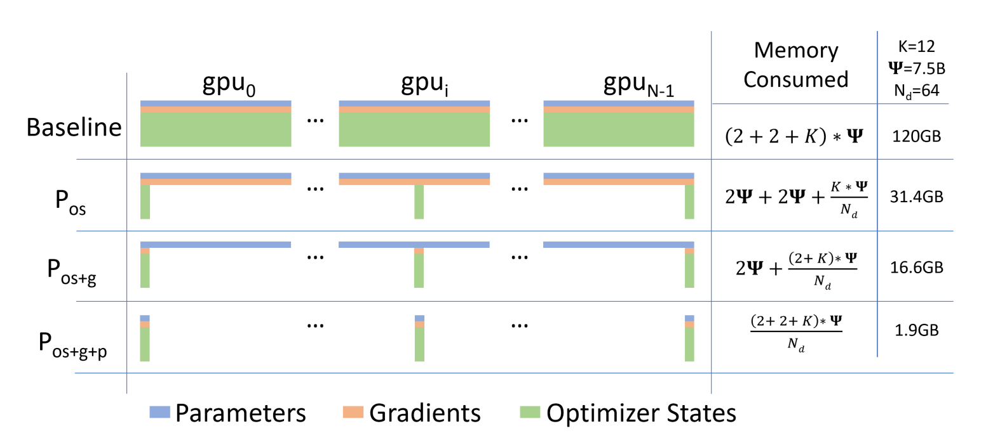
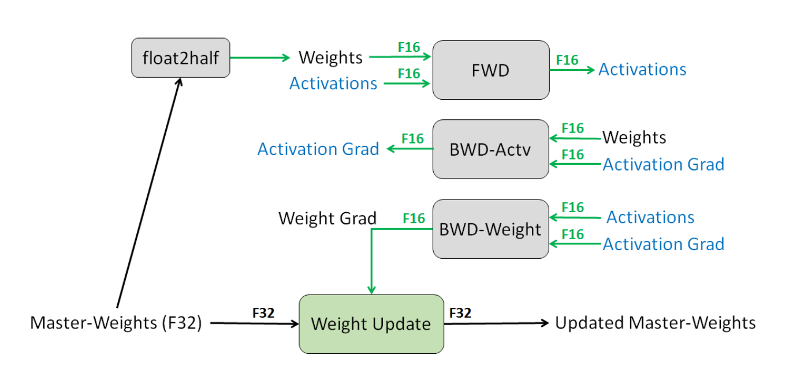
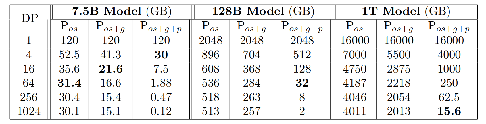

# ZeRO:

## 0x00 Abstract

ZeRO（Zero Redundancy Optimizer，零冗余优化器）用于优化大型深度学习模型的训练过程。 大型深度学习模型（拥有十亿到万亿参数）在提升准确性的同时，带来了内存和计算上的挑战。

传统方法如 DP 和 MP 存在**内存限制**和**高通信开销**的问题，限制了模型扩展性和训练效率。

 ZeRO 通过消除 DP 和 MP 中的内存冗余，保持低通信开销和高计算粒度，实现了模型规模与设备数量的线性扩展，从而显著提升训练效率和模型容量。 

在实验中，ZeRO 成功训练了超过 1000 亿参数的模型，使用了 400 个 GPU，达到了 15 petaflops （每秒千万亿次浮点运算）的吞吐量，分别比现有方法提升了 8 倍的模型大小和 10 倍的性能。 

- ZeRO 简化了大模型训练过程，允许在不使用复杂 MP 的情况下训练 130 亿参数的模型，降低了开发者的门槛。
- ZeRO 被用于训练世界最大语言模型（170 亿参数），并取得了破纪录的准确率，证明其在实际应用中的有效性和优势。

## 0x01 Extended Introduction

### 1.1 背景

随着深度学习模型（尤其是在自然语言处理领域）的规模越来越大，比如BERT、GPT、Megatron-LM和T5等，模型的准确率显著提高。然而，随着模型参数量的增加，训练这些大模型时面临的挑战也变得更加严峻，特别是内存消耗和计算效率的问题。为了训练参数达到数万亿（trillions）的模型，现有的单设备内存和传统的并行训练方法（如 DP 和 MP ）已经无法有效支持。

### 1.2 问题

1. **数据并行（DP）**： DP 通过**复制整个模型状态**（例如参数、梯度、优化器状态）到每个设备，虽然能够有效地进行计算和通信，但它的内存效率低下。对于当前GPU（例如32GB内存的V100），超过14亿个参数的模型会导致内存溢出。
2. **模型并行（MP）**： MP 将模型分割到不同设备上，以减少单个设备的内存消耗。然而，这会导致**大量的通信开销**，尤其是在跨多个节点时，效率大大下降。
3. **其他方法**：例如流水线并行（PP）、CPU卸载等，虽然可以在某些情况下有效减小内存消耗，但它们通常会在计算/通信效率和内存效率之间做出妥协。

### 1.3 ZeRO（Zero Redundancy Optimizer）

ZeRO 的目标是通过优化内存使用，既保证计算和通信效率，又能减少内存占用。ZeRO的优化过程分为两个主要部分：**模型状态内存优化** 和 **残留状态内存优化**。

#### 1. **模型状态内存优化（ZeRO-DP）**

- **模型状态**包括优化器状态（如Adam的动量和方差）、梯度和模型参数。ZeRO-DP通过在 DP 过程中划分这些状态来消除冗余，从而减少内存消耗。

- 具体来说，ZeRO-DP有三个优化阶段：

  - **优化器状态划分（$P_{os}$）**：通过划分优化器状态，内存减少4倍，计算和通信开销与传统 DP 相同。
  - **梯度划分（$P_{os+g}$）**：内存减少8倍，计算和通信开销仍然与 DP 相同。
  - **参数划分（$P_{os+g+p}$）**：内存消耗与 DP 的设备数成正比，理论上可以实现64倍甚至更多的内存减少。

  

ZeRO-DP优化可以使得一个拥有1万亿参数的模型在1024个GPU上训练，每个GPU的内存需求仅为16GB（适合当前的GPU设备）。

#### 2. **残留状态内存优化（ZeRO-R）**

- 除了模型状态内存外，训练过程中还会有**激活（activations）**、**临时缓冲区（temporary buffers）**和**内存碎片（fragmented memory）**的消耗，这些都可能成为内存瓶颈。
- ZeRO-R 针对这三者分别做了优化：
  - **激活优化**：通过激活划分和适当的激活检查点（checkpointing），减少内存消耗。
  - **临时缓冲区**：通过调整缓冲区的大小，达到计算和内存效率的平衡。
  - **内存碎片优化**：通过管理不同张量的生命周期，避免内存碎片问题。

#### 3. **ZeRO 与 （MP）的结合**

- ZeRO 优化后的 DP 方法（ZeRO-DP）相较于 MP 有更高的内存效率和扩展性，尤其在单个设备无法存下整个模型时，ZeRO-DP 可以减少每个设备的内存需求。
- 然而，在一些特定情况下，仍然可以结合 MP 和 ZeRO，以进一步优化激活内存或在较小的模型上使用更大的批次（batch size）来提高收敛速度。

### 1.4 实际效果

在实施方面，ZeRO 通过优化模型的内存消耗，支持更大规模的模型训练。根据实验，ZeRO 可以在现有的高端硬件（如400个NVIDIA V100 GPU集群）上高效训练100B（百亿）参数的模型，相比现有方法（如Megatron-LM）能够训练更大的模型，且训练速度提高了10倍以上。

## 0x02 Related Work

### 2.1 数据并行、模型并行和流水线并行

在训练大规模模型时，**并行化**是关键策略。常见的并行化方法包括：

- **数据并行（Data Parallelism, DP）**：将模型参数复制到每个设备上，每个设备处理不同的数据子集。这种方法适用于模型可以完全放入单个设备内存的情况。然而，随着模型规模的增加，单个设备的内存可能不足以容纳整个模型。
- **模型并行（Model Parallelism, MP）**：将模型划分到多个设备上，每个设备处理模型的一部分。这种方法适用于模型过大，无法完全放入单个设备内存的情况。然而， MP 可能导致通信开销增加，尤其是在跨多个节点时。
- **流水线并行（Pipeline Parallelism, PP）**：将模型按层划分，每个设备处理模型的一部分。这种方法可以通过流水线方式并行处理多个小批次，但可能需要较大的 batch size 来隐藏流水线延迟（bubble），从而增加内存消耗。（G-pipe 和 PipeDream 是两种优化 pp 的算法）

ZeRO 通过在 DP 进程之间划分模型状态（如优化器状态、梯度和参数），消除 DP 中的内存冗余，提高内存效率。与 MP 和流水线并行相比，ZeRO 在内存效率方面具有优势，同时避免了它们在功能、性能和收敛性方面的限制。

### 2.2 非并行化的内存优化方法

除了并行化方法外，还有多种技术旨在减少深度学习训练的内存开销：

- **减少激活内存**：通过激活压缩、激活检查点和实时分析等方法，减少激活的内存占用。这些方法可以与ZeRO结合使用，以进一步优化内存使用。
- **CPU卸载**：通过算法设计或虚拟化内存，将模型状态卸载到 CPU 内存。然而，CPU 和 GPU 之间的带宽有限，频繁的数据传输可能导致性能瓶颈。ZeRO 通过减少内存消耗，避免了将模型状态卸载到 CPU 内存的需求，从而避免了 PCI-E 带宽的限制。（在极少数情况下，ZeRO 可能会卸载非常大的模型的激活检查点）
- **内存高效的优化器**：通过维护模型参数和梯度的粗粒度统计信息，减少自适应优化方法的内存消耗。然而，这可能影响模型的收敛性。ZeRO 的优化方法不会改变模型的优化方法或影响模型的收敛性，但有效地减少了每个设备上优化器状态和梯度的内存占用。

### 2.3 训练优化器

自适应优化方法（如Adam）需要维护每个模型参数和梯度的细一阶和二阶信息来加速收敛。这些方法需要大量的内存。ZeRO 通过减少优化器状态和梯度的内存占用，使这些复杂且内存密集型的优化方法在训练大规模模型时变得可行。

## 0x03 显存都哪里去了

1.5B 参数的 GPT-2 模型训练时, 虽然模型本身的权重在 16 位精度下只需要 3GB 显存，但依然无法在 32GB 显存的 GPU 上训练，因为训练过程中，显存还被以下几部分占用：

1. **模型状态（Model States）**：包括**优化器状态**、**梯度**和**模型参数**。这些是训练过程中必须存储的核心数据，占用了大部分内存。
2. **残余状态（Residual States）**：包括**激活值**、**临时缓冲区**和**内存碎片**。这部分内存虽然不如模型状态占用那么多，但仍然不可忽视。

>以 GPT-2 为例的模型参数量计算方法：$d_{model}=1600$（词向量维度） ,  $d_{ffn}=4×d_{model}=6400$（前馈层维度）
>
>1. **单层参数量计算**：
>
>- 前馈层（Feed Forward）参数：
>   前馈层有两个矩阵，一个是输入到隐藏层的矩阵，一个是隐藏层到输出的矩阵。每个矩阵的维度是 $d_{\text{model}} \times d_{\text{ffn}}$。
>   前馈层的参数量：
> $$
>  d_{\text{model}} \times d_{\text{ffn}} = 1600 \times 6400 = 10.24M
> $$
>
>- 多头注意力参数：
>   每个注意力头有 $Q$ 、$K$ 、$V$ 投影矩阵和输出矩阵，因此每个头的参数是 $4 \times d_{\text{model}}^2$：
> $$
>  4 \times 1600^ 2 = 10.24M
> $$
>  所以每一层的参数量是：
> $$
>  \text{单层参数量} = d_{\text{model}} \times d_{\text{ffn}} + 4 \times d_{\text{model}}^2 = 1.6k \times 6.4k + 10.24M = 10.24M + 10.24M = 20.48M
> $$
>
>2. **总参数量**：
>
>- 每层参数量为 $20.48M$，模型有 $L=48$ 层：
> $$
>  \text{总参数量} = L \times 20.48M = 48 \times 20.48M = 983.04M \approx 1.0B
> $$
>
>3. **词表嵌入矩阵**：
>
>   词表的大小为 $50,257$，每个词的嵌入维度为 $d_{\text{model}} = 1600$：
> $$
>   \text{词表参数} = \text{vocab-size} \times d_{\text{model}} = 50,257 \times 1600 = 80.41M
> $$
>
>4. **总参数量（包含词表嵌入矩阵）**：
>
>   总参数量是：
> $$
> \text{总参数量} = 1.0B + 80.41M \approx 1.08B
> $$
>   

### 3.1 模型状态内存消耗

#### 1. 模型参数

- **16位（FP16）参数内存**： $M_{\text{params}} = 1.5B \times 2\text{bytes} = 3.0\text{GB}$
  
- **32位（FP32）参数内存**（部分优化器需要）： $M_{\text{params-fp32}} = 1.5B \times 4\text{bytes} = 6.0 \text{GB}$

#### 2. 优化器状态

以主流的 Adam 优化器为例：

- 每个参数需要存储：
  - 一阶动量（**m**）：FP32，4字节
  - 二阶动量（**v**）：FP32，4字节
  - 参数副本（FP32，某些框架如 PyTorch 的 AdamW 需要）：4 字节

##### **内存占用**

- **每参数内存**： $M_{\text{opt-per-param}} = 4 + 4 + 4 = 12\text{bytes}$
- **优化器总内存**： $M_{\text{optimizer}} = 1.5B \times 12\text{bytes} = 18 \text{GB}$

#### 3. 梯度

梯度通常与参数保持相同精度：FP16 训练时梯度为 FP16，但部分框架（如PyTorch）在混合精度训练中会将梯度转换为 FP32 存储。

##### 内存占用

- **FP16梯度**： $M_{\text{gradients-fp16}} = 1.5B \times 2\text{bytes} = 3.0 \text{GB}$
- **FP32梯度**： $M_{\text{gradients-fp32}} = 1.5B \times 4\text{bytes} = 6.0 \text{GB}$ 

#### 4. 模型状态总内存

联合考虑参数、梯度、优化器状态：

- **FP16训练（常见混合精度）**： $\scriptsize
  M_ {\text{model-states}} = \underbrace{3.0 \text{GB}}_ {\text{FP16参数}} + \underbrace{6.0 \text{GB}}_ {\text{FP32梯度}} +\underbrace{18 \text{GB}}_ {\text{Adam优化器}} = 27 \text{GB}$ 

### 3.2 残差状态的内存消耗

#### 1. 激活值

通过激活值重计算（Activation Checkpointing）估算： $M_{\text{activations}} \approx \frac{1}{2} \times \text{层数} \times \text{序列长度} \times d_{\text{model}}$ 

以序列长度=1024的推理为例： $M_{\text{activations}} \approx \frac{1}{2} \times 48 \times 1024 \times 1600 \times 2\text{bytes} \approx 0.7 \text{GB}$

#### 2. 临时缓冲区

- 用于 AllReduce 通信、梯度同步等： $M_{\text{buffers}} \approx 0.5 \text{GB}$ 这一块可以自定义的
  
  

#### 3. 内存碎片

- 因动态分配/释放导致显存利用率下降，普遍额外消耗10-20%内存： $M_{\text{fragmentation}} \approx (M_{\text{model-states}} + M_{\text{activations}}) \times 20% = (27 + 0.7) \times 0.2 \approx 5.5, \text{GB}$

### 3.3 总显存需求

$$
M_{\text{total}} = 27 \text{GB（模型状态）} + 0.7 \text{GB（激活）} + 0.5 \text{GB（缓冲区）} + 5.5 \text{GB（碎片）} \approx 33.7 \text{GB}
$$

## 0x04 ZeRO

ZeRO（Zero Redundancy Optimizer）通过两种优化策略来减少训练大规模深度学习模型时的内存消耗，同时保持计算和通信效率。这两种优化策略分别是：

1. **ZeRO-DP（数据并行优化）**：旨在减少模型状态的内存占用。
2. **ZeRO-R（残留内存优化）**：旨在减少残留内存消耗（如激活值、临时缓冲区和内存碎片）。

### 4.1 ZeRO-DP

**ZeRO-DP** 的优化基于三个关键的见解：

#### 1. DP 比 MP 有更好的扩展效率

- **MP** 会减少计算的粒度，并增加通信开销。超过某个点后，较低的计算粒度和增加的通信开销会使得每个 GPU 的效率降低，尤其是在跨节点边界时，通信开销变得更加显著。
- **DP** 能够保持较高的计算粒度，并且通信量较低，因此在扩展性上表现更好。DP 的高计算粒度和低通信量使得它比 MP 更适合扩展。

#### 2. DP 内存效率差

- 在传统的 DP 中，模型状态（包括参数、梯度和优化器状态）会在所有的 DP 进程中进行冗余存储，会导致内存占用的冗余。
- 相比之下，MP 会对模型状态进行划分，从而在内存使用上更高效。

#### 3. 不需要一直保存所有模型状态

- 在训练过程中，模型的每一层参数仅在该层的前向传播和反向传播时需要，因此并不需要在整个训练过程中一直保存所有模型状态。

**ZeRO-DP** 通过将模型状态进行划分，而不是复制它们，来消除内存的冗余，提高内存效率。它通过一个**动态通信调度**来减少通信量，并利用模型状态的时间特性，即只有在需要时才进行通信。通过这种方法，ZeRO-DP 在增加 DP 度时，能够线性减少每个设备的内存占用，同时保持与默认 DP 方法相近的通信量，从而保持高效。

### 4.2 ZeRO-R

**ZeRO-R** 的目标是优化与模型状态无关的残留内存使用，它优化了激活内存、临时缓冲区和内存碎片问题。

#### 1. 减少激活内存

- **MP** 通过划分模型状态来减少内存消耗，但通常会导致激活内存的冗余。例如，在将线性层的参数纵向划分并在两个 GPU 上并行计算时，每个 GPU 都需要存储整个激活值，以便进行分配。
- 对于像 GPT-2 这样的大型模型，其**算术强度**（计算量与激活检查点存储量的比率）非常大（通常大于 10K ），而且随着隐藏层维度的增加，这个比率会线性增长。因此，即使带宽较低，也能隐藏激活检查点的数据传输成本。

**ZeRO** 通过将激活检查点在多个 GPU 之间进行划分，消除了 MP 中激活内存的冗余，并使用 All-Gather 操作按需重建这些激活。激活内存的占用将与 MP 度成比例地减少。对于非常大的模型，ZeRO 甚至可以选择将激活分区转移到 **CPU内存**，通过较大的算术强度，依然能够保持较好的效率。

#### 2. 管理临时缓冲区

ZeRO-R 通过使用**恒定大小的缓冲区**来管理临时缓冲区，避免在模型规模增大时临时缓冲区的内存占用爆炸。通过合理调整缓冲区大小，使得它们既不会浪费内存，又能保持计算效率。

#### 3. 管理内存碎片

**内存碎片**是由短生命周期和长生命周期的内存对象交错存储导致的。举例来说，在前向传播时，激活检查点通常是长生命周期的对象，而需要重新计算的激活值则是短生命周期的；在反向传播时，激活值的梯度是短生命周期的，而参数梯度则是长生命周期的。

ZeRO 通过在内存中预分配**连续的内存缓冲区**来进行**实时内存碎片整理**。它将激活检查点和梯度按需移动到这些预分配的内存缓冲区中。不仅提高了内存的可用性，还减少内存分配器寻找空闲内存的时间。

## 0x05 Deep Dive into ZeRO-DP

**ZeRO-DP** 通过在 DP 进程中划分模型状态（优化器状态、梯度和参数）而非复制它们，消除了传统 DP 中的内存冗余。以下是ZeRO-DP的三个优化阶段的详细分析：

### 5.1 $P_{os}$: 优化器状态划分（Optimizer State Partitioning）

在 DP 训练中，所有设备都会复制模型的优化器状态（例如，Adam 的动量和梯度的方差），就导致显著的内存冗余。**ZeRO-DP** 的第一个优化阶段是**优化器状态划分（$P_{os}$）**，通过将优化器状态划分成多个部分，使得每个 DP 进程只负责更新它所对应的部分优化器状态。

- **操作方式**：对于一个 DP 度为 $Nd$ 的设置，优化器状态被划分为 $Nd$ 个相等的部分，每个 DP 进程只需要存储和更新总优化器状态的 $\frac{1}{Nd}$ 部分。
- **内存节省**：通过优化器状态的划分，内存消耗从 $4\Psi + K\Psi$（$\Psi$ 代表模型参数量，$K$ 代表优化器参数的的总字节数）降低到 $4\Psi + \frac{K\Psi}{Nd}$。例如，在 64 路 DP 时（$Nd = 64$），一个7.5B 参数的模型在使用 $P_{os}$ 优化后只需 31.4GB 的内存，而标准的 DP 方法需要 120GB。

优化器状态划分阶段减少了约 4 倍的内存使用。

### 5.2 $P_g$: 梯度划分（Gradient Partitioning）

**梯度划分（$P_g$）**是第二个优化阶段，目的是减少每个 DP 进程所需存储的梯度内存。每个 DP 进程只需要存储对应参数的梯度，并在反向传播过程中计算这些梯度。

- **操作方式**：在梯度计算过程中，只计算和存储与当前进程对应的部分梯度，计算完成后释放不再需要的梯度内存。通过这种方式，内存消耗从 $2\Psi$ 降低到 $\frac{2\Psi}{Nd}$。
- **Reduce-Scatter操作**：这实际上是一个 Reduce-Scatter 操作，其中梯度会根据不同的参数分配到不同的进程，减少了内存占用并优化了计算与通信的重叠。

梯度划分阶段将内存需求进一步减少，最终使得一个 7.5B 参数的模型在 64 路 DP 时只需要 16.6GB 的内存，而标准 DP 需要120GB。梯度划分后，内存使用减少了大约8倍。

### 5.3 $P_p$: 参数划分（Parameter Partitioning）

**参数划分（$P_p$）**是ZeRO-DP的第三个优化阶段。在这个阶段，每个 DP 进程只存储它所对应的模型参数部分。需要其他部分的参数时，它们会通过广播从相应的 DP 进程中获取。

- **操作方式**：每个进程只存储它所负责的模型参数。当需要其他进程的参数时，通过广播进行通信。尽管这种方法看似会增加通信开销，但实际证明，这种做法只会使总的通信量增加 1.5 倍，而能够显著减少内存占用。
- **内存节省**：通过参数划分，内存需求从 $16\Psi$ 降低到 $\frac{16\Psi}{Nd}$，例如在 64 路 DP 时，一个 7.5B 参数的模型只需要 1.9GB 的内存。

参数划分阶段将内存需求进一步降低，使得一个 7.5B 参数的模型在 64-way DP 时，只需 1.9GB 的模型状态内存，而标准的 DP 需要120GB。

### 5.4 对模型大小的影响

ZeRO-DP 的三个阶段（$P_{os}$、$P_{os+g}$ 和 $P_{os+g+p}$）依次减少了每个 DP 进程上模型状态的内存消耗，最多可达 4 倍、8 倍和与 DP 度 $Nd$ 成比例的减少。

- **模型大小**：例如，当 DP 度 $Nd = 64$ 时，ZeRO-DP使用 $P_{os}$、$P_{os+g}$ 和 $P_{os+g+p}$ 分别可以训练最大为 7.5B、14B 和 128B 参数的模型。如果 $Nd = 1024$，则启用所有优化后，ZeRO 能够训练一个具有 1 万亿参数的模型！这表明ZeRO能够支持训练任意规模的模型，只要设备数量足够。

没有 ZeRO 时，标准的 DP 只能训练最大 1.5B 参数的模型；而使用 ZeRO 时，可以训练最大 1 万亿参数的模型。

## 0x06 Deep Dive into ZeRO-R

**ZeRO-R** 聚焦于优化除“模型状态”之外的其他内存消耗，即**激活值、临时缓冲区和内存碎片**。它包含三大核心技术：$P_a$（Partitioned Activation Checkpointing）、$C_B$（Constant Size Buffers）以及 $M_D$（Memory Defragmentation）。

### 6.1 $P_a$: Partitioned Activation Checkpointing

在 MP 中，每个 GPU 需要存储完整的激活值，这会导致激活值在不同的 GPU 间被冗余复制。$P_a$ 技术通过将激活值拆分在多个GPU之间，来消除这些冗余：

1. 前向传播后分区
   - 当前向传播完成某一层后，输入激活值会被分割并分发到不同的 GPU 上存储，而不是在每个 GPU 上都保留一份完整激活值。
2. 按需重建
   - 在反向传播时，需要使用某层激活值时，通过一次 All-Gather 操作从各个 GPU 上收集分区好的激活值，并在本地重建出完整的激活值用于计算。
3. 与激活值重计算结合
   - 在激活值重计算策略下，只保存部分激活值，其余激活值在反向传播时重新计算。结合 $P_a$ 后，所需存储的激活值会进一步减少。
4. 可选的 CPU 卸载（$P_a+CPU$）
   - 对于极大的模型，若 GPU 显存非常有限，可以将拆分后的激活数据卸载到 CPU 内存，从而使 GPU 上几乎不再占用激活存储空间（但会增加一定的通信开销）。

**内存收益**：

例如，对一个具有 1000 亿参数、batch size 为 32、序列长度为 1024 的模型，如果 MP=16，原本需要约 33GB 来存储激活检查点，使用 $P_a$ 后可降至约 2GB。若再将这 2GB 数据卸载到 CPU，GPU 上的激活开销几乎可忽略不计。

### 6.2 $C_ B$: Constant Size Buffers

在训练大模型时，为提高计算效率，常常会将大量参数或梯度合并到一个大的缓冲区中进行一次性操作（如一次性 All-Reduce）。虽然这样能提高带宽利用率，但缓冲区大小会随模型规模线性增加，从而占用大量内存。

- **问题示例**
  - 对于一个 3B 参数的模型，若使用 32 位的 fused buffer，就需要 12GB 内存来存储这个缓冲区。
- **ZeRO-R 的做法：Constant Size Buffers**
  - 当模型规模变得非常大时，ZeRO-R 不会继续用“一个大缓冲区”来存储全部内容，而是**使用固定大小的缓冲区**进行分批操作。
  - 这样做可以使得缓冲区的总大小与模型规模**脱钩**，不会随着模型变大而无止境地增长，同时仍然能保持较高的通信效率（只要缓冲区足够大，网络带宽就能得到较好利用）。

**内存收益**：

- 将原本随模型大小快速增长的临时缓冲区改为“固定大小”，避免了内存需求的爆炸式提升。

### 6.3 $M_ D$: Memory Defragmentation

在大规模模型训练中，内存碎片化会导致以下问题：

1. 即使总可用内存足够，也可能因为缺乏足够的**连续内存块**而出现内存分配失败（OOM）。
2. 频繁的内存分配与回收会增加分配器搜索可用内存的时间，降低训练效率。

**产生原因**：

- **激活重计算**：只保留部分激活，其他激活在反向传播时重算，导致了长生命周期和短生命周期的激活在内存中交错分配。
- **反向传播**：参数梯度通常生命周期较长，而激活梯度及临时缓冲区生命周期较短，二者混合也会产生碎片。

**ZeRO-R的解决方案：On-the-fly Memory Defragmentation**

- **预分配连续内存块**：在训练开始时，就为激活检查点和梯度预先分配大块的连续内存。
- **按需拷贝**：在产生激活或梯度时，将其复制到这块连续内存里，从而避免内存中不断出现零碎的小块空闲区。

**效果**：

- 通过减少内存碎片，显存的利用效率更高，能够在同样的硬件条件下训练更大的模型或者使用更大的 batch size。
- 同时，内存分配器所需的搜索时间也大幅降低，提高了整体训练速度。

## 0x07 ZeRO-DP Communication Volume

这一章节中我们假设模型参数量为 $\Psi$ ，进程数为 $N$ 。
### 7.1 传统 DP 的通信量

在传统的 **DP** 训练中，反向传播结束后需要对所有 DP 进程上的梯度进行平均，以便在下一步更新模型参数。这个梯度平均通常使用 **All-Reduce** 操作来实现，过程可分为两步：

1. Reduce-Scatter：将梯度分块，每块分配给一个进程做规约（reduce），不同进程负责不同的块。
   - 传入/传出：$\frac{(N−1)\Psi}{N} ≈ \Psi$ 
2. All-Gather：每个进程再从所有进程收集规约好的块，最终得到完整的梯度。
   - 传入/传出：$\frac{(N−1)\Psi}{N} ≈ \Psi$

**结论**：标准 DP 的通信量是 $2\Psi$。

### 7.2 ZeRO-DP 的通信量

#### 1. $P_ {os+g}$：无额外通信量

在 ZeRO-DP 中，前两个阶段（优化器状态划分 $P_ {os}$ 和 梯度划分 $P_{g}$）并不会增加额外的通信量，主要原因是：

1. 梯度划分（$P_g$）：
   - 每个进程只保留自己负责的梯度片段，因此需要一次 **Scatter-Reduce**，通信量为 $\frac{(N−1)\Psi}{N} ≈ \Psi$ 。
   - 在更新完各自的参数后，进行一次 **All-Gather** 来让每个进程获得更新后的完整参数，这个操作同样通信量为 $\frac{(N−1)\Psi}{N} ≈ \Psi$ 。
   - **总通信量**：$\Psi + \Psi = 2\Psi$，与传统 DP 的 $2\Psi$ 相同。

因此，通过梯度划分，ZeRO 在减少内存的同时，并没有增加总的通信量。

#### 2. $P_{os+g+p}$：通信量最高增加到1.5倍

在第三个阶段（**参数划分 $P_p$**）中，每个进程只存储并更新部分参数，训练时需要按需获取其余进程的参数。这会带来额外的通信操作，但可以通过**分段广播（broadcast）**和**按需丢弃**来减少峰值内存占用，并将通信开销分散到整个正向和反向过程中。

1. **正向传播（Forward Pass）**：
   - 在计算某个参数分区对应的模型部分之前，由负责该分区的进程将参数广播给所有进程（通信量为 $\Psi$ 的一部分）。
   - 计算完该分区对应的正向后，就可以丢弃这些参数，不必一直保留在内存中。
   - 因为所有分区都要在正向过程中依次进行广播，总通信量为 $\Psi$。
2. **反向传播（Backward Pass）**：
   - 反向传播需要再次按相反顺序拿到对应分区的参数，因此又会有一次类似的总通信量 $\Psi$。
3. **梯度归约（Reduce-Scatter）**：
   - 反向传播结束后，梯度需要做一次 Reduce-Scatter（或 Scatter-Reduce）操作，通信量为 $\Psi$。

**总通信量**：$3\Psi$，即相对于传统 DP（$2\Psi$）的**1.5倍**。

虽然通信量增加了，但与此同时，参数划分（$P_p$）使得每个进程的**内存占用减少了 $N_d$ 倍**（$N_d$ 为 DP 度），这是一个非常显著的内存收益。

## 0x08 Communication Analysis of ZeRO-R

### 8.1 与 baseline 的 MP 比较

在传统的 **MP** 场景中，如果激活值需要被多个 GPU 共享，就会带来额外的通信消耗。以 Megatron-LM（SOTA MP 实现）为例，每个 Transformer Block 在使用激活值重计算（checkpointing）时：

- **前向传播**需要进行两次 All-Reduce 操作。
- **前向重计算**（用于反向传播）也需要两次 All-Reduce。
- **反向传播**再进行两次 All-Reduce。

每一次 All-Reduce 的通信量大约是 “**2 × 消息大小**”（All-Reduce 中两个阶段，所以需要乘 2），因此在一个 Transformer Block 里，合计有 6 次全归约，最终总通信量为：

$2 \times 6 \times (\text{seq length} \times \text{hidden dim})$。

$P_a$（分区激活检查点）会在反向传播时，为了重建激活，执行一次 All-Gather 操作。对于每个 Transformer Block，仅需一次 All-Gather，其通信量约为 “**1 × 消息大小**”，也就是 $(\text{seq length} \times \text{hidden dim})$ 与原先的 $2 \times 6 \times (\text{seq length} \times \text{hidden dim})$ 相比，$P_a$ 带来的通信量额外开销不到 10%（即 $\frac{1}{12}$ 左右），相对增量较小。

 

### 8.2 $P_a$ 对 DP 通信的影响

当 MP 与 DP 结合使用时，$P_a$ 能够通过降低激活内存占用来增大 batch size，从而**减少 DP 的通信量**。原因在于：

1. 激活内存减少
   - $P_a$ 可以将激活内存消耗减少到原来的 $\frac{1}{\text{MP degree}}$。如果 MP degree = 16，那么激活内存可减少 16 倍。
2. batch size 增大
   - 减少的激活内存可以用来增大 batch size。对于深度学习训练而言，DP 的通信量通常与 $\frac{1}{\text{batch size}}$ 成正比：批次越大，单个迭代需要进行的全局同步（梯度平均）次数就相对变少。
3. 通信量减少
   - 当 batch size 扩大一个数量级时（例如从 32 提升到 512）， DP 的通信量就会相应减少一个数量级。这样一来，即使 $P_a$ 在 MP 端多增加了约 10% 的通信量，也能带来更大的收益。

### 8.3 $P_a+CPU$：进一步降低激活内存

对于特别大的模型或在显存极其有限的场景，可以将拆分后的激活值卸载到 CPU（即 $P_a+CPU$），从而让 GPU 几乎不再存储激活值：

1. 内存占用几乎为零
   - 将激活分区卸载到 CPU 后，GPU 上只在需要时通过通信读取激活。
2. 通信量代价
   - 相比于单纯的 $P_a$ ，需要多 2 倍的数据传输量（来回 CPU 的额外传输），因此通信代价更大。
3. 适用场景
   - 当 DP 通信量已经是整个训练过程中的主要瓶颈，而小批次导致频繁的梯度同步，$P_a+CPU$ 可以通过允许更大批次来减少 DP 通信量，只要 CPU 数据传输的开销低于 DP 通信瓶颈，就能整体提升效率。

### 8.4 何时应用 $P_a$ 或 $P_a+CPU$

根据上述分析，可以根据模型规模、硬件资源以及通信瓶颈来选择是否使用 $P_a$ 或 $P_a+CPU$：

1. **如果 MP 带来的激活值冗余不是主要瓶颈**，则不一定需要 $P_a$。
2. **如果激活值内存占用较高**，并且我们想要增加 batch size 以减少 DP 端的通信，则 $P_a$ 会非常有效。
3. **如果激活值内存需求依旧超过 GPU 的可用显存**，则考虑使用 $P_a+CPU$，将拆分的激活值卸载到 CPU。不过要注意 CPU-GPU 之间的数据传输成本。
4. **当 batch size 过小导致 DP 通信量非常大时**，通过 $P_a$ 或 $P_a+CPU$ 增大 batch size 后，DP 通信量下降，有助于整体效率提升。

## 参考文献

[ZeRO: Memory Optimizations Toward Training Trillion Parameter Models](https://arxiv.org/abs/1910.02054)

[MIXED PRECISION TRAINING](https://arxiv.org/pdf/1710.03740)

[动画理解Pytorch 大模型分布式训练技术 DP，DDP，DeepSpeed ZeRO技术](https://www.bilibili.com/video/BV1mm42137X8)

