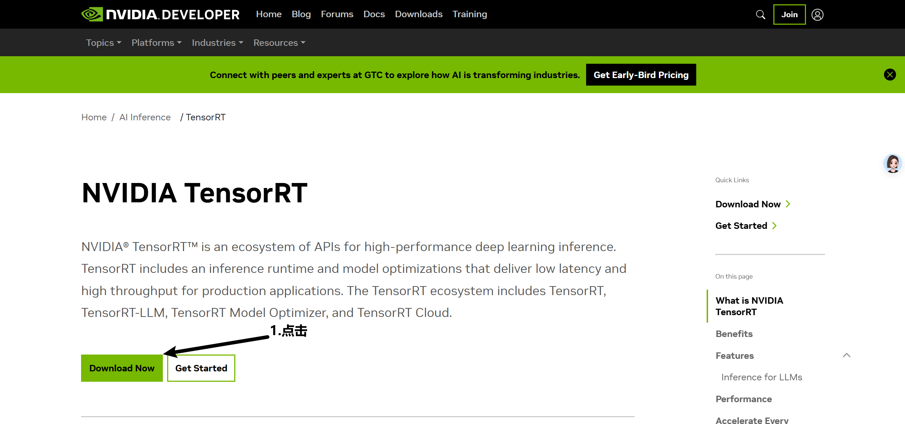
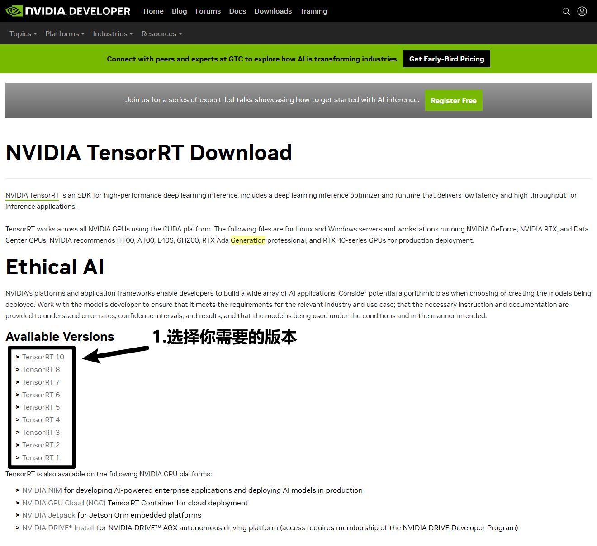
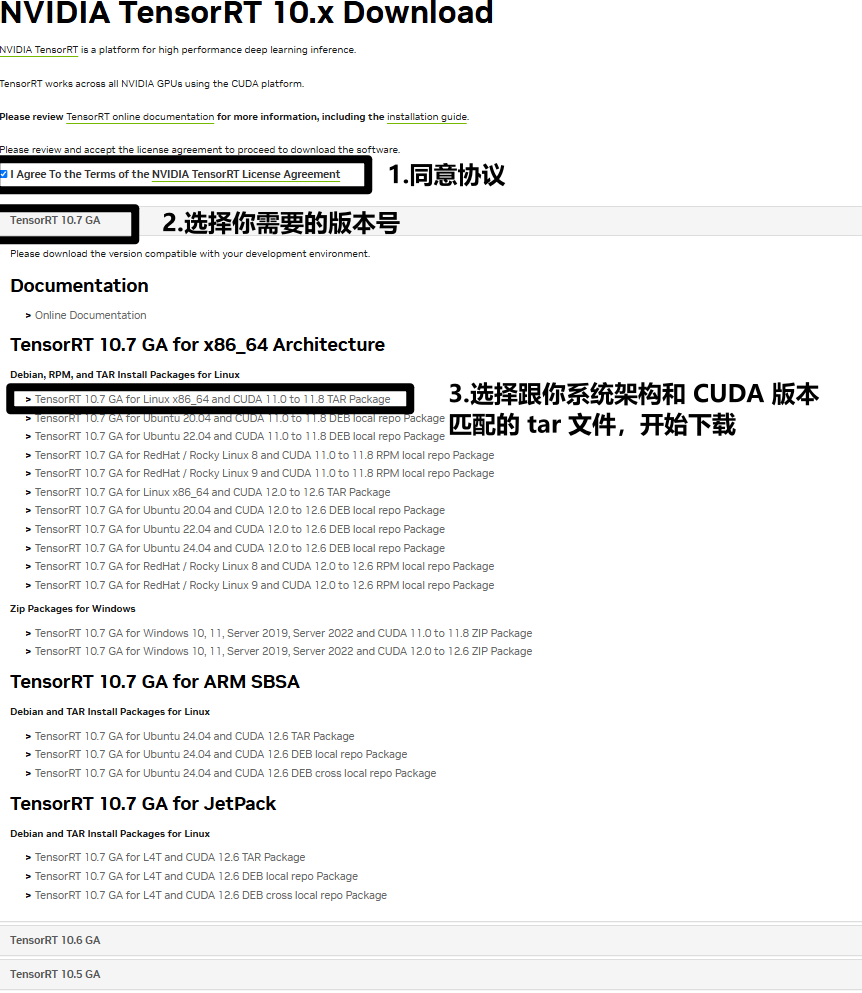
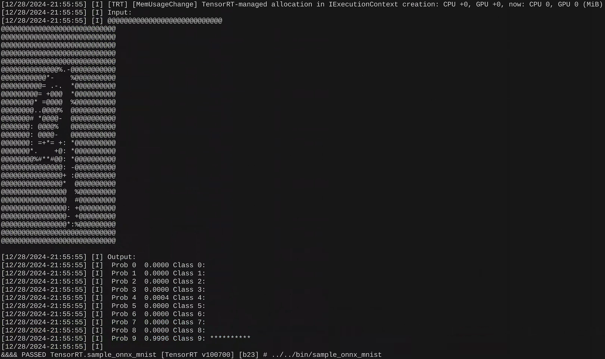

## TensorRT

NVIDIA TensorRT 的**核心是一个 C++库**，可在 NVIDIA 图形处理单元（GPU）上实现高性能推理。TensorRT 接收由**网络定义**和一组**训练参数**组成的经过训练的网络，并生成一个高度优化的**运行时引擎**，用于对该网络进行推理。 

TensorRT 通过 C++ 和 Python 提供 API，可通过**网络定义 API 表达深度学习模型**，或**通过 ONNX 解析器加载预定义模型**，使 TensorRT 能够在 NVIDIA GPU 上对其进行优化和运行。TensorRT 应用图形优化（包括层融合等），同时还利用各种高度优化的内核集合找到该模型的最快实现。TensorRT 还提供了一个 runtime，可用于在 NVIDIA Turing 及后续的所有 NVIDIA GPU 上执行此网络。 

TensorRT 在 NVIDIA Turing、NVIDIA Ampere、NVIDIA Ada Lovelace 和 NVIDIA Hopper 架构中包含可选的高速混合精度功能。


## Installation

必备条件：

- 已安装 NVIDIA CUDA™工具包。如果尚未安装 CUDA，请查看[“NVIDIA CUDA 安装指南”](https://docs.nvidia.com/cuda/cuda-installation-guide-linux/index.html)以获取安装 CUDA 工具包的说明。


> 安装 TensorRT 可以选择：Debian 或 RPM 包、Python wheel 文件、tar 文件或 zip 文件。
>
> - Debian 和 RPM 安装会自动安装任何依赖项，但
>   - 需要 sudo 或 root 权限才能安装
>   - 对于 TensorRT 安装到哪个位置没有灵活性
>   - **要求 CUDA 工具包也已使用 Debian 或 RPM 包安装**
>   - 不允许同时安装多个 TensorRT 次要版本
> - tar 文件安装可以同时安装多个 TensorRT 版本。但是，你必须自己安装必要的依赖项并管理  LD_LIBRARY_PATH。

**本教程使用 tar 文件安装方式。**

### 下载 tar 文件

- 前往：[TensorRT开发者官网](https://developer.nvidia.com/tensorrt)。 

- 点击“立即下载”。 

  

- 选择你需要的 TensorRT 版本。

  

-  选中复选框以同意许可条款，点击你要安装的软件包，开始下载。



### 安装

#### 解压

```shell
# 解压下载好的文件
tar -xzvf TensorRT-10.7.0.23.Linux.x86_64-gnu.cuda-11.8.tar.gz

# 查看解压的目录结构
tree TensorRT-10.7.0.23/ -L 1      
```
解压后的目录结构如下：

> ```shell
> TensorRT-10.7.0.23/
> ├── bin -> targets/x86_64-linux-gnu/bin
> ├── data
> ├── doc
> ├── include
> ├── lib -> targets/x86_64-linux-gnu/lib
> ├── python
> ├── samples
> └── targets          
> ```


#### 创建环境变量

将 TensorRT 库目录的绝对路径添加到环境变量 LD_LIBRARY_PATH 中（这里我将解压好的文件夹移到了 `/usr/local` 目录下）。

```shell
# bash 指令
export LD_LIBRARY_PATH=/usr/local/TensorRT-10.7.0.23/lib:$LD_LIBRARY_PATH
# fish 指令
set -x LD_LIBRARY_PATH /usr/local/TensorRT-10.7.0.23/lib $LD_LIBRARY_PATH
```


#### 安装 Python TensorRT

注意：tensorrt 目录下的 python 文件夹中只包含部分 python 版本的包，创建 conda 环境时注意 python 版本。

```shell
# 使用 conda 创建新环境并激活
conda create -n tensorrt10 python=3.10  
conda activate tensorrt10

# 切换到 tensorrt 目录下的 python 文件夹
cd /usr/local/TensorRT-10.7.0.23/python

# 安装 python 包（cp310表示上面创建的环境python版本是3.10）
python3 -m pip install tensorrt-*-cp310-none-linux_x86_64.whl
python3 -m pip install tensorrt_lean-*-cp310-none-linux_x86_64.whl
python3 -m pip install tensorrt_dispatch-*-cp310-none-linux_x86_64.whl
```


### 验证安装

测试 TensorRT-10.7.0.23 文件夹中的案例验证安装是否成功。

- 编译

```shell
# 切换到 sampleOnnxMNIST 目录
cd /usr/local/TensorRT-10.7.0.23/samples/sampleOnnxMNIST

# 编译
make
```

- 运行可执行文件

```shell
../../bin/sample_onnx_mnist
```

运行结果：




## 参考

[Nvidia TensorRT Install Guide](https://docs.nvidia.com/deeplearning/tensorrt/install-guide/index.html)
