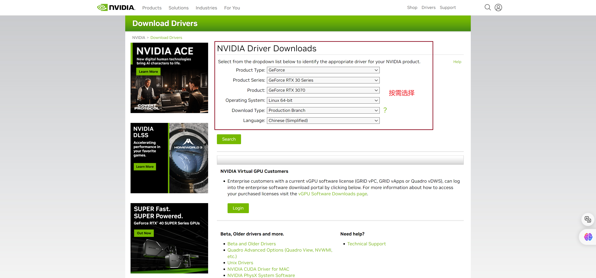
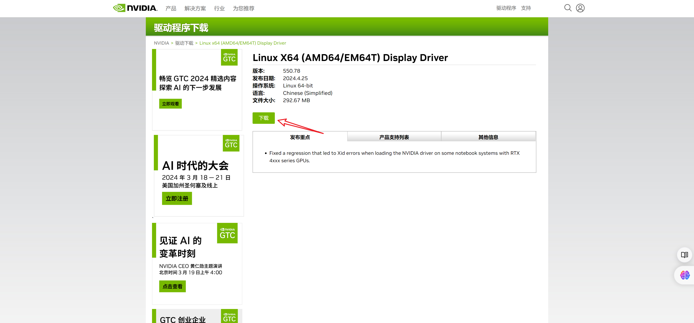
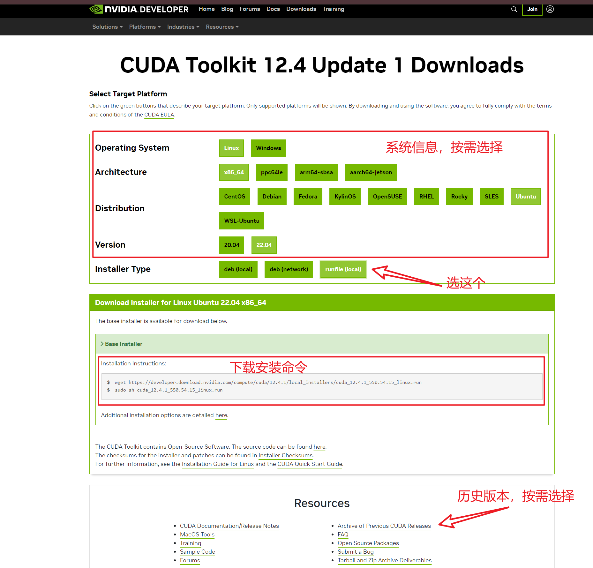
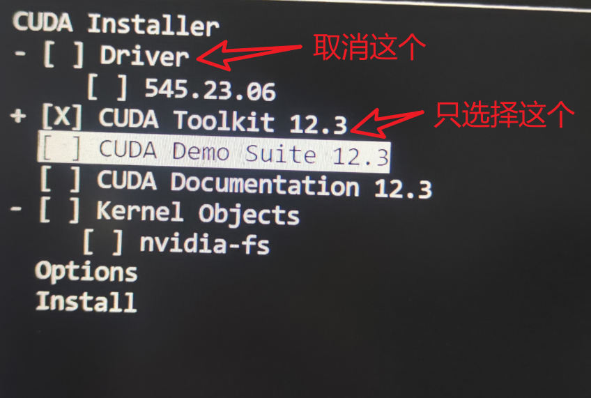

### NVIDIA驱动程序（NVIDIA Driver）和CUDA Toolkit

NVIDIA驱动程序（NVIDIA Driver）和CUDA Toolkit是两个不同的概念，它们各自担负着不同的角色和功能。

#### NVIDIA驱动程序（NVIDIA Driver）

- NVIDIA驱动程序是安装在计算机上的软件，用于管理和控制NVIDIA显卡（GPU）的操作。它负责将计算机上的软件与NVIDIA GPU硬件进行通信，以便执行图形渲染、通用计算等任务。
- NVIDIA驱动程序提供了GPU的基本功能，包括图形显示、CUDA加速计算、深度学习模型的训练和推断等。

#### CUDA Toolkit

- CUDA Toolkit 是由NVIDIA提供的用于GPU并行计算的开发工具包。它包含了一系列用于开发GPU加速应用程序的工具、库和文档，以及支持CUDA编程模型的编译器和运行时。
- CUDA Toolkit 提供了许多功能，包括CUDA编程模型、CUDA C/C++编译器（nvcc）、CUDA库、CUDA运行时等。开发人员可以使用CUDA Toolkit来编写和优化GPU加速的应用程序，这些应用程序可以在NVIDIA GPU上运行。

虽然NVIDIA驱动程序和CUDA Toolkit都涉及到NVIDIA GPU的使用，但它们的职责和功能不同。NVIDIA驱动程序是必需的，用于使计算机能够与NVIDIA GPU进行通信和操作，而CUDA Toolkit是可选的，用于开发和运行GPU加速的应用程序。

在使用CUDA开发或运行CUDA加速应用程序时，需要安装NVIDIA驱动程序和CUDA Toolkit。这两者通常是配合使用的，因为CUDA程序需要NVIDIA GPU的支持，而NVIDIA驱动程序提供了GPU的基本功能，并且CUDA Toolkit提供了开发CUDA程序所需的工具和库。

### 安装NVIDIA Driver && CUDA Toolkit

#### 1. 安装NVIDIA Driver

1. **禁用Nouveau驱动**
   在安装NVIDIA官方驱动程序之前，通常需要禁用开源的Nouveau驱动程序。Nouveau是Linux系统上的一个开源显卡驱动程序，但它可能会与NVIDIA官方驱动程序发生冲突。禁用Nouveau可以确保在安装NVIDIA官方驱动程序时不会出现问题。
   在开始禁用Nouveau之前，首先确保Nouveau驱动程序当前是否在使用中。执行`lsmod | grep nouveau`指令，如果输出中有`nouveau`，则表示Nouveau驱动程序当前正在使用，需要禁用。

2. **查找适合您的GPU的驱动程序**
   访问[NVIDIA驱动程序下载页面](https://www.nvidia.com/Download/index.aspx)并选择适合您的GPU和操作系统的驱动程序。



3. **下载.run文件**
   我这里是`NVIDIA-Linux-x86_64-550.78.run`



4. **安装下载的驱动程序**

- 打开终端。

- 切换到下载文件所在的目录，例如：

  ```bash
  cd ~/Downloads
  ```

- 执行.run文件：

  ```bash
  sudo ./NVIDIA-Linux-x86_64-550.78.run
  ```

5. **重启电脑**
   在安装完成后，重启您的电脑以确保新的驱动程序被正确加载。

#### 2.安装CUDA Toolkit

1. **下载**

   从[NVIDIA官方网站](https://developer.nvidia.com/cuda-downloads)下载合适的CUDA Toolkit安装程序。
   

```bash
# 执行命令，下载文件
wget https://developer.download.nvidia.com/compute/cuda/12.4.1/local_installers/cuda_12.4.1_550.54.15_linux.run
```

2. **安装**

```bash
# 执行命令，安装文件
sudo sh cuda_12.3.0_545.23.06_linux.run
```

等待弹出界面之后，选择`continue`，之后的协议选择`accept`。

最后的安装界面中，按回车键取消Driver的安装，只安装CUDA Toolkit即可，选择好了之后移动到`Install`按下回车。



安装完成之后出现以下内容

```bash
===========
= Summary =
===========

Driver:   Not Selected
Toolkit:  Installed in /usr/local/cuda-12.3/

Please make sure that
 -   PATH includes /usr/local/cuda-12.3/bin
 -   LD_LIBRARY_PATH includes /usr/local/cuda-12.3/lib64, or, add /usr/local/cuda-12.3/lib64 to /etc/ld.so.conf and run ldconfig as root

To uninstall the CUDA Toolkit, run cuda-uninstaller in /usr/local/cuda-12.3/bin
***WARNING: Incomplete installation! This installation did not install the CUDA Driver. A driver of version at least 545.00 is required for CUDA 12.3 functionality to work.
To install the driver using this installer, run the following command, replacing <CudaInstaller> with the name of this run file:
    sudo <CudaInstaller>.run --silent --driver

Logfile is /var/log/cuda-installer.log
```

3. **配置环境变量**

- 设置全局环境变量，使用`/etc/profile.d/`添加CUDA环境变量：

```bash
# 创建一个新的配置文件
sudo vim /etc/profile.d/cuda.sh

# 在打开的文件中，添加以下内容(注意这里的12.3版本改成你安装的版本)
# CUDA Soft Link
export PATH=$PATH:/usr/local/cuda-12.3/bin             
export LD_LIBRARY_PATH=$LD_LIBRARY_PATH:/usr/local/cuda-12.3/lib64

# 为了让更改生效，您需要重新登录或重新启动系统。
```

- 仅为当前用户设置环境变量（zsh用户把`.bashrc`改成`.zshrc`）：

```bash
# 使用以下命令追加环境变量到.bashrc文件
echo '# CUDA Soft Link for CUDA version 12.3' >> ~/.bashrc
echo 'export PATH=$PATH:/usr/local/cuda-12.3/bin' >> ~/.bashrc
echo 'export LD_LIBRARY_PATH=$LD_LIBRARY_PATH:/usr/local/cuda-12.3/lib64' >> ~/.bashrc

# 使更改生效，运行以下命令来重新加载配置文件
source ~/.bashrc
```

4. **验证安装**

```bash
# 使用以下命令追加环境变量到.bashrc文件
nvcc --version

# 出现以下结果表示安装成功
nvcc: NVIDIA (R) Cuda compiler driver
Copyright (c) 2005-2023 NVIDIA Corporation
Built on Fri_Sep__8_19:17:24_PDT_2023
Cuda compilation tools, release 12.3, V12.3.52
Build cuda_12.3.r12.3/compiler.33281558_0
```


### 遇到的问题：

`nvcc`（NVIDIA CUDA Compiler）和`nvidia-smi`（NVIDIA System Management Interface）显示的CUDA版本不一致，可能是由以下原理和原因造成的：

1. **独立更新**：
   `nvcc` 作为CUDA Toolkit的一部分，可能独立于NVIDIA驱动程序更新。用户可能只更新了CUDA Toolkit，而没有更新驱动程序，或者反之。

2. **版本分层**：
   CUDA Toolkit通常由多个层次的库和工具组成，包括运行时库、编译器、开发工具等。`nvcc` 的版本可能对应于开发工具的版本，而`nvidia-smi` 显示的可能是与驱动程序捆绑的CUDA运行时库的版本。

3. **多个CUDA Toolkit安装**：
   用户可能在同一系统上安装了多个版本的CUDA Toolkit。`nvcc` 可能链接到了一个特定版本的CUDA Toolkit，而`nvidia-smi` 可能与另一个版本交互。

4. **环境变量配置**：
   如果`PATH`环境变量配置不正确，可能调用了错误版本的`nvcc`。
