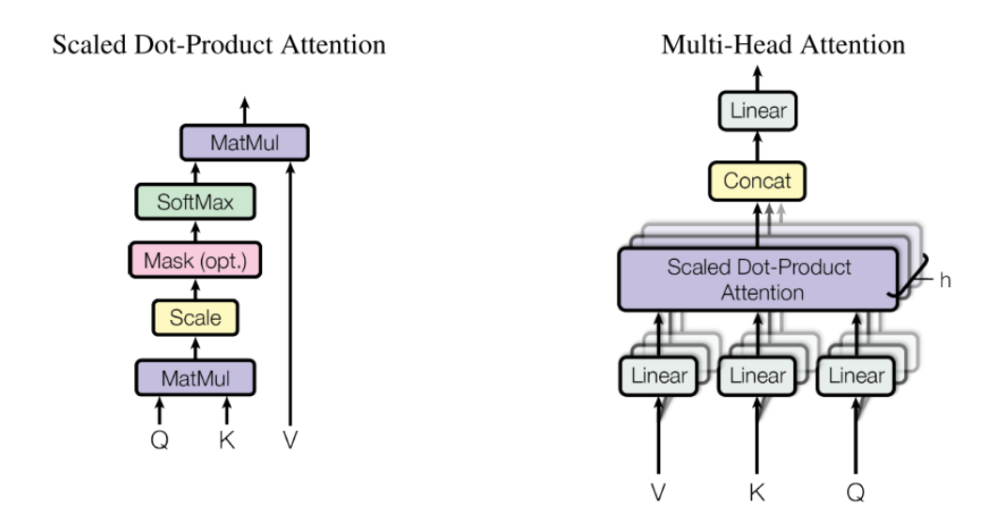
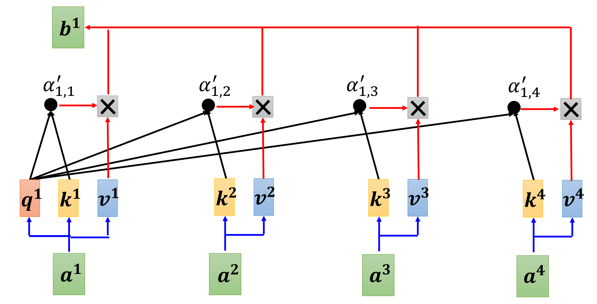
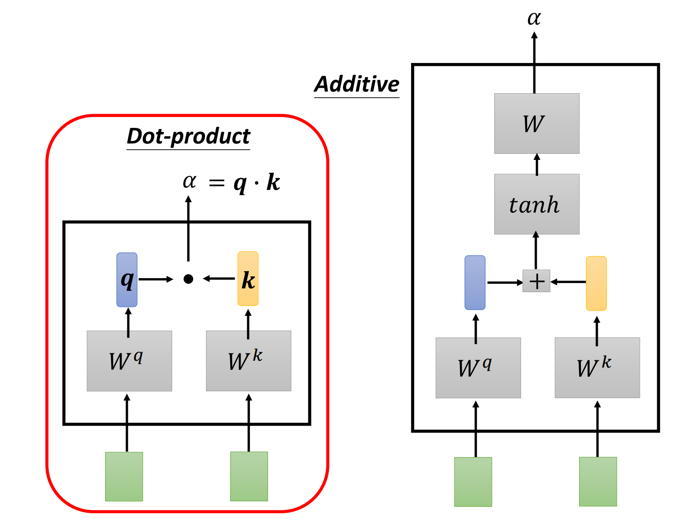
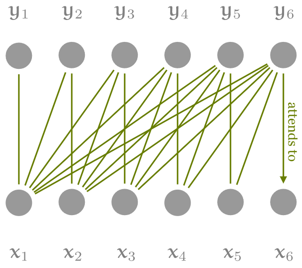

### 摘要

Transformer，它完全基于注意力机制，完全不需要递归和卷积。

### 背景

先前的一些模型中，关联来自两个任意输入或输出位置的信号所需的操作数量随着位置之间的距离而增加，使得学习遥远位置之间的依赖关系变得更加困难。

- 在 Transformer 中，这被减少到恒定数量的操作，由于平均注意力加权位置而导致有效分辨率降低，因此，采用多头注意力来抵消这种影响。

### 方法分析

#### 1. Encoder and Decoder

##### 1.1 Encoder

编码器由 $N = 6$ 个相同层的模块组成。每个模块有两个子模块。第一个是多头自注意力机制，第二个是简单的位置全连接前馈网络。在两个子模块周围采用残差连接，然后进行层归一化。即每个子模块的输出为$\text{LayerNorm}(x + \text{Sublayer}(x))$，其中$\text{Sublayer}(x)$是多头注意力模块本身实现的函数。为了促进这些残差连接，模型中的所有子模块以及embeddings层都会生成维度 $d_{\text{model}} = 512$ 的输出。

##### 1.2 Decoder

解码器也由 $N = 6$ 个相同层的模块组成。除了每个编码器模块中的两个子模块之外，解码器还插入第三个子模块，该子模块对编码器的输出执行多头注意力。同时在每个子模块周围采用残差连接，然后进行层归一化。此外，还修改了解码器中的多头注意力模块，使用掩码的方式防止当前位置关注后续位置，确保位置 $i$ 的预测只能依赖于小于 $i$ 的位置处的已知输出。

#### 2. Attention

##### 2.1 Scaled Dot-Product Attention

下图中，$a^1$ 生成的的query( $W_qa^1$ )去查询 $a^1,\ldots,a^4$ 生成的key( $W_ka^1,\ldots,W_ka^4$ )，获得注意力分数 $\alpha' _ {1,1},\ldots,\alpha'_{1,4}$ ，使用这些注意力分数与 $a^1,\ldots,a^4$ 生成的value( $W_va^1,\ldots,W_va^4$ ) 做内积，最后生成$a^1$对应的 $b^1$ 。

对该过程使用矩阵化并行计算，计算所有query和所有key的点积，除以 $\sqrt{d_k}$ ，得到注意力分数矩阵，然后使用 softmax 函数得到注意力权重矩阵，将注意力权重矩阵与value矩阵 $V$ 相乘，得到最终的注意力输出：
$$
\text{Attention}(Q,K,V) = \text{softmax}\left( \frac{QK^T}{\sqrt{d_k}} \right)V
$$
9两种最常用的注意力函数是**加性注意力**和**点积注意力**。虽然两种方法在理论复杂度上相似，但点积可以使用高度优化的矩阵乘法代码来实现，所以更快且更节省空间。对于较小的 $d_k$ 值，两种机制的表现相似；但对于较大的 $d_k$ 值，如果不进行缩放，加性注意力的表现优于点积注意力。可能是对于较大的 $d_k$ 值，点积的幅度会变得很大，使得softmax函数进入梯度极小的区域。所以通过 $\frac{1}{\sqrt{d_k}}$ 缩放点积抵消这种影响。

##### 2.2 Multi-Head Attention

对$d_{\text{model}}$维度的keys、values和queries执行单一的注意力函数不如通过不同的线性投影将queries、keys和values投影到$d_k$、$d_k$和$d_v$维度，并进行$h$次这样的操作更有益。对投影后的queries、keys和values，并行执行注意力函数，产生$d_v$维的输出值。将这些输出值拼接起来，再次进行投影，得到最终的输出值。
$$
\text{MultiHead}\left( Q,K,V \right) = \text{Concat} \left( head_{1},\ldots, head_{h}\right)W^O
$$

$$
head_i = \text{Attention} \left( QW_i^Q, KW_i^K, VW_i^V \right)
$$

其中：

- $W^Q_i \in \mathbb{R}^{d_{\text{model}} \times d_k}$
- $W^K_i \in \mathbb{R}^{d_{\text{model}} \times d_k}$
- $W^V_i \in \mathbb{R}^{d_{\text{model}} \times d_v}$
- $W^O \in \mathbb{R}^{h d_v \times d_{\text{model}}}$

上图中，将生成的query，key，value拆分成多个，每个部分单独做自注意力处理，然后concat到一起，整个过程形成多头注意力。

多头注意力使得模型可以联合关注来自不同表示子空间的不同位置的信息。使用单个注意力头时，平均化会抑制这种能力。论文使用了$h = 8$个并行的注意力层或头。对于每个头，使用$d_k = d_v = d_{\text{model}} / h = 64$，总的计算成本与全维度的单头注意力相似。

##### 2.3 Applications of Attention in transformer

- 在“编码器-解码器注意力”中，查询来自先前的解码器层，键和值来自编码器的输出。

- 在编码器自注意力层中，所有键、值和查询都来自同一位置，也就是编码器中前一层的输出。编码器中的每个位置可以关注编码器上一层中的所有位置。

- 解码器中的自注意力层允许解码器中的每个位置关注解码器中直到并包括该位置的所有位置（不能使用到当前位置右边的数据）。通过屏蔽（设置为$−\infty$）softmax输入中与非法连接相对应的所有值来实现缩放点积注意力的内部，以达到下图所示的效果。

#### 3. Position-wise Feed-Forward Networks

除了注意力子模块之外，编码器和解码器中的每个模块还包含一个全连接前馈神经网络。该网络由两个线性变换和一个ReLU激活函数组成，激活函数位于两个线性变换之间。

前馈神经网络的公式为： 
$$
\text{FFN}(x) = \max(0, xW_1 + b_1)W_2 + b_2
$$
其中：

- $x$是输入
- $W_1$和$W_2$是线性变换的权重矩阵
- $b_1$和$b_2$是偏置向量，
- $\max(0, \cdot)$表示ReLU激活函数

另一种描述方式是将其视为两个卷积核大小为1的卷积操作。输入和输出的维度是 $d_{\text{model}} = 512$，而内部层的维度是 $d_{ff} = 2048$。

#### 4. Embeddings and Softmax

- Embedding：输入序列中的单词（或标记）会转换为称为嵌入（Embedding-长为$d_{model}$的向量）的数值表示。这些嵌入捕捉了单词的含义和它们之间的关系。

解码器的输出经过线性变换，生成一个维度为词汇表大小的向量，然后通过softmax函数计算每个token的概率分布，最后让该结果辅助下一个token的生成。

论文中，在两个嵌入层和 pre-softmax 线性变换之间共享相同的权重矩阵，并在嵌入层中将这些权重乘以 $\sqrt{d_{model}}$。

####  5. Positional Encoding

由于Transformer模型没有循环和卷积机制，为了使模型能够利用序列的顺序信息，必须向输入embeddings中注入一些关于token相对或绝对位置的信息。具体的做法是，在编码器和解码器的底部将位置编码添加到输入embeddings中。位置编码的维度与embeddings的维度 $d_{\text{model}}$ 相同，这样可以直接相加。位置编码有多种选择，可以通过学习得到，也可以是固定（下文公式）。论文中使用的是正弦和余弦函数的固定位置编码。
$$
\text{PE(pos, 2i)} = \sin\left(\frac{\text{pos}}{10000^{\frac{2i}{d_{\text{model}}}}}\right)
$$

$$
\text{PE(pos, 2i+1)} = \cos\left(\frac{\text{pos}}{10000^{\frac{2i}{d_{\text{model}}}}}\right)
$$

其中：

- $\text{pos}$ 是位置
- $i$ 是维度

即位置编码的每个维度对应一个正弦函数或余弦函数。波长从 $2\pi$ 到 $10000 \cdot 2\pi$ 形成几何级数。选择这种函数是因为我们假设它可以使模型容易学习相对位置的关注机制，因为对于任何固定的偏移 $k$，$ \text{PE} _ {\text{pos}+k} $ 可以表示为 $  \text{PE}_{\text{pos}}  $ 的线性函数。

### 参考

[TRANSFORMERS FROM SCRATCH](https://peterbloem.nl/blog/transformers)

[The Illustrated Transformer](https://jalammar.github.io/illustrated-transformer/)
