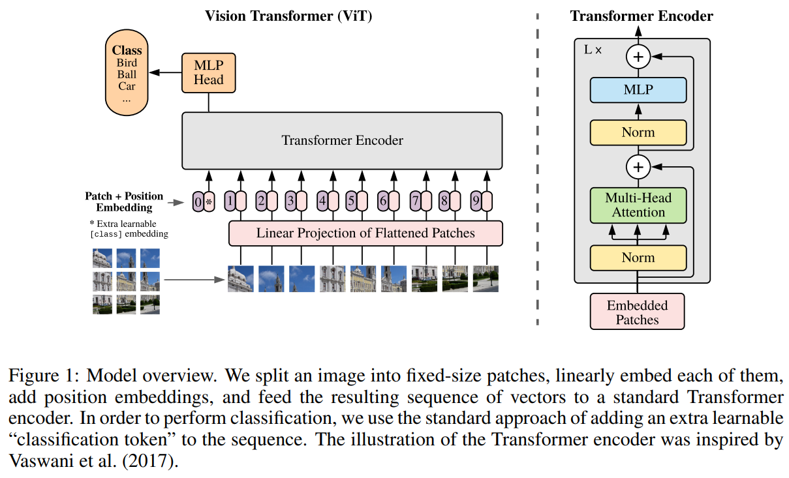

在计算机视觉中，注意力要么与卷积神经网络结合应用，要么用于替换卷积神经网络的某些模块，同时保持其整体结构不变。本文认为对卷积神经网络的依赖不是必要的，直接在图像块序列上应用纯 Transformer 也可以在分类任务上有良好的表现。

### 1. Introduction

受到 NLP 中 Transformer 成功的启发，本文尝试将标准 Transformer 直接应用于图像，并进行尽可能少的修改。即将图像分割成  patches，并提供这些 patches 的线性嵌入序列（linear embeddings）作为 Transformer 的输入。图像块的处理方式与 NLP  中的 token（单词）相同。

在中等规模的数据集（如ImageNet）上进行训练时，如果没有强力的正则化，这些模型的准确率比同等大小的ResNet低几个百分点。这种看似令人沮丧的结果是可以预料的：Transformer缺乏CNN固有的一些归纳偏置，例如平移等变性和局部性，因此在数据量不足的情况下，Transformer的泛化能力较差。 

然而，如果模型在更大的数据集（14M-300M 张）上进行训练，情况就会发生变化。实验发现大规模训练胜过归纳偏置。当以足够的规模进行预训练并转移到数据点较少的任务时，Vision Transformer（ViT）取得了优异的结果。

### 2. Method

在模型设计中，本文尽可能遵循原始的Transformer架构。这种刻意保持简洁的设计的一个好处是，可以几乎直接使用可扩展的 NLP Transformer 架构。

#### 2.1 Vision Transformer

标准 Transformer 接收token embeddings的一维序列作为输入。为了处理 2D 图像，本文将图像 $x \in R^{H×W×C}$ 重构为一系列展平的 2D 块 $x_p \in R^{N×(P^2·C)}$ ，其中 $(H,W)$ 是原始图像的分辨率，$C$ 是通道数，$(P, P)$ 是每个图像块的分辨率，$N = HW/P^2$ 是生成的块数，也是 Transformer 的有效输入序列长度。 Transformer 在其所有层中使用固定向量大小 $D$，因此将 patches 展平并使用可训练的线性投影映射到 D 维度（公式1）。将该投影的输出称为patch embeedings。

类似于BERT的[class] token，本文在 patch embeddings 序列前加上一个可学习的embeddings $(z_0^0 = x_{class})$ ，其在 Transformer 编码器输出时的状态 $(z_L^0)$ 作为图像分类结果 $y$（公式4）。在预训练和微调期间，分类头都连接到 $z_L^0$。预训练时分类头由一个带有隐藏层的 MLP 实现，而微调时则由一个线性层实现。position embeddings 被添加到 patch embeddings 中以保留位置信息。本文使用标准的可学习 1D position embeddings，因为使用更先进的 2D 感知position embeddings没有带来的显著性能提升。生成的 embeddings 向量序列作为编码器的输入。Transformer 编码器由多头自注意力和 MLP 块（公式 2、3）交替层组成。每个块前应用 Layernorm（LN），每个块后有残差连接。
$$
Z_0 = [X_{class};X_p^1E;X_p^2E;\ldots;X_p^NE;] + E_{pos}
$$

其中, $E \in R^{(P^2 \cdot C) \times D}, E_{pos} \in R^{(N+1) \times D}$ 。

$$
Z'_l = MSA(LN(Z _ {l-1})) + Z _ {l-1}
$$

$$
Z_l = MLP(LN(Z'_l)) + Z'_l
$$

其中，$l = 1 \ldots L$

$$
y = LN(Z_L^0)
$$

- **Inductive bias**

Vision Transformer相比于卷积神经网络，具有更少的图像特定归纳偏置。在CNNs中，局部性、二维邻域结构和平移等变性在整个模型的每一层中都有体现。而在ViT中，自注意力层是全局的，只有MLP层是局部的并且具有平移等变性。二维邻域结构的使用非常有限：在模型的开始阶段通过将图像切成patches，以及在微调时调整不同分辨率图像的 position embeddings （如下面描述的）。除此之外，初始化时的 position embeddings 并不携带关于这些 patches 的二维位置的信息，所有补丁之间的空间关系都需要从头学习。

- **Hybrid Architecture**

作为原始图像 patches 的替代，输入序列可以由CNN的特征图构成。在这种混合模型中，patch embeddings 投影E（公式1）应用在从CNN 特征图提取的 patches 。作为一种特殊情况，这些 patches 可以具有 $1 \times 1$ 的空间尺寸，这意味着输入序列是通过简单地展平特征图的空间维度并投影到 Transformer 维度来获得的。分类输入嵌入和位置嵌入如上所述添加。

#### 2.2 fine-tuning and higher resolution

通常的做法是在大型数据集上预训练 ViT ，然后再对较小的下游任务进行微调。所以，实验移除预训练的预测头并添加一个零初始化的 $D \times K$ 前馈层，其中 $K$ 是下游任务的类别数。通常，在比预训练更高的分辨率下进行微调是有益的。当输入更高分辨率的图像时，保持 patches 大小不变，这会导致更长的有效序列长度。Vision Transformer可以处理任意长度的序列（在内存限制范围内），但是预训练的 position embeddings 可能会变得无意义。所以，需要根据预训练 position embeddings 在原始图像中的位置，进行二维插值。这种分辨率调整和 patches 提取是唯一手动引入图像二维结构归纳偏置的地方。

### 3. Conclusion

本文直接将 Transformer 应用于图像识别。与之前在计算机视觉中使用自注意力机制的工作不同，除了初始的图像 patches 提取步骤外，没有在 Transformer 中引入任何图像特定的归纳偏置。而是将图像看作一系列的 patches ，并使用与NLP中相同的标准 Transformer 编码器来处理图像。这种简单但可扩展的策略在与大型数据集上的预训练结合时表现出色。因此，Vision Transformer在许多图像分类数据集上达到了或超过了现有的最先进水平，同时预训练相对便宜。

尽管这些初步结果令人兴奋，但仍有许多挑战存在。一个挑战是将 ViT 应用于其他计算机视觉任务，例如检测和分割。本文的结果，加上 Carion 等人的工作，展示了这种方法的前景。另一个挑战是继续探索自监督预训练方法。初步实验显示，自监督预训练有所改进，但自监督与大规模监督预训练之间仍有很大差距。最后，进一步扩大 ViT 的规模可能会带来更好的性能。
