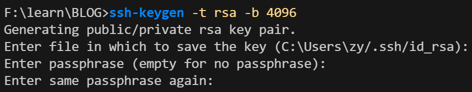

最近在实习的时候用的 vscode 连接远程服务器做一些任务，发现这个过程中总是需要打开一些不同的文件夹，每次打开新的文件夹都需要输入密码（连接远程的时候也是需要输密码），那么直接打开根目录的话，用终端的时候就是默认在根目录下，个人觉得不是很方便，遂上网找方法，做个总结。


### SSH_key

SSH密钥是一种用于安全远程登录的身份验证方法，主要由公钥和私钥组成。用户将公钥放在远程服务器上，而私钥则保存在本地，只有持有私钥的人才能访问对应的服务器。这种方式比传统的密码更安全，防止密码被窃取。

#### 生成 SSH key

如果之前使用过 GitHub，那本地的机器上应该是生成过 ssh key 的。

否则可以在终端执行以下指令生成：

```bash
ssh-keygen -t rsa -b 4096 -C "your_email@example.com"
```

- `-t rsa` 指定密钥类型为 RSA
- `-b 4096` 表示密钥长度为 4096 位
- `-C` 用于添加注释（通常是你的邮箱），也可以不填

系统会提示你

- 选择保存的位置，按回车接受默认位置，默认是 `~/.ssh/id_rsa` 
- 为私钥设置一个密码（看需求，一般直接回车不设置 ）



#### 查看 SSH key

执行完生成指令之后，在 `~/.ssh` 文件夹下会生成以下两个文件：

1. **私钥（id_rsa）**：
   - 该文件包含私钥内容，切勿与他人分享。私钥用于身份验证，存储在本地机器上。
2. **公钥（id_rsa.pub）**：
   - 该文件包含公钥内容，可以安全地分享给他人或添加到远程服务器的 `authorized_keys` 文件中。


#### 将公钥添加到远程服务器

1. **登录到远程服务器**： 使用密码登录到你的远程服务器 `ssh username@remote_host `， 创建 `.ssh` 目录（如果不存在）。

   ```bash
   mkdir -p ~/.ssh
   ```

2. **将公钥复制到 `authorized_keys` 文件**： 

   使用以下命令将本地公钥内容复制到远程服务器的 `authorized_keys` 文件中：

   ```bash
   # 远程终端执行
   echo "复制的本地公钥内容" >> ~/.ssh/authorized_keys
   ```

   

   你也可以使用 `scp` 命令直接复制公钥文件：

   - 如果本地是 Linux 系统可执行以下命令：

       ```bash
       # 直接创建远程 ~/.ssh/authorized_keys 文件（注意，会覆盖原始的文件）
       scp ~/.ssh/id_rsa.pub username@remote_host:~/.ssh/authorized_keys
       # 或者追加到远程服务器的authorized_keys文件中
       cat ~/.ssh/id_rsa.pub | ssh username@remote_host 'cat >> /.ssh/authorized_keys'
       ```
       
   - Windows终端应该识别不了路径 `~` （git bash 应该可以），可以在终端先切换到用户目录下找到 `.ssh` 文件夹，进入之后用以下命令：

       ```bash
       # 本地执行上传公钥
       scp id_rsa.pub username@remote_host:~/.ssh/id_rsa_local.pub
       # 进入远程服务器终端执行
       cat ~/.ssh/id_rsa_local.pub >> ~/.ssh/authorized_keys
       # 删除公钥
       rm ~/.ssh/id_rsa_local.pub
       ```

1. **设置正确的权限**： 确保 `.ssh` 目录和 `authorized_keys` 文件具有正确的权限：

   ```bash
   chmod 700 ~/.ssh
   chmod 600 ~/.ssh/authorized_keys
   ```


#### 在 VS Code 中配置 SSH 连接

1. **配置 SSH 主机**： 在VS Code 中输入并选择 `Remote-SSH: Add New SSH Host...`，然后输入`ssh username@remote_host`。
2. **选择 SSH 配置文件**： VS Code 会提示你选择 SSH 配置文件，通常是 `~/.ssh/config`。
3. **使用 SSH 密钥连接**： 之后，再连接服务器和打开文件夹应该不再需要输入密码
