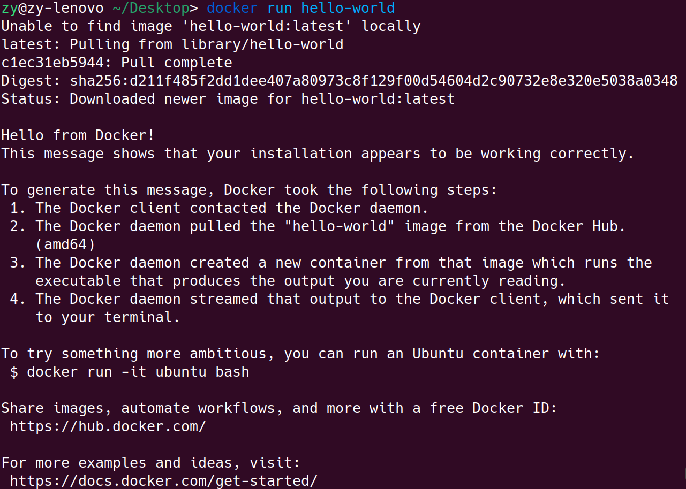

## 安装

### 使用 apt 存储库安装

在新主机上首次安装 Docker Engine 之前，需要设置 Docker 存储库。之后，您可以从存储库安装和更新 Docker。

#### 1. 设置 Docker 的`apt`存储库。

   ```bash
sudo apt-get update
sudo apt-get install ca-certificates curl
sudo install -m 0755 -d /etc/apt/keyrings
sudo curl -fsSL https://download.docker.com/linux/ubuntu/gpg -o /etc/apt/keyrings/docker.asc
sudo chmod a+r /etc/apt/keyrings/docker.asc

echo \
  "deb [arch=$(dpkg --print-architecture) signed-by=/etc/apt/keyrings/docker.asc] \
   https://download.docker.com/linux/ubuntu \
   $(. /etc/os-release && echo "$VERSION_CODENAME") stable" | \
   sudo tee /etc/apt/sources.list.d/docker.list > /dev/null
  
sudo apt-get update
   ```

- `sudo apt-get update`:
  - 更新系统的软件包列表，以确保系统可以访问最新的软件包。

- `sudo apt-get install ca-certificates curl`:
  - 安装两个软件包：
    - `ca-certificates`：用于验证服务器的数字证书，确保连接的安全性。
    - `curl`：一个用于传输数据的命令行工具。

- `sudo install -m 0755 -d /etc/apt/keyrings`:
  - 创建目录 `/etc/apt/keyrings`，权限为 0755。
  - 目录的拥有者可以读取、写入和执行，其他用户只能读取和执行。

- `sudo curl -fsSL https://download.docker.com/linux/ubuntu/gpg -o /etc/apt/keyrings/docker.asc`:
  - 使用 `curl` 命令从 Docker 官方网站下载 GPG 公钥文件。
  - 将文件保存到 `/etc/apt/keyrings/docker.asc`。

- `sudo chmod a+r /etc/apt/keyrings/docker.asc`:
  - 将文件 `/etc/apt/keyrings/docker.asc` 的权限设置为所有用户都可以读取。

- `echo "deb [arch=$(dpkg --print-architecture) signed-by=/etc/apt/keyrings/docker.asc] https://download.docker.com/linux/ubuntu $(. /etc/os-release && echo "$VERSION_CODENAME") stable" | sudo tee /etc/apt/sources.list.d/docker.list > /dev/null`
  - 使用 `echo` 命令创建 Docker 的 Apt 源列表。
  - 使用 `dpkg --print-architecture` 确定系统架构。
  - 使用 `signed-by=/etc/apt/keyrings/docker.asc` 指定 GPG 公钥文件的路径。
  - 使用 `. /etc/os-release && echo "$VERSION_CODENAME"` 确定当前系统版本代号。
  - 使用 `sudo tee /etc/apt/sources.list.d/docker.list > /dev/null` 将 Apt 源列表写入文件 `/etc/apt/sources.list.d/docker.list`，并将标准输出重定向到 `/dev/null` 以隐藏命令行输出。

- `sudo apt-get update`:
  - 更新系统的软件包列表，以确保添加的 Docker 源生效。


#### 2. 安装 Docker 软件包。

要安装最新版本，请运行：

```bash
sudo apt-get install docker-ce docker-ce-cli containerd.io docker-buildx-plugin docker-compose-plugin
```


#### 3. 通过运行镜像来验证Docker Engine安装是否成功 `hello-world`。

```bash
sudo docker run hello-world
```



docker run 的时候，hello-world 这个镜像是不存在本地的，所以他去远程仓库拉取镜像并运行（docker 镜像源最近有一些问题，如果访问不到建议上网找一些可以访问的镜像源）。


#### 4. 以非 root 用户身份管理 Docker

  Docker 守护进程绑定到 Unix 套接字，而不是 TCP 端口。默认情况下，该 `root`用户拥有      Unix 套接字，其他用户只能使用 `sudo`. Docker 守护进程始终以`root`用户身份运行。

  如果您不想`docker`在命令前面加上`sudo`，请创建一个名为 的 Unix 组`docker`并向其中添加用户。当 Docker 守护进程启动时，它会创建一个可由组成员访问的 Unix 套接字`docker`。在某些 Linux 发行版上，系统在使用包管理器安装 Docker Engine 时会自动创建该组。在这种情况下，您无需手动创建组。

  创建`docker`组并添加您的用户：

  - 创建`docker`群组。

    ```bash
    sudo groupadd docker
    ```

  - 将您的用户添加到`docker`组中。

    ```bash
    sudo usermod -aG docker $USER
    ```

  - 激活对组的更改：

    ```bash
    newgrp docker
    ```

  - 验证是否可以不用`sudo`执行`docker`

    ```bash
    docker run hello-world
    ```

    此命令下载测试镜像并在容器中运行它。当容器运行时，它会打印一条消息并退出。

    如果您在将用户添加到组之前运行 Docker CLI 命令`docker`，可能会看到以下错误：
    
    ```bash
    WARNING: Error loading config file: /home/user/.docker/config.json -stat
    /home/user/.docker/config.json: permission denied
    ```
    
    此错误表明由于之前使用过该命令，该目录的权限设置不正确。
    要解决此问题，删除`~/.docker/`目录（它会自动重新创建，但所有自定义设置都会丢失），或者使用以下命令更改其所有权和权限：
    
    ```bash
    sudo chown "$USER":"$USER" /home/"$USER"/.docker -R
    sudo chmod g+rwx "$HOME/.docker" -R
    ```
    
    
