## Docker 使用教程

### 1. 什么是 Docker？
Docker 是一个开源平台，用于开发、交付和运行应用程序。它使用容器（轻量级、可移植的运行环境）来打包应用及其依赖项，确保在不同环境中一致地运行。（就是不用你操心环境问题，深度学习福音）


### 2. Docker 的核心概念

- **镜像（Image）**: Docker 镜像是一个只读的模板，包含运行应用所需的操作系统、库和应用程序。
- **容器（Container）**: 容器是从镜像创建的实例，是一个轻量级、可执行的独立软件包。
- **Dockerfile**: 一个文本文件，包含用于构建 Docker 镜像的所有命令。
- **Docker Hub**: Docker 的公共仓库，可以存储和分享 Docker 镜像（类似于Github是存储代码的）。


### 3. 安装 Docker

见 [docker 安装](./docker_install.md) 。


### 4. 常用 Docker 命令

#### 4.1 查看 Docker 版本

```bash
docker --version
```


#### 4.2 拉取镜像

```bash
# 拉取指定版本的镜像
docker pull <image-name>:<tag>
```
示例：使用 docker 拉取 nginx 最新版本镜像。

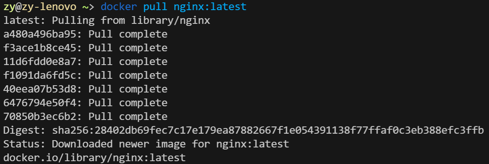


#### 4.3 列出本地镜像

```bash
docker images
```

示例：列出本地所有 Docker 镜像的详细信息，包括仓库名、标签、镜像 ID、创建时间和大小。

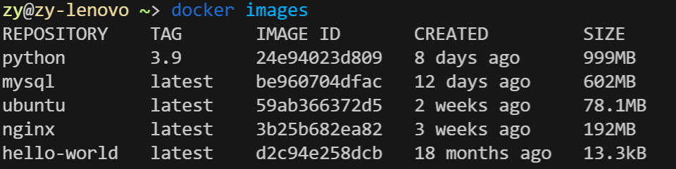


#### 4.4 创建并启动容器

```bash
docker run [OPTIONS] <image-name>:<tag>
```
**OPTIONS**: 可选参数，用于配置容器。

- `-d`: 后台运行容器。
- `-p <host-port>:<container-port>`: 映射主机端口到容器端口。
- `--name <container-name>`: 指定容器名称。
- `-e <key>=<value>`: 设置环境变量。
- ....

示例：以后台模式运行一个最新的 Nginx 容器，将主机的 8080 端口映射到容器的 80 端口，将容器命名为 `my-nginx`，并设置环境变量 `NGINX_HOST` 为 `example.com`。

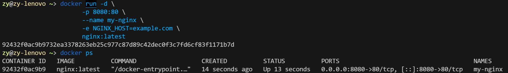

接着在浏览器上即可访问映射到 8080 端口的 nginx 服务。

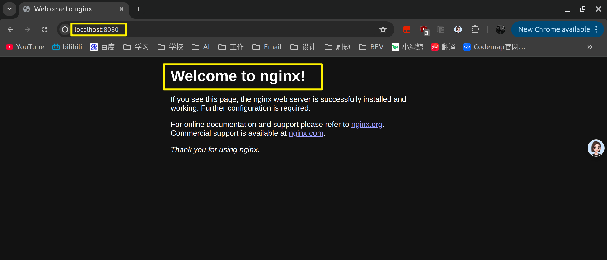


#### 4.5 查看容器日志

```bash
# 查看指定容器的日志输出
docker logs <container-id>
```

常用参数：

- `-f`: 实时跟踪日志输出。

示例：

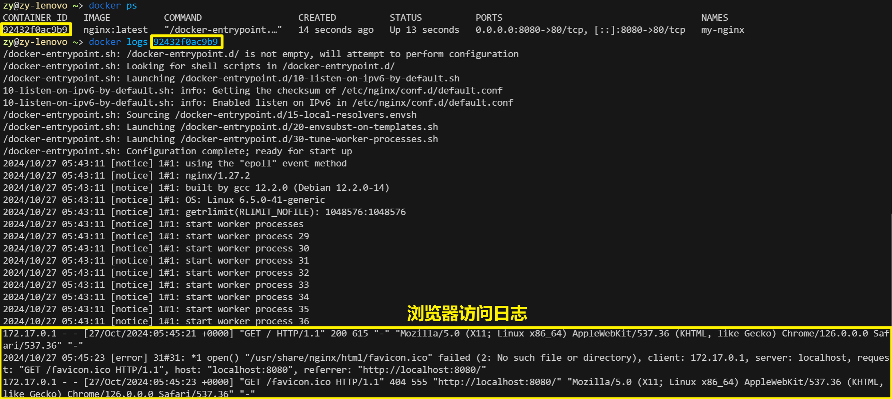


#### 4.6 列出容器

```bash
docker ps [OPTIONS]
```

- `-a`: 列出所有容器，包括停止的容器。
- `--filter <filter>`: 根据条件过滤容器列表。

示例：

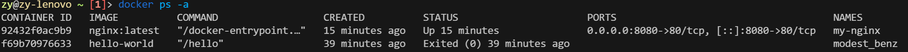


#### 4.7 进入容器

```bash
# 在运行中的容器中打开一个新的 shell 会话
docker exec -it <container-id> /bin/bash
```

**常用参数**：

- `-i`: 让容器保持标准输入打开。
- `-t`: 分配一个伪终端。

示例：在指定的 Docker 容器中启动一个交互式的 Bash shell 会话。

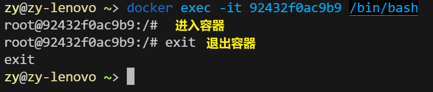


#### 4.8 停止容器

```bash
docker stop <container-id>
```

  示例：

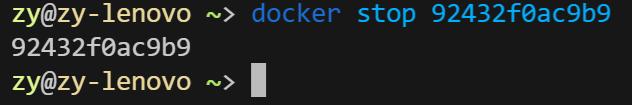


#### 4.9 启动容器

```bash
docker start <container-id>
```

示例：

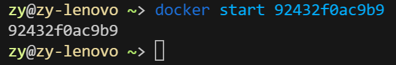

#### 4.10 删除容器

```bash
docker rm <container-id>
```

  示例：注意删除容器之前要停止 容器

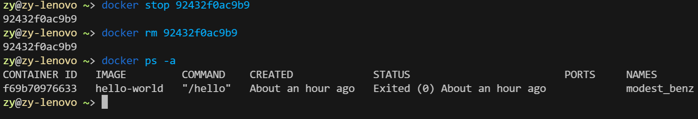


#### 4.11 删除镜像

```bash
docker rmi <image-id>
```

  示例：

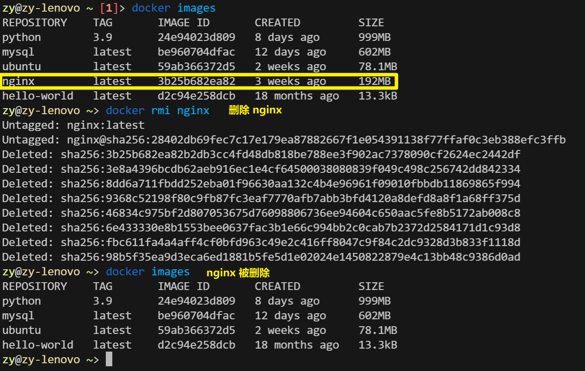


### 5.  Dockerfile 使用

#### 5.1 创建 Dockerfile 和必要文件

Dockerfile 是用来**构建镜像**的脚本：

- 创建一个目录去写我们的 Dockerfile 

  ```bash
  mkdir my_docker_app
  cd my_docker_app
  ```

- 创建并编写 Dockerfile

  ```bash
  nano Dockerfile
  # 或者使用 vim 编辑器
  vim Dockerfile
  ```
  
  编辑以下内容：
  
  ```bash
  # 使用官方 Node.js 镜像作为基础镜像
  FROM node:14
  
  # 设置工作目录
  WORKDIR /usr/src/app
  
  # 复制 package.json 和 package-lock.json
  COPY package*.json ./
  
  # 安装依赖
  RUN npm install
  
  # 复制应用代码
  COPY . .
  
  # 暴露应用运行的端口
  EXPOSE 3000
  
  # 指定容器启动时执行的命令
  CMD [ "node", "app.js" ]
  ```

上面的 Dockerfile 里面指定了 app.js 和 package.json 文件的使用，所以我们需要在 Dockerfile 的同级目录下创建这两个文件。

- 创建 `app.js` （这个代码是一个简单的 Node.js 应用程序，使用 Express 框架在端口 3000 上启动一个 HTTP 服务器，并在访问根路径（`/`）时返回 "Hello, Docker!" 的响应。）

  ```javascript
  const express = require('express');
  const app = express();
  const PORT = 3000;
  
  app.get('/', (req, res) => {
      res.send('Hello, Docker!');
  });
  
  app.listen(PORT, () => {
      console.log(`Server is running on http://localhost:${PORT}`);
  });
  ```

- 创建 `package.json` （这个 `package.json` 文件描述了一个简单的 Node.js 应用程序，使用 Express 框架，并定义了启动脚本 `start` 来运行 `app.js`。）

  ```json
  {
    "name": "my-docker-app",
    "version": "1.0.0",
    "description": "A simple Node.js app",
    "main": "app.js",
    "scripts": {
      "start": "node app.js"
    },
    "dependencies": {
      "express": "^4.17.1"
    }
  }
  ```

至此，我们构建这个镜像所需要的文件准备完成。


#### 5.2 构建镜像

使用 Dockerfile 构建镜像：
```bash
docker build -t <镜像名称>:<标签> .
```
示例：在 Dockerfile 同级目录执行 `docker build -t my_docker_image .`

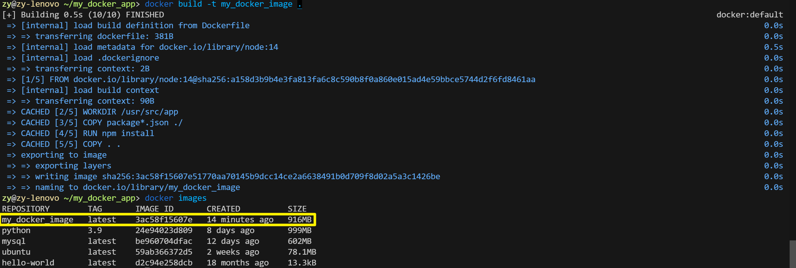


#### 5.3 运行 Docker 容器

构建完成后，可以使用以下命令运行容器：
```bash
docker run -d -p 3000:3000 my_docker_app
```
- `-d` 表示以后台模式运行

- `-p` 用于端口映射。

  

#### 5.4 访问应用

在浏览器中访问 `http://localhost:3000`，即可查看运行的应用。

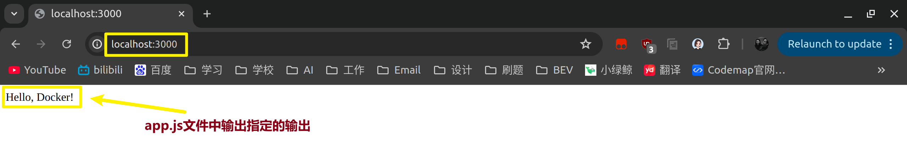


### 6. Docker network

Docker 网络是用于容器之间通信的机制，允许容器通过网络相互连接。Docker 提供了多种网络驱动类型，最常用的包括：

- **bridge**: 默认网络驱动，适用于在单台主机上运行的容器。
- **host**: 将容器直接连接到主机的网络。
- **overlay**: 用于跨多个 Docker 主机的网络通信，适合集群环境。
- **macvlan**: 允许容器拥有其 MAC 地址，并直接连接到物理网络。


#### 6.1 列出网络

查看所有 Docker 网络：

```bash
docker network ls
```


#### 6.2 创建网络

使用以下命令创建一个新的网络：

```bash
docker network create <network-name>
```

示例：列出当前的网络并创建一个新的网络 `my_bridge_network`。

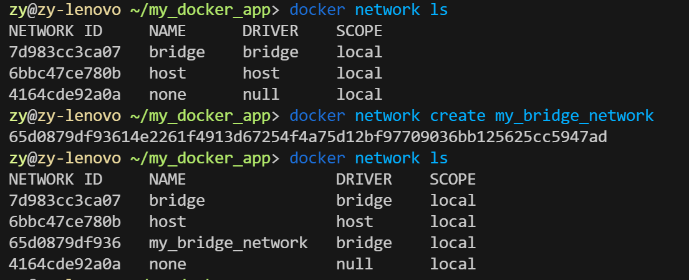


#### 6.3 容器连接/断开网络

```bash
# 在运行容器时指定网络
docker run --network <network-name> <image-name>
# 连接容器到网络
docker network connect <network> <container>
# 断开容器与网络的连接
docker network disconnect <network> <container>
```

示例：在后台运行一个使用 `my_docker_image` 镜像的容器，并将其连接到名为 `my_bridge_network` 的自定义桥接网络。

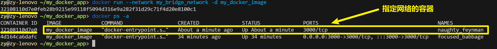


#### 6.4 查看网络详情

获取网络的详细信息：

```bash
docker network inspect <network-name>
```

示例：获取我们自己创建的网络 `my_bridge_network` 的信息，里面会包含上一步操作中生成的容器信息。

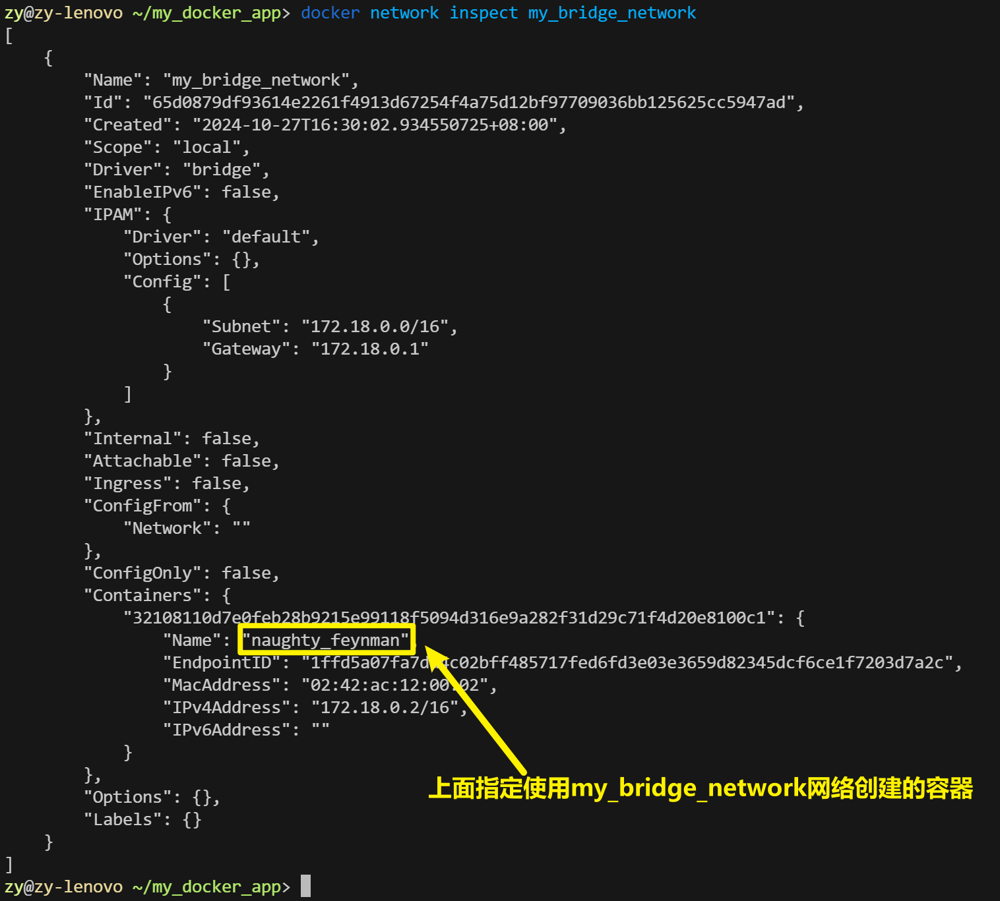


#### 6.5 删除网络

删除不再使用的网络：

```bash
docker network rm <network-name>
```

如果要删除所有未使用的网络，可以使用：

```bash
docker network prune
```


### 7. Docker 卷

Docker 卷用于**持久化**和**共享容器数据**。卷存储在主机上，与容器生命周期无关，适用于需要长期保存数据的场景。

#### 7.1 列出卷

查看所有 Docker 卷：

```bash
docker volume ls
```


#### 7.2 创建卷

创建一个新的卷：

```bash
docker volume create <volume-name>
```

示例：创建 `my_volume` 卷

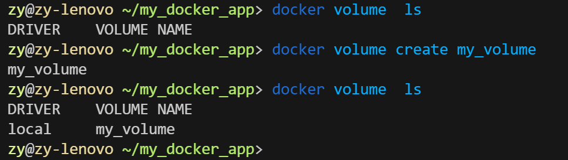


#### 7.3 使用卷

在运行容器时，使用 `-v` 或 `--mount` 参数挂载卷：

```bash
docker run -v <volume-name>:<container-path> <image-name>
```

示例：将 `my_volume` 卷挂载到容器的 `/usr/src/app/data` 目录下，实现共享文件或持久化存储日志等功能。

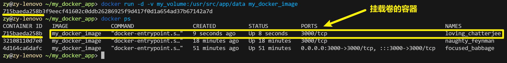


#### 7.4 查看卷详情

获取卷的详细信息：

```bash
docker volume inspect <volume-name>
```

示例：查看我们自己创建的卷 `my_volume` 的信息。

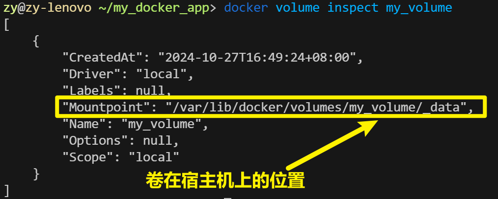


#### 7.5 删除卷

删除不再使用的卷：

```bash
docker volume rm <volume-name>
```

如果要删除所有未使用的卷，可以使用：

```bash
docker volume prune
```


### 8. 本地镜像管理

在 Docker 中，镜像是容器的基础。有效地管理本地镜像可以帮助你更好地利用存储资源，并保持环境的整洁。（上面的一些内容已经包含了镜像的一些操作，这里不再详细赘述）

#### 8.1 列出本地镜像

```bash
# 该命令将显示镜像的 REPOSITORY、TAG、IMAGE ID、创建时间和大小等信息。
docker images
```


#### 8.2 删除镜像

请确保删除前该镜像没有被任何容器使用。可以使用 `-f` 参数强制删除。

```bash
docker rmi [-f] <image-id>
```


#### 8.3 创建镜像别名（Tag）

为本地镜像创建别名（tag），便于再在不同的环境中辨别镜像版本：

```bash
docker tag <image-id> <repository>:<tag>
```

示例：为本地的 `my_docker_image` 镜像创建一个新的标签 `myrepo/my_docker_image:v1.0`。

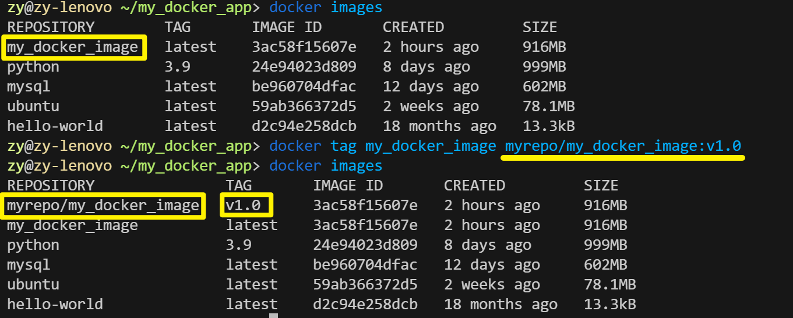


#### 8.4 查看镜像历史

要查看指定镜像的历史层信息，包括每一层的创建时间和命令，可以使用：

```bash
docker history <image-id>
```

示例：输出显示了 Docker 镜像的构建历史，每一行代表镜像的一个层，包括每一层的创建时间、创建命令、大小和一些其他元数据。**18 个月前**的内容是基础镜像的构建历史，而 **2 小时前**的内容是使用我们编写的 Dockerfile 构建自己镜像时添加的新层。

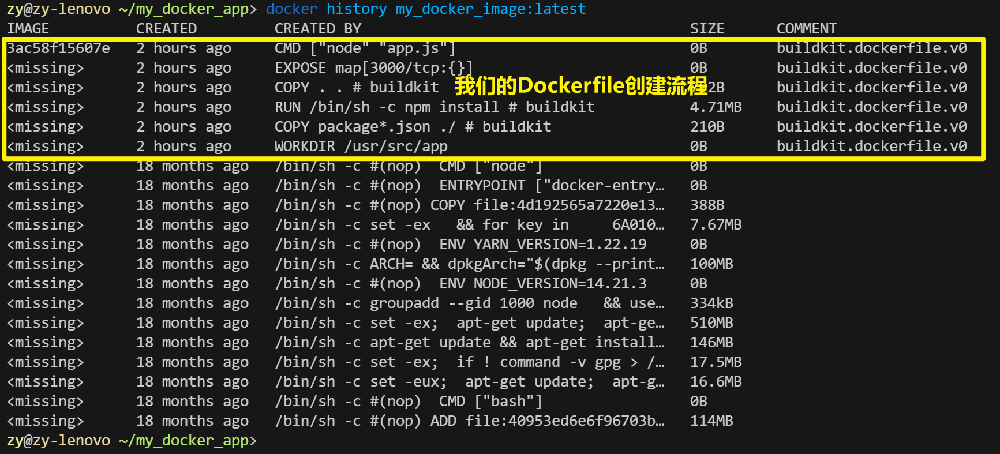


#### 8.5 保存镜像

如果你想将一个或多个 Docker 镜像保存到一个 `tar` 归档文件中，可以使用以下命令：

```bash
docker save -o <file-path>.tar <image-name>:<tag>
```

示例：将 `my_docker_image:latest` 的 Docker 镜像保存为一个名为 `my_docker_image.tar` 的 tar 文件，存储在当前目录下，方便我们以文件的形式传播该镜像。

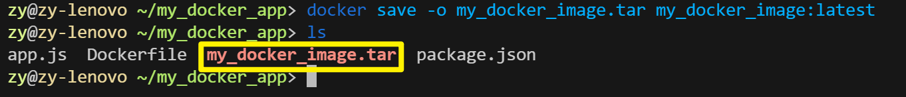


#### 8.6 加载镜像

要从由 `docker save` 命令生成的 `tar` 文件中加载 Docker 镜像，可以使用 `docekr load` ，会保留原有的镜像历史层信息和标签：

```bash
docker load -i <file-path>.tar
```

示例：从 `my_docker_image.tar` 文件中加载 Docker 镜像到本地 Docker 环境中。

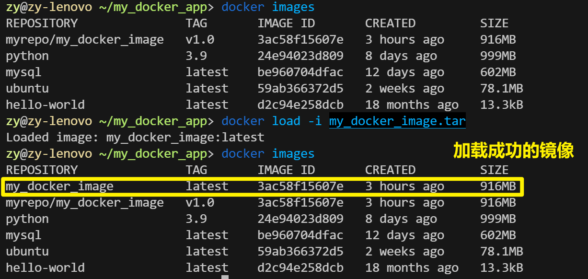


#### 8.7 导入镜像

从一个 `tar` 文件或 `URL` 导入容器快照，导入一个新的基础镜像，不保留原有镜像的历史层信息。：

```bash
docker import <file-path>.tar <new-image-name>
```

示例：从 `my_docker_image.tar` 文件中导入一个新的 Docker 镜像，并将其命名为 `my_docker_image_new`。

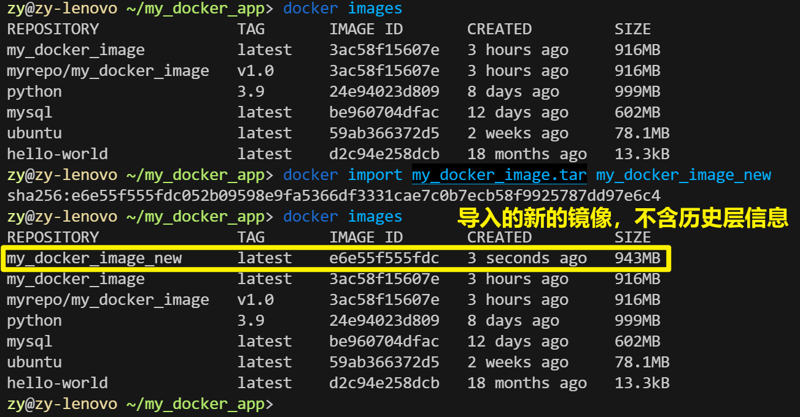


### 9. Docker Compose 

Docker Compose 是一个用于**定义和运行多个 Docker 容器**的工具。使用 Compose，可以通过 YAML 文件来配置应用程序的服务，从而简化了容器的管理和部署。

这一节，我们用一个案例来做演示，我们将创建一个简单的 Node.js 应用，并使用 Docker Compose 来管理其服务。这个应用将使用 Express 框架，并与 MongoDB 数据库进行交互。

#### 9.1 安装 Docker Compose

确保你的系统上已安装 Docker 和 Docker Compose。可以通过以下命令检查：

```bash
docker compose --version
```

如果没安装，使用以下命令安装：

```bash
sudo apt-get update
sudo apt-get install docker-compose-plugin
```


#### 9.2 创建项目目录

首先，创建一个新的项目目录，并进入该目录：

```bash
mkdir my_node_app
cd my_node_app
```


#### 9.3 创建 Dockerfile

在项目目录中创建 `Dockerfile`，并添加以下内容：

```Dockerfile
# 使用官方 Node.js 镜像作为基础镜像
FROM node:14

# 设置工作目录
WORKDIR /usr/src/app

# 复制 package.json 和 package-lock.json
COPY package*.json ./

# 设置 npm 镜像源为腾讯云镜像
RUN npm config set registry https://mirrors.cloud.tencent.com/npm/ && \
    npm install

# 复制应用代码
COPY . .

# 暴露应用运行的端口
EXPOSE 3000

# 指定容器启动时执行的命令
CMD [ "node", "app.js" ]
```


#### 9.4 创建 Node.js 应用代码

在项目目录中创建 `app.js` 文件，并添加以下代码，这个代码是一个简单的 Node.js 应用程序，使用 Express 框架在端口 3000 上启动一个 HTTP 服务器，并连接到名为 `mydatabase` 的 MongoDB 数据库。当访问根路径（`/`）时，服务器会返回 "Hello, Docker with MongoDB!" 的响应：

```javascript
const express = require('express');
const mongoose = require('mongoose');
const app = express();
const PORT = 3000;

mongoose.connect('mongodb://db:27017/mydatabase', { useNewUrlParser: true, useUnifiedTopology: true });

app.get('/', (req, res) => {
    res.send('Hello, Docker with MongoDB!');
});

app.listen(PORT, () => {
    console.log(`Server is running on http://localhost:${PORT}`);
});
```


#### 9.5 创建 package.json

在项目目录中创建 `package.json`，并添加以下内容，这个文件定义了一个简单的 Node.js 应用程序，使用 Express 框架和 Mongoose 库来连接 MongoDB，并且包含启动脚本 `start` 来运行 `app.js` ：

```json
{
  "name": "my-node-app",
  "version": "1.0.0",
  "description": "A simple Node.js app with MongoDB",
  "main": "app.js",
  "scripts": {
    "start": "node app.js"
  },
  "dependencies": {
    "express": "^4.17.1",
    "mongoose": "^5.10.9"
  }
}
```


#### 9.6 创建 docker-compose.yml

在项目目录中创建 `docker-compose.yml` 文件，这个文件定义了一个包含 Node.js 应用和 MongoDB 数据库的服务组合，并配置了端口映射、依赖关系、环境变量和数据持久化：

```yaml
services:
  web:
    build:
      context: .
      dockerfile: Dockerfile
    ports:
      - "3000:3000"
    depends_on:
      - db
    environment:
      - NODE_ENV=production

  db:
    image: mongo:latest
    volumes:
      - dbdata:/data/db

volumes:
  dbdata:
```


#### 9.7 启动服务

使用以下命令启动所有服务：

```bash
docker compose up -d
```

 `-d` ：在后台运行

示例：

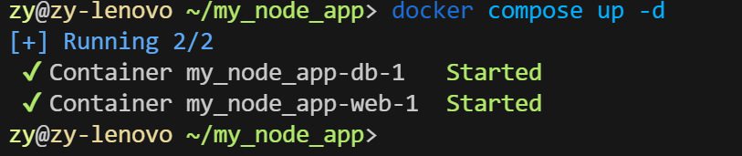


#### 9.8 查看服务状态

使用以下命令查看正在运行的服务：

```bash
docker compose ps
```

示例：显示的结果表明，Docker Compose 服务已经成功启动并运行。`my_node_app-web-1` 容器基于 `my_node_app-web` 镜像，映射了主机的 3000 端口到容器的 3000 端口，并且正在运行。`my_node_app-db-1` 容器基于 `mongo:latest` 镜像，暴露了 27017 端口，并且也在运行。

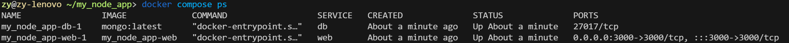

同时使用 `docker ps -a` ，也能够看到这两个容器。

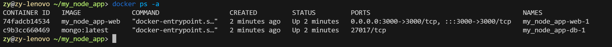


#### 9.9 访问应用

在浏览器中访问 `http://localhost:3000`，你应该能看到 "Hello, Docker with MongoDB!" 的信息，表示应用正在运行并成功连接到 MongoDB。


#### 9.10 重新构建服务

如果对代码或 `Dockerfile` 进行了更改，比如我们将 `app.js` 文件修改为：

```javascript
const express = require('express');
const mongoose = require('mongoose');
const app = express();
const PORT = 3000;

mongoose.connect('mongodb://db:27017/mydatabase', { useNewUrlParser: true, useUnifiedTopology: true });

app.get('/', (req, res) => {
    res.send('Hello, this Node.js and MongoDB application is running in Docker!');
});

app.listen(PORT, () => {
    console.log(`Server is running on http://localhost:${PORT}`);
});
```

可以使用以下命令重新构建服务。：

```bash
docker compose up --build -d
```

这将重新构建服务并启动它们。

示例：

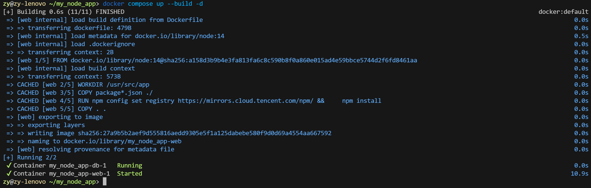

并且此时我们再次访问 `localhost:3000` ，显示的内容已经修改为 `Hello, this Node.js and MongoDB application is running in Docker!`

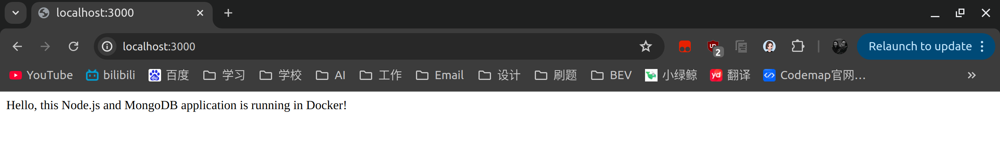


#### 9.11 使用多个 Compose 文件

假设你想为开发和生产环境使用不同的配置。你可以创建一个名为 `docker-compose.override.yml` 的文件，在其中定义开发环境的配置。例如：

```yaml
services:
  web:
    environment:
      - NODE_ENV=development
    ports:
      - "4000:3000"  # 在开发环境中使用不同的端口
```

在此文件中，我们为 `web` 服务定义了开发环境的环境变量，并更改了端口映射。

要启动这两个 Compose 文件，可以使用以下命令：

```bash
docker-compose up -f docker-compose.yml -f docker-compose.override.yml
```

这样，Docker Compose 将使用两个文件中的配置，结合它们来启动服务。


#### 9.12 停止服务

要停止运行的服务，可以使用：

```bash
docker compose stop
```

示例：

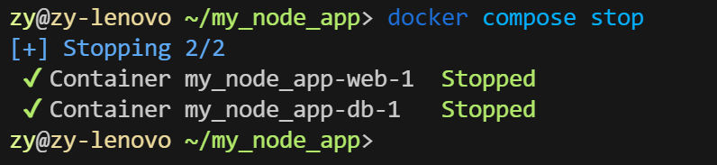

如果要停止并删除容器，可以使用：

```bash
docker-compose down
```


### 10. 清理 Docker

为了释放空间，可以定期清理未使用的镜像和容器：
- 删除所有停止的容器：
  ```bash
  docker container prune
  ```
  示例：
  
  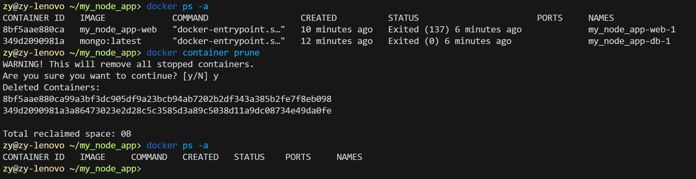
  
  
  
- 删除所有未使用的镜像：

  ``` bash
  docker image prune
  ```
  示例：

  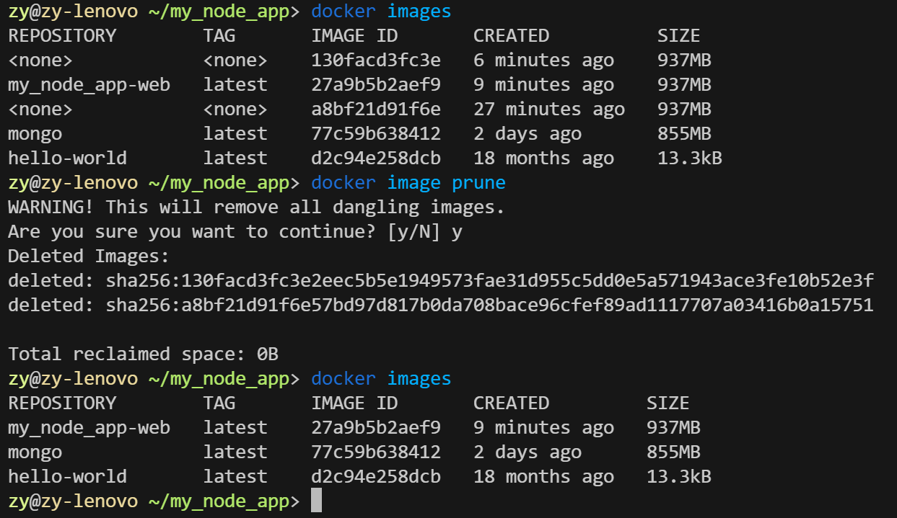


### PS：一些疑问

在 `docker images` 命令的输出中，出现 `<none>` 标签的原因通常有以下几种情况：

1. **中间镜像**：在构建 Docker 镜像的过程中，Docker 会创建多个中间镜像层。这些中间镜像层通常没有标签（即 `<none>`），但它们会被保留在系统中，直到被清理。
2. **未标记的镜像**：如果你在构建或导入镜像时没有给它指定标签，那么该镜像就会显示为 `<none>`。
3. **删除了标签**：如果你手动删除了某个镜像的标签，但镜像本身仍然存在，那么它也会显示为 `<none>`。