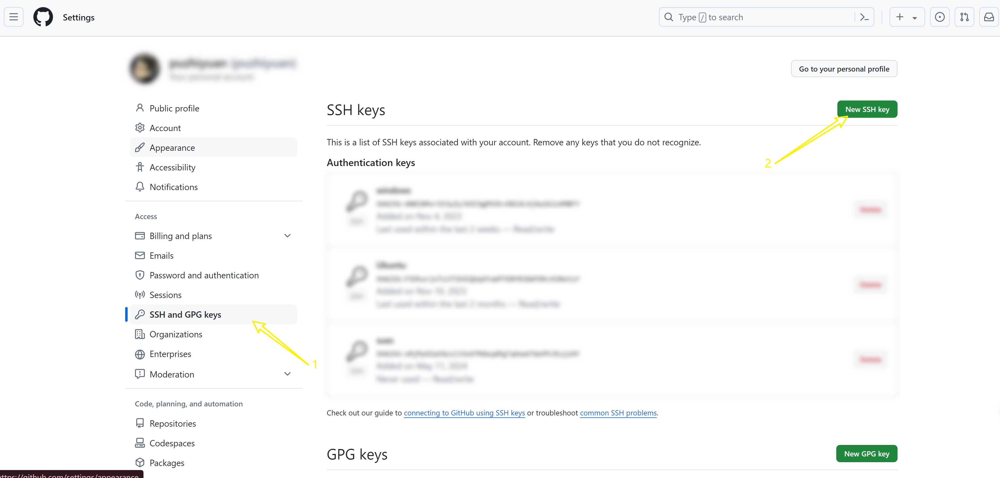
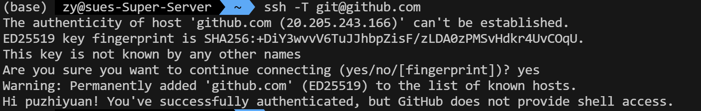
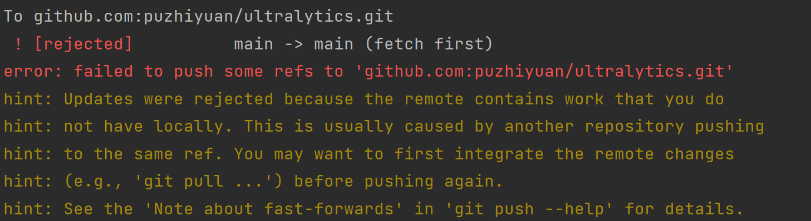
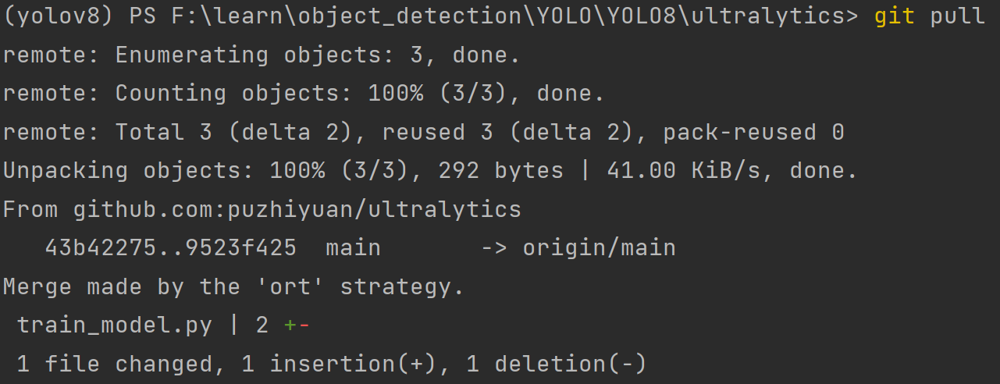
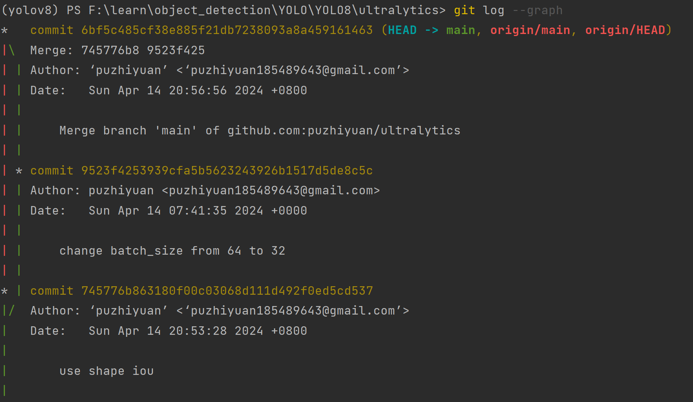
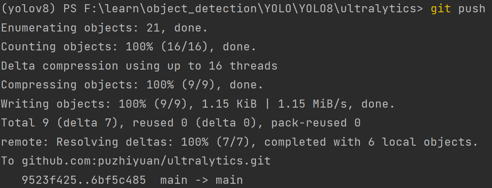
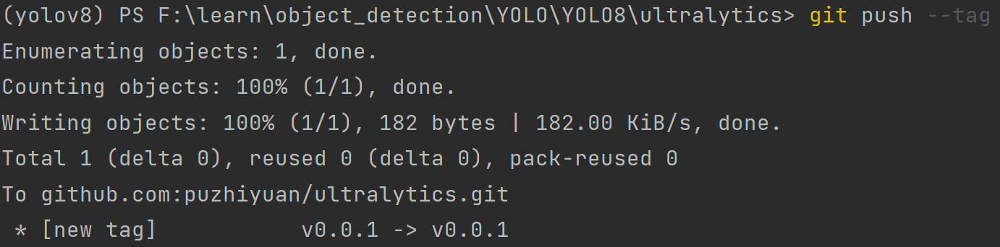
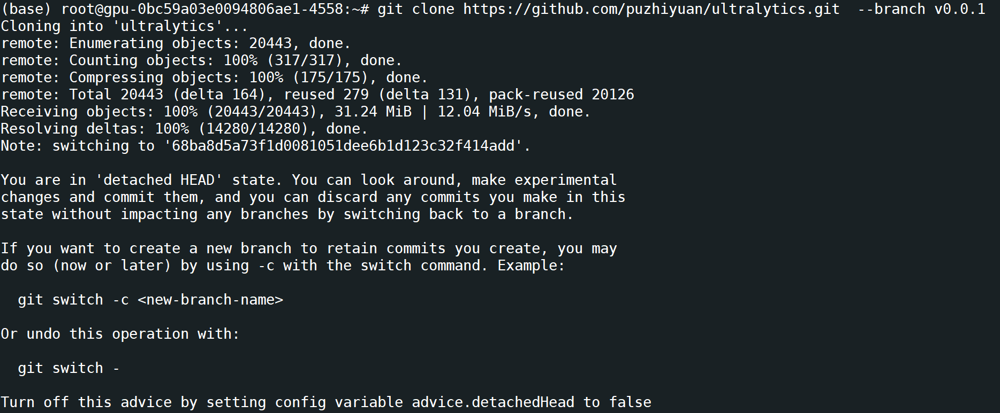

## 1. 环境配置

### 1. 生成密钥

```bash
# 生成密钥
ssh-keygen -t rsa -b 4096 -C puzhiyuan185489643@gmail.com
# 查看密钥
cat ~/.ssh/id_rsa.pub
```

### 2. 将密钥上传到 Github



验证是否成功：

```bash
ssh -T git@github.com
```




## 2. 使用

### 1. 初始化git仓库

```bash
git init
```

**该命令将执行以下操作：**

- 创建一个名为 `.git` 的新目录。
- 在`.git`目录中创建以下文件：
  - `config`：存储 Git 配置信息的文件。
  - `HEAD`：指向当前活动分支的指针文件。
  - `objects`：存储 Git 对象（blob、树和提交）的目录。
  - `refs`：存储 Git 引用（分支、标签和远程信息）的目录。
- 初始化 HEAD 指针以指向初始提交，该提交是一个空提交，消息为“Initial commit”。

### 2. 工作区、暂存区、版本库

**1. 工作区（Working Directory）:**

- 这是在本地计算机上编辑、修改和创建文件的地方。
- 包含所有受版本控制管理的文件和目录。
- 可以在此区域使用 git 命令来跟踪更改、查看历史记录并提交更改。

**2. 暂存区（Staging Area）:**

- 这是一个临时区域，用于存储要提交到版本库的更改。
- 使用 `git add` 命令将文件从工作区添加到暂存区。
- 暂存区允许您选择要包含在下次提交中的特定更改。

**3. 版本库（Repository）:**

- 这是存储所有版本历史记录的安全区域。
- 包含提交的所有更改的快照。
- 版本库可以位于本地计算机上或远程服务器上（例如 GitHub）。

**每个区域的作用如下：**

- **工作区:** 用于日常开发和文件编辑。
- **暂存区:** 用于选择要提交到版本库的特定更改。
- **版本库:** 用于存储所有版本历史记录并提供安全可靠的备份。

#### 1. 从暂存区撤退到工作区

```bash
git restore --staged <file>
```

#### 2. 版本回退

```bash
# 回退到上一个commit的版本，commit内容会退回到暂存区
git reset --soft HEAD^
```

- HEAD 说明：
  - HEAD 表示当前版本
  - HEAD^ 上一个版本
  - HEAD^^ 上上一个版本
  - HEAD^^^ 上上上一个版本
  - ...

### 3. 冲突（本地仓库并不是最新的远程仓库）

- 



- `git pull` 拉取远程仓库，更新本地仓库到最新的远程仓库



- 合并之后的效果



- 再次push到远程仓库



### 4. tag

```bash
# 生成tag
git tag -a "v0.0.0" -m "info"

# 查看tag信息
git show <tagname>

# 共享tag（推送远程仓库）
git push --tag
git push --tags

# 删除tag
git tag -d <tagname>

# 删除远程tag信息
git push <remote> :refs/tags/<tagname>
git push origin --delete <tagname>

# 获取对应tag的远程仓库
git clone https://github.com/puzhiyuan/ultralytics.git  --branch v0.0.1
```






