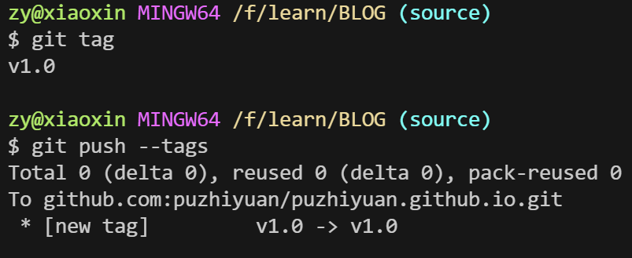
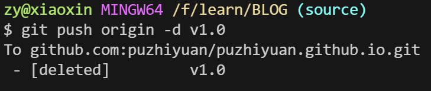
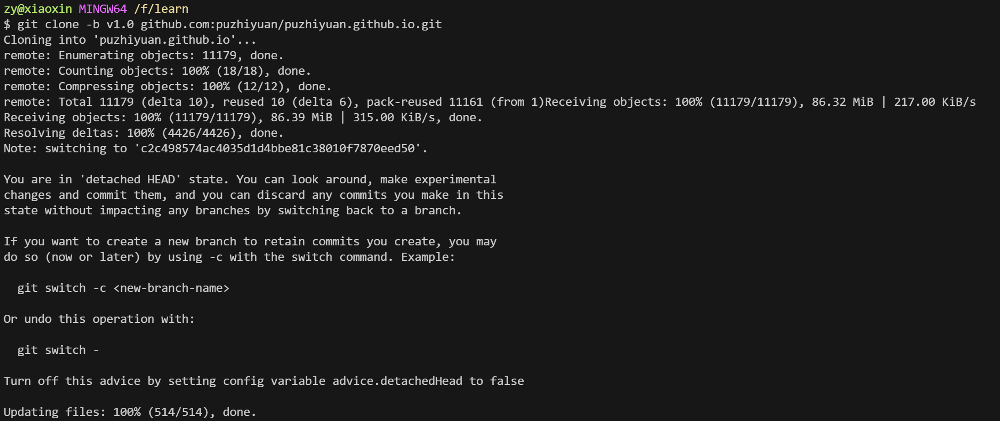
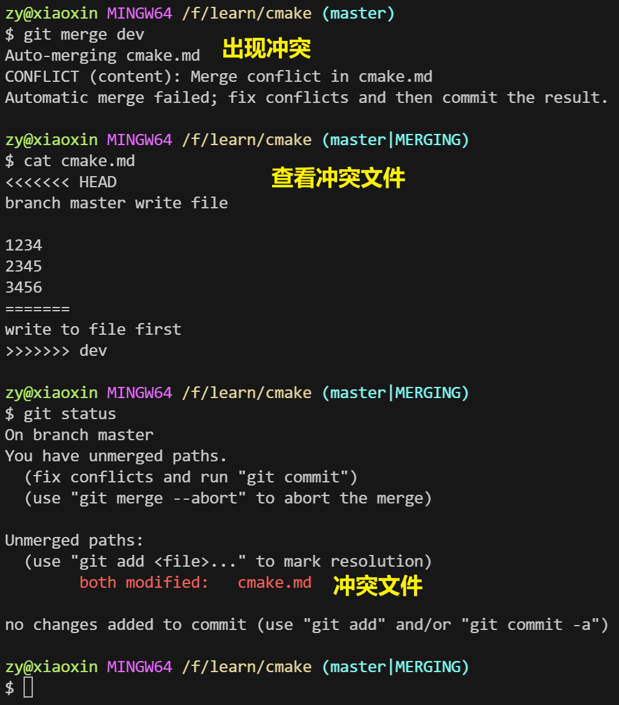
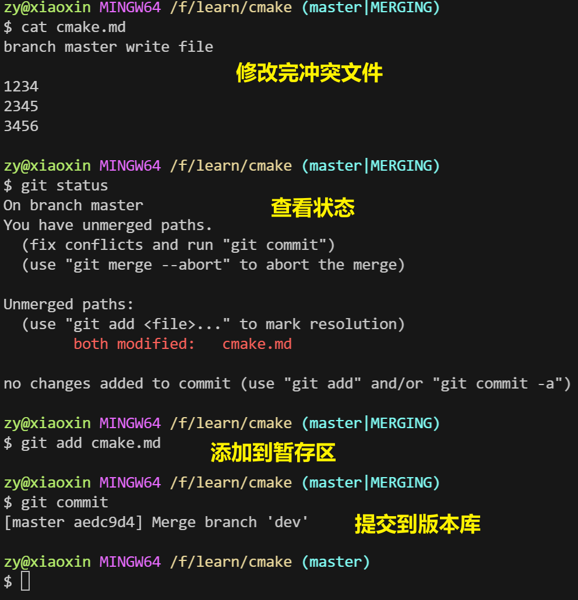
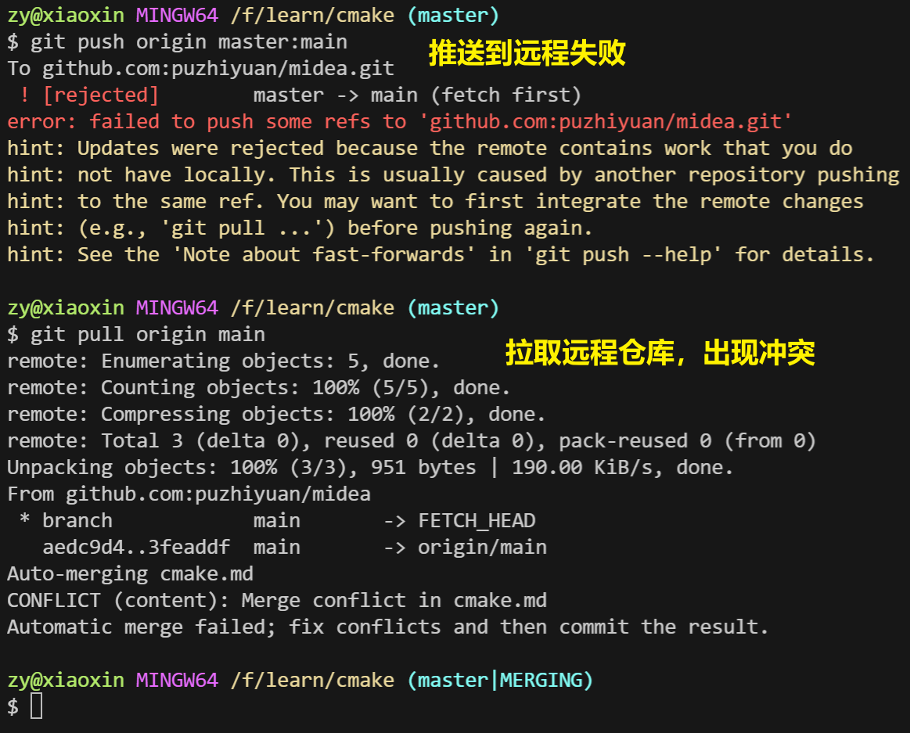
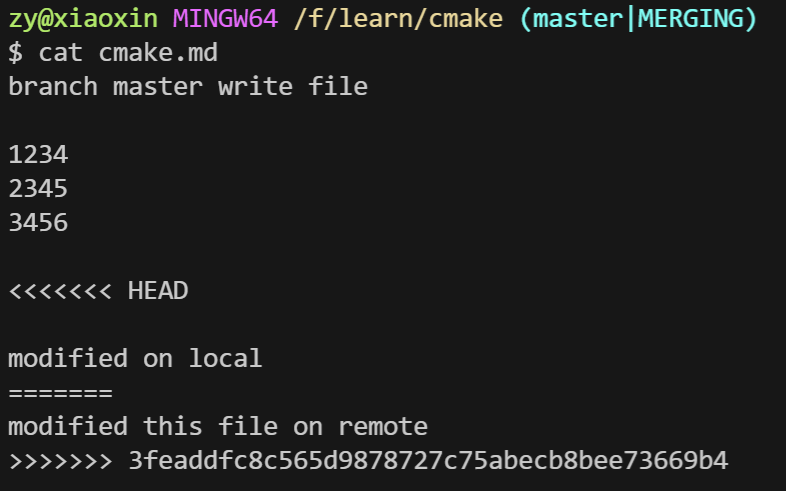
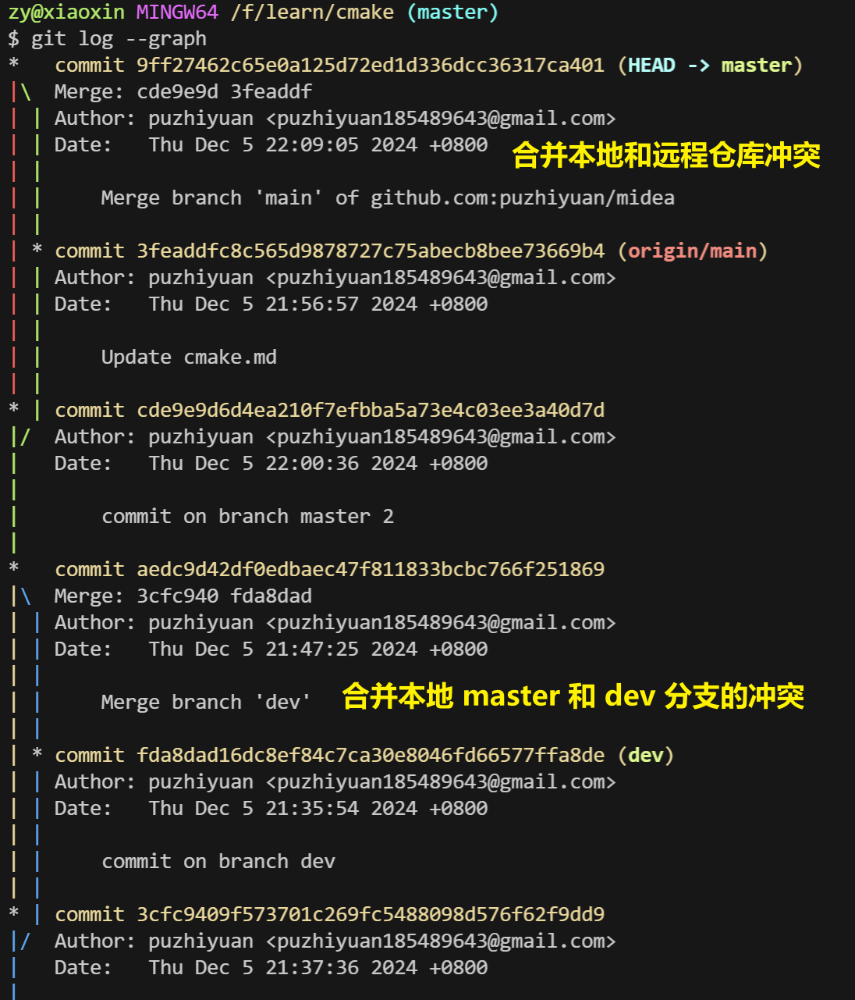
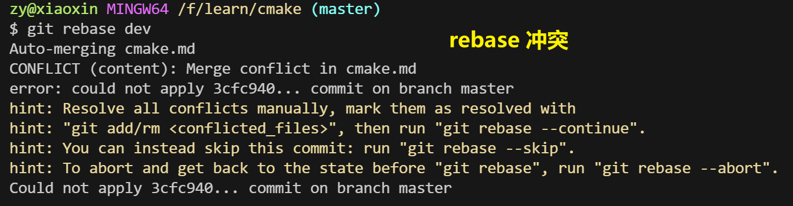
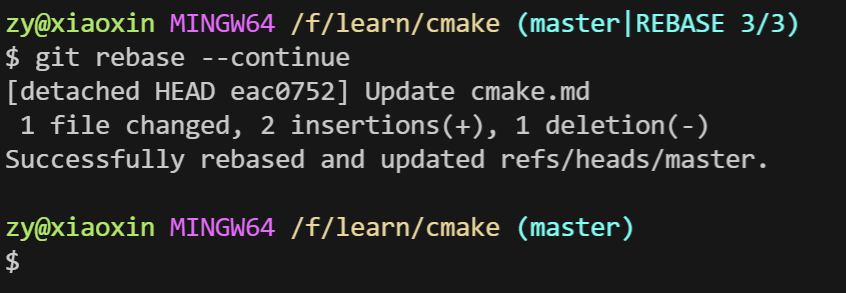

## 1. 环境配置

### 1. 生成密钥

```bash
# 生成密钥
ssh-keygen -t rsa -b 4096 -C puzhiyuan185489643@gmail.com
# 查看密钥
cat ~/.ssh/id_rsa.pub
```

### 2. 将密钥上传到 Github


验证是否成功：

```bash
ssh -T git@github.com
```


## 2. 使用

### 2.1 初始化git仓库

```bash
git init
```

**该命令将执行以下操作：**

- 创建一个名为 `.git` 的新目录。
- 在`.git`目录中创建以下文件：
  - `config`：存储 Git 配置信息的文件。
  - `HEAD`：指向当前活动分支的指针文件。
  - `objects`：存储 Git 对象（blob、树和提交）的目录。
  - `refs`：存储 Git 引用（分支、标签和远程信息）的目录。
- 初始化 HEAD 指针以指向初始提交，该提交是一个空提交，消息为“Initial commit”。


### 2.2 工作区、暂存区、版本库

**每个区域的作用如下：**

- **工作区:** 用于日常开发和文件编辑。
- **暂存区:** 用于选择要提交到版本库的特定更改。
- **版本库:** 用于存储所有版本历史记录并提供安全可靠的备份。

#### 2.2.1. 工作区

- 这是在本地计算机上编辑、修改和创建文件的地方。
- 包含所有受版本控制管理的文件和目录。
- 可以在此区域使用 git 命令来跟踪更改、查看历史记录并提交更改。

#### 2.2.2. 暂存区

- 这是一个临时区域，用于存储要提交到版本库的更改。
- 使用 `git add` 命令将文件从工作区添加到暂存区。
- 暂存区允许您选择要包含在下次提交中的特定更改。

#### 2.2.3. 版本库

- 这是存储所有版本历史记录的安全区域。
- 包含提交的所有更改的快照。
- 版本库可以位于本地计算机上或远程服务器上（例如 GitHub）。


### 2.3 工作区 - 暂存区

#### 2.3.1. 工作区到暂存区

```bash
# 将工作区中的文件或目录添加到暂存区
git add <file>

# 如果要添加所有更改过的文件
git add . 
# 或
git add -A
```

- `git add <file>`：将工作区中的文件或目录添加到暂存区，准备进行下一步的提交。
- `git add .`：添加当前目录及其子目录中所有修改过的文件。
- `git add -A`：添加所有变化的文件，包括删除的文件。


#### 2.3.2. 查看暂存区状态

```bash
# 显示工作区和暂存区的状态
git status
```

- `git status`：显示工作区和暂存区的状态，帮助查看哪些文件被修改、哪些文件已经被添加到暂存区、哪些文件还没有添加到暂存区等。


#### 2.3.3. 暂存区撤退到工作区

```bash
# 将指定文件从暂存区撤回到工作区
git restore --staged <file>
```

- `git restore --staged <file>`：将指定文件从暂存区撤回到工作区，即取消暂存操作，但不会删除工作区中的修改。


#### 2.3.4. 查看文件差异

在将更改添加到暂存区之前，你可能想查看文件的修改内容：

```bash
git diff
```

- `git diff`：查看工作区和暂存区之间的差异，显示当前工作区文件的更改内容。
- `git diff --staged`：查看暂存区和版本库之间的差异，即查看已经暂存的更改内容。

**注**：git diff 可以用于显示两个提交（commits）、提交和工作树（working tree）、分支之间或任何其他版本控制操作之间的差异。

>1. **比较两个提交之间的差异**：
>
>   ```bash
>   git diff <commit1> <commit2>
>   ```
>
>2. **比较工作树和最近一次提交的差异**：
>
>   ```bash
>   git diff
>   ```
>
>   不带任何参数时，默认比较工作树（当前工作目录）和最近一次提交（HEAD）之间的差异。
>
>3. **比较当前分支和另一分支的差异**：
>
>   ```bash
>   git diff <branch_name>
>   ```
>
>   这里 `<branch_name>` 是你想要比较的分支名称。
>
>4. **比较两个分支之间的差异**：
>
>   ```bash
>   git diff <branch1>..<branch2>
>   ```
>
>   这里 `<branch1>` 和 `<branch2>` 是两个分支名称。
>
>5. **比较工作树和索引（暂存区）的差异**：
>
>   ```bash
>   git diff --cached
>   # 或者
>   git diff --staged
>   ```
>
>   这两个命令显示已暂存（staged）但尚未提交（committed）的更改。
>
>6. **比较特定文件在两个提交之间的差异**：
>
>   ```bash
>   git diff <commit1> <commit2> -- <file_path>
>   ```
>
>   这里 `<file_path>` 是你想要比较差异的文件路径。
>
>7. **比较当前分支和HEAD的差异，只显示自上次提交以来新添加的行**：
>
>   ```bash
>   git diff HEAD
>   ```
>
>8. **比较两个分支之间的差异，只显示差异的统计信息**：
>
>   ```bash
>   git diff --stat <branch1>..<branch2>
>   ```


### 2.4 暂存区 - 版本库

#### 2.4.1. 提交更改

```bash
# 提交更改到本地仓库
git commit -m "commit message"
```

- `git commit -m "commit message"`：将暂存区中的更改提交到本地版本库。提交信息（`commit message`）用于描述本次提交的目的或内容，通常遵循简洁明了的规则。


#### 2.4.2. 添加文件到提交

也可以在提交之前，选择哪些文件或更改被包含在提交中。

```bash
git commit -am "commit message"
```

- `git commit -am "commit message"`：相当于先执行了 `git add` 再执行 `git commit`，它只会自动暂存那些已经被 Git 跟踪的文件，新增的文件需要手动执行 `git add`。


#### 2.4.3. 提交并跳过暂存区（直接提交工作区的更改）

```bash
git commit -a -m "commit message"
```

- `git commit -a`：直接将所有修改过的文件（已跟踪的文件）提交到版本库，而不需要先使用 `git add` 添加到暂存区。


#### 2.4.4. 版本回退

```bash
# 回退到上一个commit的版本，commit内容会退回到暂存区
git reset --soft HEAD^
```

- `git reset --soft HEAD^`：回退到上一个版本，`HEAD^` 表示上一个提交，`--soft` 选项保留暂存区的内容，即将撤销的提交变为暂存状态。
- `git reset --mixed HEAD^`：类似 `--soft`，但还会将暂存区的内容移回工作区。
- `git reset --hard HEAD^`：完全回退，包括将工作区的修改也撤销（慎用，因为此操作会丢失工作区中的未保存内容）。

**注**：HEAD 说明：

>- `HEAD`：当前提交的指针，表示当前版本。
>- `HEAD^`：上一个提交版本。
>- `HEAD^^`：上上个提交版本。
>- `HEAD~n`：表示当前提交之前的第 `n` 个提交。


#### 2.4.5. 查看提交历史

```bash
# 查看提交历史
git log
```

- `git log`：显示提交历史记录，包括每个提交的哈希、作者、时间和提交信息。
- `git log --oneline`：以简洁的方式查看提交记录，每个提交以一行显示，仅包含提交的哈希和提交信息。


#### 2.4.6. 修改最后一次提交

如果你提交后发现提交信息有问题，或者需要修改已提交的内容，你可以使用以下命令：

```bash
# 修改最后一次提交的信息
git commit --amend -m "new commit message"
```

- `git commit --amend`：修改最后一次提交的提交信息。如果你已经在暂存区添加了新更改，它们会被一并包括在这个修改中。


### 2.5 Git 分支

#### 2.5.1. 查看分支

```bash
# 列出所有分支，并标记（前面有 * 号）出当前分支。
git branch
```


#### 2.5.2. 创建和切换分支

```bash
# 创建新分支并切换到该分支
git checkout -b <branch_name>
# 仅创建分支，但不切换
git branch <branch_name>
# 切换到指定的分支
git checkout <branch_name>
```

示例：

```bash
# 列出当前分支
$ git branch
* source

# 创建 test 分支但不切换
$ git branch test

# 查看分支信息（创建了 test 分支但未切换分支）
$ git branch
* source
  test

# 创建 switch_test 分支并跳转 
$ git checkout -b switch_test
Switched to a new branch 'switch_test'

# 查看分支信息（创建了 switch_test 分支并切换到 switch_test 分支）
$ git branch
  source
* switch_test
  test
```


#### 2.5.3. 合并分支

```bash
# 切换到目标分支
git checkout <target_branch>

# 合并源分支到目标分支
git merge <source_branch>
```

- `git merge <source_branch>`：将指定的源分支合并到当前分支。合并时，Git 会自动尝试合并代码，若存在冲突，则需要手动解决。


#### 2.5.4. 删除分支

```bash
# 删除本地分支,若分支未合并到当前分支，则会提示警告。
git branch -d <branch_name>

# 强制删除未合并的本地分支,无论分支是否合并
git branch -D <branch_name>
```

示例：

```bash
$ git branch 
* source
  switch_test
  test

$ git branch -d switch_test 
Deleted branch switch_test (was c2c4985).

$ git branch -d test
Deleted branch test (was c2c4985).

$ git branch
* source
```


### 2.6 Git 标签

#### 2.6.1. 查看标签

```bash
# 列出当前仓库的所有标签
git tag
```


#### 2.6.2. 创建标签

```bash
# 创建轻量标签（不包含额外信息）
git tag <tagname>

# 创建附注标签（包含详细信息）
git tag -a <tagname> -m "tag message"
```

示例：

```bash
git tag -a "v0.0.0" -m "info"
```


#### 2.6.3. 查看标签信息

```bash
# 查看特定标签的详细信息，包括标签作者、创建时间和标签注释
git show <tagname>
```


#### 2.6.4. 删除标签

```bash
# 删除本地标签
git tag -d <tagname>
```


### 2.7 远程仓库

#### 2.7.1. 查看远程仓库信息

```bash
# 列出远程仓库中所有的引用（refs），包括分支和标签
git ls-remote --refs git@github.com:puzhiyuan/puzhiyuan.github.io.git
```


#### 2.7.2. 设置远程仓库

```bash
# 添加一个新的远程仓库
git remote add <remote_name> <repository_url>

# 查看远程仓库信息
git remote -v

# 重命名远程仓库
git remote rename <old_name> <new_name>

# 删除远程仓库
git remote remove <remote_name>
```


#### 2.7.3. 拉取远程仓库的更新

```bash
# 拉取远程仓库指定分支的更新并自动合并。
git pull <remote> <branch_name>

# 拉取远程仓库指定分支的更新并进行 rebase 而不是合并。
git pull --rebase <remote> <branch_name>
```


#### 2.7.4. 推送分支到远程

```bash
# 将本地分支推送到远程仓库
git push <remote> <branch_name>

# 将本地分支推送到远程并设置跟踪关系
git push -u <remote> <branch_name>

# 强制推送到远程仓库（慎用，会覆盖远程分支）
git push -f <remote> <branch_name>

# 推送所有本地分支到远程仓库
git push --all <remote>

# 推送特定提交到远程仓库
git push <remote> <commit_id>:<branch_name>

# 推送本地和远程不同名的分支
git push <remote> <local_branch>:<remote_branch>
```


#### 2.7.5. 远程仓库分支比较

```bash
# 比较本地分支与远程分支的差异
git diff <remote>/<branch_name>...
```


#### 2.7.6. 删除远程分支

```bash
# 删除远程分支
git push <remote> --delete <branch_name>
```


#### 2.7.7. 共享标签

```bash
# 推送单个标签到远程仓库
git push <remote> <tagname>

# 推送本地所有标签到远程仓库
git push --tags
```

示例：




#### 2.7.8. 删除远程标签

```bash
# 删除远程标签
git push <remote> --delete <tagname>
```

示例:




#### 2.7.9. 获取特定标签的远程仓库

```bash
# 查看所有远程标签
git ls-remote --tags https://github.com/username/repository.git

# 克隆远程仓库并只检出特定标签
git clone -b <tagname> https://github.com/puzhiyuan/ultralytics.git
```

示例：



成功克隆了一个名为 `puzhiyuan.github.io` 的仓库，并且检出了名为 `v1.0` 的标签。

1. **状态**：当前处于“detached HEAD”状态，当前 HEAD 不关联任何分支。这是一个临时的状态，用于查看代码或做实验性更改。在这个状态下所做的任何提交都不会影响任何分支。

2. **创建新分支**：如果希望保留在这个状态下所做的更改，可以创建一个新的分支。

   ```bash
   git switch -c new-branch
   ```

   这样，就可以在新分支上继续工作，并且这些更改会被保留。


### 2.8 冲突

#### 2.8.1. 冲突发生的场景

- **合并冲突（Merge Conflict）**：在执行 `git merge` 时，如果两个分支同时修改了相同的代码行，Git 就无法自动合并这些更改。
- **拉取冲突（Pull Conflict）**：在执行 `git pull` 拉取远程更改时，如果本地仓库与远程仓库的更改发生冲突，会出现冲突。
- **重基冲突（Rebase Conflict）**：在执行 `git rebase` 时，若重基过程中某个提交与目标分支的更改发生冲突，也会出现冲突。


#### 2.8.2. merge 冲突

- dev 分支和 master 分支都对 cmake.md 做了修改,所以在 master 分支合并 dev 分支出现冲突,同时，Git 会将冲突的文件标记为“未合并”（unmerged），并将冲突的部分用标记表示，通常是：

```bash
<<<<<<< HEAD
当前分支中的内容
=======
另一个分支中的内容
>>>>>>> <other_branch_name>
```

示例:



- 打开冲突文件，手动修改冲突部分(如果想放弃本次合并操作，可以使用 `git merge --abort` 取消合并，恢复到合并前的状态)

- 修改完冲突文件后，需要告诉 Git 该文件已解决冲突。使用 `git add` 命令将修改后的文件标记为已解决
- 使用 `git commit` 完成合并，Git 会自动生成一个合并提交信息

示例:




#### 2.8.3. pull 冲突

- 远程仓库的修改领先于本地分支,并且本地分支和远程仓库同时对同一个文件进行了不同的修改,此时 `git push` 出错

- `git pull` 拉取远程仓库

示例:



- 查看冲突文件,并修改冲突(如果想放弃本次合并操作，可以使用 `git merge --abort` 取消合并，恢复到合并前的状态)

示例:



- 修改完冲突之后, `git add .` 添加到暂存区, `git commit` 提交到版本库

示例:



- 最后`git push`到远程仓库


#### 2.8.4. rebase 冲突

>虽然 `git rebase` 和 `git merge` 都可以用于合并不同分支的修改，它们之间有一些关键的区别：
>
>- `git merge`：将两个分支的历史合并为一个新的提交，产生一个新的合并提交（merge commit）。合并后的历史可能是分叉的（non-linear）。
>- `git rebase`：将当前分支的修改“搬到”目标分支上，这样就不会产生合并提交，历史将变得线性。

- 在 master 分支执行 `git rebase dev` 时遇到了合并冲突。Git 在尝试将 `master` 分支上的提交移到 `dev` 分支的顶部时，发现了 `cmake.md` 文件中的冲突，并暂停了 rebase 操作。



- 如果在解决冲突时想放弃 rebase，可以使用 `git rebase --abort`

- 手动解决了冲突并保存了文件后，使用 `git add` 命令将解决冲突后的文件标记为已解决
- 可以执行 `git rebase --continue` 继续 rebase 过程,Git 会继续剩余的提交。如果没有其他冲突，rebase 操作会继续，直到所有提交都被应用完。



- 如果需要跳过当前提交，可以使用 `git rebase --skip`.
